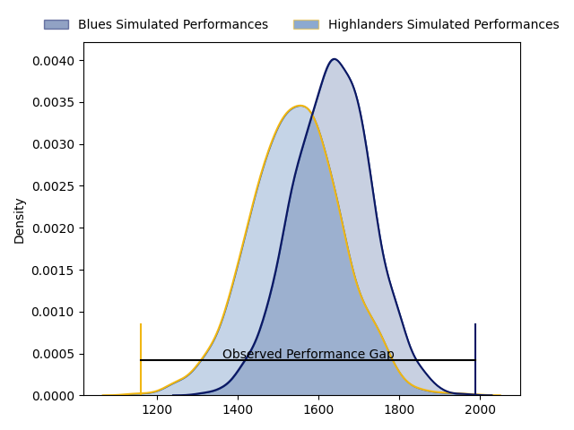
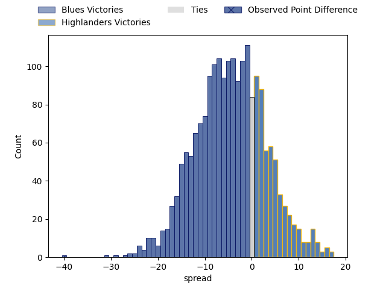
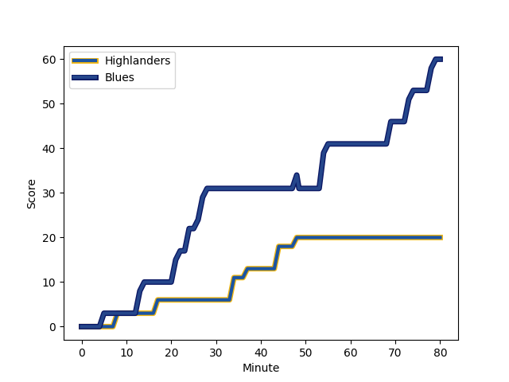
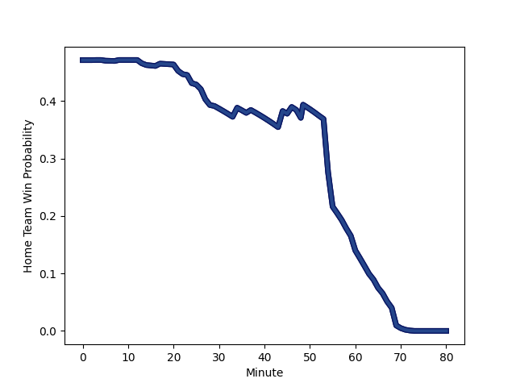

---  
layout: page  
title: Blues at Highlanders; 60-20  
date: 2023-02-25 01:05:00 18:00:00 -0500  
categories: match review  
---
# Blues at Highlanders; 60-20

# Club Level Predictions

The first set of predictions treats a club as the smallest object, as the club develops its members, organizes a gameplan, and deploys its players as needed for each match. This club model has a prediction of 0.379, which translates to predicting Blues to win by 4.5.

Each club has a rating and a rating deviation (simiar to a Glicko system), and expected performances can be generated. This allows for simulated matches and spreads like the ones below.
## Projected Performances

## Projected Spreads

## Projected Results

# Player Level Predictions

Treating teams instead as an entity made up of the currently active players, I have ratings for each player in an altogether different system. These can be combined to form team ratings once teamsheets are announced, weighting starters a bit higher than the reserves. After the match is played, players can be weighted by their minutes on the field, allowing for an accurate measure of the team's composition. With these compiled team ratings, we can make predictions, measure inaccuracy, and update the individual player ratings.
## Prediction with Player Minutes: Blues by 1.0

Blues by 5.0 on a neutral field
## Scores over Time

## Win Probability over Time

There were 5 large changes in win probability in this match
## Prediction without Player Minutes: Highlanders by 0.3

Blues by 3.7 on a neutral pitch

|   Away Minutes | Away Player                                                           |   Away elo |   Away Percentile |   Number |   Home Percentile |   Home elo | Home Player                                                                 |   Home Minutes |
|---------------:|:----------------------------------------------------------------------|-----------:|------------------:|---------:|------------------:|-----------:|:----------------------------------------------------------------------------|---------------:|
|             46 | [Ofa Tu'ungafasi](..//playerfiles//OfaTu'ungafasi_cleaned.md)         |     110.86 |                86 |        1 |               nan |      95    | [Ethan de Groot](..//playerfiles//EthandeGroot_cleaned.md)                  |             53 |
|             46 | [Kurt Eklund](..//playerfiles//KurtEklund_cleaned.md)                 |     114.45 |                92 |        2 |                87 |     109.3  | [Rhys Marshall](..//playerfiles//RhysMarshall_cleaned.md)                   |             53 |
|             46 | [Nepo Laulala](..//playerfiles//NepoLaulala_cleaned.md)               |      95    |               nan |        3 |                87 |     109.26 | [Jermaine Ainsley](..//playerfiles//JermaineAinsley_cleaned.md)             |             58 |
|             68 | [Patrick Tuipulotu](..//playerfiles//PatrickTuipulotu_cleaned.md)     |     129.05 |                97 |        4 |               nan |     156.43 | [Pari Pari Parkinson](..//playerfiles//PariPariParkinson_cleaned.md)        |             55 |
|             80 | [Cameron Suafoa](..//playerfiles//CameronSuafoa_cleaned.md)           |     105.38 |                76 |        5 |               nan |      95    | [Josh Dickson](..//playerfiles//JoshDickson_cleaned.md)                     |             80 |
|             29 | [Akira Ioane](..//playerfiles//AkiraIoane_cleaned.md)                 |      95    |               nan |        6 |               nan |      95    | [Shannon Frizell](..//playerfiles//ShannonFrizell_cleaned.md)               |             80 |
|             80 | [Dalton Papali'i](..//playerfiles//DaltonPapali'i_cleaned.md)         |     102.74 |                71 |        7 |                92 |     119.52 | [Billy Harmon](..//playerfiles//BillyHarmon_cleaned.md)                     |             80 |
|             80 | [Hoskins Sotutu](..//playerfiles//HoskinsSotutu_cleaned.md)           |     126.71 |                97 |        8 |               nan |      95    | [Marino Mikaele-Tu'u](..//playerfiles//MarinoMikaele-Tu'u_cleaned.md)       |              3 |
|             66 | [Finlay Christie](..//playerfiles//FinlayChristie_cleaned.md)         |     103.43 |                74 |        9 |                30 |      84.57 | [Folau Fakatava](..//playerfiles//FolauFakatava_cleaned.md)                 |             72 |
|             80 | [Beauden Barrett](..//playerfiles//BeaudenBarrett_cleaned.md)         |     156.57 |                99 |       10 |                94 |     124.7  | [Mitch Hunt](..//playerfiles//MitchHunt_cleaned.md)                         |             80 |
|             66 | [Caleb Clarke](..//playerfiles//CalebClarke_cleaned.md)               |      99.21 |                63 |       11 |                55 |      96.71 | [Connor Garden-Bachop](..//playerfiles//ConnorGarden-Bachop_cleaned.md)     |             60 |
|             60 | [Roger Tuivasa-Sheck](..//playerfiles//RogerTuivasa-Sheck_cleaned.md) |      84.15 |                19 |       12 |                68 |     100.99 | [Thomas Umaga-Jensen](..//playerfiles//ThomasUmaga-Jensen_cleaned.md)       |             64 |
|             80 | [Rieko Ioane](..//playerfiles//RiekoIoane_cleaned.md)                 |      77.8  |                 9 |       13 |                58 |      97.88 | [Josh Timu](..//playerfiles//JoshTimu_cleaned.md)                           |             80 |
|             80 | [Mark Telea](..//playerfiles//MarkTelea_cleaned.md)                   |     114.17 |                89 |       14 |                82 |     107.98 | [Jonah Lowe](..//playerfiles//JonahLowe_cleaned.md)                         |             80 |
|             80 | [Stephen Perofeta](..//playerfiles//StephenPerofeta_cleaned.md)       |     115.24 |                88 |       15 |                51 |      94.78 | [Sam Gilbert](..//playerfiles//SamGilbert_cleaned.md)                       |             80 |
|             34 | [Ricky Riccitelli](..//playerfiles//RickyRiccitelli_cleaned.md)       |      93.85 |                49 |       16 |                80 |     104.56 | [Andrew Makalio](..//playerfiles//AndrewMakalio_cleaned.md)                 |             27 |
|             34 | [Josh Fusitua](..//playerfiles//JoshFusitua_cleaned.md)               |      96.11 |               nan |       17 |                71 |     100.91 | [Dan Lienert-Brown](..//playerfiles//DanLienert-Brown_cleaned.md)           |             27 |
|             34 | [Marcel Renata](..//playerfiles//MarcelRenata_cleaned.md)             |     101.8  |                75 |       18 |                80 |     104.26 | [Saula Mau](..//playerfiles//SaulaMau_cleaned.md)                           |             22 |
|             12 | [James Tucker](..//playerfiles//JamesTucker_cleaned.md)               |     111.27 |                87 |       19 |               nan |      95    | [Will Tucker](..//playerfiles//WillTucker_cleaned.md)                       |             25 |
|             51 | [Adrian Choat](..//playerfiles//AdrianChoat_cleaned.md)               |      90.53 |                36 |       20 |                54 |      95.4  | [Sean Withy](..//playerfiles//SeanWithy_cleaned.md)                         |             77 |
|             14 | [Taufa Funaki](..//playerfiles//TaufaFunaki_cleaned.md)               |      84.41 |                20 |       21 |                58 |      97.51 | [Kemara Hauiti-Parapara](..//playerfiles//KemaraHauiti-Parapara_cleaned.md) |              8 |
|             20 | [Bryce Heem](..//playerfiles//BryceHeem_cleaned.md)                   |     117.32 |                92 |       22 |                90 |     116.89 | [Freddie Burns](..//playerfiles//FreddieBurns_cleaned.md)                   |             16 |
|             14 | [AJ Lam](..//playerfiles//AJLam_cleaned.md)                           |      95    |               nan |       23 |               nan |      95    | [Martin Bogado](..//playerfiles//MartinBogado_cleaned.md)                   |             20 |

