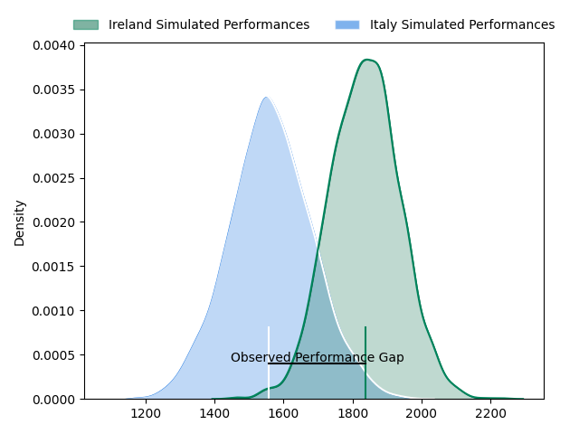
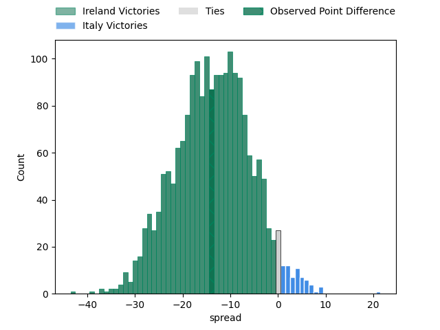
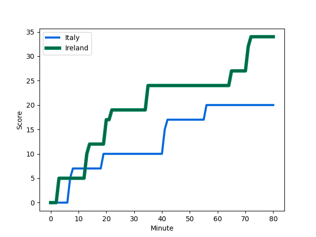
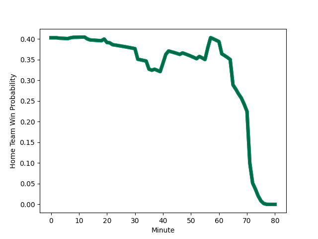

---  
layout: page  
title: Ireland at Italy; 34-20  
date: 2023-02-25 09:15:00 18:00:00 -0500  
categories: match review  
---
# Ireland at Italy; 34-20

# Club Level Predictions

The first set of predictions treats a club as the smallest object, as the club develops its members, organizes a gameplan, and deploys its players as needed for each match. This club model has a prediction of 0.182, which translates to predicting Ireland to win by 13.7.

Each club has a rating and a rating deviation (simiar to a Glicko system), and expected performances can be generated. This allows for simulated matches and spreads like the ones below.
## Projected Performances

## Projected Spreads

## Projected Results

# Player Level Predictions

Treating teams instead as an entity made up of the currently active players, I have ratings for each player in an altogether different system. These can be combined to form team ratings once teamsheets are announced, weighting starters a bit higher than the reserves. After the match is played, players can be weighted by their minutes on the field, allowing for an accurate measure of the team's composition. With these compiled team ratings, we can make predictions, measure inaccuracy, and update the individual player ratings.
## Prediction with Player Minutes: Ireland by 13.1

Ireland by 17.1 on a neutral field
## Scores over Time

## Win Probability over Time

There were 6 large changes in win probability in this match
## Prediction without Player Minutes: Ireland by 13.0

Ireland by 17.0 on a neutral pitch

|   Away Minutes | Away Player                                                       |   Away elo |   Away Percentile |   Number |   Home Percentile |   Home elo | Home Player                                                           |   Home Minutes |
|---------------:|:------------------------------------------------------------------|-----------:|------------------:|---------:|------------------:|-----------:|:----------------------------------------------------------------------|---------------:|
|             65 | [Andrew Porter](..//playerfiles//AndrewPorter_cleaned.md)         |      96.37 |                54 |        1 |                74 |     101.99 | [Danilo Fischetti](..//playerfiles//DaniloFischetti_cleaned.md)       |             61 |
|             57 | [Ronan Kelleher](..//playerfiles//RonanKelleher_cleaned.md)       |     123.87 |                97 |        2 |                98 |     130.6  | [Giacomo Nicotera](..//playerfiles//GiacomoNicotera_cleaned.md)       |             52 |
|             37 | [Finlay Bealham](..//playerfiles//FinlayBealham_cleaned.md)       |      95.88 |                53 |        3 |                39 |      93.87 | [Simone Ferrari](..//playerfiles//SimoneFerrari_cleaned.md)           |             47 |
|             53 | [Iain Henderson](..//playerfiles//IainHenderson_cleaned.md)       |     116.21 |                93 |        4 |                 4 |      64.91 | [Niccolo Cannone](..//playerfiles//NiccoloCannone_cleaned.md)         |             65 |
|             80 | [James Ryan](..//playerfiles//JamesRyan_cleaned.md)               |     108.64 |                82 |        5 |                89 |     113.51 | [Federico Ruzza](..//playerfiles//FedericoRuzza_cleaned.md)           |             80 |
|             80 | [Caelan Doris](..//playerfiles//CaelanDoris_cleaned.md)           |     123.75 |                95 |        6 |                41 |      91.82 | [Sebastian Negri](..//playerfiles//SebastianNegri_cleaned.md)         |             80 |
|             80 | [Josh van der Flier](..//playerfiles//JoshvanderFlier_cleaned.md) |     128.71 |                96 |        7 |                91 |     117.68 | [Michele Lamaro](..//playerfiles//MicheleLamaro_cleaned.md)           |             80 |
|             57 | [Jack Conan](..//playerfiles//JackConan_cleaned.md)               |     122.12 |                95 |        8 |                73 |     103.5  | [Lorenzo Cannone](..//playerfiles//LorenzoCannone_cleaned.md)         |             65 |
|             65 | [Craig Casey](..//playerfiles//CraigCasey_cleaned.md)             |     108.84 |                88 |        9 |                14 |      81.13 | [Stephen Varney](..//playerfiles//StephenVarney_cleaned.md)           |             68 |
|             78 | [Ross Byrne](..//playerfiles//RossByrne_cleaned.md)               |     110.21 |                88 |       10 |                62 |     103.05 | [Paolo Garbisi](..//playerfiles//PaoloGarbisi_cleaned.md)             |             73 |
|             80 | [James Lowe](..//playerfiles//JamesLowe_cleaned.md)               |     142.33 |                99 |       11 |                82 |     110.17 | [Pierre Bruno](..//playerfiles//PierreBruno_cleaned.md)               |             80 |
|             73 | [Stuart McCloskey](..//playerfiles//StuartMcCloskey_cleaned.md)   |     137.35 |                99 |       12 |                97 |     130.55 | [Tommaso Menoncello](..//playerfiles//TommasoMenoncello_cleaned.md)   |             78 |
|             80 | [Bundee Aki](..//playerfiles//BundeeAki_cleaned.md)               |     134.72 |                98 |       13 |                88 |     113.2  | [Juan Ignacio Brex](..//playerfiles//JuanIgnacioBrex_cleaned.md)      |             80 |
|             80 | [Mack Hansen](..//playerfiles//MackHansen_cleaned.md)             |      86.44 |                23 |       14 |                89 |     113.63 | [Edoardo Padovani](..//playerfiles//EdoardoPadovani_cleaned.md)       |             80 |
|             80 | [Hugo Keenan](..//playerfiles//HugoKeenan_cleaned.md)             |     141.4  |                99 |       15 |                90 |     117.19 | [Ange Capuozzo](..//playerfiles//AngeCapuozzo_cleaned.md)             |             80 |
|             23 | [Dan Sheehan](..//playerfiles//DanSheehan_cleaned.md)             |     109.88 |                88 |       16 |               nan |      80.89 | [Luca Bigi](..//playerfiles//LucaBigi_cleaned.md)                     |             28 |
|             15 | [Dave Kilcoyne](..//playerfiles//DaveKilcoyne_cleaned.md)         |     130.12 |               nan |       17 |               nan |      99.78 | [Federico Zani](..//playerfiles//FedericoZani_cleaned.md)             |             19 |
|             43 | [Tom O'Toole](..//playerfiles//TomO'Toole_cleaned.md)             |      85.61 |               nan |       18 |                82 |     105.52 | [Marco Riccioni](..//playerfiles//MarcoRiccioni_cleaned.md)           |             33 |
|             27 | [Ryan Baird](..//playerfiles//RyanBaird_cleaned.md)               |      95    |               nan |       19 |               nan |     103.93 | [Edoardo Iachizzi](..//playerfiles//EdoardoIachizzi_cleaned.md)       |             15 |
|             23 | [Peter O'Mahony](..//playerfiles//PeterO'Mahony_cleaned.md)       |      81.88 |                13 |       20 |               nan |     132.48 | [Giovanni Pettinelli](..//playerfiles//GiovanniPettinelli_cleaned.md) |             15 |
|             15 | [Conor Murray](..//playerfiles//ConorMurray_cleaned.md)           |     145.33 |                99 |       21 |               nan |      87.54 | [Alessandro Fusco](..//playerfiles//AlessandroFusco_cleaned.md)       |             12 |
|              2 | [Jack Crowley](..//playerfiles//JackCrowley_cleaned.md)           |      95    |               nan |       22 |                87 |     111.19 | [Luca Morisi](..//playerfiles//LucaMorisi_cleaned.md)                 |              2 |
|              7 | [Jimmy O'Brien](..//playerfiles//JimmyO'Brien_cleaned.md)         |      95    |               nan |       23 |                70 |     102.31 | [Tommaso Allan](..//playerfiles//TommasoAllan_cleaned.md)             |              7 |

