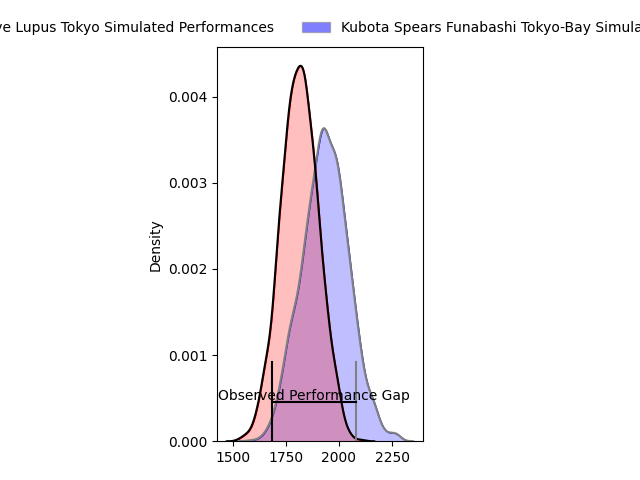
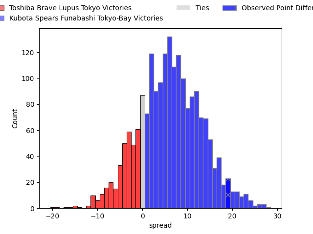
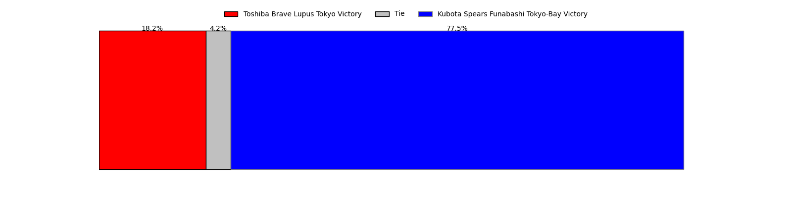
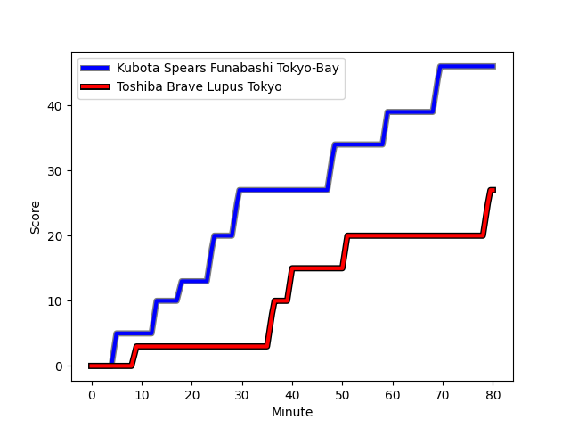
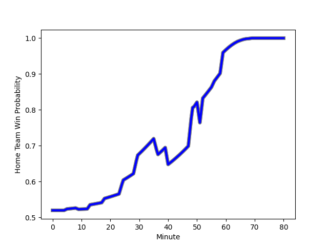

---  
layout: page  
title: Toshiba Brave Lupus Tokyo at Kubota Spears Funabashi Tokyo-Bay; 27-46  
date: 2023-02-25 00:00:00 18:00:00 -0500  
categories: match review  
---
# Toshiba Brave Lupus Tokyo at Kubota Spears Funabashi Tokyo-Bay; 27-46

# Club Level Predictions

The first set of predictions treats a club as the smallest object, as the club develops its members, organizes a gameplan, and deploys its players as needed for each match. This club model has a prediction of 0.663, which translates to predicting Kubota Spears Funabashi Tokyo-Bay to win by 6.1.

Each club has a rating and a rating deviation (simiar to a Glicko system), and expected performances can be generated. This allows for simulated matches and spreads like the ones below.
## Projected Performances

## Projected Spreads

## Projected Results

# Player Level Predictions

Treating teams instead as an entity made up of the currently active players, I have ratings for each player in an altogether different system. These can be combined to form team ratings once teamsheets are announced, weighting starters a bit higher than the reserves. After the match is played, players can be weighted by their minutes on the field, allowing for an accurate measure of the team's composition. With these compiled team ratings, we can make predictions, measure inaccuracy, and update the individual player ratings.
## Prediction with Player Minutes: Kubota Spears Funabashi Tokyo-Bay by 7.4

Kubota Spears Funabashi Tokyo-Bay by 3.4 on a neutral field
## Scores over Time

## Win Probability over Time

There were 9 large changes in win probability in this match
## Prediction without Player Minutes: Kubota Spears Funabashi Tokyo-Bay by 6.5

Kubota Spears Funabashi Tokyo-Bay by 2.5 on a neutral pitch

|   Away Minutes | Away Player                                                         |   Away elo |   Away Percentile |   Number |   Home Percentile |   Home elo | Home Player                                                                              |   Home Minutes |
|---------------:|:--------------------------------------------------------------------|-----------:|------------------:|---------:|------------------:|-----------:|:-----------------------------------------------------------------------------------------|---------------:|
|             52 | [Sena Kimura](..//playerfiles//SenaKimura_cleaned.md)               |     102.65 |                75 |        1 |               nan |      95    | [Yota Kaminori](..//playerfiles//YotaKaminori_cleaned.md)                                |             52 |
|             52 | [Mamoru Harada](..//playerfiles//MamoruHarada_cleaned.md)           |      98.64 |                63 |        2 |                69 |     100.3  | [Malcolm Justin Marx](..//playerfiles//MalcolmJustinMarx_cleaned.md)                     |             68 |
|             52 | [Yuta Kokaji](..//playerfiles//YutaKokaji_cleaned.md)               |     119.83 |                96 |        3 |                12 |      84.4  | [Shoya Matsunami](..//playerfiles//ShoyaMatsunami_cleaned.md)                            |             52 |
|             80 | [Warner Dearns](..//playerfiles//WarnerDearns_cleaned.md)           |     105.83 |                77 |        4 |                69 |     101.85 | [Yuki Aoki](..//playerfiles//YukiAoki_cleaned.md)                                        |             40 |
|             56 | [Shin Ito](..//playerfiles//ShinIto_cleaned.md)                     |     107.57 |                81 |        5 |                80 |     107.26 | [David James Bulbring](..//playerfiles//DavidJamesBulbring_cleaned.md)                   |             80 |
|             80 | [Yoshitaka Tokunaga](..//playerfiles//YoshitakaTokunaga_cleaned.md) |     106.45 |                78 |        6 |                98 |     139.35 | [Finau Tupa](..//playerfiles//FinauTupa_cleaned.md)                                      |             68 |
|             80 | [Matt Todd](..//playerfiles//MattTodd_cleaned.md)                   |     105.7  |                77 |        7 |                94 |     122.26 | [Takeo Suenaga](..//playerfiles//TakeoSuenaga_cleaned.md)                                |             80 |
|             71 | [Michael Leitch](..//playerfiles//MichaelLeitch_cleaned.md)         |     103.57 |                73 |        8 |                85 |     110.72 | [Faulua Makisi](..//playerfiles//FauluaMakisi_cleaned.md)                                |             80 |
|             49 | [Takahiro Ogawa](..//playerfiles//TakahiroOgawa_cleaned.md)         |      93.81 |                47 |        9 |                97 |     122.24 | [Kazuhiro Taniguchi](..//playerfiles//KazuhiroTaniguchi_cleaned.md)                      |             52 |
|             80 | [Tom Taylor](..//playerfiles//TomTaylor_cleaned.md)                 |     108.41 |                83 |       10 |                73 |     103.61 | [Bernard Foley](..//playerfiles//BernardFoley_cleaned.md)                                |             80 |
|             65 | [Toshiki Kuwayama](..//playerfiles//ToshikiKuwayama_cleaned.md)     |     101.27 |                67 |       11 |                93 |     121.06 | [Haruto Kida](..//playerfiles//HarutoKida_cleaned.md)                                    |             80 |
|             80 | [Nicholas McCurran](..//playerfiles//NicholasMcCurran_cleaned.md)   |     115.45 |                91 |       12 |                69 |     101.87 | [Rikus Pretorius](..//playerfiles//RikusPretorius_cleaned.md)                            |             52 |
|             72 | [Seta Tamanivalu](..//playerfiles//SetaTamanivalu_cleaned.md)       |      99.34 |                63 |       13 |                63 |      99.63 | [Halatoa Vailea](..//playerfiles//HalatoaVailea_cleaned.md)                              |             52 |
|             80 | [Masaki Hamada](..//playerfiles//MasakiHamada_cleaned.md)           |     115.11 |                90 |       14 |                37 |      90.79 | [Koga Nezuka](..//playerfiles//KogaNezuka_cleaned.md)                                    |             80 |
|             80 | [Takuro Matsunaga](..//playerfiles//TakuroMatsunaga_cleaned.md)     |     109.36 |                81 |       15 |                82 |     109.68 | [Gerhard Jacobus van den Heever](..//playerfiles//GerhardJacobusvandenHeever_cleaned.md) |             80 |
|             31 | [Jack Stratton](..//playerfiles//JackStratton_cleaned.md)           |      97.55 |               nan |       16 |                52 |      98.12 | [Uwe Helu](..//playerfiles//UweHelu_cleaned.md)                                          |             40 |
|             28 | [Masataka Mikami](..//playerfiles//MasatakaMikami_cleaned.md)       |      99.09 |                59 |       17 |               nan |      93.89 | [Kenshi Yamamoto](..//playerfiles//KenshiYamamoto_cleaned.md)                            |             28 |
|             28 | [Daigo Hashimoto](..//playerfiles//DaigoHashimoto_cleaned.md)       |      72.81 |                 4 |       18 |                93 |     117.11 | [Opeti Helu](..//playerfiles//OpetiHelu_cleaned.md)                                      |             28 |
|             28 | [Latu Taufa](..//playerfiles//LatuTaufa_cleaned.md)                 |     101.87 |               nan |       19 |                73 |     102.95 | [Harumichi Tatekawa](..//playerfiles//HarumichiTatekawa_cleaned.md)                      |             28 |
|             24 | [Kyosuke Kajikawa](..//playerfiles//KyosukeKajikawa_cleaned.md)     |      96.91 |                51 |       20 |                71 |     103.65 | [Shinobu Fujiwara](..//playerfiles//ShinobuFujiwara_cleaned.md)                          |             28 |
|             15 | [Shohei Toyoshima](..//playerfiles//ShoheiToyoshima_cleaned.md)     |     107.3  |                77 |       21 |                81 |     108.6  | [Sione Teaupa](..//playerfiles//SioneTeaupa_cleaned.md)                                  |             28 |
|              9 | [Takeshi Sasaki](..//playerfiles//TakeshiSasaki_cleaned.md)         |     104.53 |               nan |       22 |                79 |     105.3  | [Schalk Erasmus](..//playerfiles//SchalkErasmus_cleaned.md)                              |             12 |
|              8 | [Futoshi Mori](..//playerfiles//FutoshiMori_cleaned.md)             |      98.98 |                64 |       23 |               nan |      94.1  | [Masaya Tamaki](..//playerfiles//MasayaTamaki_cleaned.md)                                |             12 |

