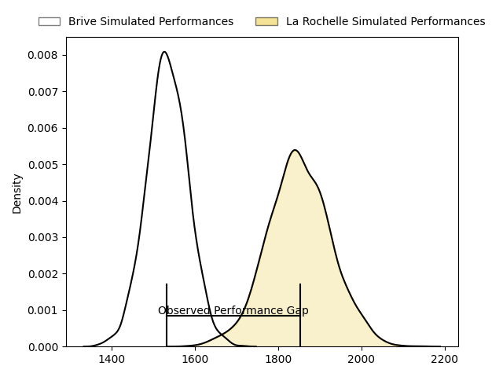
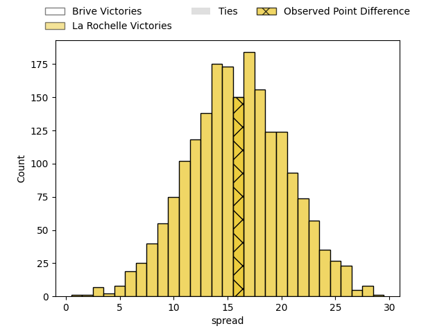
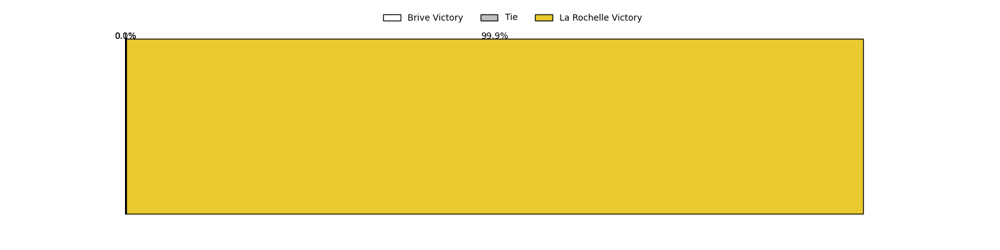
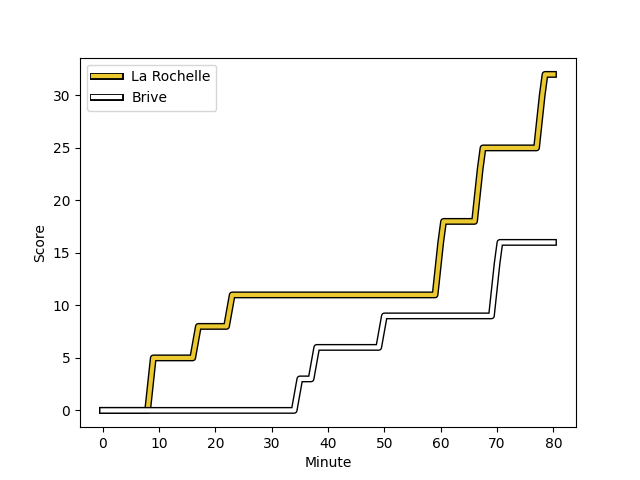
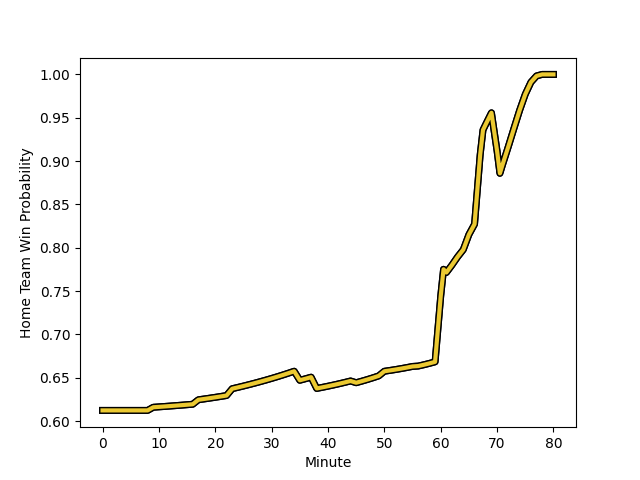

---  
layout: page  
title: Brive at La Rochelle; 16-32  
date: 2023-02-25 17:00:00 18:00:00 -0500  
categories: match review  
---
# Brive at La Rochelle; 16-32

# Club Level Predictions

The first set of predictions treats a club as the smallest object, as the club develops its members, organizes a gameplan, and deploys its players as needed for each match. This club model has a prediction of 0.859, which translates to predicting La Rochelle to win by 15.9.

Each club has a rating and a rating deviation (simiar to a Glicko system), and expected performances can be generated. This allows for simulated matches and spreads like the ones below.
## Projected Performances

## Projected Spreads

## Projected Results

# Player Level Predictions

Treating teams instead as an entity made up of the currently active players, I have ratings for each player in an altogether different system. These can be combined to form team ratings once teamsheets are announced, weighting starters a bit higher than the reserves. After the match is played, players can be weighted by their minutes on the field, allowing for an accurate measure of the team's composition. With these compiled team ratings, we can make predictions, measure inaccuracy, and update the individual player ratings.
## Prediction with Player Minutes: La Rochelle by 23.9

La Rochelle by 19.9 on a neutral field
## Scores over Time

## Win Probability over Time

There were 6 large changes in win probability in this match
## Prediction without Player Minutes: La Rochelle by 24.0

La Rochelle by 20.0 on a neutral pitch

|   Away Minutes | Away Player                                                                      |   Away elo |   Away Percentile |   Number |   Home Percentile |   Home elo | Home Player                                                                       |   Home Minutes |
|---------------:|:---------------------------------------------------------------------------------|-----------:|------------------:|---------:|------------------:|-----------:|:----------------------------------------------------------------------------------|---------------:|
|             61 | [Wesley Tapueluelu](..//playerfiles//WesleyTapueluelu_cleaned.md)                |      82.66 |                13 |        1 |                36 |      91.22 | [Joel Sclavi](..//playerfiles//JoelSclavi_cleaned.md)                             |             61 |
|             61 | [Lucas Da Silva](..//playerfiles//LucasDaSilva_cleaned.md)                       |      86.61 |                33 |        2 |                72 |     101.42 | [Quentin Lespiaucq-Brettes](..//playerfiles//QuentinLespiaucq-Brettes_cleaned.md) |             45 |
|             61 | [Marcel van der Merwe](..//playerfiles//MarcelvanderMerwe_cleaned.md)            |      89.56 |                30 |        3 |                44 |      95    | [Georges-Henri Colombe](..//playerfiles//Georges-HenriColombe_cleaned.md)         |             61 |
|             80 | [Tevita Ratuva](..//playerfiles//TevitaRatuva_cleaned.md)                        |      79.74 |                13 |        4 |                84 |     109.41 | [Romain Sazy](..//playerfiles//RomainSazy_cleaned.md)                             |             45 |
|             56 | [Julien Delannoy](..//playerfiles//JulienDelannoy_cleaned.md)                    |     101    |                67 |        5 |                85 |     110.32 | [William Skelton](..//playerfiles//WilliamSkelton_cleaned.md)                     |             80 |
|             80 | [Esteban Abadie](..//playerfiles//EstebanAbadie_cleaned.md)                      |      91.19 |                38 |        6 |                44 |      93.13 | [Ultan Dillane](..//playerfiles//UltanDillane_cleaned.md)                         |             71 |
|             65 | [Saïd Hireche](..//playerfiles//SaïdHireche_cleaned.md)                          |     103.24 |                75 |        7 |                59 |      98.19 | [Levani Botia](..//playerfiles//LevaniBotia_cleaned.md)                           |             80 |
|             80 | [Mesulame Kunavula](..//playerfiles//MesulameKunavula_cleaned.md)                |      91.23 |                36 |        8 |                81 |     108.81 | [Yoan Tanga Mangene](..//playerfiles//YoanTangaMangene_cleaned.md)                |             70 |
|             50 | [Vasil Lobzhanidze](..//playerfiles//VasilLobzhanidze_cleaned.md)                |     111.95 |                90 |        9 |                56 |      99.65 | [Thomas Berjon](..//playerfiles//ThomasBerjon_cleaned.md)                         |             64 |
|             50 | [Vasil Lobzhanidze](..//playerfiles//VasilLobzhanidze_cleaned.md)                |     111.95 |                83 |        9 |                56 |      99.65 | [Thomas Berjon](..//playerfiles//ThomasBerjon_cleaned.md)                         |             64 |
|             50 | [Nicolas Sanchez](..//playerfiles//NicolasSanchez_cleaned.md)                    |      97.5  |                55 |       10 |                87 |     114.04 | [Antoine Hastoy](..//playerfiles//AntoineHastoy_cleaned.md)                       |             80 |
|             80 | [Setareki Bituniyata](..//playerfiles//SetarekiBituniyata_cleaned.md)            |      86.45 |                24 |       11 |                88 |     112.77 | [Raymond Rhule](..//playerfiles//RaymondRhule_cleaned.md)                         |             80 |
|             80 | [Guillaume Galletier](..//playerfiles//GuillaumeGalletier_cleaned.md)            |      95    |               nan |       12 |                89 |     116    | [Jonathan Danty](..//playerfiles//JonathanDanty_cleaned.md)                       |             67 |
|             80 | [Nicolaas Jacobus Lee](..//playerfiles//NicolaasJacobusLee_cleaned.md)           |      88.95 |                31 |       13 |                67 |     100.62 | [Jules Favre](..//playerfiles//JulesFavre_cleaned.md)                             |             80 |
|             80 | [Arthur Bonneval](..//playerfiles//ArthurBonneval_cleaned.md)                    |      90.4  |                37 |       14 |                95 |     123.67 | [Dillyn Leyds](..//playerfiles//DillynLeyds_cleaned.md)                           |             80 |
|             80 | [Setariki Tuicuvu](..//playerfiles//SetarikiTuicuvu_cleaned.md)                  |     101.93 |                70 |       15 |                84 |     112.01 | [Brice Dulin](..//playerfiles//BriceDulin_cleaned.md)                             |             80 |
|             30 | [Enzo Hervé](..//playerfiles//EnzoHervé_cleaned.md)                              |      67.39 |                 3 |       16 |                64 |     100.01 | [Pierre Bourgarit](..//playerfiles//PierreBourgarit_cleaned.md)                   |             35 |
|             30 | [Paul Abadie](..//playerfiles//PaulAbadie_cleaned.md)                            |      88.19 |                32 |       17 |                67 |     104.19 | [Thomas Lavault](..//playerfiles//ThomasLavault_cleaned.md)                       |             35 |
|             24 | [Retief Marais](..//playerfiles//RetiefMarais_cleaned.md)                        |     102.7  |                71 |       18 |                42 |      92.94 | [Aleksandre Kuntelia](..//playerfiles//AleksandreKuntelia_cleaned.md)             |             19 |
|             19 | [Nathan Fraissenon](..//playerfiles//NathanFraissenon_cleaned.md)                |     102.98 |                60 |       19 |               nan |     100.29 | [Leo Aouf](..//playerfiles//LeoAouf_cleaned.md)                                   |             19 |
|             19 | [Francisco Coria Marchetti](..//playerfiles//FranciscoCoriaMarchetti_cleaned.md) |      79.83 |                14 |       20 |               nan |      95    | [Jules Le Bail](..//playerfiles//JulesLeBail_cleaned.md)                          |             16 |
|             19 | [Daniel Brennan](..//playerfiles//DanielBrennan_cleaned.md)                      |     100.09 |                68 |       21 |                48 |      94.32 | [Paul Boudehent](..//playerfiles//PaulBoudehent_cleaned.md)                       |             13 |
|             15 | [Sasha Gue](..//playerfiles//SashaGue_cleaned.md)                                |      88.05 |                26 |       22 |                46 |      95.26 | [Kyle Hatherell](..//playerfiles//KyleHatherell_cleaned.md)                       |             10 |
|            nan | nan                                                                              |     nan    |               nan |       23 |               nan |      96.2  | [Noé Della Schiava](..//playerfiles//NoéDellaSchiava_cleaned.md)                  |              9 |

