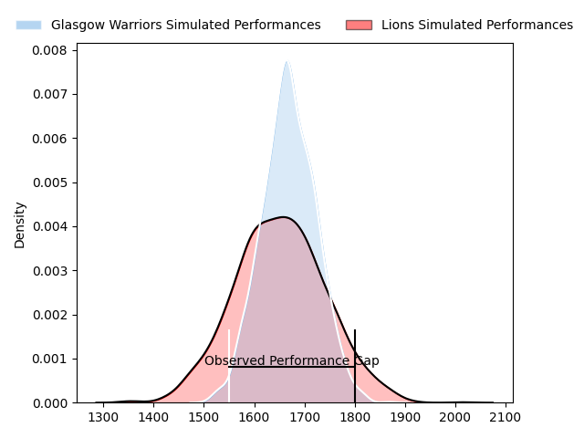
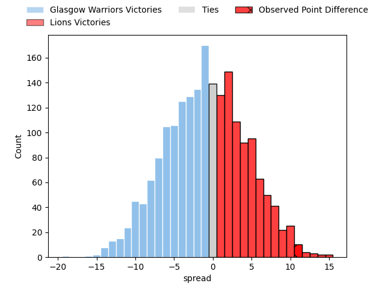
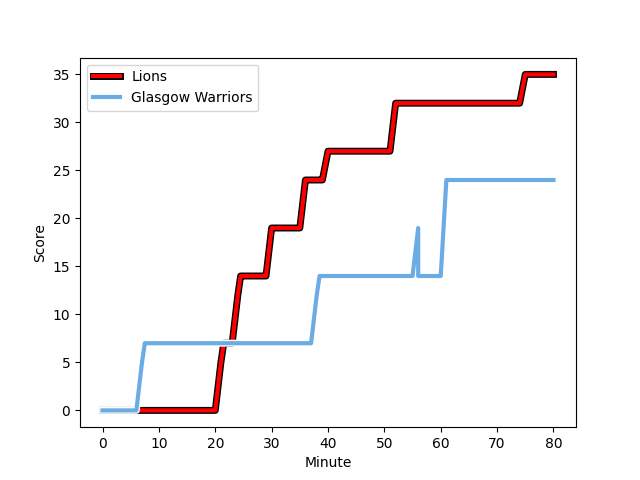
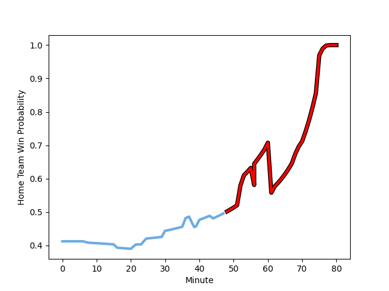

---  
layout: page  
title: Glasgow Warriors at Lions; 24-35  
date: 2023-02-25 15:10:00 18:00:00 -0500  
categories: match review  
---
# Glasgow Warriors at Lions; 24-35

# Club Level Predictions

The first set of predictions treats a club as the smallest object, as the club develops its members, organizes a gameplan, and deploys its players as needed for each match. This club model has a prediction of 0.474, which translates to predicting Glasgow Warriors to win by 0.9.

Each club has a rating and a rating deviation (simiar to a Glicko system), and expected performances can be generated. This allows for simulated matches and spreads like the ones below.
## Projected Performances

## Projected Spreads

## Projected Results

# Player Level Predictions

Treating teams instead as an entity made up of the currently active players, I have ratings for each player in an altogether different system. These can be combined to form team ratings once teamsheets are announced, weighting starters a bit higher than the reserves. After the match is played, players can be weighted by their minutes on the field, allowing for an accurate measure of the team's composition. With these compiled team ratings, we can make predictions, measure inaccuracy, and update the individual player ratings.
## Prediction with Player Minutes: Glasgow Warriors by 11.4

Glasgow Warriors by 15.4 on a neutral field
## Scores over Time

## Win Probability over Time

There were 12 large changes in win probability in this match
## Prediction without Player Minutes: Glasgow Warriors by 8.0

Glasgow Warriors by 12.0 on a neutral pitch

|   Away Minutes | Away Player                                                                   |   Away elo |   Away Percentile |   Number |   Home Percentile |   Home elo | Home Player                                                                         |   Home Minutes |
|---------------:|:------------------------------------------------------------------------------|-----------:|------------------:|---------:|------------------:|-----------:|:------------------------------------------------------------------------------------|---------------:|
|             44 | [Nathan McBeth](..//playerfiles//NathanMcBeth_cleaned.md)                     |      95.09 |                50 |        1 |                22 |      87.46 | [Jean-Pierre Smith](..//playerfiles//Jean-PierreSmith_cleaned.md)                   |             60 |
|             44 | [Johnny Matthews](..//playerfiles//JohnnyMatthews_cleaned.md)                 |      90.87 |                38 |        2 |                19 |      85.28 | [PJ Botha](..//playerfiles//PJBotha_cleaned.md)                                     |             75 |
|             31 | [Lucio Sordoni](..//playerfiles//LucioSordoni_cleaned.md)                     |     101.67 |                74 |        3 |                 2 |      66.75 | [Asenathi Ntlabakanye](..//playerfiles//AsenathiNtlabakanye_cleaned.md)             |             53 |
|             75 | [Lewis Bean](..//playerfiles//LewisBean_cleaned.md)                           |     104.35 |                74 |        4 |                16 |      83.39 | [Ruan Venter](..//playerfiles//RuanVenter_cleaned.md)                               |             62 |
|             80 | [Scott Cummings](..//playerfiles//ScottCummings_cleaned.md)                   |      92.92 |                44 |        5 |                30 |      89    | [Ruben (Hobo) Schoeman](..//playerfiles//Ruben(Hobo)Schoeman_cleaned.md)            |             80 |
|             44 | [Ally Miller](..//playerfiles//AllyMiller_cleaned.md)                         |      95    |               nan |        6 |                74 |     104.03 | [Jacobus Albertus Kriel](..//playerfiles//JacobusAlbertusKriel_cleaned.md)          |             16 |
|             54 | [Rory Darge](..//playerfiles//RoryDarge_cleaned.md)                           |      95    |               nan |        7 |                32 |      89.55 | [Emmanuel Tshituka](..//playerfiles//EmmanuelTshituka_cleaned.md)                   |             80 |
|             80 | [Sione Vailanu](..//playerfiles//SioneVailanu_cleaned.md)                     |     101.26 |                68 |        8 |               nan |      95    | [Francke Horn](..//playerfiles//FranckeHorn_cleaned.md)                             |             80 |
|             53 | [Jamie Dobie](..//playerfiles//JamieDobie_cleaned.md)                         |     102.1  |                72 |        9 |                57 |      94.59 | [Sanele Nohamba](..//playerfiles//SaneleNohamba_cleaned.md)                         |             70 |
|             80 | [Tom Jordan](..//playerfiles//TomJordan_cleaned.md)                           |      91.12 |                37 |       10 |                30 |      89.43 | [Gianni Dean Lombard](..//playerfiles//GianniDeanLombard_cleaned.md)                |             75 |
|             80 | [Elias Caven](..//playerfiles//EliasCaven_cleaned.md)                         |      94.13 |               nan |       11 |                28 |      88.24 | [Edwill Charl van der Merwe](..//playerfiles//EdwillCharlvanderMerwe_cleaned.md)    |             80 |
|             80 | [Sam Johnson](..//playerfiles//SamJohnson_cleaned.md)                         |      98.58 |                61 |       12 |                34 |      89.86 | [Marius Louw](..//playerfiles//MariusLouw_cleaned.md)                               |             80 |
|             80 | [Stafford McDowall](..//playerfiles//StaffordMcDowall_cleaned.md)             |     122.05 |                95 |       13 |                13 |      80.85 | [Manuel Johern (Mannie) Rass](..//playerfiles//ManuelJohern(Mannie)Rass_cleaned.md) |             68 |
|             80 | [Cole Forbes](..//playerfiles//ColeForbes_cleaned.md)                         |      98.58 |                61 |       14 |                24 |      86.73 | [Sibahle Ndiphiwe Maxwane](..//playerfiles//SibahleNdiphiweMaxwane_cleaned.md)      |             80 |
|             80 | [Josh McKay](..//playerfiles//JoshMcKay_cleaned.md)                           |      87.28 |                30 |       15 |                39 |      90.18 | [Quan Horn](..//playerfiles//QuanHorn_cleaned.md)                                   |             80 |
|             49 | [Simon Berghan](..//playerfiles//SimonBerghan_cleaned.md)                     |     102.23 |                77 |       16 |                34 |      87.73 | [Ruhan Straeuli](..//playerfiles//RuhanStraeuli_cleaned.md)                         |             64 |
|             36 | [Jean-Pierre du Preez](..//playerfiles//Jean-PierreduPreez_cleaned.md)        |     110.79 |                87 |       17 |                64 |      96.44 | [Ruan Martin Dreyer](..//playerfiles//RuanMartinDreyer_cleaned.md)                  |             27 |
|             36 | [Allan Michael Elgin Dell](..//playerfiles//AllanMichaelElginDell_cleaned.md) |      95    |               nan |       18 |               nan |      95    | [Rhynardt Rinjsburger](..//playerfiles//RhynardtRinjsburger_cleaned.md)             |             20 |
|             36 | [Angus Fraser](..//playerfiles//AngusFraser_cleaned.md)                       |      95.74 |               nan |       19 |                62 |      98.63 | [Ruan Delport](..//playerfiles//RuanDelport_cleaned.md)                             |             18 |
|             27 | [Sean Kennedy](..//playerfiles//SeanKennedy_cleaned.md)                       |      97.23 |               nan |       20 |                58 |      97.26 | [Rynardt Jonker](..//playerfiles//RynardtJonker_cleaned.md)                         |             12 |
|             26 | [Thomas Gordon](..//playerfiles//ThomasGordon_cleaned.md)                     |      95.8  |                52 |       21 |                10 |      76.46 | [Morne Van den Berg](..//playerfiles//MorneVandenBerg_cleaned.md)                   |             10 |
|              5 | [Euan Ferrie](..//playerfiles//EuanFerrie_cleaned.md)                         |      98.22 |                59 |       22 |                77 |     105.84 | [Andries Coetzee](..//playerfiles//AndriesCoetzee_cleaned.md)                       |              5 |
|            nan | nan                                                                           |     nan    |               nan |       23 |                14 |      82.84 | [Morné Brandon](..//playerfiles//MornéBrandon_cleaned.md)                           |              5 |

