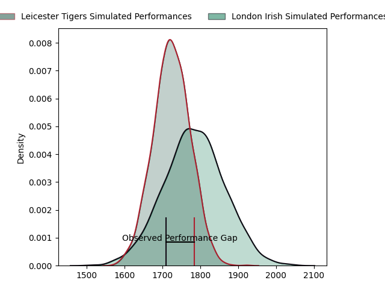
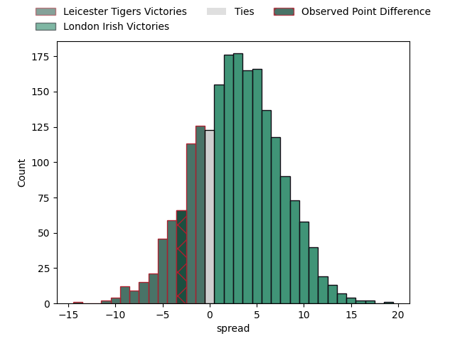
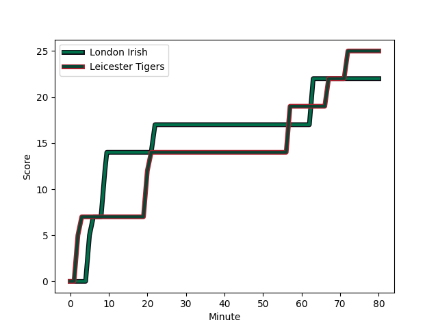
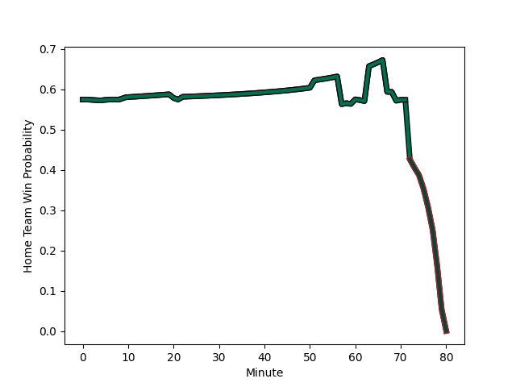

---  
layout: page  
title: Leicester Tigers at London Irish; 25-22  
date: 2023-02-25 14:30:00 18:00:00 -0500  
categories: match review  
---
# Leicester Tigers at London Irish; 25-22

# Club Level Predictions

The first set of predictions treats a club as the smallest object, as the club develops its members, organizes a gameplan, and deploys its players as needed for each match. This club model has a prediction of 0.582, which translates to predicting London Irish to win by 2.9.

Each club has a rating and a rating deviation (simiar to a Glicko system), and expected performances can be generated. This allows for simulated matches and spreads like the ones below.
## Projected Performances

## Projected Spreads

## Projected Results

# Player Level Predictions

Treating teams instead as an entity made up of the currently active players, I have ratings for each player in an altogether different system. These can be combined to form team ratings once teamsheets are announced, weighting starters a bit higher than the reserves. After the match is played, players can be weighted by their minutes on the field, allowing for an accurate measure of the team's composition. With these compiled team ratings, we can make predictions, measure inaccuracy, and update the individual player ratings.
## Prediction with Player Minutes: London Irish by 13.9

London Irish by 9.9 on a neutral field
## Scores over Time

## Win Probability over Time

There were 10 large changes in win probability in this match
## Prediction without Player Minutes: London Irish by 11.9

London Irish by 7.9 on a neutral pitch

|   Away Minutes | Away Player                                                       |   Away elo |   Away Percentile |   Number |   Home Percentile |   Home elo | Home Player                                                                       |   Home Minutes |
|---------------:|:------------------------------------------------------------------|-----------:|------------------:|---------:|------------------:|-----------:|:----------------------------------------------------------------------------------|---------------:|
|             61 | [Tom West](..//playerfiles//TomWest_cleaned.md)                   |      96.45 |                54 |        1 |                64 |      98.84 | [Facundo Gigena](..//playerfiles//FacundoGigena_cleaned.md)                       |             51 |
|             77 | [Julian Montoya](..//playerfiles//JulianMontoya_cleaned.md)       |      84.88 |                18 |        2 |                11 |      83.46 | [Mike Willemse](..//playerfiles//MikeWillemse_cleaned.md)                         |             51 |
|             74 | [Joe Heyes](..//playerfiles//JoeHeyes_cleaned.md)                 |     102.25 |                75 |        3 |                10 |      81.82 | [Lovejoy Chawatama](..//playerfiles//LovejoyChawatama_cleaned.md)                 |             61 |
|             80 | [George Martin](..//playerfiles//GeorgeMartin_cleaned.md)         |      99.28 |                63 |        4 |                56 |      96.79 | [Api Ratuniyarawa](..//playerfiles//ApiRatuniyarawa_cleaned.md)                   |             60 |
|             69 | [Cameron Henderson](..//playerfiles//CameronHenderson_cleaned.md) |     108.94 |                83 |        5 |                98 |     136    | [Rob Simmons](..//playerfiles//RobSimmons_cleaned.md)                             |             80 |
|             80 | [Hanro Liebenberg](..//playerfiles//HanroLiebenberg_cleaned.md)   |     116.34 |                91 |        6 |                50 |      95.04 | [Juan Martin Gonzalez](..//playerfiles//JuanMartinGonzalez_cleaned.md)            |             77 |
|             67 | [Olly Cracknell](..//playerfiles//OllyCracknell_cleaned.md)       |      97.72 |                57 |        7 |                99 |     140.47 | [Tom Pearson](..//playerfiles//TomPearson_cleaned.md)                             |             80 |
|             80 | [Jasper Wiese](..//playerfiles//JasperWiese_cleaned.md)           |     103.47 |                73 |        8 |                85 |     111.12 | [Matt Rogerson](..//playerfiles//MattRogerson_cleaned.md)                         |             58 |
|             80 | [Ben Youngs](..//playerfiles//BenYoungs_cleaned.md)               |      87.72 |                28 |        9 |                26 |      87.15 | [Joe Powell](..//playerfiles//JoePowell_cleaned.md)                               |             58 |
|             80 | [Handre Pollard](..//playerfiles//HandrePollard_cleaned.md)       |     126.44 |                95 |       10 |                95 |     127.95 | [Paddy Jackson](..//playerfiles//PaddyJackson_cleaned.md)                         |             80 |
|             80 | [Harry Potter](..//playerfiles//HarryPotter_cleaned.md)           |      88.48 |                30 |       11 |                89 |     113.57 | [Ben Loader](..//playerfiles//BenLoader_cleaned.md)                               |             80 |
|             58 | [Jimmy Gopperth](..//playerfiles//JimmyGopperth_cleaned.md)       |     100.42 |                66 |       12 |                91 |     115.58 | [Rory Jennings](..//playerfiles//RoryJennings_cleaned.md)                         |             63 |
|             80 | [Matt Scott](..//playerfiles//MattScott_cleaned.md)               |      85.83 |                23 |       13 |                90 |     114.38 | [Benhard Janse van Rensburg](..//playerfiles//BenhardJansevanRensburg_cleaned.md) |             80 |
|             70 | [Chris Ashton](..//playerfiles//ChrisAshton_cleaned.md)           |     107.15 |                81 |       14 |                30 |      88.54 | [Lucio Cinti](..//playerfiles//LucioCinti_cleaned.md)                             |             80 |
|             80 | [Mike Brown](..//playerfiles//MikeBrown_cleaned.md)               |     105.77 |                74 |       15 |                79 |     108.02 | [James Stokes](..//playerfiles//JamesStokes_cleaned.md)                           |             80 |
|              3 | [Charlie Clare](..//playerfiles//CharlieClare_cleaned.md)         |      68.3  |                 4 |       16 |                93 |     115.38 | [Agustin Creevy](..//playerfiles//AgustinCreevy_cleaned.md)                       |             29 |
|             19 | [Francois van Wyk](..//playerfiles//FrancoisvanWyk_cleaned.md)    |     122.29 |                98 |       17 |               nan |      95.63 | [Tarek Haffar](..//playerfiles//TarekHaffar_cleaned.md)                           |             29 |
|              6 | [Will Hurd](..//playerfiles//WillHurd_cleaned.md)                 |      86    |                19 |       18 |                90 |     112.77 | [Oli Hoskins](..//playerfiles//OliHoskins_cleaned.md)                             |             19 |
|             11 | [Harry Wells](..//playerfiles//HarryWells_cleaned.md)             |     143.75 |                99 |       19 |                94 |     119.33 | [Chunya Munga](..//playerfiles//ChunyaMunga_cleaned.md)                           |             20 |
|             13 | [Emeka Ilione](..//playerfiles//EmekaIlione_cleaned.md)           |      94.65 |               nan |       20 |               nan |      89.83 | [Josh Caulfield](..//playerfiles//JoshCaulfield_cleaned.md)                       |              3 |
|              0 | [Tom Whiteley](..//playerfiles//TomWhiteley_cleaned.md)           |     100.42 |                75 |       21 |                57 |      98.79 | [Chandler Cunningham-South](..//playerfiles//ChandlerCunningham-South_cleaned.md) |             22 |
|             22 | [Charlie Atkinson](..//playerfiles//CharlieAtkinson_cleaned.md)   |      91.8  |                43 |       22 |               nan |      96.6  | [Hugh O'Sullivan](..//playerfiles//HughO'Sullivan_cleaned.md)                     |             22 |
|             10 | [Harry Simmons](..//playerfiles//HarrySimmons_cleaned.md)         |     106.09 |                83 |       23 |                43 |      92.93 | [Will Joseph](..//playerfiles//WillJoseph_cleaned.md)                             |             17 |

