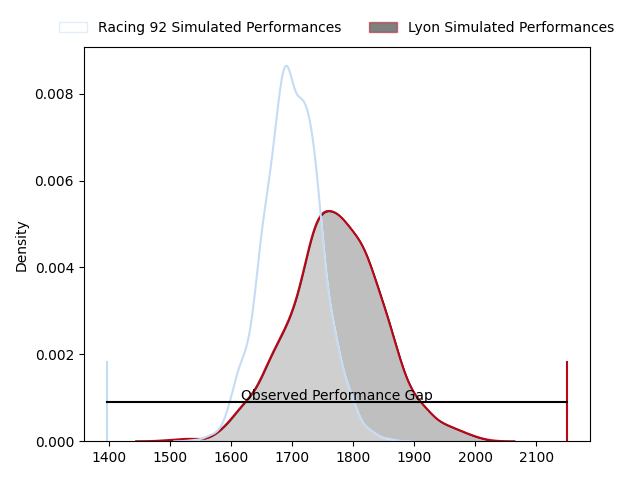
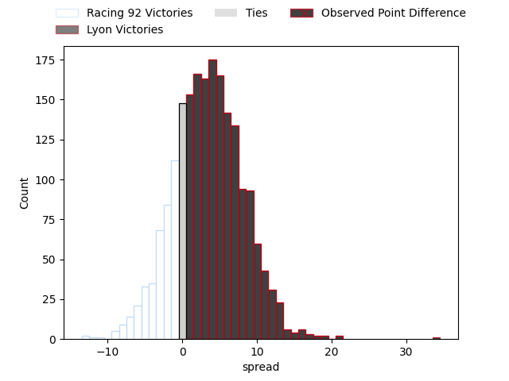
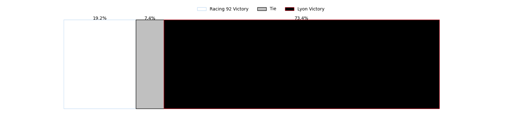
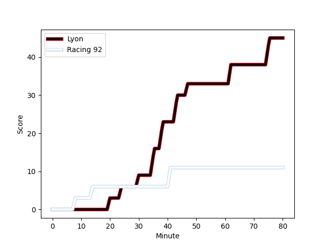
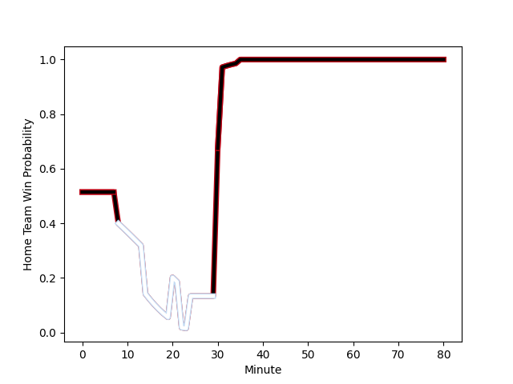

---  
layout: page  
title: Racing 92 at Lyon; 11-45  
date: 2023-02-25 17:00:00 18:00:00 -0500  
categories: match review  
---
# Racing 92 at Lyon; 11-45

# Club Level Predictions

The first set of predictions treats a club as the smallest object, as the club develops its members, organizes a gameplan, and deploys its players as needed for each match. This club model has a prediction of 0.594, which translates to predicting Lyon to win by 3.3.

Each club has a rating and a rating deviation (simiar to a Glicko system), and expected performances can be generated. This allows for simulated matches and spreads like the ones below.
## Projected Performances

## Projected Spreads

## Projected Results

# Player Level Predictions

Treating teams instead as an entity made up of the currently active players, I have ratings for each player in an altogether different system. These can be combined to form team ratings once teamsheets are announced, weighting starters a bit higher than the reserves. After the match is played, players can be weighted by their minutes on the field, allowing for an accurate measure of the team's composition. With these compiled team ratings, we can make predictions, measure inaccuracy, and update the individual player ratings.
## Prediction with Player Minutes: Lyon by 6.5

Lyon by 2.5 on a neutral field
## Scores over Time

## Win Probability over Time

There were 7 large changes in win probability in this match
## Prediction without Player Minutes: Lyon by 5.1

Lyon by 1.1 on a neutral pitch

|   Away Minutes | Away Player                                                                |   Away elo |   Away Percentile |   Number |   Home Percentile |   Home elo | Home Player                                                                      |   Home Minutes |
|---------------:|:---------------------------------------------------------------------------|-----------:|------------------:|---------:|------------------:|-----------:|:---------------------------------------------------------------------------------|---------------:|
|             63 | [Guram Gogichashvili](..//playerfiles//GuramGogichashvili_cleaned.md)      |     106.79 |                85 |        1 |                46 |      93.75 | [Sébastien Taofifenua](..//playerfiles//SébastienTaofifenua_cleaned.md)          |             61 |
|             31 | [Peniami Nasali Narisia](..//playerfiles//PeniamiNasaliNarisia_cleaned.md) |      98.28 |                58 |        2 |                48 |      96.43 | [Liam Coltman](..//playerfiles//LiamColtman_cleaned.md)                          |             55 |
|             63 | [Gia Kharaishvili](..//playerfiles//GiaKharaishvili_cleaned.md)            |     105.47 |                82 |        3 |                33 |      94.75 | [Paulo Tafili](..//playerfiles//PauloTafili_cleaned.md)                          |             49 |
|             80 | [Boris Palu](..//playerfiles//BorisPalu_cleaned.md)                        |      98.59 |                61 |        4 |                40 |      92.01 | [Théo William](..//playerfiles//ThéoWilliam_cleaned.md)                          |             61 |
|             55 | [Fabien Sanconnie](..//playerfiles//FabienSanconnie_cleaned.md)            |      93.92 |                47 |        5 |                82 |     108.79 | [Temo Sukayawa Mayanavanua](..//playerfiles//TemoSukayawaMayanavanua_cleaned.md) |             80 |
|             44 | [Wenceslas Lauret](..//playerfiles//WenceslasLauret_cleaned.md)            |     106.01 |                77 |        6 |                74 |     103.92 | [Dylan Cretin](..//playerfiles//DylanCretin_cleaned.md)                          |             80 |
|             80 | [Ibrahim Diallo](..//playerfiles//IbrahimDiallo_cleaned.md)                |      88.04 |                27 |        7 |                85 |     110.58 | [Patrick Sobela](..//playerfiles//PatrickSobela_cleaned.md)                      |             22 |
|             44 | [Kitione Kamikamica](..//playerfiles//KitioneKamikamica_cleaned.md)        |     107.8  |                81 |        8 |                32 |      89.59 | [Arno Botha](..//playerfiles//ArnoBotha_cleaned.md)                              |             41 |
|             80 | [Teddy Iribaren](..//playerfiles//TeddyIribaren_cleaned.md)                |     102.34 |                72 |        9 |                87 |     106.98 | [Jean-Marc Doussain](..//playerfiles//Jean-MarcDoussain_cleaned.md)              |             49 |
|             63 | [Antoine Gibert](..//playerfiles//AntoineGibert_cleaned.md)                |      96.73 |                52 |       10 |                20 |      85.77 | [Léo Berdeu](..//playerfiles//LéoBerdeu_cleaned.md)                              |             80 |
|             80 | [Vinaya Habosi](..//playerfiles//VinayaHabosi_cleaned.md)                  |      95    |               nan |       11 |                52 |      96.02 | [Davit Niniashvili](..//playerfiles//DavitNiniashvili_cleaned.md)                |             80 |
|             55 | [Henry Chavancy](..//playerfiles//HenryChavancy_cleaned.md)                |      87.97 |                28 |       12 |                83 |     108.51 | [Josua Tuisova](..//playerfiles//JosuaTuisova_cleaned.md)                        |             80 |
|             80 | [Inia Tabuavou](..//playerfiles//IniaTabuavou_cleaned.md)                  |     109.02 |                84 |       13 |                80 |     106.27 | [Josiah Maraku](..//playerfiles//JosiahMaraku_cleaned.md)                        |             80 |
|             80 | [Donovan Taofifenua](..//playerfiles//DonovanTaofifenua_cleaned.md)        |     103.82 |                74 |       14 |                50 |      94.59 | [Tavite Veredamu](..//playerfiles//TaviteVeredamu_cleaned.md)                    |             51 |
|             80 | [Max Spring](..//playerfiles//MaxSpring_cleaned.md)                        |      82.96 |                21 |       15 |                50 |      95.19 | [Toby Arnold](..//playerfiles//TobyArnold_cleaned.md)                            |             80 |
|             49 | [Janick Tarrit](..//playerfiles//JanickTarrit_cleaned.md)                  |      82.77 |                15 |       16 |                56 |      97.63 | [Mickael Guillard](..//playerfiles//MickaelGuillard_cleaned.md)                  |             58 |
|             36 | [Baptiste Chouzenoux](..//playerfiles//BaptisteChouzenoux_cleaned.md)      |      81.85 |                12 |       17 |                60 |      96    | [Joel Kpoku](..//playerfiles//JoelKpoku_cleaned.md)                              |             39 |
|             36 | [Maxime Baudonne](..//playerfiles//MaximeBaudonne_cleaned.md)              |      86.23 |                23 |       18 |               nan |      95    | [Feao Fotuaika](..//playerfiles//FeaoFotuaika_cleaned.md)                        |             31 |
|             25 | [Olivier Klemenczak](..//playerfiles//OlivierKlemenczak_cleaned.md)        |      93.31 |                45 |       19 |               nan |      95.78 | [Liam Rimet](..//playerfiles//LiamRimet_cleaned.md)                              |             31 |
|             25 | [Anton Bresler](..//playerfiles//AntonBresler_cleaned.md)                  |      94.29 |                55 |       20 |               nan |      93.64 | [Lima Sopoaga](..//playerfiles//LimaSopoaga_cleaned.md)                          |             29 |
|             17 | [Ben Volavola](..//playerfiles//BenVolavola_cleaned.md)                    |      94.08 |               nan |       21 |                49 |      95.62 | [Yanis Charcosset](..//playerfiles//YanisCharcosset_cleaned.md)                  |             25 |
|             17 | [Trevor Ntando Nyakane](..//playerfiles//TrevorNtandoNyakane_cleaned.md)   |      92.17 |                30 |       22 |               nan |      95    | [Killian Geraci](..//playerfiles//KillianGeraci_cleaned.md)                      |             19 |
|             17 | [Cedate Gomes Sa](..//playerfiles//CedateGomesSa_cleaned.md)               |      89.78 |                31 |       23 |               nan |      93.11 | [Vivien Devisme](..//playerfiles//VivienDevisme_cleaned.md)                      |             19 |

