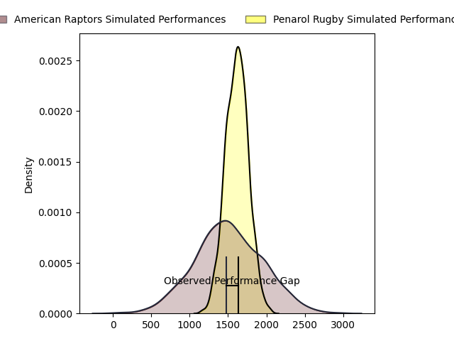
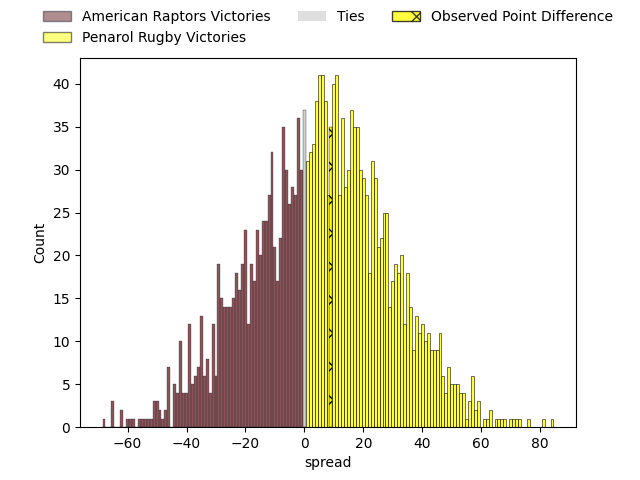
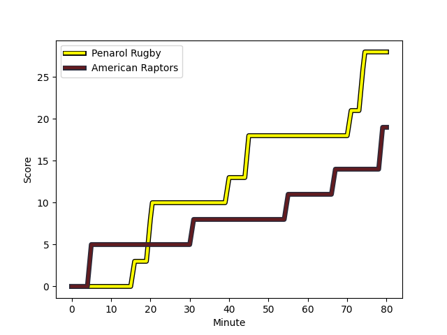
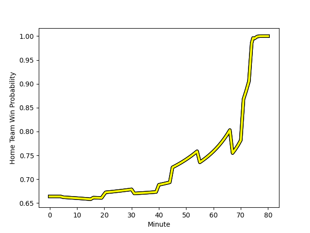

---  
layout: page  
title: American Raptors at Penarol Rugby; 19-28  
date: 2023-02-25 22:00:00 18:00:00 -0500  
categories: match review  
---
# American Raptors at Penarol Rugby; 19-28

# Club Level Predictions

The first set of predictions treats a club as the smallest object, as the club develops its members, organizes a gameplan, and deploys its players as needed for each match. This club model has a prediction of 0.598, which translates to predicting Penarol Rugby to win by 5.9.

Each club has a rating and a rating deviation (simiar to a Glicko system), and expected performances can be generated. This allows for simulated matches and spreads like the ones below.
## Projected Performances

## Projected Spreads

## Projected Results

# Player Level Predictions

Treating teams instead as an entity made up of the currently active players, I have ratings for each player in an altogether different system. These can be combined to form team ratings once teamsheets are announced, weighting starters a bit higher than the reserves. After the match is played, players can be weighted by their minutes on the field, allowing for an accurate measure of the team's composition. With these compiled team ratings, we can make predictions, measure inaccuracy, and update the individual player ratings.
## Prediction with Player Minutes: Penarol Rugby by 12.2

Penarol Rugby by 8.2 on a neutral field
## Scores over Time

## Win Probability over Time

There were 6 large changes in win probability in this match
## Prediction without Player Minutes: Penarol Rugby by 12.2

Penarol Rugby by 8.2 on a neutral pitch

|   Away Minutes | Away Player                                                                    |   Away elo |   Away Percentile |   Number |   Home Percentile |   Home elo | Home Player                                                                                   |   Home Minutes |
|---------------:|:-------------------------------------------------------------------------------|-----------:|------------------:|---------:|------------------:|-----------:|:----------------------------------------------------------------------------------------------|---------------:|
|             80 | [Ma'ake Muti](..//playerfiles//Ma'akeMuti_cleaned.md)                          |      95    |               nan |        1 |                56 |     100.46 | [Edgardo Matias Benitez Santin](..//playerfiles//EdgardoMatiasBenitezSantin_cleaned.md)       |             80 |
|             80 | [Diego Fortuny](..//playerfiles//DiegoFortuny_cleaned.md)                      |      89.64 |                32 |        2 |               nan |      95    | [Guillermo Pujadas Leon](..//playerfiles//GuillermoPujadasLeon_cleaned.md)                    |             80 |
|             80 | [Juan Echeverria](..//playerfiles//JuanEcheverria_cleaned.md)                  |      95    |               nan |        3 |               nan |      95    | [Ignacio Alfredo Peculo Rodriguez](..//playerfiles//IgnacioAlfredoPeculoRodriguez_cleaned.md) |             80 |
|             80 | [Mikey Grandy](..//playerfiles//MikeyGrandy_cleaned.md)                        |      95    |               nan |        4 |               nan |      95    | [Ignacio Dotti](..//playerfiles//IgnacioDotti_cleaned.md)                                     |             80 |
|             80 | [Will Crawford](..//playerfiles//WillCrawford_cleaned.md)                      |      58.97 |                 2 |        5 |               nan |      97.21 | [Felipe Aliaga](..//playerfiles//FelipeAliaga_cleaned.md)                                     |             80 |
|             80 | [Shawn Clark](..//playerfiles//ShawnClark_cleaned.md)                          |      91.94 |                43 |        6 |               nan |      95    | [Manuel Ardao](..//playerfiles//ManuelArdao_cleaned.md)                                       |             80 |
|             80 | [Diego Magno](..//playerfiles//DiegoMagno_cleaned.md)                          |      95    |               nan |        7 |               nan |      95    | [Lucas Bianchi](..//playerfiles//LucasBianchi_cleaned.md)                                     |             80 |
|             80 | [Ronan Murphy](..//playerfiles//RonanMurphy_cleaned.md)                        |      93.98 |                47 |        8 |               nan |      95    | [Manuel Diana](..//playerfiles//ManuelDiana_cleaned.md)                                       |             80 |
|             80 | [Martin Landajo](..//playerfiles//MartinLandajo_cleaned.md)                    |      95    |               nan |        9 |                61 |      97.92 | [Santiago Álvarez Viera Da Cunha](..//playerfiles//SantiagoÁlvarezVieraDaCunha_cleaned.md)    |             80 |
|             80 | [Lucas Gonzalez Amorosino](..//playerfiles//LucasGonzalezAmorosino_cleaned.md) |      95    |               nan |       10 |               nan |      95    | [Felipe Etcheverry](..//playerfiles//FelipeEtcheverry_cleaned.md)                             |             80 |
|             80 | [Seimou Smith](..//playerfiles//SeimouSmith_cleaned.md)                        |      86.86 |               nan |       11 |               nan |      95    | [Juan Manuel Alonso](..//playerfiles//JuanManuelAlonso_cleaned.md)                            |             80 |
|             80 | [Aki Pulu](..//playerfiles//AkiPulu_cleaned.md)                                |      95    |               nan |       12 |                86 |     111.61 | [Juan Zuccarino](..//playerfiles//JuanZuccarino_cleaned.md)                                   |             80 |
|             80 | [Dominik Iacovino](..//playerfiles//DominikIacovino_cleaned.md)                |      94.29 |               nan |       13 |               nan |      95    | [Tomas Inciarte Rachetti](..//playerfiles//TomasInciarteRachetti_cleaned.md)                  |             80 |
|             80 | [Ryan James](..//playerfiles//RyanJames_cleaned.md)                            |      95    |               nan |       14 |               nan |      95    | [Alfonso Silva](..//playerfiles//AlfonsoSilva_cleaned.md)                                     |             80 |
|             80 | [Line Latu](..//playerfiles//LineLatu_cleaned.md)                              |      95    |               nan |       15 |               nan |      95    | [Rodrigo Silva](..//playerfiles//RodrigoSilva_cleaned.md)                                     |             80 |

