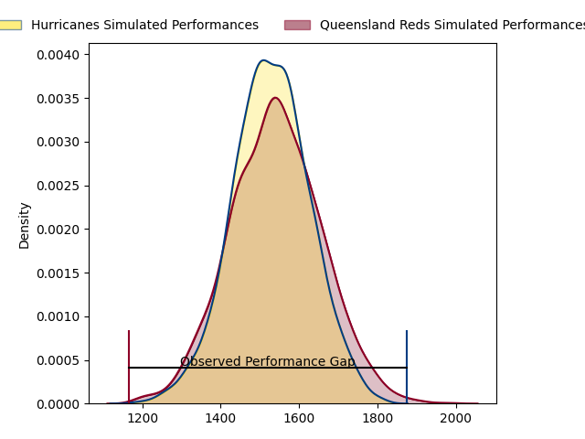
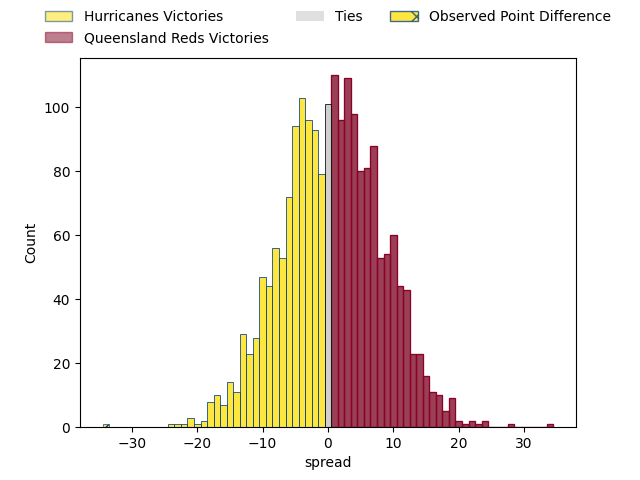
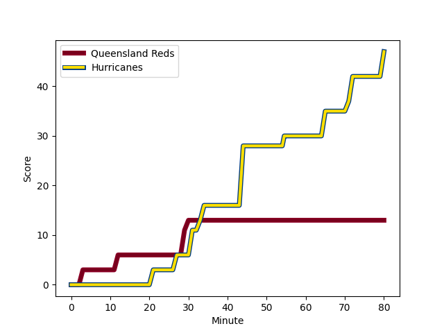
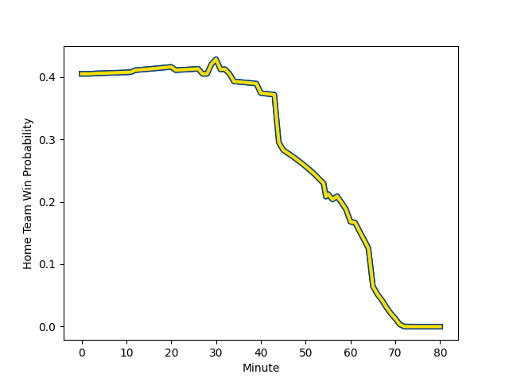

---  
layout: page  
title: Hurricanes at Queensland Reds; 47-13  
date: 2023-02-25 03:35:00 18:00:00 -0500  
categories: match review  
---
# Hurricanes at Queensland Reds; 47-13

# Club Level Predictions

The first set of predictions treats a club as the smallest object, as the club develops its members, organizes a gameplan, and deploys its players as needed for each match. This club model has a prediction of 0.511, which translates to predicting Queensland Reds to win by 0.4.

Each club has a rating and a rating deviation (simiar to a Glicko system), and expected performances can be generated. This allows for simulated matches and spreads like the ones below.
## Projected Performances

## Projected Spreads

## Projected Results

# Player Level Predictions

Treating teams instead as an entity made up of the currently active players, I have ratings for each player in an altogether different system. These can be combined to form team ratings once teamsheets are announced, weighting starters a bit higher than the reserves. After the match is played, players can be weighted by their minutes on the field, allowing for an accurate measure of the team's composition. With these compiled team ratings, we can make predictions, measure inaccuracy, and update the individual player ratings.
## Prediction with Player Minutes: Hurricanes by 12.7

Hurricanes by 16.7 on a neutral field
## Scores over Time

## Win Probability over Time

There were 2 large changes in win probability in this match
## Prediction without Player Minutes: Hurricanes by 10.9

Hurricanes by 14.9 on a neutral pitch

|   Away Minutes | Away Player                                                             |   Away elo |   Away Percentile |   Number |   Home Percentile |   Home elo | Home Player                                                     |   Home Minutes |
|---------------:|:------------------------------------------------------------------------|-----------:|------------------:|---------:|------------------:|-----------:|:----------------------------------------------------------------|---------------:|
|             40 | [Xavier Numia](..//playerfiles//XavierNumia_cleaned.md)                 |     125.32 |                97 |        1 |                77 |     103.98 | [Dane Zander](..//playerfiles//DaneZander_cleaned.md)           |             45 |
|             40 | [Dane Coles](..//playerfiles//DaneColes_cleaned.md)                     |     130.63 |                98 |        2 |                56 |      95.86 | [Matt Faessler](..//playerfiles//MattFaessler_cleaned.md)       |             55 |
|             40 | [Owen Franks](..//playerfiles//OwenFranks_cleaned.md)                   |      93.35 |                44 |        3 |                53 |      96.21 | [Zane Nonggorr](..//playerfiles//ZaneNonggorr_cleaned.md)       |             53 |
|             67 | [James Blackwell](..//playerfiles//JamesBlackwell_cleaned.md)           |      99.51 |                64 |        4 |                49 |      94.54 | [Ryan Smith](..//playerfiles//RyanSmith_cleaned.md)             |             74 |
|             80 | [Isaia Walker-Leawere](..//playerfiles//IsaiaWalker-Leawere_cleaned.md) |     117.94 |                92 |        5 |               nan |      95    | [Lopeti Faifua](..//playerfiles//LopetiFaifua_cleaned.md)       |             55 |
|             57 | [Devan Flanders](..//playerfiles//DevanFlanders_cleaned.md)             |      95    |               nan |        6 |                54 |      96.91 | [Seru Uru](..//playerfiles//SeruUru_cleaned.md)                 |             80 |
|             60 | [Peter Lakai](..//playerfiles//PeterLakai_cleaned.md)                   |     104.5  |                75 |        7 |                84 |     109.96 | [Fraser McReight](..//playerfiles//FraserMcReight_cleaned.md)   |             80 |
|             80 | [Ardie Savea](..//playerfiles//ArdieSavea_cleaned.md)                   |     123.53 |                95 |        8 |               nan |     106.26 | [Harry Wilson](..//playerfiles//HarryWilson_cleaned.md)         |             80 |
|             61 | [Cam Roigard](..//playerfiles//CamRoigard_cleaned.md)                   |      98.4  |                60 |        9 |                58 |     101.28 | [Tate McDermott](..//playerfiles//TateMcDermott_cleaned.md)     |             62 |
|             80 | [Aidan Morgan](..//playerfiles//AidanMorgan_cleaned.md)                 |     104.54 |                64 |       10 |               nan |      95    | [Tom Lynagh](..//playerfiles//TomLynagh_cleaned.md)             |             80 |
|             74 | [Salesi Rayasi](..//playerfiles//SalesiRayasi_cleaned.md)               |      97.09 |                56 |       11 |                93 |     120.66 | [Filipo Daugunu](..//playerfiles//FilipoDaugunu_cleaned.md)     |             71 |
|             80 | [Jordie Barrett](..//playerfiles//JordieBarrett_cleaned.md)             |     134.49 |                98 |       12 |               nan |      95    | [Isaac Henry](..//playerfiles//IsaacHenry_cleaned.md)           |             80 |
|             80 | [Billy Proctor](..//playerfiles//BillyProctor_cleaned.md)               |     121.02 |                94 |       13 |                89 |     114.15 | [Hunter Paisami](..//playerfiles//HunterPaisami_cleaned.md)     |             80 |
|             80 | [Julian Savea](..//playerfiles//JulianSavea_cleaned.md)                 |     138.05 |                99 |       14 |                48 |      94.29 | [Josh Flook](..//playerfiles//JoshFlook_cleaned.md)             |             80 |
|             80 | [Joshua Moorby](..//playerfiles//JoshuaMoorby_cleaned.md)               |      94.68 |                48 |       15 |                49 |      94.3  | [Jordan Petaia](..//playerfiles//JordanPetaia_cleaned.md)       |             60 |
|             40 | [Asafo Aumua](..//playerfiles//AsafoAumua_cleaned.md)                   |     123.65 |                96 |       16 |                90 |     115.8  | [Richie Asiata](..//playerfiles//RichieAsiata_cleaned.md)       |             25 |
|             40 | [Tevita Mafileo](..//playerfiles//TevitaMafileo_cleaned.md)             |     105.99 |                83 |       17 |               nan |      88.21 | [Sef Fa'agase](..//playerfiles//SefFa'agase_cleaned.md)         |             35 |
|             40 | [Tyrel Lomax](..//playerfiles//TyrelLomax_cleaned.md)                   |     145.67 |                99 |       18 |               nan |      95    | [Peni Ravai](..//playerfiles//PeniRavai_cleaned.md)             |             27 |
|             13 | [Caleb Delany](..//playerfiles//CalebDelany_cleaned.md)                 |      81.1  |                12 |       19 |               nan |      95    | [Jake Upfield](..//playerfiles//JakeUpfield_cleaned.md)         |             25 |
|             20 | [Du'Plessis Kirifi](..//playerfiles//Du'PlessisKirifi_cleaned.md)       |     127.84 |                96 |       20 |               nan |      95    | [Connor Anderson](..//playerfiles//ConnorAnderson_cleaned.md)   |              6 |
|             23 | [Brayden Iose](..//playerfiles//BraydenIose_cleaned.md)                 |      59.04 |                 1 |       21 |                62 |      98.42 | [Kalani Thomas](..//playerfiles//KalaniThomas_cleaned.md)       |             18 |
|             19 | [Jamie Booth](..//playerfiles//JamieBooth_cleaned.md)                   |      68.8  |                 4 |       22 |               nan |      95    | [Lawson Creighton](..//playerfiles//LawsonCreighton_cleaned.md) |              9 |
|              6 | [Harry Godfrey](..//playerfiles//HarryGodfrey_cleaned.md)               |      87.27 |                32 |       23 |               nan |      95    | [Taj Annan](..//playerfiles//TajAnnan_cleaned.md)               |             20 |

