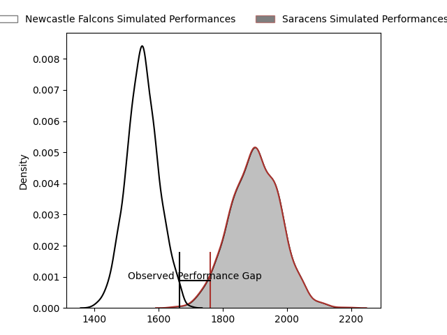
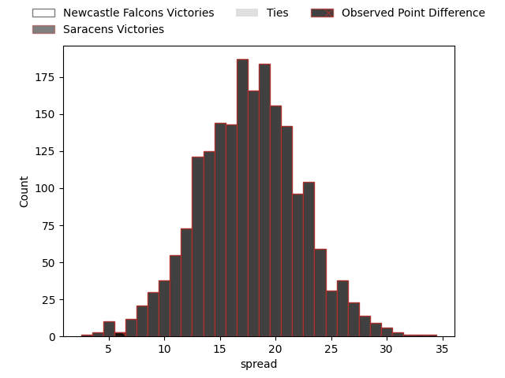
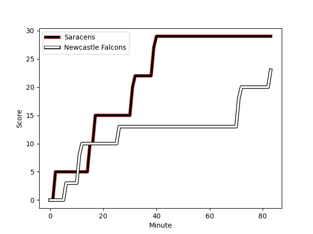
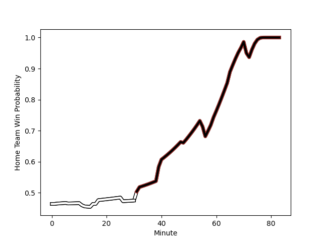

---  
layout: page  
title: Newcastle Falcons at Saracens; 23-29  
date: 2023-02-25 09:30:00 18:00:00 -0500  
categories: match review  
---
# Newcastle Falcons at Saracens; 23-29

# Club Level Predictions

The first set of predictions treats a club as the smallest object, as the club develops its members, organizes a gameplan, and deploys its players as needed for each match. This club model has a prediction of 0.881, which translates to predicting Saracens to win by 17.6.

Each club has a rating and a rating deviation (simiar to a Glicko system), and expected performances can be generated. This allows for simulated matches and spreads like the ones below.
## Projected Performances

## Projected Spreads

## Projected Results

# Player Level Predictions

Treating teams instead as an entity made up of the currently active players, I have ratings for each player in an altogether different system. These can be combined to form team ratings once teamsheets are announced, weighting starters a bit higher than the reserves. After the match is played, players can be weighted by their minutes on the field, allowing for an accurate measure of the team's composition. With these compiled team ratings, we can make predictions, measure inaccuracy, and update the individual player ratings.
## Prediction with Player Minutes: Newcastle Falcons by 4.5

Newcastle Falcons by 8.5 on a neutral field
## Scores over Time

## Win Probability over Time

There were 7 large changes in win probability in this match
## Prediction without Player Minutes: Newcastle Falcons by 3.2

Newcastle Falcons by 7.2 on a neutral pitch

|   Away Minutes | Away Player                                                          |   Away elo |   Away Percentile |   Number |   Home Percentile |   Home elo | Home Player                                                   |   Home Minutes |
|---------------:|:---------------------------------------------------------------------|-----------:|------------------:|---------:|------------------:|-----------:|:--------------------------------------------------------------|---------------:|
|             50 | [Logovi'i Mulipola](..//playerfiles//Logovi'iMulipola_cleaned.md)    |     104.57 |                81 |        1 |                16 |      84    | [Eroni Mawi](..//playerfiles//EroniMawi_cleaned.md)           |             55 |
|             72 | [Jamie Blamire](..//playerfiles//JamieBlamire_cleaned.md)            |      91.51 |                39 |        2 |                50 |      93.33 | [Theo Dan](..//playerfiles//TheoDan_cleaned.md)               |             55 |
|             56 | [Trevor Davison](..//playerfiles//TrevorDavison_cleaned.md)          |      69.23 |                 3 |        3 |                22 |      87.14 | [Alec Clarey](..//playerfiles//AlecClarey_cleaned.md)         |             55 |
|             83 | [Greg Peterson](..//playerfiles//GregPeterson_cleaned.md)            |      81.31 |                15 |        4 |                 7 |      72.64 | [Tom Ellis](..//playerfiles//TomEllis_cleaned.md)             |             72 |
|             83 | [Sebastian de Chaves](..//playerfiles//SebastiandeChaves_cleaned.md) |      81.92 |                16 |        5 |                19 |      83.9  | [Hugh Tizard](..//playerfiles//HughTizard_cleaned.md)         |             83 |
|             56 | [Philip van der Walt](..//playerfiles//PhilipvanderWalt_cleaned.md)  |      92.11 |                44 |        6 |                26 |      87.54 | [Andy Christie](..//playerfiles//AndyChristie_cleaned.md)     |             83 |
|             56 | [Gary Graham](..//playerfiles//GaryGraham_cleaned.md)                |     106.78 |                78 |        7 |                93 |     119    | [Ben Earl](..//playerfiles//BenEarl_cleaned.md)               |             83 |
|             83 | [Callum Chick](..//playerfiles//CallumChick_cleaned.md)              |     104.22 |                74 |        8 |                84 |     110.18 | [Billy Vunipola](..//playerfiles//BillyVunipola_cleaned.md)   |             78 |
|             70 | [Michael Young](..//playerfiles//MichaelYoung_cleaned.md)            |     118.78 |                96 |        9 |                91 |     113.4  | [Ivan van Zyl](..//playerfiles//IvanvanZyl_cleaned.md)        |             55 |
|             83 | [Brett Connon](..//playerfiles//BrettConnon_cleaned.md)              |     100.75 |                64 |       10 |                41 |      92.63 | [Manu Vunipola](..//playerfiles//ManuVunipola_cleaned.md)     |             83 |
|             83 | [Ben Stevenson](..//playerfiles//BenStevenson_cleaned.md)            |      96.54 |                55 |       11 |                21 |      85.53 | [Alex Lewington](..//playerfiles//AlexLewington_cleaned.md)   |             65 |
|             48 | [Matias Orlando](..//playerfiles//MatiasOrlando_cleaned.md)          |      81.31 |                14 |       12 |               nan |      96.76 | [Olly Hartley](..//playerfiles//OllyHartley_cleaned.md)       |             69 |
|             59 | [Matias Moroni](..//playerfiles//MatiasMoroni_cleaned.md)            |     122.37 |                95 |       13 |                49 |      94.82 | [Alex Lozowski](..//playerfiles//AlexLozowski_cleaned.md)     |             83 |
|             83 | [Adam Radwan](..//playerfiles//AdamRadwan_cleaned.md)                |     133.01 |                97 |       14 |                62 |      99.25 | [Rotimi Segun](..//playerfiles//RotimiSegun_cleaned.md)       |             83 |
|             83 | [Elliott Obatoyinbo](..//playerfiles//ElliottObatoyinbo_cleaned.md)  |      99.41 |                60 |       15 |                67 |     101.47 | [Alex Goode](..//playerfiles//AlexGoode_cleaned.md)           |             83 |
|             11 | [Ollie Fletcher](..//playerfiles//OllieFletcher_cleaned.md)          |      95    |               nan |       16 |                 1 |      45.61 | [Kapeli Pifeleti](..//playerfiles//KapeliPifeleti_cleaned.md) |             28 |
|             33 | [Adam Brocklebank](..//playerfiles//AdamBrocklebank_cleaned.md)      |     104.7  |                81 |       17 |               nan |     104.5  | [Robin Hislop](..//playerfiles//RobinHislop_cleaned.md)       |             28 |
|             27 | [Mark Tampin](..//playerfiles//MarkTampin_cleaned.md)                |     100.12 |               nan |       18 |                15 |      82.91 | [Eduardo Bello](..//playerfiles//EduardoBello_cleaned.md)     |             28 |
|             27 | [Freddie Lockwood](..//playerfiles//FreddieLockwood_cleaned.md)      |     103.45 |                73 |       19 |               nan |      92.1  | [Cameron Boon](..//playerfiles//CameronBoon_cleaned.md)       |             11 |
|             27 | [Carl Fearns](..//playerfiles//CarlFearns_cleaned.md)                |     123.7  |                95 |       20 |               nan |      93.4  | [Toby Knight](..//playerfiles//TobyKnight_cleaned.md)         |              5 |
|             13 | [Sam Stuart](..//playerfiles//SamStuart_cleaned.md)                  |      64.96 |                 3 |       21 |                69 |     100.79 | [Aled Davies](..//playerfiles//AledDavies_cleaned.md)         |             28 |
|             24 | [Tian Schoeman](..//playerfiles//TianSchoeman_cleaned.md)            |     115.62 |                91 |       22 |               nan |      92.91 | [Josh Hallett](..//playerfiles//JoshHallett_cleaned.md)       |             14 |
|             35 | [Pete Lucock](..//playerfiles//PeteLucock_cleaned.md)                |      95.8  |                52 |       23 |                87 |     114.65 | [Sean Maitland](..//playerfiles//SeanMaitland_cleaned.md)     |             18 |

