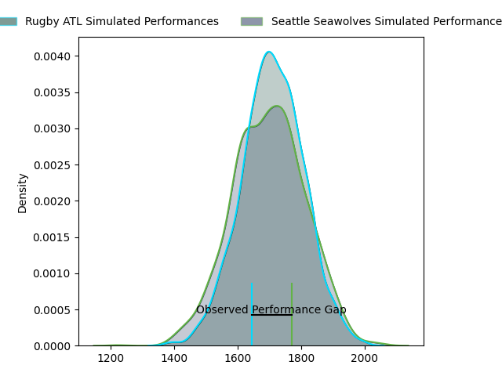
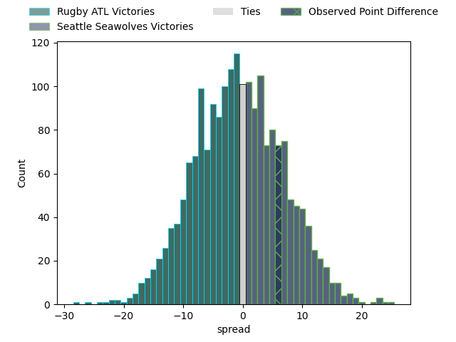
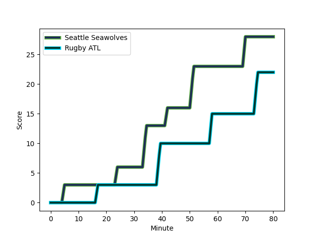
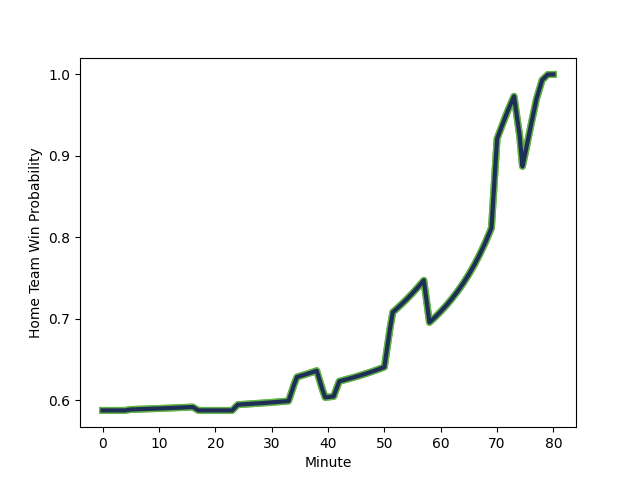

---  
layout: page  
title: Rugby ATL at Seattle Seawolves; 22-28  
date: 2023-02-25 04:30:00 18:00:00 -0500  
categories: match review  
---
# Rugby ATL at Seattle Seawolves; 22-28

# Club Level Predictions

The first set of predictions treats a club as the smallest object, as the club develops its members, organizes a gameplan, and deploys its players as needed for each match. This club model has a prediction of 0.481, which translates to predicting Rugby ATL to win by 0.7.

Each club has a rating and a rating deviation (simiar to a Glicko system), and expected performances can be generated. This allows for simulated matches and spreads like the ones below.
## Projected Performances

## Projected Spreads

## Projected Results

# Player Level Predictions

Treating teams instead as an entity made up of the currently active players, I have ratings for each player in an altogether different system. These can be combined to form team ratings once teamsheets are announced, weighting starters a bit higher than the reserves. After the match is played, players can be weighted by their minutes on the field, allowing for an accurate measure of the team's composition. With these compiled team ratings, we can make predictions, measure inaccuracy, and update the individual player ratings.
## Prediction with Player Minutes: Seattle Seawolves by 29.1

Seattle Seawolves by 25.1 on a neutral field
## Scores over Time

## Win Probability over Time

There were 5 large changes in win probability in this match
## Prediction without Player Minutes: Seattle Seawolves by 26.9

Seattle Seawolves by 22.9 on a neutral pitch

|   Away Minutes | Away Player                                                                |   Away elo |   Away Percentile |   Number |   Home Percentile |   Home elo | Home Player                                                                |   Home Minutes |
|---------------:|:---------------------------------------------------------------------------|-----------:|------------------:|---------:|------------------:|-----------:|:---------------------------------------------------------------------------|---------------:|
|             74 | [Alex Maughan](..//playerfiles//AlexMaughan_cleaned.md)                    |      -6.86 |                 0 |        1 |                77 |     103.23 | [Mzamo Majola](..//playerfiles//MzamoMajola_cleaned.md)                    |             59 |
|             80 | [Alex Maughan](..//playerfiles//AlexMaughan_cleaned.md)                    |      -6.86 |                 0 |        1 |                77 |     103.23 | [Mzamo Majola](..//playerfiles//MzamoMajola_cleaned.md)                    |             59 |
|             80 | [Alex Maughan](..//playerfiles//AlexMaughan_cleaned.md)                    |      -6.86 |                 0 |        1 |                77 |     103.23 | [Mzamo Majola](..//playerfiles//MzamoMajola_cleaned.md)                    |             80 |
|             80 | [Alex Maughan](..//playerfiles//AlexMaughan_cleaned.md)                    |      -6.86 |                 0 |        1 |                77 |     103.23 | [Mzamo Majola](..//playerfiles//MzamoMajola_cleaned.md)                    |             80 |
|             74 | [Alex Maughan](..//playerfiles//AlexMaughan_cleaned.md)                    |      -6.86 |                 0 |        1 |                77 |     103.23 | [Mzamo Majola](..//playerfiles//MzamoMajola_cleaned.md)                    |             80 |
|             74 | [Alex Maughan](..//playerfiles//AlexMaughan_cleaned.md)                    |      -6.86 |                 0 |        1 |                77 |     103.23 | [Mzamo Majola](..//playerfiles//MzamoMajola_cleaned.md)                    |             80 |
|             80 | [Alex Maughan](..//playerfiles//AlexMaughan_cleaned.md)                    |      -6.86 |                 0 |        1 |                77 |     103.23 | [Mzamo Majola](..//playerfiles//MzamoMajola_cleaned.md)                    |             59 |
|             74 | [Alex Maughan](..//playerfiles//AlexMaughan_cleaned.md)                    |      -6.86 |                 0 |        1 |                77 |     103.23 | [Mzamo Majola](..//playerfiles//MzamoMajola_cleaned.md)                    |             59 |
|             59 | [Tiaan Erasmus](..//playerfiles//TiaanErasmus_cleaned.md)                  |      27.91 |                 0 |        2 |               nan |      97.06 | [Peter Malcolm](..//playerfiles//PeterMalcolm_cleaned.md)                  |             80 |
|             59 | [Tiaan Erasmus](..//playerfiles//TiaanErasmus_cleaned.md)                  |      27.91 |                 0 |        2 |               nan |      97.06 | [Peter Malcolm](..//playerfiles//PeterMalcolm_cleaned.md)                  |             80 |
|             80 | [Tiaan Erasmus](..//playerfiles//TiaanErasmus_cleaned.md)                  |      27.91 |                 0 |        2 |               nan |      97.06 | [Peter Malcolm](..//playerfiles//PeterMalcolm_cleaned.md)                  |             59 |
|             80 | [Tiaan Erasmus](..//playerfiles//TiaanErasmus_cleaned.md)                  |      27.91 |                 0 |        2 |               nan |      97.06 | [Peter Malcolm](..//playerfiles//PeterMalcolm_cleaned.md)                  |             59 |
|             59 | [Tiaan Erasmus](..//playerfiles//TiaanErasmus_cleaned.md)                  |      27.91 |                 0 |        2 |               nan |      97.06 | [Peter Malcolm](..//playerfiles//PeterMalcolm_cleaned.md)                  |             59 |
|             59 | [Tiaan Erasmus](..//playerfiles//TiaanErasmus_cleaned.md)                  |      27.91 |                 0 |        2 |               nan |      97.06 | [Peter Malcolm](..//playerfiles//PeterMalcolm_cleaned.md)                  |             59 |
|             80 | [Tiaan Erasmus](..//playerfiles//TiaanErasmus_cleaned.md)                  |      27.91 |                 0 |        2 |               nan |      97.06 | [Peter Malcolm](..//playerfiles//PeterMalcolm_cleaned.md)                  |             80 |
|             80 | [Tiaan Erasmus](..//playerfiles//TiaanErasmus_cleaned.md)                  |      27.91 |                 0 |        2 |               nan |      97.06 | [Peter Malcolm](..//playerfiles//PeterMalcolm_cleaned.md)                  |             80 |
|             59 | [John Roy Jenkinson](..//playerfiles//JohnRoyJenkinson_cleaned.md)         |     105.62 |                73 |        3 |                64 |      99.11 | [Sam Matenga](..//playerfiles//SamMatenga_cleaned.md)                      |             80 |
|             80 | [John Roy Jenkinson](..//playerfiles//JohnRoyJenkinson_cleaned.md)         |     105.62 |                83 |        3 |                64 |      99.11 | [Sam Matenga](..//playerfiles//SamMatenga_cleaned.md)                      |             80 |
|             59 | [John Roy Jenkinson](..//playerfiles//JohnRoyJenkinson_cleaned.md)         |     105.62 |                73 |        3 |                64 |      99.11 | [Sam Matenga](..//playerfiles//SamMatenga_cleaned.md)                      |             51 |
|             59 | [John Roy Jenkinson](..//playerfiles//JohnRoyJenkinson_cleaned.md)         |     105.62 |                83 |        3 |                64 |      99.11 | [Sam Matenga](..//playerfiles//SamMatenga_cleaned.md)                      |             80 |
|             59 | [John Roy Jenkinson](..//playerfiles//JohnRoyJenkinson_cleaned.md)         |     105.62 |                83 |        3 |                64 |      99.11 | [Sam Matenga](..//playerfiles//SamMatenga_cleaned.md)                      |             51 |
|             80 | [John Roy Jenkinson](..//playerfiles//JohnRoyJenkinson_cleaned.md)         |     105.62 |                73 |        3 |                64 |      99.11 | [Sam Matenga](..//playerfiles//SamMatenga_cleaned.md)                      |             51 |
|             80 | [John Roy Jenkinson](..//playerfiles//JohnRoyJenkinson_cleaned.md)         |     105.62 |                83 |        3 |                64 |      99.11 | [Sam Matenga](..//playerfiles//SamMatenga_cleaned.md)                      |             51 |
|             80 | [John Roy Jenkinson](..//playerfiles//JohnRoyJenkinson_cleaned.md)         |     105.62 |                73 |        3 |                64 |      99.11 | [Sam Matenga](..//playerfiles//SamMatenga_cleaned.md)                      |             80 |
|             80 | [Justin Johan Basson](..//playerfiles//JustinJohanBasson_cleaned.md)       |     106.36 |                79 |        4 |                 0 |       8.42 | [Ben Mitchell](..//playerfiles//BenMitchell_cleaned.md)                    |             71 |
|             80 | [Justin Johan Basson](..//playerfiles//JustinJohanBasson_cleaned.md)       |     106.36 |                68 |        4 |                 0 |       8.42 | [Ben Mitchell](..//playerfiles//BenMitchell_cleaned.md)                    |             71 |
|             62 | [Justin Johan Basson](..//playerfiles//JustinJohanBasson_cleaned.md)       |     106.36 |                79 |        4 |                 0 |       8.42 | [Ben Mitchell](..//playerfiles//BenMitchell_cleaned.md)                    |             71 |
|             62 | [Justin Johan Basson](..//playerfiles//JustinJohanBasson_cleaned.md)       |     106.36 |                68 |        4 |                 0 |       8.42 | [Ben Mitchell](..//playerfiles//BenMitchell_cleaned.md)                    |             71 |
|             80 | [Justin Johan Basson](..//playerfiles//JustinJohanBasson_cleaned.md)       |     106.36 |                79 |        4 |                 0 |       8.42 | [Ben Mitchell](..//playerfiles//BenMitchell_cleaned.md)                    |             80 |
|             80 | [Justin Johan Basson](..//playerfiles//JustinJohanBasson_cleaned.md)       |     106.36 |                68 |        4 |                 0 |       8.42 | [Ben Mitchell](..//playerfiles//BenMitchell_cleaned.md)                    |             80 |
|             62 | [Justin Johan Basson](..//playerfiles//JustinJohanBasson_cleaned.md)       |     106.36 |                79 |        4 |                 0 |       8.42 | [Ben Mitchell](..//playerfiles//BenMitchell_cleaned.md)                    |             80 |
|             62 | [Justin Johan Basson](..//playerfiles//JustinJohanBasson_cleaned.md)       |     106.36 |                68 |        4 |                 0 |       8.42 | [Ben Mitchell](..//playerfiles//BenMitchell_cleaned.md)                    |             80 |
|             67 | [Jordan Brown](..//playerfiles//JordanBrown_cleaned.md)                    |      96.81 |               nan |        5 |                68 |     101.58 | [Rhyno Herbst](..//playerfiles//RhynoHerbst_cleaned.md)                    |             80 |
|             80 | [Jordan Brown](..//playerfiles//JordanBrown_cleaned.md)                    |      96.81 |               nan |        5 |                68 |     101.58 | [Rhyno Herbst](..//playerfiles//RhynoHerbst_cleaned.md)                    |             80 |
|             80 | [Johannes Momsen](..//playerfiles//JohannesMomsen_cleaned.md)              |      56.42 |                 2 |        6 |                68 |     101.58 | [Ben Landry](..//playerfiles//BenLandry_cleaned.md)                        |             80 |
|             80 | [Johannes Momsen](..//playerfiles//JohannesMomsen_cleaned.md)              |      56.42 |                 2 |        6 |                68 |     101.58 | [Ben Landry](..//playerfiles//BenLandry_cleaned.md)                        |             49 |
|             59 | [Daemon Torres](..//playerfiles//DaemonTorres_cleaned.md)                  |      97.85 |                57 |        7 |                68 |     101.42 | [Charles Elton](..//playerfiles//CharlesElton_cleaned.md)                  |             80 |
|             80 | [Daemon Torres](..//playerfiles//DaemonTorres_cleaned.md)                  |      97.85 |                57 |        7 |                68 |     101.42 | [Charles Elton](..//playerfiles//CharlesElton_cleaned.md)                  |             80 |
|             80 | [Jason Damm](..//playerfiles//JasonDamm_cleaned.md)                        |      30.33 |                 0 |        8 |                68 |     101.58 | [Riekert Hattingh](..//playerfiles//RiekertHattingh_cleaned.md)            |             80 |
|             61 | [Rowan Gouws](..//playerfiles//RowanGouws_cleaned.md)                      |      74.72 |                 8 |        9 |                88 |     110.35 | [JP Smith](..//playerfiles//JPSmith_cleaned.md)                            |             80 |
|             61 | [Rowan Gouws](..//playerfiles//RowanGouws_cleaned.md)                      |      74.72 |                 7 |        9 |                88 |     110.35 | [JP Smith](..//playerfiles//JPSmith_cleaned.md)                            |             80 |
|             80 | [Rowan Gouws](..//playerfiles//RowanGouws_cleaned.md)                      |      74.72 |                 8 |        9 |                88 |     110.35 | [JP Smith](..//playerfiles//JPSmith_cleaned.md)                            |             80 |
|             80 | [Rowan Gouws](..//playerfiles//RowanGouws_cleaned.md)                      |      74.72 |                 7 |        9 |                88 |     110.35 | [JP Smith](..//playerfiles//JPSmith_cleaned.md)                            |             80 |
|             80 | [Duncan van Schalkwyk](..//playerfiles//DuncanvanSchalkwyk_cleaned.md)     |      37.11 |                 0 |       10 |                61 |      99.44 | [Jordan Chait](..//playerfiles//JordanChait_cleaned.md)                    |             80 |
|             80 | [Harley Davidson](..//playerfiles//HarleyDavidson_cleaned.md)              |      73.94 |                 9 |       11 |                69 |     101.58 | [Martin Iosefo](..//playerfiles//MartinIosefo_cleaned.md)                  |             80 |
|             80 | [Harley Davidson](..//playerfiles//HarleyDavidson_cleaned.md)              |      73.94 |                56 |       11 |                69 |     101.58 | [Martin Iosefo](..//playerfiles//MartinIosefo_cleaned.md)                  |             80 |
|             80 | [Rewita Biddle](..//playerfiles//RewitaBiddle_cleaned.md)                  |     101.59 |                68 |       12 |                64 |     100.1  | [Tevita Lopeti](..//playerfiles//TevitaLopeti_cleaned.md)                  |             59 |
|             80 | [Rewita Biddle](..//playerfiles//RewitaBiddle_cleaned.md)                  |     101.59 |                68 |       12 |                64 |     100.1  | [Tevita Lopeti](..//playerfiles//TevitaLopeti_cleaned.md)                  |             80 |
|             80 | [George Barton](..//playerfiles//GeorgeBarton_cleaned.md)                  |      62.12 |               nan |       13 |                68 |     101.58 | [Daniel David Kriel](..//playerfiles//DanielDavidKriel_cleaned.md)         |             80 |
|             51 | [George Barton](..//playerfiles//GeorgeBarton_cleaned.md)                  |      62.12 |               nan |       13 |                68 |     101.58 | [Daniel David Kriel](..//playerfiles//DanielDavidKriel_cleaned.md)         |             80 |
|             80 | [Will Leonard](..//playerfiles//WillLeonard_cleaned.md)                    |     209.54 |               100 |       14 |                 7 |      71.59 | [Conner Mooneyham](..//playerfiles//ConnerMooneyham_cleaned.md)            |             61 |
|             80 | [Will Leonard](..//playerfiles//WillLeonard_cleaned.md)                    |     209.54 |                99 |       14 |                 7 |      71.59 | [Conner Mooneyham](..//playerfiles//ConnerMooneyham_cleaned.md)            |             61 |
|             80 | [Will Leonard](..//playerfiles//WillLeonard_cleaned.md)                    |     209.54 |               100 |       14 |                 7 |      71.59 | [Conner Mooneyham](..//playerfiles//ConnerMooneyham_cleaned.md)            |             80 |
|             80 | [Will Leonard](..//playerfiles//WillLeonard_cleaned.md)                    |     209.54 |                99 |       14 |                 7 |      71.59 | [Conner Mooneyham](..//playerfiles//ConnerMooneyham_cleaned.md)            |             80 |
|             80 | [Jack Shaw](..//playerfiles//JackShaw_cleaned.md)                          |     101.59 |                69 |       15 |                67 |     101.58 | [Duncan Victor Matthews](..//playerfiles//DuncanVictorMatthews_cleaned.md) |             80 |
|              6 | [Will Burke](..//playerfiles//WillBurke_cleaned.md)                        |      75.24 |                 7 |       16 |                41 |      95.57 | [Jake Turnbull](..//playerfiles//JakeTurnbull_cleaned.md)                  |             21 |
|             21 | [Ben Strang](..//playerfiles//BenStrang_cleaned.md)                        |      96.15 |               nan |       17 |                66 |      99.52 | [James Malcolm](..//playerfiles//JamesMalcolm_cleaned.md)                  |             21 |
|             21 | [Jonas Petrakopoulos](..//playerfiles//JonasPetrakopoulos_cleaned.md)      |      65.61 |               nan |       18 |                 2 |      67.19 | [Mason Pedersen](..//playerfiles//MasonPedersen_cleaned.md)                |             29 |
|             18 | [Christian Nahuel Milan](..//playerfiles//ChristianNahuelMilan_cleaned.md) |      95    |               nan |       19 |                72 |     103.06 | [Taylor Krumrei](..//playerfiles//TaylorKrumrei_cleaned.md)                |              9 |
|             13 | [Matthew Heaton](..//playerfiles//MatthewHeaton_cleaned.md)                |      95    |               nan |       20 |                50 |      98.79 | [Nakai Penny](..//playerfiles//NakaiPenny_cleaned.md)                      |             31 |
|             21 | [Ross Deacon](..//playerfiles//RossDeacon_cleaned.md)                      |      34.43 |                 0 |       21 |               nan |      96.48 | [AJ Alatimu](..//playerfiles//AJAlatimu_cleaned.md)                        |             21 |
|             19 | [Ryan Rees](..//playerfiles//RyanRees_cleaned.md)                          |      94.82 |                93 |       22 |                99 |     151.78 | [Lauina Futi](..//playerfiles//LauinaFuti_cleaned.md)                      |             19 |
|             19 | [Ryan Rees](..//playerfiles//RyanRees_cleaned.md)                          |      94.82 |                40 |       22 |                99 |     151.78 | [Lauina Futi](..//playerfiles//LauinaFuti_cleaned.md)                      |             19 |
|             29 | [Martini Talapusi](..//playerfiles//MartiniTalapusi_cleaned.md)            |      81.01 |                17 |       23 |               nan |     nan    | nan                                                                        |            nan |

