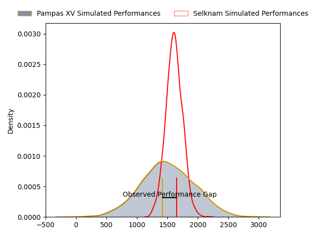
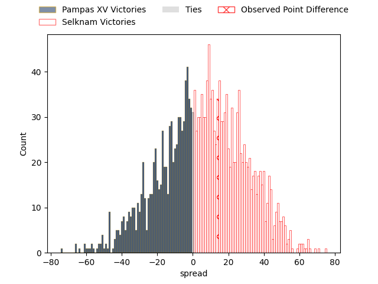
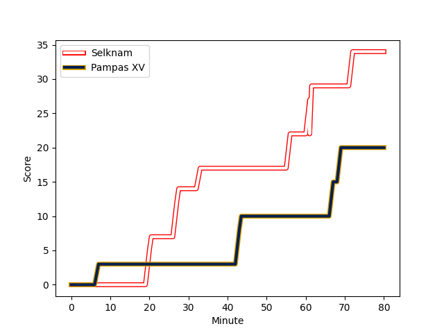
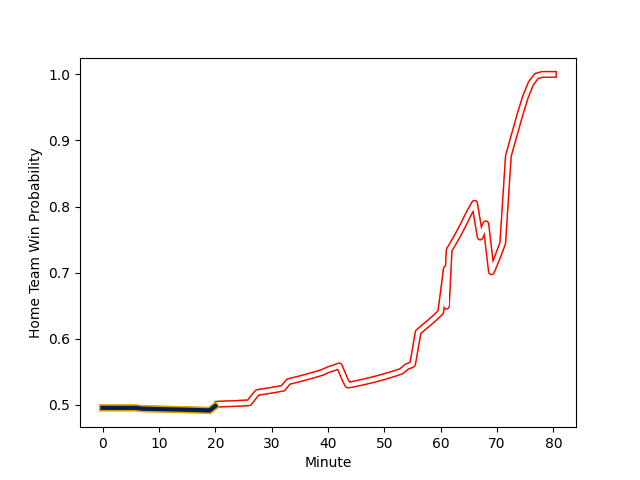

---  
layout: page  
title: Pampas XV at Selknam; 20-34  
date: 2023-02-25 22:00:00 18:00:00 -0500  
categories: match review  
---
# Pampas XV at Selknam; 20-34

# Club Level Predictions

The first set of predictions treats a club as the smallest object, as the club develops its members, organizes a gameplan, and deploys its players as needed for each match. This club model has a prediction of 0.596, which translates to predicting Selknam to win by 5.8.

Each club has a rating and a rating deviation (simiar to a Glicko system), and expected performances can be generated. This allows for simulated matches and spreads like the ones below.
## Projected Performances

## Projected Spreads

## Projected Results

# Player Level Predictions

Treating teams instead as an entity made up of the currently active players, I have ratings for each player in an altogether different system. These can be combined to form team ratings once teamsheets are announced, weighting starters a bit higher than the reserves. After the match is played, players can be weighted by their minutes on the field, allowing for an accurate measure of the team's composition. With these compiled team ratings, we can make predictions, measure inaccuracy, and update the individual player ratings.
## Prediction with Player Minutes: Selknam by 3.2

Pampas XV by 0.8 on a neutral field
## Scores over Time

## Win Probability over Time

There were 10 large changes in win probability in this match
## Prediction without Player Minutes: Selknam by 2.9

Pampas XV by 1.1 on a neutral pitch

|   Away Minutes | Away Player                                                                               |   Away elo |   Away Percentile |   Number |   Home Percentile |   Home elo | Home Player                                                                                     |   Home Minutes |
|---------------:|:------------------------------------------------------------------------------------------|-----------:|------------------:|---------:|------------------:|-----------:|:------------------------------------------------------------------------------------------------|---------------:|
|             40 | [Miguel Angel Prince](..//playerfiles//MiguelAngelPrince_cleaned.md)                      |      92.9  |                42 |        1 |               nan |      97.84 | [Javier Carrasco](..//playerfiles//JavierCarrasco_cleaned.md)                                   |             57 |
|             70 | [Ramiro Gurovich](..//playerfiles//RamiroGurovich_cleaned.md)                             |      99.15 |                65 |        2 |                26 |      87.71 | [Tomas Dussaillant](..//playerfiles//TomasDussaillant_cleaned.md)                               |             54 |
|             77 | [Javier Angel Coronel](..//playerfiles//JavierAngelCoronel_cleaned.md)                    |      96.74 |                55 |        3 |                16 |      83.71 | [Inaki Gurruchaga](..//playerfiles//InakiGurruchaga_cleaned.md)                                 |             57 |
|             57 | [Manuel Bernstein](..//playerfiles//ManuelBernstein_cleaned.md)                           |     109.49 |                83 |        4 |                69 |     101.89 | [Santiago Pedrero](..//playerfiles//SantiagoPedrero_cleaned.md)                                 |             80 |
|             40 | [Federico Ignacio Lavanini](..//playerfiles//FedericoIgnacioLavanini_cleaned.md)          |      79.98 |                14 |        5 |                63 |      99.13 | [Pablo Huete](..//playerfiles//PabloHuete_cleaned.md)                                           |             44 |
|             77 | [Nicolas Damorim](..//playerfiles//NicolasDamorim_cleaned.md)                             |     120.15 |                93 |        6 |                70 |     101.89 | [Clemente Saavedra](..//playerfiles//ClementeSaavedra_cleaned.md)                               |             80 |
|             80 | [Jeronimo Ureta](..//playerfiles//JeronimoUreta_cleaned.md)                               |     111.7  |                85 |        7 |                66 |     100.25 | [Ignacio Silva](..//playerfiles//IgnacioSilva_cleaned.md)                                       |             80 |
|             80 | [Santiago Ruiz](..//playerfiles//SantiagoRuiz_cleaned.md)                                 |     100.54 |                67 |        8 |                47 |      94.92 | [Joaquin Milesi](..//playerfiles//JoaquinMilesi_cleaned.md)                                     |             64 |
|             40 | [Rafael Iriarte](..//playerfiles//RafaelIriarte_cleaned.md)                               |     103.44 |                76 |        9 |                83 |     106.85 | [Benjamin Videla](..//playerfiles//BenjaminVidela_cleaned.md)                                   |             57 |
|             80 | [Joaquin de la Vega Mendia](..//playerfiles//JoaquindelaVegaMendia_cleaned.md)            |      48.45 |                 1 |       10 |                64 |     100.6  | [Rodrigo Fernandez](..//playerfiles//RodrigoFernandez_cleaned.md)                               |             66 |
|             80 | [Tomas Passaro](..//playerfiles//TomasPassaro_cleaned.md)                                 |     126.61 |                97 |       11 |               nan |      96.64 | [Pablo Casas](..//playerfiles//PabloCasas_cleaned.md)                                           |             23 |
|             57 | [Manuel Alfaro Torneiro](..//playerfiles//ManuelAlfaroTorneiro_cleaned.md)                |      88.62 |                30 |       12 |                70 |     101.89 | [Santiago Videla](..//playerfiles//SantiagoVidela_cleaned.md)                                   |             80 |
|             80 | [Felipe de la Vega](..//playerfiles//FelipedelaVega_cleaned.md)                           |      95.05 |                50 |       13 |                70 |     101.89 | [Matias Garafulic](..//playerfiles//MatiasGarafulic_cleaned.md)                                 |             80 |
|             80 | [Benjamin Elizalde](..//playerfiles//BenjaminElizalde_cleaned.md)                         |      98.32 |               nan |       14 |                70 |     101.89 | [Nicolas Garafulic Schar](..//playerfiles//NicolasGarafulicSchar_cleaned.md)                    |             80 |
|             80 | [Juan Ignacio Lando](..//playerfiles//JuanIgnacioLando_cleaned.md)                        |     119.27 |                92 |       15 |                66 |     101.89 | [Francisco Urroz](..//playerfiles//FranciscoUrroz_cleaned.md)                                   |             80 |
|             40 | [Eliseo Nicolas Morales Abraham](..//playerfiles//EliseoNicolasMoralesAbraham_cleaned.md) |      95    |               nan |       16 |               nan |      96.29 | [Jose Ignacio Larenas](..//playerfiles//JoseIgnacioLarenas_cleaned.md)                          |             57 |
|             40 | [Rodrigo Fernandez Criado](..//playerfiles//RodrigoFernandezCriado_cleaned.md)            |     101.21 |                69 |       17 |               nan |      97.76 | [Raimundo Martinez](..//playerfiles//RaimundoMartinez_cleaned.md)                               |             36 |
|             40 | [Javier Corvalan](..//playerfiles//JavierCorvalan_cleaned.md)                             |      77.25 |                 6 |       18 |               nan |      97.41 | [Diego Escobar](..//playerfiles//DiegoEscobar_cleaned.md)                                       |             26 |
|             23 | [Lorenzo Colidio](..//playerfiles//LorenzoColidio_cleaned.md)                             |     100.54 |                66 |       19 |                64 |      99.05 | [Salvador Lues](..//playerfiles//SalvadorLues_cleaned.md)                                       |             23 |
|             23 | [Joaquin Lamas](..//playerfiles//JoaquinLamas_cleaned.md)                                 |     100.23 |                63 |       20 |               nan |      97.41 | [Lukas Carvallo](..//playerfiles//LukasCarvallo_cleaned.md)                                     |             23 |
|              3 | [Matias Medrano](..//playerfiles//MatiasMedrano_cleaned.md)                               |     103.13 |                77 |       21 |               nan |      97.07 | [Lucas Bordigoni](..//playerfiles//LucasBordigoni_cleaned.md)                                   |             23 |
|             10 | [Rodrigo Boulan](..//playerfiles//RodrigoBoulan_cleaned.md)                               |      96.38 |               nan |       22 |               nan |      95    | [Thomas Hans Orchard Meyer-Rachner](..//playerfiles//ThomasHansOrchardMeyer-Rachner_cleaned.md) |             16 |
|              3 | [Tomas Suarez Folch](..//playerfiles//TomasSuarezFolch_cleaned.md)                        |      97.85 |                41 |       23 |                26 |      87.97 | [Diego Warnken](..//playerfiles//DiegoWarnken_cleaned.md)                                       |             14 |

