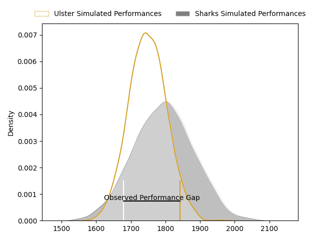
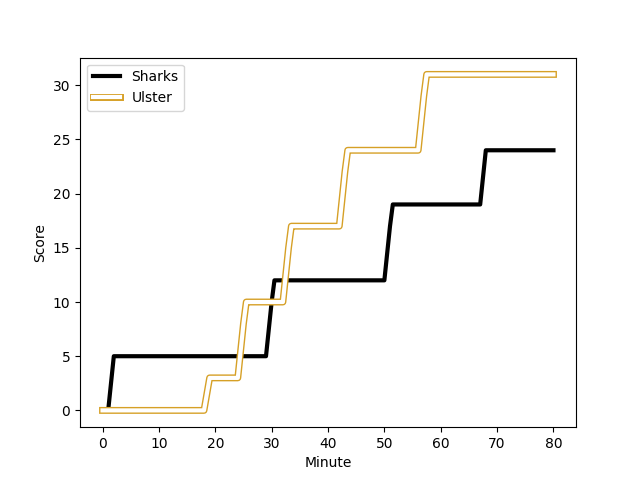
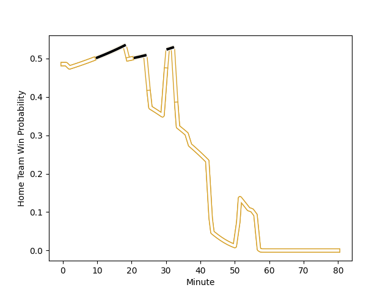

---  
layout: page  
title: Ulster at Sharks; 31-24  
date: 2023-02-25 13:00:00 18:00:00 -0500  
categories: match review  
---
# Ulster at Sharks; 31-24

# Club Level Predictions

The first set of predictions treats a club as the smallest object, as the club develops its members, organizes a gameplan, and deploys its players as needed for each match. This club model has a prediction of 0.564, which translates to predicting Sharks to win by 2.3.

Each club has a rating and a rating deviation (simiar to a Glicko system), and expected performances can be generated. This allows for simulated matches and spreads like the ones below.
## Projected Performances

## Projected Spreads

## Projected Results

# Player Level Predictions

Treating teams instead as an entity made up of the currently active players, I have ratings for each player in an altogether different system. These can be combined to form team ratings once teamsheets are announced, weighting starters a bit higher than the reserves. After the match is played, players can be weighted by their minutes on the field, allowing for an accurate measure of the team's composition. With these compiled team ratings, we can make predictions, measure inaccuracy, and update the individual player ratings.
## Prediction with Player Minutes: Sharks by 0.7

Ulster by 3.3 on a neutral field
## Scores over Time

## Win Probability over Time

There were 11 large changes in win probability in this match
## Prediction without Player Minutes: Sharks by 4.1

Sharks by 0.1 on a neutral pitch

|   Away Minutes | Away Player                                                                 |   Away elo |   Away Percentile |   Number |   Home Percentile |   Home elo | Home Player                                                                         |   Home Minutes |
|---------------:|:----------------------------------------------------------------------------|-----------:|------------------:|---------:|------------------:|-----------:|:------------------------------------------------------------------------------------|---------------:|
|             65 | [Rory Sutherland](..//playerfiles//RorySutherland_cleaned.md)               |     115    |                91 |        1 |                22 |      86.72 | [Ntuthuko Mchunu](..//playerfiles//NtuthukoMchunu_cleaned.md)                       |             58 |
|              2 | [John Andrew](..//playerfiles//JohnAndrew_cleaned.md)                       |      98.27 |               nan |        2 |                56 |      95.84 | [Daniel Viljoen Jooste](..//playerfiles//DanielViljoenJooste_cleaned.md)            |             58 |
|             65 | [Jeffery To'omaga-Allen](..//playerfiles//JefferyTo'omaga-Allen_cleaned.md) |     113.33 |                91 |        3 |               nan |      95.27 | [Hanro Jacobs](..//playerfiles//HanroJacobs_cleaned.md)                             |             71 |
|             80 | [Alan O'Connor](..//playerfiles//AlanO'Connor_cleaned.md)                   |     102.52 |                71 |        4 |                52 |      95.71 | [Daniel Pieter (Reniel) Hugo](..//playerfiles//DanielPieter(Reniel)Hugo_cleaned.md) |             58 |
|             80 | [Harry Sheridan](..//playerfiles//HarrySheridan_cleaned.md)                 |     100.5  |                66 |        5 |                81 |     108.04 | [Douw Gerbrandt Grobler](..//playerfiles//DouwGerbrandtGrobler_cleaned.md)          |             80 |
|             58 | [Jordi Murphy](..//playerfiles//JordiMurphy_cleaned.md)                     |      95.52 |                51 |        6 |               nan |      97.52 | [Dylan Richardson](..//playerfiles//DylanRichardson_cleaned.md)                     |             80 |
|             80 | [Nick Timoney](..//playerfiles//NickTimoney_cleaned.md)                     |     106.49 |                78 |        7 |                81 |     111.89 | [Vincent Tshikaya Tshituka](..//playerfiles//VincentTshikayaTshituka_cleaned.md)    |             80 |
|             71 | [Duane Vermeulen](..//playerfiles//DuaneVermeulen_cleaned.md)               |     102.07 |                69 |        8 |                68 |     100.97 | [Phendulani Buthelezi](..//playerfiles//PhendulaniButhelezi_cleaned.md)             |             55 |
|             80 | [John Cooney](..//playerfiles//JohnCooney_cleaned.md)                       |     118.7  |                94 |        9 |                84 |     107.81 | [Grant Williams](..//playerfiles//GrantWilliams_cleaned.md)                         |             65 |
|             58 | [Jake Flannery](..//playerfiles//JakeFlannery_cleaned.md)                   |      95.33 |               nan |       10 |                86 |     111.98 | [Curwin Dominique Bosch](..//playerfiles//CurwinDominiqueBosch_cleaned.md)          |             80 |
|             80 | [Aaron Sexton](..//playerfiles//AaronSexton_cleaned.md)                     |      94.74 |                44 |       11 |                13 |      79.26 | [Thaakir Abrahams](..//playerfiles//ThaakirAbrahams_cleaned.md)                     |             80 |
|             80 | [Stewart Moore](..//playerfiles//StewartMoore_cleaned.md)                   |     101.83 |                69 |       12 |                70 |     102.06 | [Rohan Janse van Rensburg](..//playerfiles//RohanJansevanRensburg_cleaned.md)       |             80 |
|             80 | [Luke Marshall](..//playerfiles//LukeMarshall_cleaned.md)                   |     108.57 |                84 |       13 |                82 |     107.86 | [François Venter](..//playerfiles//FrançoisVenter_cleaned.md)                       |             58 |
|             37 | [Craig Gilroy](..//playerfiles//CraigGilroy_cleaned.md)                     |      94.13 |               nan |       14 |                94 |     122.71 | [Werner Kok](..//playerfiles//WernerKok_cleaned.md)                                 |             80 |
|             80 | [Michael Lowry](..//playerfiles//MichaelLowry_cleaned.md)                   |     107    |                77 |       15 |                93 |     121.22 | [Boeta Chamberlain](..//playerfiles//BoetaChamberlain_cleaned.md)                   |             69 |
|             78 | [Tom Stewart](..//playerfiles//TomStewart_cleaned.md)                       |     115.93 |                93 |       16 |                86 |     105.56 | [Sikhumbuzo Notshe](..//playerfiles//SikhumbuzoNotshe_cleaned.md)                   |             25 |
|             43 | [Ethan McIlroy](..//playerfiles//EthanMcIlroy_cleaned.md)                   |      85.21 |                25 |       17 |                28 |      88.06 | [Emile van Heerden](..//playerfiles//EmilevanHeerden_cleaned.md)                    |             22 |
|             22 | [David McCann](..//playerfiles//DavidMcCann_cleaned.md)                     |     102.08 |                66 |       18 |                33 |      87.01 | [Yaw Osei Penxe](..//playerfiles//YawOseiPenxe_cleaned.md)                          |             22 |
|             22 | [Ian Madigan](..//playerfiles//IanMadigan_cleaned.md)                       |     102.86 |                69 |       19 |                37 |      93.4  | [Fezokuhle Mbatha](..//playerfiles//FezokuhleMbatha_cleaned.md)                     |             22 |
|             15 | [Andrew Warwick](..//playerfiles//AndrewWarwick_cleaned.md)                 |      86.7  |                19 |       20 |                29 |      90.4  | [Dian Bleuler](..//playerfiles//DianBleuler_cleaned.md)                             |             22 |
|             15 | [Gareth Milasinovich](..//playerfiles//GarethMilasinovich_cleaned.md)       |     100.31 |               nan |       21 |                17 |      77.68 | [Cameron Robin Wright](..//playerfiles//CameronRobinWright_cleaned.md)              |             15 |
|             15 | [Gareth Milasinovich](..//playerfiles//GarethMilasinovich_cleaned.md)       |     100.31 |               nan |       21 |                 8 |      77.68 | [Cameron Robin Wright](..//playerfiles//CameronRobinWright_cleaned.md)              |             15 |
|              9 | [Cormac Izuchukwu](..//playerfiles//CormacIzuchukwu_cleaned.md)             |      94.53 |               nan |       22 |               nan |      90.76 | [Lionel Cronje](..//playerfiles//LionelCronje_cleaned.md)                           |             11 |
|            nan | nan                                                                         |     nan    |               nan |       23 |               nan |      95    | [Khwezi Jongamazizi Mona](..//playerfiles//KhweziJongamaziziMona_cleaned.md)        |              9 |

