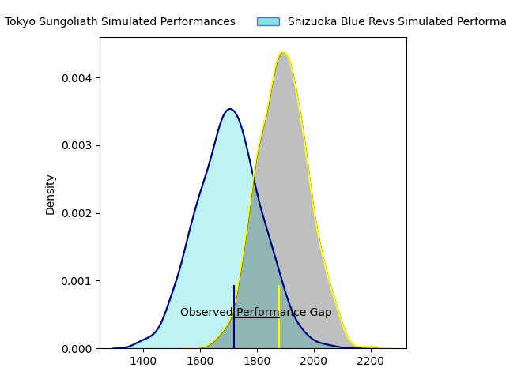
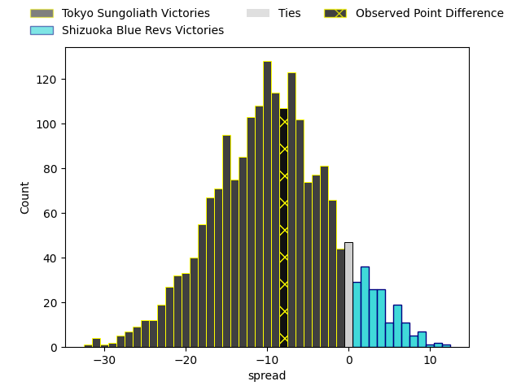
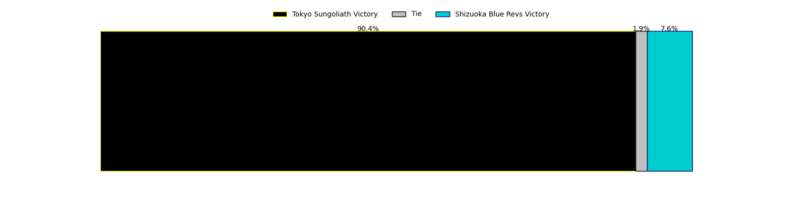
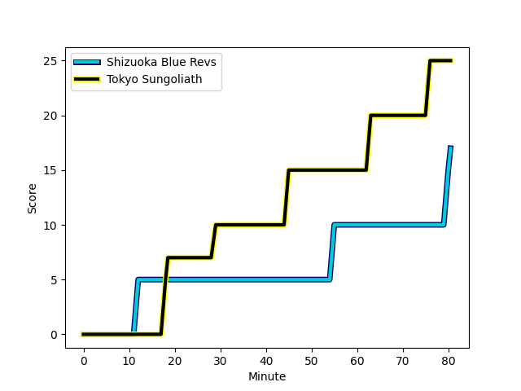

---  
layout: page  
title: Tokyo Sungoliath at Shizuoka Blue Revs; 25-17  
date: 2023-02-25 00:00:00 18:00:00 -0500  
categories: match review  
---
# Tokyo Sungoliath at Shizuoka Blue Revs; 25-17

# Club Level Predictions

The first set of predictions treats a club as the smallest object, as the club develops its members, organizes a gameplan, and deploys its players as needed for each match. This club model has a prediction of 0.263, which translates to predicting Tokyo Sungoliath to win by 9.3.

Each club has a rating and a rating deviation (simiar to a Glicko system), and expected performances can be generated. This allows for simulated matches and spreads like the ones below.
## Projected Performances

## Projected Spreads

## Projected Results

# Player Level Predictions

Treating teams instead as an entity made up of the currently active players, I have ratings for each player in an altogether different system. These can be combined to form team ratings once teamsheets are announced, weighting starters a bit higher than the reserves. After the match is played, players can be weighted by their minutes on the field, allowing for an accurate measure of the team's composition. With these compiled team ratings, we can make predictions, measure inaccuracy, and update the individual player ratings.
## Prediction with Player Minutes: Tokyo Sungoliath by 0.4

Tokyo Sungoliath by 4.4 on a neutral field
## Scores over Time

## Win Probability over Time

There were 5 large changes in win probability in this match
## Prediction without Player Minutes: Tokyo Sungoliath by 1.5

Tokyo Sungoliath by 5.5 on a neutral pitch

|   Away Minutes | Away Player                                                       |   Away elo |   Away Percentile |   Number |   Home Percentile |   Home elo | Home Player                                                                                     |   Home Minutes |
|---------------:|:------------------------------------------------------------------|-----------:|------------------:|---------:|------------------:|-----------:|:------------------------------------------------------------------------------------------------|---------------:|
|             65 | [Shintaro Ishihara](..//playerfiles//ShintaroIshihara_cleaned.md) |     105.7  |                85 |        1 |                85 |     106.97 | [Kazuhiro Kawata](..//playerfiles//KazuhiroKawata_cleaned.md)                                   |             77 |
|             77 | [Shunta Nakamura](..//playerfiles//ShuntaNakamura_cleaned.md)     |     131.05 |                98 |        2 |                68 |     100.24 | [Takeshi Hino](..//playerfiles//TakeshiHino_cleaned.md)                                         |             77 |
|             47 | [Ryosuke Iwaihara](..//playerfiles//RyosukeIwaihara_cleaned.md)   |     100.28 |                68 |        3 |                82 |     105.33 | [Heiichiro Ito](..//playerfiles//HeiichiroIto_cleaned.md)                                       |             62 |
|             72 | [Tom Savage](..//playerfiles//TomSavage_cleaned.md)               |      98.27 |                63 |        4 |               nan |     100.3  | [Murray Douglas](..//playerfiles//MurrayDouglas_cleaned.md)                                     |             80 |
|             80 | [Harrison Hockings](..//playerfiles//HarrisonHockings_cleaned.md) |     110.73 |                86 |        5 |                97 |     130.54 | [Eishin Kuwano](..//playerfiles//EishinKuwano_cleaned.md)                                       |             62 |
|             80 | [Kanji Shimokawa](..//playerfiles//KanjiShimokawa_cleaned.md)     |     111.44 |                86 |        6 |                57 |      97.82 | [Malgene Ilaua](..//playerfiles//MalgeneIlaua_cleaned.md)                                       |             80 |
|             80 | [Kai Yamamoto](..//playerfiles//KaiYamamoto_cleaned.md)           |     104.72 |                75 |        7 |                71 |     102.76 | [Richard Goh Jones](..//playerfiles//RichardGohJones_cleaned.md)                                |             77 |
|             68 | [Ryuga Hashimoto](..//playerfiles//RyugaHashimoto_cleaned.md)     |     104.69 |                79 |        8 |                66 |     100.96 | [Albertus Stephanus (Kwagga) Smith](..//playerfiles//AlbertusStephanus(Kwagga)Smith_cleaned.md) |             80 |
|             59 | [Naoto Saito](..//playerfiles//NaotoSaito_cleaned.md)             |     104.38 |                77 |        9 |                75 |     103.7  | [Bryn Hall](..//playerfiles//BrynHall_cleaned.md)                                               |             56 |
|             75 | [Hikaru Tamura](..//playerfiles//HikaruTamura_cleaned.md)         |      90.32 |                22 |       10 |               nan |      95    | [Kenta Iemura](..//playerfiles//KentaIemura_cleaned.md)                                         |             80 |
|             80 | [Tevita Li](..//playerfiles//TevitaLi_cleaned.md)                 |     103.82 |                74 |       11 |                52 |      95.54 | [Chikara Ito](..//playerfiles//ChikaraIto_cleaned.md)                                           |             56 |
|             80 | [Ryoto Nakamura](..//playerfiles//RyotoNakamura_cleaned.md)       |     109.78 |                85 |       12 |                80 |     106.12 | [Viliami Tahitu'a](..//playerfiles//ViliamiTahitu'a_cleaned.md)                                 |             80 |
|             80 | [Shogo Nakano](..//playerfiles//ShogoNakano_cleaned.md)           |     109.47 |                85 |       13 |                96 |     126.53 | [Hiroto Kobayashi](..//playerfiles//HirotoKobayashi_cleaned.md)                                 |             80 |
|             59 | [Ryosuke Kawase](..//playerfiles//RyosukeKawase_cleaned.md)       |     102.31 |                70 |       14 |               nan |      95.63 | [Eito Maki](..//playerfiles//EitoMaki_cleaned.md)                                               |             80 |
|             80 | [Seiya Ozaki](..//playerfiles//SeiyaOzaki_cleaned.md)             |     107.04 |                82 |       15 |                72 |     104.97 | [Keagan Faria](..//playerfiles//KeaganFaria_cleaned.md)                                         |             80 |
|             33 | [Genki Sudo](..//playerfiles//GenkiSudo_cleaned.md)               |     117.63 |                94 |       16 |               nan |      99.04 | [Fumihiro Yoshizawa](..//playerfiles//FumihiroYoshizawa_cleaned.md)                             |             24 |
|             21 | [Yutaka Nagare](..//playerfiles//YutakaNagare_cleaned.md)         |     101.8  |               nan |       17 |                24 |      88.61 | [Sam Greene](..//playerfiles//SamGreene_cleaned.md)                                             |             24 |
|             21 | [Kotaro Matsushima](..//playerfiles//KotaroMatsushima_cleaned.md) |     104.3  |                71 |       18 |               nan |      93.79 | [Bunkei Kaku](..//playerfiles//BunkeiKaku_cleaned.md)                                           |             18 |
|             15 | [Kenta Kobayashi](..//playerfiles//KentaKobayashi_cleaned.md)     |     102.83 |                77 |       19 |               nan |      97.14 | [Samuela Anise](..//playerfiles//SamuelaAnise_cleaned.md)                                       |             18 |
|             12 | [Tevita Tatafu](..//playerfiles//TevitaTatafu_cleaned.md)         |     109.06 |                82 |       20 |               nan |      96.28 | [Shintaro Okamoto](..//playerfiles//ShintaroOkamoto_cleaned.md)                                 |              3 |
|              8 | [Wataru Kobayashi](..//playerfiles//WataruKobayashi_cleaned.md)   |     125.27 |                96 |       21 |                20 |      86.56 | [Toshiya Hirakawa](..//playerfiles//ToshiyaHirakawa_cleaned.md)                                 |              3 |
|              5 | [Taiga Ozaki](..//playerfiles//TaigaOzaki_cleaned.md)             |      91.23 |                40 |       22 |                95 |     125.8  | [Ryosuke Funahashi](..//playerfiles//RyosukeFunahashi_cleaned.md)                               |              3 |
|              3 | [Kienori Go](..//playerfiles//KienoriGo_cleaned.md)               |      91.32 |               nan |       23 |               nan |     nan    | nan                                                                                             |            nan |

