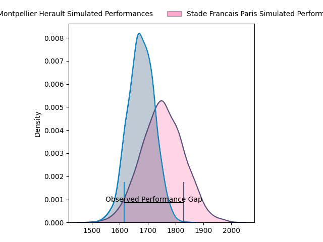
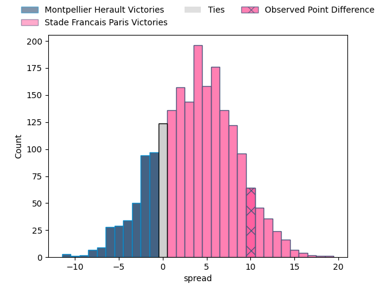
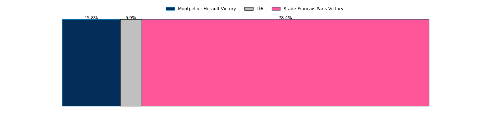
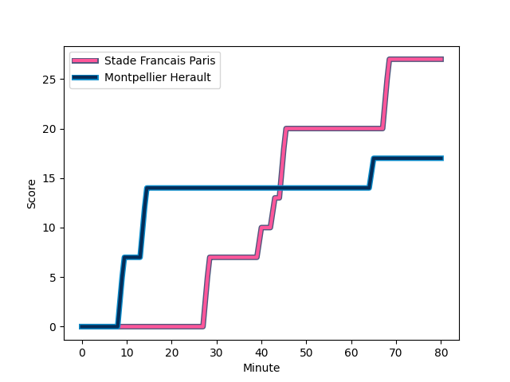
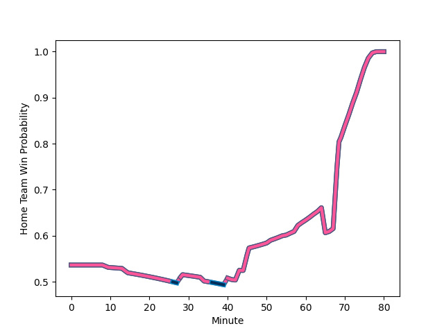

---  
layout: page  
title: Montpellier Herault at Stade Francais Paris; 17-27  
date: 2023-02-25 15:00:00 18:00:00 -0500  
categories: match review  
---
# Montpellier Herault at Stade Francais Paris; 17-27

# Club Level Predictions

The first set of predictions treats a club as the smallest object, as the club develops its members, organizes a gameplan, and deploys its players as needed for each match. This club model has a prediction of 0.608, which translates to predicting Stade Francais Paris to win by 3.9.

Each club has a rating and a rating deviation (simiar to a Glicko system), and expected performances can be generated. This allows for simulated matches and spreads like the ones below.
## Projected Performances

## Projected Spreads

## Projected Results

# Player Level Predictions

Treating teams instead as an entity made up of the currently active players, I have ratings for each player in an altogether different system. These can be combined to form team ratings once teamsheets are announced, weighting starters a bit higher than the reserves. After the match is played, players can be weighted by their minutes on the field, allowing for an accurate measure of the team's composition. With these compiled team ratings, we can make predictions, measure inaccuracy, and update the individual player ratings.
## Prediction with Player Minutes: Stade Francais Paris by 9.4

Stade Francais Paris by 5.4 on a neutral field
## Scores over Time

## Win Probability over Time

There were 8 large changes in win probability in this match
## Prediction without Player Minutes: Stade Francais Paris by 9.1

Stade Francais Paris by 5.1 on a neutral pitch

|   Away Minutes | Away Player                                                                                        |   Away elo |   Away Percentile |   Number |   Home Percentile |   Home elo | Home Player                                                                  |   Home Minutes |
|---------------:|:---------------------------------------------------------------------------------------------------|-----------:|------------------:|---------:|------------------:|-----------:|:-----------------------------------------------------------------------------|---------------:|
|             43 | [Grégory Fichten](..//playerfiles//GrégoryFichten_cleaned.md)                                      |      98.4  |               nan |        1 |                40 |      92.35 | [Moses Eneliko Alo-Emile](..//playerfiles//MosesEnelikoAlo-Emile_cleaned.md) |             51 |
|             59 | [Brandon Paenga-Amosa](..//playerfiles//BrandonPaenga-Amosa_cleaned.md)                            |      94.32 |                51 |        2 |                55 |      95.72 | [Laurent Panis](..//playerfiles//LaurentPanis_cleaned.md)                    |             57 |
|             43 | [Titi Lamositele](..//playerfiles//TitiLamositele_cleaned.md)                                      |      90.74 |                23 |        3 |                46 |      95.74 | [Vincent Philip Koch](..//playerfiles//VincentPhilipKoch_cleaned.md)         |             51 |
|             51 | [Elliott Stooke](..//playerfiles//ElliottStooke_cleaned.md)                                        |      97.24 |                57 |        4 |                62 |      98.77 | [Paul Gabrillagues](..//playerfiles//PaulGabrillagues_cleaned.md)            |             80 |
|             80 | [Tyler Evan Duguid](..//playerfiles//TylerEvanDuguid_cleaned.md)                                   |      99.2  |                63 |        5 |                15 |      83.41 | [Sitakeli Timani](..//playerfiles//SitakeliTimani_cleaned.md)                |             69 |
|             80 | [Nicolaas Jacobus Janse van Rensburg](..//playerfiles//NicolaasJacobusJansevanRensburg_cleaned.md) |      99.12 |                62 |        6 |                73 |     103.76 | [Romain Briatte](..//playerfiles//RomainBriatte_cleaned.md)                  |             80 |
|             58 | [Masivesi Dakuwaqa](..//playerfiles//MasivesiDakuwaqa_cleaned.md)                                  |      99.54 |                38 |        7 |                62 |      98.73 | [Marcos Kremer](..//playerfiles//MarcosKremer_cleaned.md)                    |             80 |
|             41 | [Marco Tauleigne](..//playerfiles//MarcoTauleigne_cleaned.md)                                      |      87.09 |                26 |        8 |                74 |     103.88 | [Giovanni Habel Kuffner](..//playerfiles//GiovanniHabelKuffner_cleaned.md)   |             73 |
|             55 | [Jacobus Meyer Reinach](..//playerfiles//JacobusMeyerReinach_cleaned.md)                           |      98.18 |                60 |        9 |                80 |     105.65 | [Morgan Parra](..//playerfiles//MorganParra_cleaned.md)                      |             66 |
|             80 | [Louis Carbonel](..//playerfiles//LouisCarbonel_cleaned.md)                                        |      95.08 |                48 |       10 |                56 |      97.66 | [Joris Segonds](..//playerfiles//JorisSegonds_cleaned.md)                    |             80 |
|             80 | [George Bridge](..//playerfiles//GeorgeBridge_cleaned.md)                                          |      97.78 |                58 |       11 |                83 |     109.13 | [Lester Etien](..//playerfiles//LesterEtien_cleaned.md)                      |             80 |
|             63 | [Karl Martin](..//playerfiles//KarlMartin_cleaned.md)                                              |      88.22 |               nan |       12 |                14 |      81.02 | [Théo Dachary](..//playerfiles//ThéoDachary_cleaned.md)                      |             70 |
|             80 | [Thomas Darmon](..//playerfiles//ThomasDarmon_cleaned.md)                                          |      93.25 |                45 |       13 |                75 |     103.88 | [Jeremy Charles Ward](..//playerfiles//JeremyCharlesWard_cleaned.md)         |             80 |
|             80 | [Julien Tisseron](..//playerfiles//JulienTisseron_cleaned.md)                                      |     103.96 |                75 |       14 |                82 |     107.57 | [Sione Tui](..//playerfiles//SioneTui_cleaned.md)                            |             34 |
|             80 | [Anthony Bouthier](..//playerfiles//AnthonyBouthier_cleaned.md)                                    |      86.75 |                28 |       15 |                78 |     107.58 | [Léo Barré](..//playerfiles//LéoBarré_cleaned.md)                            |             80 |
|             39 | [Clément Doumenc](..//playerfiles//ClémentDoumenc_cleaned.md)                                      |      91.47 |                45 |       16 |               nan |      94.99 | [Peniasi Dakuwaqa](..//playerfiles//PeniasiDakuwaqa_cleaned.md)              |             46 |
|             37 | [Henry Thomas](..//playerfiles//HenryThomas_cleaned.md)                                            |      85.64 |                27 |       17 |                82 |     105.08 | [Clément Castets](..//playerfiles//ClémentCastets_cleaned.md)                |             29 |
|             37 | [Enzo Forletta](..//playerfiles//EnzoForletta_cleaned.md)                                          |      96.76 |                56 |       18 |                26 |      90.78 | [Paul Alo-Emile](..//playerfiles//PaulAlo-Emile_cleaned.md)                  |             29 |
|             29 | [Bastien Chalureau](..//playerfiles//BastienChalureau_cleaned.md)                                  |      97.34 |                46 |       19 |                46 |      94.88 | [Lucas Peyresblanques](..//playerfiles//LucasPeyresblanques_cleaned.md)      |             23 |
|             25 | [Léo Coly](..//playerfiles//LéoColy_cleaned.md)                                                    |     102.2  |                72 |       20 |                67 |     101.1  | [Arthur Coville](..//playerfiles//ArthurCoville_cleaned.md)                  |             14 |
|             21 | [Jérémie Maurouard](..//playerfiles//JérémieMaurouard_cleaned.md)                                  |      92.59 |               nan |       21 |                18 |      84.03 | [Mathieu Hirigoyen](..//playerfiles//MathieuHirigoyen_cleaned.md)            |             11 |
|             22 | [Samuel Maximin](..//playerfiles//SamuelMaximin_cleaned.md)                                        |      83.08 |                19 |       22 |                39 |      90.75 | [Kylan Hamdaoui](..//playerfiles//KylanHamdaoui_cleaned.md)                  |             10 |
|             17 | [Pierre Lucas](..//playerfiles//PierreLucas_cleaned.md)                                            |      91.42 |                47 |       23 |                23 |      87.34 | [Ryan Chapuis](..//playerfiles//RyanChapuis_cleaned.md)                      |              7 |

