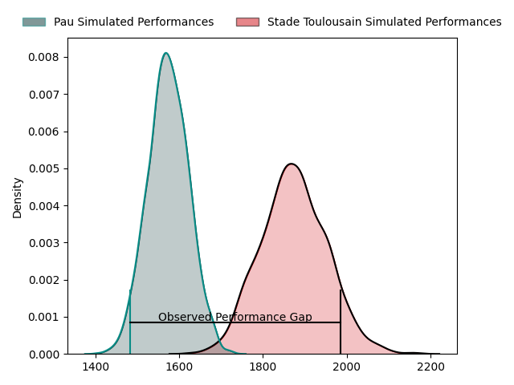
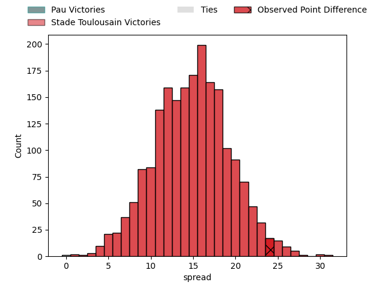
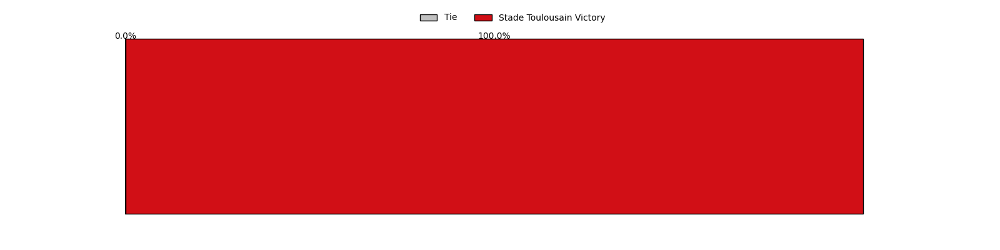
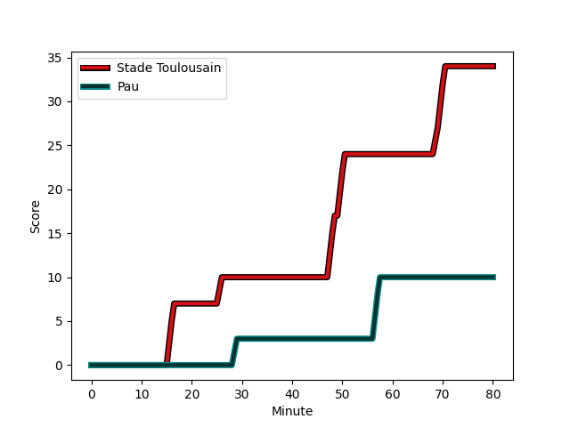
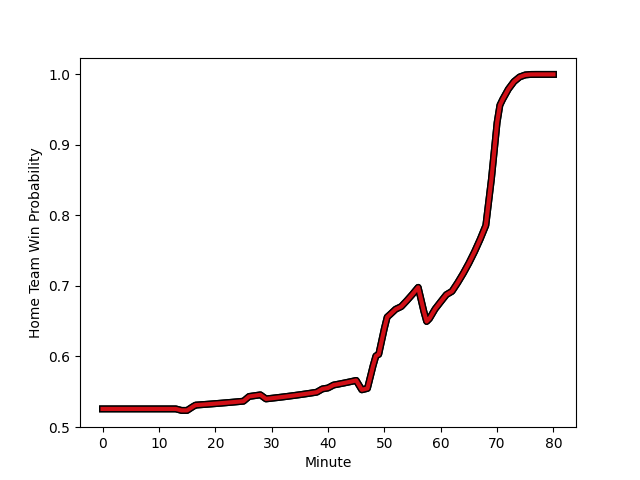

---  
layout: page  
title: Pau at Stade Toulousain; 10-34  
date: 2023-02-25 21:05:00 18:00:00 -0500  
categories: match review  
---
# Pau at Stade Toulousain; 10-34

# Club Level Predictions

The first set of predictions treats a club as the smallest object, as the club develops its members, organizes a gameplan, and deploys its players as needed for each match. This club model has a prediction of 0.846, which translates to predicting Stade Toulousain to win by 14.9.

Each club has a rating and a rating deviation (simiar to a Glicko system), and expected performances can be generated. This allows for simulated matches and spreads like the ones below.
## Projected Performances

## Projected Spreads

## Projected Results

# Player Level Predictions

Treating teams instead as an entity made up of the currently active players, I have ratings for each player in an altogether different system. These can be combined to form team ratings once teamsheets are announced, weighting starters a bit higher than the reserves. After the match is played, players can be weighted by their minutes on the field, allowing for an accurate measure of the team's composition. With these compiled team ratings, we can make predictions, measure inaccuracy, and update the individual player ratings.
## Prediction with Player Minutes: Stade Toulousain by 8.4

Stade Toulousain by 4.4 on a neutral field
## Scores over Time

## Win Probability over Time

There were 5 large changes in win probability in this match
## Prediction without Player Minutes: Stade Toulousain by 6.8

Stade Toulousain by 2.8 on a neutral pitch

|   Away Minutes | Away Player                                                                          |   Away elo |   Away Percentile |   Number |   Home Percentile |   Home elo | Home Player                                                             |   Home Minutes |
|---------------:|:-------------------------------------------------------------------------------------|-----------:|------------------:|---------:|------------------:|-----------:|:------------------------------------------------------------------------|---------------:|
|             53 | [Siegfried (Ziggy) Fisi'ihoi](..//playerfiles//Siegfried(Ziggy)Fisi'ihoi_cleaned.md) |      88.8  |                28 |        1 |                29 |      89.13 | [David Ainu'u](..//playerfiles//DavidAinu'u_cleaned.md)                 |             59 |
|             53 | [Lucas Rey](..//playerfiles//LucasRey_cleaned.md)                                    |      95.21 |                53 |        2 |                56 |      95.64 | [Guillaume Cramont](..//playerfiles//GuillaumeCramont_cleaned.md)       |             62 |
|             46 | [Nicolas Corato](..//playerfiles//NicolasCorato_cleaned.md)                          |      95.18 |                32 |        3 |                78 |     103.31 | [Dorian Aldegheri](..//playerfiles//DorianAldegheri_cleaned.md)         |             59 |
|             46 | [Hugo Auradou](..//playerfiles//HugoAuradou_cleaned.md)                              |      75.78 |                 9 |        4 |                83 |     108.61 | [Richie Arnold](..//playerfiles//RichieArnold_cleaned.md)               |             80 |
|             80 | [Lekima Vuda Tagitagivalu](..//playerfiles//LekimaVudaTagitagivalu_cleaned.md)       |     102.92 |                40 |        5 |                87 |     111.38 | [Emmanuel Meafou](..//playerfiles//EmmanuelMeafou_cleaned.md)           |             62 |
|             41 | [Martin Puech](..//playerfiles//MartinPuech_cleaned.md)                              |     102.99 |                71 |        6 |                32 |      89.4  | [Peato Mauvaka](..//playerfiles//PeatoMauvaka_cleaned.md)               |             80 |
|             60 | [Reece Hewat](..//playerfiles//ReeceHewat_cleaned.md)                                |      94.8  |                50 |        7 |                39 |      91.02 | [Theo Ntamack](..//playerfiles//TheoNtamack_cleaned.md)                 |             39 |
|             80 | [Sacha Zegueur](..//playerfiles//SachaZegueur_cleaned.md)                            |      74.03 |                 5 |        8 |                58 |      98.23 | [Alexandre Roumat](..//playerfiles//AlexandreRoumat_cleaned.md)         |             80 |
|             60 | [Dan Robson](..//playerfiles//DanRobson_cleaned.md)                                  |      92.42 |                30 |        9 |                98 |     124.29 | [Paul Graou](..//playerfiles//PaulGraou_cleaned.md)                     |             80 |
|             80 | [Thibault Debaes](..//playerfiles//ThibaultDebaes_cleaned.md)                        |     101.99 |                69 |       10 |                49 |      95.94 | [Juan Cruz Mallia](..//playerfiles//JuanCruzMallia_cleaned.md)          |             80 |
|             80 | [Émilien Gailleton](..//playerfiles//ÉmilienGailleton_cleaned.md)                    |     112.84 |                86 |       11 |                69 |     101.36 | [Matthis Lebel](..//playerfiles//MatthisLebel_cleaned.md)               |             80 |
|             60 | [Nathan Decron](..//playerfiles//NathanDecron_cleaned.md)                            |     103.42 |                75 |       12 |                82 |     107.55 | [Pita Ahki](..//playerfiles//PitaAhki_cleaned.md)                       |             69 |
|             80 | [Tumua Manu](..//playerfiles//TumuaManu_cleaned.md)                                  |      88.61 |                30 |       13 |                61 |      96.73 | [Sofiane Guitoune](..//playerfiles//SofianeGuitoune_cleaned.md)         |             80 |
|             80 | [Aminiasi Tuimaba](..//playerfiles//AminiasiTuimaba_cleaned.md)                      |      95    |               nan |       14 |               nan |      95    | [Nelson Epee](..//playerfiles//NelsonEpee_cleaned.md)                   |             14 |
|             80 | [Clément Laporte](..//playerfiles//ClémentLaporte_cleaned.md)                        |     113.31 |                88 |       15 |                23 |      86.21 | [Arthur Retière](..//playerfiles//ArthurRetière_cleaned.md)             |             80 |
|             34 | [Guram Papidze](..//playerfiles//GuramPapidze_cleaned.md)                            |     103.98 |                76 |       16 |                51 |      95.14 | [Joshua Brennan](..//playerfiles//JoshuaBrennan_cleaned.md)             |             41 |
|             34 | [Guram Papidze](..//playerfiles//GuramPapidze_cleaned.md)                            |     103.98 |                52 |       16 |                51 |      95.14 | [Joshua Brennan](..//playerfiles//JoshuaBrennan_cleaned.md)             |             41 |
|             27 | [Ignacio David Calles](..//playerfiles//IgnacioDavidCalles_cleaned.md)               |      98.02 |                61 |       17 |                38 |      91.02 | [Pierre-Louis Barassi](..//playerfiles//Pierre-LouisBarassi_cleaned.md) |             66 |
|             39 | [Luke Whitelock](..//playerfiles//LukeWhitelock_cleaned.md)                          |      95    |               nan |       18 |                80 |     104.26 | [Rodrigue Neti](..//playerfiles//RodrigueNeti_cleaned.md)               |             21 |
|             34 | [Fabrice Metz](..//playerfiles//FabriceMetz_cleaned.md)                              |      95.25 |                51 |       19 |                64 |      98.52 | [Joel Merkler](..//playerfiles//JoelMerkler_cleaned.md)                 |             21 |
|             27 | [Youri Delhommel](..//playerfiles//YouriDelhommel_cleaned.md)                        |      91.17 |                51 |       20 |               nan |      96.87 | [Clement Verge](..//playerfiles//ClementVerge_cleaned.md)               |             18 |
|             20 | [Clovis Le Bail](..//playerfiles//ClovisLeBail_cleaned.md)                           |      95.73 |                52 |       21 |                73 |     103.53 | [Edgar Retiere](..//playerfiles//EdgarRetiere_cleaned.md)               |             11 |
|             20 | [Mathias Colombet](..//playerfiles//MathiasColombet_cleaned.md)                      |      96.39 |                51 |       22 |               nan |      95    | [Pierre Fouyssac](..//playerfiles//PierreFouyssac_cleaned.md)           |             18 |
|             20 | [Santiago Grondona](..//playerfiles//SantiagoGrondona_cleaned.md)                    |      98.77 |                61 |       23 |               nan |     nan    | nan                                                                     |            nan |

