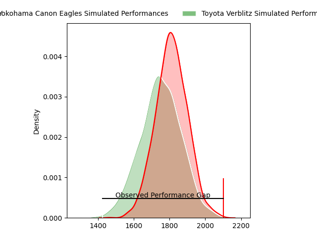
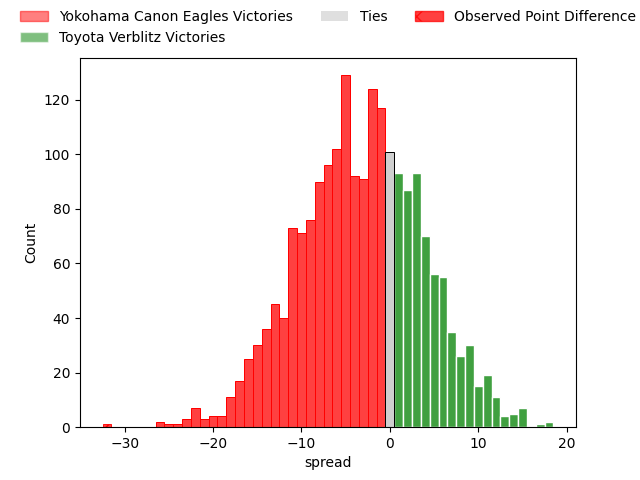
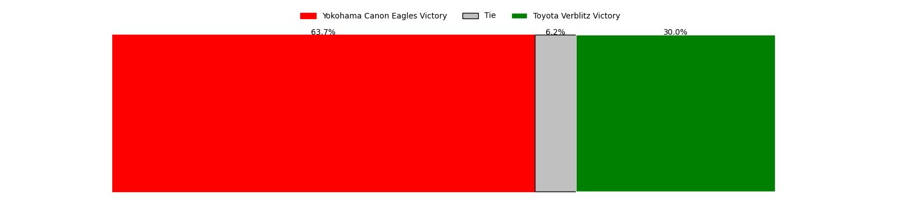
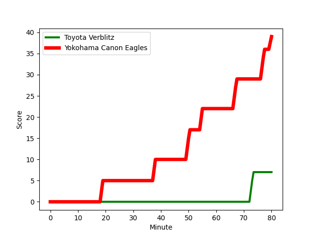
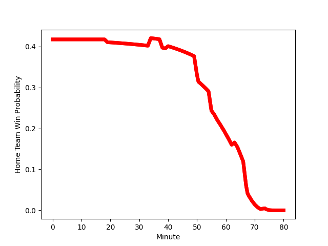

---  
layout: page  
title: Yokohama Canon Eagles at Toyota Verblitz; 39-7  
date: 2023-02-25 00:00:00 18:00:00 -0500  
categories: match review  
---
# Yokohama Canon Eagles at Toyota Verblitz; 39-7

# Club Level Predictions

The first set of predictions treats a club as the smallest object, as the club develops its members, organizes a gameplan, and deploys its players as needed for each match. This club model has a prediction of 0.415, which translates to predicting Yokohama Canon Eagles to win by 3.1.

Each club has a rating and a rating deviation (simiar to a Glicko system), and expected performances can be generated. This allows for simulated matches and spreads like the ones below.
## Projected Performances

## Projected Spreads

## Projected Results

# Player Level Predictions

Treating teams instead as an entity made up of the currently active players, I have ratings for each player in an altogether different system. These can be combined to form team ratings once teamsheets are announced, weighting starters a bit higher than the reserves. After the match is played, players can be weighted by their minutes on the field, allowing for an accurate measure of the team's composition. With these compiled team ratings, we can make predictions, measure inaccuracy, and update the individual player ratings.
## Prediction with Player Minutes: Yokohama Canon Eagles by 10.5

Yokohama Canon Eagles by 14.5 on a neutral field
## Scores over Time

## Win Probability over Time

There were 3 large changes in win probability in this match
## Prediction without Player Minutes: Yokohama Canon Eagles by 13.1

Yokohama Canon Eagles by 17.1 on a neutral pitch

|   Away Minutes | Away Player                                                                 |   Away elo |   Away Percentile |   Number |   Home Percentile |   Home elo | Home Player                                                                   |   Home Minutes |
|---------------:|:----------------------------------------------------------------------------|-----------:|------------------:|---------:|------------------:|-----------:|:------------------------------------------------------------------------------|---------------:|
|             63 | [Takato Okabe](..//playerfiles//TakatoOkabe_cleaned.md)                     |     129.7  |                98 |        1 |                52 |      95.74 | [Shogo Miura](..//playerfiles//ShogoMiura_cleaned.md)                         |             80 |
|             63 | [Yusuke Niwai](..//playerfiles//YusukeNiwai_cleaned.md)                     |      92.29 |                42 |        2 |                91 |     113.89 | [Yoshikatsu Hikosaka](..//playerfiles//YoshikatsuHikosaka_cleaned.md)         |             73 |
|             34 | [Rento Tsukayama](..//playerfiles//RentoTsukayama_cleaned.md)               |     111.3  |                89 |        3 |                13 |      82.43 | [Yusuke Kizu](..//playerfiles//YusukeKizu_cleaned.md)                         |             40 |
|             80 | [Max Douglas](..//playerfiles//MaxDouglas_cleaned.md)                       |     100.13 |                65 |        4 |                41 |      92.54 | [Daichi Akiyama](..//playerfiles//DaichiAkiyama_cleaned.md)                   |             80 |
|             50 | [Mitchell Brown](..//playerfiles//MitchellBrown_cleaned.md)                 |      92.94 |                43 |        5 |                29 |      88.54 | [Michael Allardice](..//playerfiles//MichaelAllardice_cleaned.md)             |             80 |
|             80 | [Sioeli Vakalahi](..//playerfiles//SioeliVakalahi_cleaned.md)               |     111.8  |                87 |        6 |                37 |      91.13 | [Pieter Stephanus du Toit](..//playerfiles//PieterStephanusduToit_cleaned.md) |             80 |
|             80 | [Naoto Shimada](..//playerfiles//NaotoShimada_cleaned.md)                   |      93.85 |                46 |        7 |                18 |      83.05 | [Kazuki Himeno](..//playerfiles//KazukiHimeno_cleaned.md)                     |             80 |
|             74 | [Sione Halasili](..//playerfiles//SioneHalasili_cleaned.md)                 |      97.36 |                54 |        8 |                 8 |      74.4  | [Lautaimi Fetuani](..//playerfiles//LautaimiFetuani_cleaned.md)               |             64 |
|             57 | [Francois (Faf) de Klerk](..//playerfiles//Francois(Faf)deKlerk_cleaned.md) |      97.8  |                59 |        9 |                25 |      86.96 | [Kaito Shigeno](..//playerfiles//KaitoShigeno_cleaned.md)                     |             50 |
|             57 | [Yu Tamura](..//playerfiles//YuTamura_cleaned.md)                           |     103.54 |                73 |       10 |                 2 |      64.78 | [Willem Jacobus Le Roux](..//playerfiles//WillemJacobusLeRoux_cleaned.md)     |             80 |
|             80 | [Masayoshi Takezawa](..//playerfiles//MasayoshiTakezawa_cleaned.md)         |      66.08 |                 4 |       11 |                49 |      94.5  | [Vatiliai Tuidraki](..//playerfiles//VatiliaiTuidraki_cleaned.md)             |             80 |
|             80 | [Yusuke Kajimura](..//playerfiles//YusukeKajimura_cleaned.md)               |     107.98 |                82 |       12 |               nan |      95    | [Male Sau](..//playerfiles//MaleSau_cleaned.md)                               |             40 |
|             68 | [Jesse Andre Kriel](..//playerfiles//JesseAndreKriel_cleaned.md)            |     110.06 |                85 |       13 |                74 |     103.14 | [Charlie Lawrence](..//playerfiles//CharlieLawrence_cleaned.md)               |             50 |
|             80 | [Inoke Burua](..//playerfiles//InokeBurua_cleaned.md)                       |     105.81 |                78 |       14 |                10 |      76.94 | [Taichi Takahashi](..//playerfiles//TaichiTakahashi_cleaned.md)               |             63 |
|             80 | [Junpei Ogura](..//playerfiles//JunpeiOgura_cleaned.md)                     |      94.5  |                50 |       15 |                39 |      90.33 | [Tiaan Falcon](..//playerfiles//TiaanFalcon_cleaned.md)                       |             80 |
|             46 | [Tatsuro Sugimoto](..//playerfiles//TatsuroSugimoto_cleaned.md)             |      68.13 |                 3 |       16 |                50 |      95.16 | [Will Tupou](..//playerfiles//WillTupou_cleaned.md)                           |             40 |
|             30 | [Cory Hill](..//playerfiles//CoryHill_cleaned.md)                           |     101.95 |                69 |       17 |                72 |      99.81 | [Shunsuke Asaoka](..//playerfiles//ShunsukeAsaoka_cleaned.md)                 |             36 |
|             23 | [Sarel Petrus Marais](..//playerfiles//SarelPetrusMarais_cleaned.md)        |     119.45 |                92 |       18 |                80 |     103.23 | [Kenta Fukuda](..//playerfiles//KentaFukuda_cleaned.md)                       |             30 |
|             23 | [Kafazumi Yamasuga](..//playerfiles//KafazumiYamasuga_cleaned.md)           |      89.48 |                28 |       19 |                 9 |      76.66 | [Rob Thompson](..//playerfiles//RobThompson_cleaned.md)                       |             30 |
|             17 | [Shin Kawamura](..//playerfiles//ShinKawamura_cleaned.md)                   |      69.07 |                 4 |       20 |               nan |      93.76 | [Jamie Henry](..//playerfiles//JamieHenry_cleaned.md)                         |             17 |
|             17 | [Chang Ho Ahn](..//playerfiles//ChangHoAhn_cleaned.md)                      |      98.34 |               nan |       21 |                45 |      92.17 | [Kyo Yoshida](..//playerfiles//KyoYoshida_cleaned.md)                         |             16 |
|             12 | [Naoya Minamihashi](..//playerfiles//NaoyaMinamihashi_cleaned.md)           |     116.26 |                92 |       22 |                26 |      87.54 | [Toshizaku Nobeyama](..//playerfiles//ToshizakuNobeyama_cleaned.md)           |              7 |
|              6 | [Ryota Suginaga](..//playerfiles//RyotaSuginaga_cleaned.md)                 |     130.7  |                97 |       23 |               nan |      93.91 | [Yuji Takei](..//playerfiles//YujiTakei_cleaned.md)                           |              4 |

