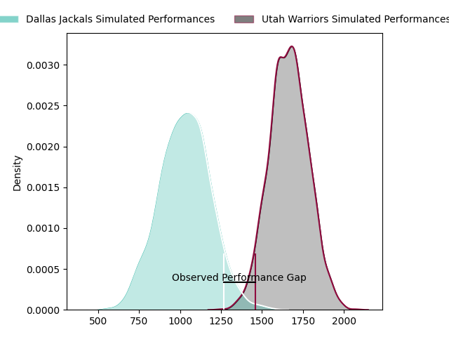
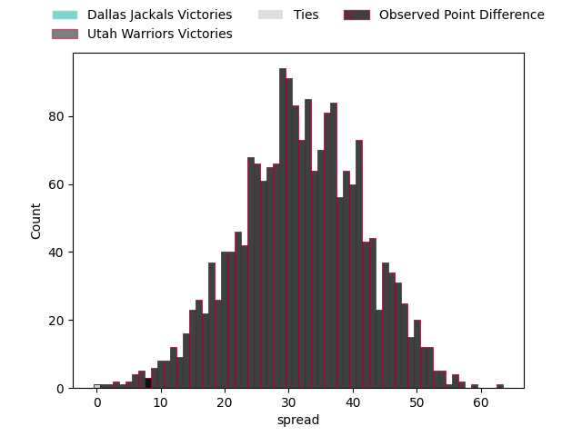
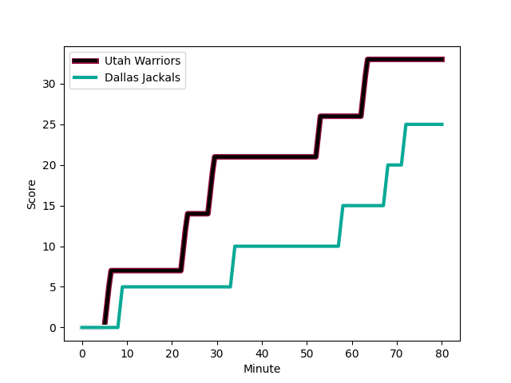
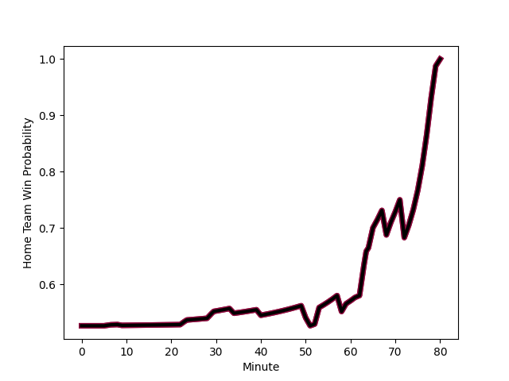

---  
layout: page  
title: Dallas Jackals at Utah Warriors; 25-33  
date: 2023-02-25 22:00:00 18:00:00 -0500  
categories: match review  
---
# Dallas Jackals at Utah Warriors; 25-33

# Club Level Predictions

The first set of predictions treats a club as the smallest object, as the club develops its members, organizes a gameplan, and deploys its players as needed for each match. This club model has a prediction of 0.964, which translates to predicting Utah Warriors to win by 31.7.

Each club has a rating and a rating deviation (simiar to a Glicko system), and expected performances can be generated. This allows for simulated matches and spreads like the ones below.
## Projected Performances

## Projected Spreads

## Projected Results

# Player Level Predictions

Treating teams instead as an entity made up of the currently active players, I have ratings for each player in an altogether different system. These can be combined to form team ratings once teamsheets are announced, weighting starters a bit higher than the reserves. After the match is played, players can be weighted by their minutes on the field, allowing for an accurate measure of the team's composition. With these compiled team ratings, we can make predictions, measure inaccuracy, and update the individual player ratings.
## Prediction with Player Minutes: Utah Warriors by 8.6

Utah Warriors by 4.6 on a neutral field
## Scores over Time

## Win Probability over Time

There were 12 large changes in win probability in this match
## Prediction without Player Minutes: Utah Warriors by 12.4

Utah Warriors by 8.4 on a neutral pitch

|   Away Minutes | Away Player                                                            |   Away elo |   Away Percentile |   Number |   Home Percentile |   Home elo | Home Player                                                                       |   Home Minutes |
|---------------:|:-----------------------------------------------------------------------|-----------:|------------------:|---------:|------------------:|-----------:|:----------------------------------------------------------------------------------|---------------:|
|             51 | [Liam Murray](..//playerfiles//LiamMurray_cleaned.md)                  |      44.79 |                 0 |        1 |                67 |      96.34 | [Emerson Prior](..//playerfiles//EmersonPrior_cleaned.md)                         |             50 |
|             62 | [Dewald Kotze](..//playerfiles//DewaldKotze_cleaned.md)                |      81.94 |                13 |        2 |                44 |      92.77 | [Ratu Vere Taukona Vugakoto](..//playerfiles//RatuVereTaukonaVugakoto_cleaned.md) |             59 |
|             65 | [Juan Pablo Zeiss](..//playerfiles//JuanPabloZeiss_cleaned.md)         |      88.01 |                24 |        3 |                44 |      93.5  | [Paul Mullen](..//playerfiles//PaulMullen_cleaned.md)                             |             50 |
|             80 | [Sam Golla](..//playerfiles//SamGolla_cleaned.md)                      |      88.01 |                28 |        4 |                42 |      92.45 | [Jamie Lane](..//playerfiles//JamieLane_cleaned.md)                               |             80 |
|             71 | [Lucas Bur](..//playerfiles//LucasBur_cleaned.md)                      |      87.34 |                26 |        5 |                11 |      77.49 | [Saia Uhila](..//playerfiles//SaiaUhila_cleaned.md)                               |             50 |
|             80 | [Conrado Roura](..//playerfiles//ConradoRoura_cleaned.md)              |      24.56 |                 0 |        6 |                 4 |      68.61 | [Lance Williams](..//playerfiles//LanceWilliams_cleaned.md)                       |             80 |
|             80 | [Jeronimo Gomez Vara](..//playerfiles//JeronimoGomezVara_cleaned.md)   |      84.25 |                18 |        7 |                 4 |      68.29 | [Bailey Wilson](..//playerfiles//BaileyWilson_cleaned.md)                         |             59 |
|             59 | [Jan Adriaan Booysen](..//playerfiles//JanAdriaanBooysen_cleaned.md)   |      87.34 |                25 |        8 |                25 |      87.35 | [Jurie George van Vuuren](..//playerfiles//JurieGeorgevanVuuren_cleaned.md)       |             80 |
|             69 | [Pedro Imhoff](..//playerfiles//PedroImhoff_cleaned.md)                |      95    |               nan |        9 |                44 |      92.67 | [Connor McLeod](..//playerfiles//ConnorMcLeod_cleaned.md)                         |             59 |
|             80 | [Martin Elias](..//playerfiles//MartinElias_cleaned.md)                |     132.27 |                98 |       10 |                41 |      92.45 | [Joel Hodgson](..//playerfiles//JoelHodgson_cleaned.md)                           |             50 |
|             65 | [James Vaifale](..//playerfiles//JamesVaifale_cleaned.md)              |     108.52 |                86 |       11 |                32 |      89.3  | [Joseph Mano](..//playerfiles//JosephMano_cleaned.md)                             |             80 |
|             40 | [Juan Pablo Aguirre](..//playerfiles//JuanPabloAguirre_cleaned.md)     |      54.48 |                 1 |       12 |                44 |      93.02 | [Paul Lasike](..//playerfiles//PaulLasike_cleaned.md)                             |             59 |
|             80 | [Tomas Malanos](..//playerfiles//TomasMalanos_cleaned.md)              |     109.34 |                84 |       13 |                42 |      92.45 | [Calvin Whiting](..//playerfiles//CalvinWhiting_cleaned.md)                       |             80 |
|             80 | [Eric Naposki](..//playerfiles//EricNaposki_cleaned.md)                |      55.93 |                 1 |       14 |                43 |      92.45 | [Mika Kruse](..//playerfiles//MikaKruse_cleaned.md)                               |             80 |
|             80 | [Adriaan John Carelse](..//playerfiles//AdriaanJohnCarelse_cleaned.md) |      84.88 |                25 |       15 |                44 |      92.45 | [Caleb Makene](..//playerfiles//CalebMakene_cleaned.md)                           |             80 |
|             29 | [Nicolas Revol](..//playerfiles//NicolasRevol_cleaned.md)              |     104.54 |                79 |       16 |                 0 |      39.02 | [Franco van den Berg](..//playerfiles//FrancovandenBerg_cleaned.md)               |             30 |
|             18 | [Connor Robinson](..//playerfiles//ConnorRobinson_cleaned.md)          |      92.89 |               nan |       17 |               nan |      93.52 | [Joey Backe](..//playerfiles//JoeyBacke_cleaned.md)                               |             21 |
|             15 | [Kyle Steeves](..//playerfiles//KyleSteeves_cleaned.md)                |      94.28 |               nan |       18 |                16 |      84.63 | [Angus McLellan](..//playerfiles//AngusMcLellan_cleaned.md)                       |             30 |
|              9 | [Carson Shoemaker](..//playerfiles//CarsonShoemaker_cleaned.md)        |      90.43 |                37 |       19 |                 2 |      55.41 | [Thomas Tu'avao](..//playerfiles//ThomasTu'avao_cleaned.md)                       |             30 |
|             21 | [Maikeli Naromaitoga](..//playerfiles//MaikeliNaromaitoga_cleaned.md)  |      91.74 |               nan |       20 |               nan |      94.62 | [Jeremiah Noaese](..//playerfiles//JeremiahNoaese_cleaned.md)                     |             21 |
|             11 | [Danny Christensen](..//playerfiles//DannyChristensen_cleaned.md)      |      70.91 |                 7 |       21 |                68 |     100.15 | [Zion Going](..//playerfiles//ZionGoing_cleaned.md)                               |             21 |
|             15 | [Campbell Johnstone](..//playerfiles//CampbellJohnstone_cleaned.md)    |      13.91 |                 0 |       22 |               nan |      94.43 | [Cliven Loubser](..//playerfiles//ClivenLoubser_cleaned.md)                       |             30 |
|             40 | [Patrick Medina](..//playerfiles//PatrickMedina_cleaned.md)            |      95    |               nan |       23 |               nan |      95    | [Logan Tago](..//playerfiles//LoganTago_cleaned.md)                               |             21 |

