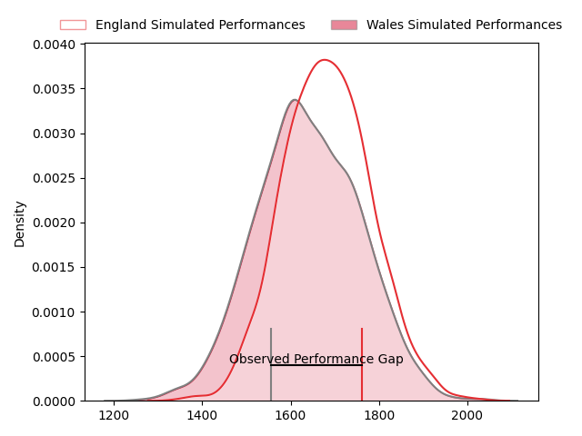
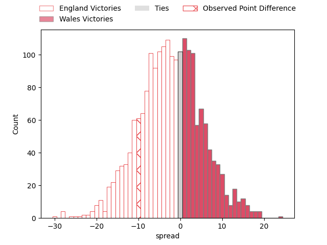
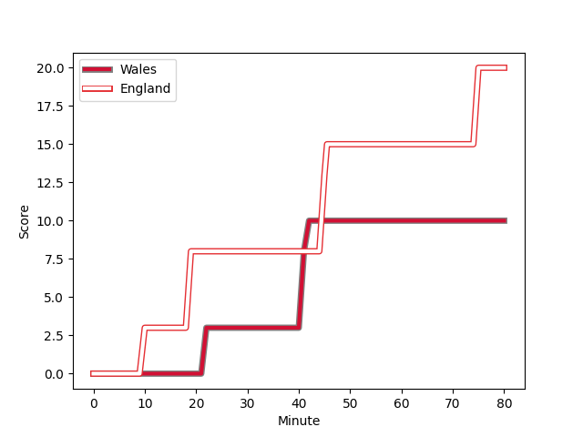
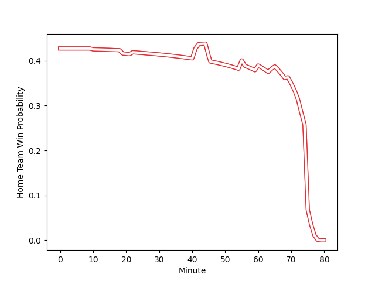

---  
layout: page  
title: England at Wales; 20-10  
date: 2023-02-25 11:45:00 18:00:00 -0500  
categories: match review  
---
# England at Wales; 20-10

# Club Level Predictions

The first set of predictions treats a club as the smallest object, as the club develops its members, organizes a gameplan, and deploys its players as needed for each match. This club model has a prediction of 0.435, which translates to predicting England to win by 2.4.

Each club has a rating and a rating deviation (simiar to a Glicko system), and expected performances can be generated. This allows for simulated matches and spreads like the ones below.
## Projected Performances

## Projected Spreads

## Projected Results

# Player Level Predictions

Treating teams instead as an entity made up of the currently active players, I have ratings for each player in an altogether different system. These can be combined to form team ratings once teamsheets are announced, weighting starters a bit higher than the reserves. After the match is played, players can be weighted by their minutes on the field, allowing for an accurate measure of the team's composition. With these compiled team ratings, we can make predictions, measure inaccuracy, and update the individual player ratings.
## Prediction with Player Minutes: England by 8.7

England by 12.7 on a neutral field
## Scores over Time

## Win Probability over Time

There were 5 large changes in win probability in this match
## Prediction without Player Minutes: England by 8.5

England by 12.5 on a neutral pitch

|   Away Minutes | Away Player                                                          |   Away elo |   Away Percentile |   Number |   Home Percentile |   Home elo | Home Player                                                       |   Home Minutes |
|---------------:|:---------------------------------------------------------------------|-----------:|------------------:|---------:|------------------:|-----------:|:------------------------------------------------------------------|---------------:|
|             55 | [Ellis Genge](..//playerfiles//EllisGenge_cleaned.md)                |      95.32 |                51 |        1 |                 7 |      76.02 | [Gareth Thomas](..//playerfiles//GarethThomas_cleaned.md)         |             56 |
|             80 | [Jamie George](..//playerfiles//JamieGeorge_cleaned.md)              |     161.24 |               100 |        2 |                55 |      95.61 | [Ken Owens](..//playerfiles//KenOwens_cleaned.md)                 |             69 |
|             65 | [Kyle Sinckler](..//playerfiles//KyleSinckler_cleaned.md)            |     111.34 |                89 |        3 |                98 |     126    | [Tomas Francis](..//playerfiles//TomasFrancis_cleaned.md)         |             56 |
|             80 | [Maro Itoje](..//playerfiles//MaroItoje_cleaned.md)                  |     107.67 |                81 |        4 |                40 |      92.25 | [Adam Beard](..//playerfiles//AdamBeard_cleaned.md)               |             80 |
|             80 | [Ollie Chessum](..//playerfiles//OllieChessum_cleaned.md)            |     117.9  |                92 |        5 |                75 |     104.26 | [Alun Wyn Jones](..//playerfiles//AlunWynJones_cleaned.md)        |             64 |
|             80 | [Lewis Ludlam](..//playerfiles//LewisLudlam_cleaned.md)              |      93.23 |                45 |        6 |                22 |      86.26 | [Christ Tshiunza](..//playerfiles//ChristTshiunza_cleaned.md)     |             64 |
|             60 | [Jack Willis](..//playerfiles//JackWillis_cleaned.md)                |     122.98 |                94 |        7 |                91 |     116.99 | [Justin Tipuric](..//playerfiles//JustinTipuric_cleaned.md)       |             80 |
|             69 | [Alex Dombrandt](..//playerfiles//AlexDombrandt_cleaned.md)          |     138.93 |                99 |        8 |                35 |      90.09 | [Taulupe Faletau](..//playerfiles//TaulupeFaletau_cleaned.md)     |             80 |
|             73 | [Jack van Poortvliet](..//playerfiles//JackvanPoortvliet_cleaned.md) |      90.01 |                34 |        9 |                86 |     109.14 | [Tomos Williams](..//playerfiles//TomosWilliams_cleaned.md)       |             69 |
|             80 | [Owen Farrell](..//playerfiles//OwenFarrell_cleaned.md)              |     125.03 |                95 |       10 |                88 |     112.61 | [Owen Williams](..//playerfiles//OwenWilliams_cleaned.md)         |             55 |
|             80 | [Anthony Watson](..//playerfiles//AnthonyWatson_cleaned.md)          |      86.99 |                23 |       11 |                27 |      87.49 | [Louis Rees-Zammit](..//playerfiles//LouisRees-Zammit_cleaned.md) |             80 |
|             80 | [Ollie Lawrence](..//playerfiles//OllieLawrence_cleaned.md)          |      86.42 |                24 |       12 |                 7 |      74.12 | [Joe Hawkins](..//playerfiles//JoeHawkins_cleaned.md)             |             80 |
|             80 | [Henry Slade](..//playerfiles//HenrySlade_cleaned.md)                |      96.33 |                53 |       13 |                52 |      95.84 | [Mason Grady](..//playerfiles//MasonGrady_cleaned.md)             |             80 |
|             80 | [Max Malins](..//playerfiles//MaxMalins_cleaned.md)                  |      88.83 |                31 |       14 |                34 |      89.73 | [Josh Adams](..//playerfiles//JoshAdams_cleaned.md)               |             55 |
|             80 | [Freddie Steward](..//playerfiles//FreddieSteward_cleaned.md)        |      98.42 |                57 |       15 |                77 |     106.84 | [Leigh Halfpenny](..//playerfiles//LeighHalfpenny_cleaned.md)     |             80 |
|              0 | [Jack Walker](..//playerfiles//JackWalker_cleaned.md)                |      87.45 |                26 |       16 |               nan |      95    | [Bradley Roberts](..//playerfiles//BradleyRoberts_cleaned.md)     |             11 |
|             25 | [Mako Vunipola](..//playerfiles//MakoVunipola_cleaned.md)            |     124.75 |                97 |       17 |                16 |      82.31 | [Rhys Carré](..//playerfiles//RhysCarré_cleaned.md)               |             24 |
|             15 | [Dan Cole](..//playerfiles//DanCole_cleaned.md)                      |      84.31 |                18 |       18 |                64 |      99.09 | [Dillon Lewis](..//playerfiles//DillonLewis_cleaned.md)           |             24 |
|             11 | [Courtney Lawes](..//playerfiles//CourtneyLawes_cleaned.md)          |      95    |               nan |       19 |                86 |     111.17 | [Dafydd Jenkins](..//playerfiles//DafyddJenkins_cleaned.md)       |             16 |
|             20 | [Ben Curry](..//playerfiles//BenCurry_cleaned.md)                    |      90.55 |                37 |       20 |                81 |     108.31 | [Tommy Reffell](..//playerfiles//TommyReffell_cleaned.md)         |             16 |
|              7 | [Alex Mitchell](..//playerfiles//AlexMitchell_cleaned.md)            |     106.37 |                82 |       21 |               nan |      95    | [Kieran Hardy](..//playerfiles//KieranHardy_cleaned.md)           |             11 |
|              0 | [Marcus Smith](..//playerfiles//MarcusSmith_cleaned.md)              |     133.51 |                97 |       22 |                97 |     131.75 | [Dan Biggar](..//playerfiles//DanBiggar_cleaned.md)               |             25 |
|              0 | [Henry Arundell](..//playerfiles//HenryArundell_cleaned.md)          |      94.1  |                50 |       23 |                99 |     146.96 | [Nick Tompkins](..//playerfiles//NickTompkins_cleaned.md)         |             25 |

