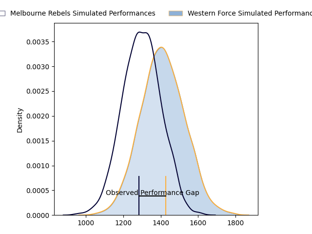
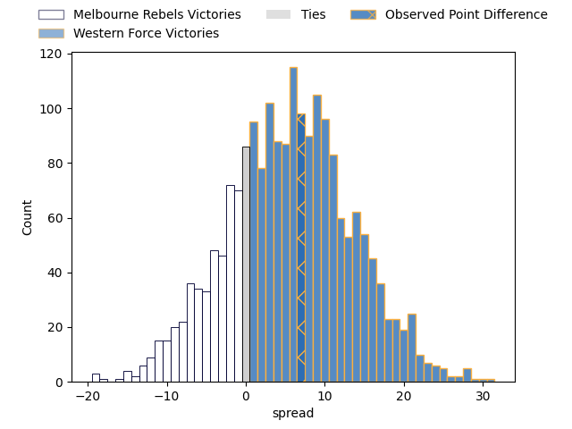
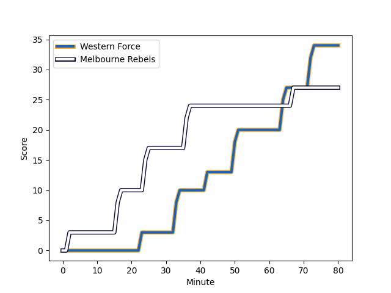
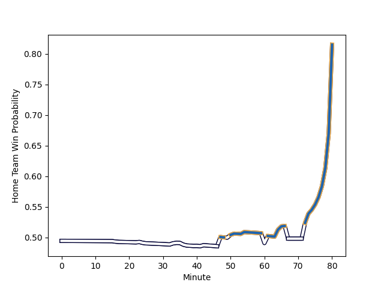

---  
layout: page  
title: Melbourne Rebels at Western Force; 27-34  
date: 2023-02-25 06:00:00 18:00:00 -0500  
categories: match review  
---
# Melbourne Rebels at Western Force; 27-34

# Club Level Predictions

The first set of predictions treats a club as the smallest object, as the club develops its members, organizes a gameplan, and deploys its players as needed for each match. This club model has a prediction of 0.647, which translates to predicting Western Force to win by 5.5.

Each club has a rating and a rating deviation (simiar to a Glicko system), and expected performances can be generated. This allows for simulated matches and spreads like the ones below.
## Projected Performances

## Projected Spreads

## Projected Results

# Player Level Predictions

Treating teams instead as an entity made up of the currently active players, I have ratings for each player in an altogether different system. These can be combined to form team ratings once teamsheets are announced, weighting starters a bit higher than the reserves. After the match is played, players can be weighted by their minutes on the field, allowing for an accurate measure of the team's composition. With these compiled team ratings, we can make predictions, measure inaccuracy, and update the individual player ratings.
## Prediction with Player Minutes: Western Force by 3.0

Melbourne Rebels by 1.0 on a neutral field
## Scores over Time

## Win Probability over Time

There were 4 large changes in win probability in this match
## Prediction without Player Minutes: Melbourne Rebels by 3.5

Melbourne Rebels by 7.5 on a neutral pitch

|   Away Minutes | Away Player                                                          |   Away elo |   Away Percentile |   Number |   Home Percentile |   Home elo | Home Player                                                               |   Home Minutes |
|---------------:|:---------------------------------------------------------------------|-----------:|------------------:|---------:|------------------:|-----------:|:--------------------------------------------------------------------------|---------------:|
|             54 | [Matt Gibbon](..//playerfiles//MattGibbon_cleaned.md)                |     113.85 |                91 |        1 |                91 |     117.31 | [Tom Robertson](..//playerfiles//TomRobertson_cleaned.md)                 |             60 |
|             51 | [Alex Mafi](..//playerfiles//AlexMafi_cleaned.md)                    |      98.11 |               nan |        2 |                98 |     131.49 | [Folau Fainga'a](..//playerfiles//FolauFainga'a_cleaned.md)               |             80 |
|             47 | [Sam Talakai](..//playerfiles//SamTalakai_cleaned.md)                |      95    |               nan |        3 |                96 |     120.21 | [Santiago Medrano](..//playerfiles//SantiagoMedrano_cleaned.md)           |             60 |
|             80 | [Josh Canham](..//playerfiles//JoshCanham_cleaned.md)                |     103.69 |                73 |        4 |                 1 |      53.13 | [Felix Kalapu](..//playerfiles//FelixKalapu_cleaned.md)                   |             47 |
|             47 | [Tuaina Taii Tualima](..//playerfiles//TuainaTaiiTualima_cleaned.md) |      93.41 |                42 |        5 |               nan |      72.52 | [Jeremy Williams](..//playerfiles//JeremyWilliams_cleaned.md)             |             80 |
|             61 | [Josh Kemeny](..//playerfiles//JoshKemeny_cleaned.md)                |      93.84 |               nan |        6 |                 4 |      68.23 | [Tim Anstee](..//playerfiles//TimAnstee_cleaned.md)                       |             80 |
|             51 | [Brad Wilkin](..//playerfiles//BradWilkin_cleaned.md)                |     101.5  |                68 |        7 |                22 |      86.18 | [Ollie Callan](..//playerfiles//OllieCallan_cleaned.md)                   |             80 |
|             80 | [Richard Hardwick](..//playerfiles//RichardHardwick_cleaned.md)      |      94.42 |                44 |        8 |                35 |      90.28 | [Michael Wells](..//playerfiles//MichaelWells_cleaned.md)                 |             73 |
|             53 | [Ryan Louwrens](..//playerfiles//RyanLouwrens_cleaned.md)            |     130.5  |                98 |        9 |                82 |     107.22 | [Ian Prior](..//playerfiles//IanPrior_cleaned.md)                         |             47 |
|             80 | [Carter Gordon](..//playerfiles//CarterGordon_cleaned.md)            |      99.48 |                60 |       10 |                76 |     106.56 | [Bryce Hegarty](..//playerfiles//BryceHegarty_cleaned.md)                 |             80 |
|             80 | [Monty Ioane](..//playerfiles//MontyIoane_cleaned.md)                |     124.76 |                95 |       11 |                 4 |      70.71 | [Zach Kibirige](..//playerfiles//ZachKibirige_cleaned.md)                 |             80 |
|             80 | [Stacey Ili](..//playerfiles//StaceyIli_cleaned.md)                  |     115.31 |                90 |       12 |                97 |     130.98 | [Hamish Stewart](..//playerfiles//HamishStewart_cleaned.md)               |             80 |
|             80 | [Reece Hodge](..//playerfiles//ReeceHodge_cleaned.md)                |     106    |                80 |       13 |               nan |      95    | [Sam Spink](..//playerfiles//SamSpink_cleaned.md)                         |             40 |
|             80 | [Lachie Anderson](..//playerfiles//LachieAnderson_cleaned.md)        |      92.39 |                44 |       14 |               nan |      95    | [Toni Pulu](..//playerfiles//ToniPulu_cleaned.md)                         |             67 |
|             80 | [Nick Jooste](..//playerfiles//NickJooste_cleaned.md)                |      75.18 |                11 |       15 |                74 |     105.3  | [Chase Tiatia](..//playerfiles//ChaseTiatia_cleaned.md)                   |             80 |
|             29 | [Jordan Uelese](..//playerfiles//JordanUelese_cleaned.md)            |      98.2  |                62 |       16 |                76 |     102.85 | [Tom Horton](..//playerfiles//TomHorton_cleaned.md)                       |             42 |
|             26 | [Isaac Aedo Kailea](..//playerfiles//IsaacAedoKailea_cleaned.md)     |      95    |               nan |       17 |               nan |      87.74 | [Angus Wagner](..//playerfiles//AngusWagner_cleaned.md)                   |             20 |
|             33 | [Pone Fa'amausili](..//playerfiles//PoneFa'amausili_cleaned.md)      |      98.06 |                74 |       18 |               nan |      95    | [Siosifa Amone](..//playerfiles//SiosifaAmone_cleaned.md)                 |             20 |
|             33 | [Trevor Hosea](..//playerfiles//TrevorHosea_cleaned.md)              |      94.08 |               nan |       19 |                89 |     113.38 | [Jeremy Thrush](..//playerfiles//JeremyThrush_cleaned.md)                 |             33 |
|             29 | [Tamati Ioane](..//playerfiles//TamatiIoane_cleaned.md)              |      95    |               nan |       20 |                34 |      90.74 | [Jackson Pugh](..//playerfiles//JacksonPugh_cleaned.md)                   |              7 |
|             19 | [Vaiolini Ekuasi](..//playerfiles//VaioliniEkuasi_cleaned.md)        |      95    |               nan |       21 |                62 |      99    | [Issak Fines-Leleiwasa](..//playerfiles//IssakFines-Leleiwasa_cleaned.md) |             33 |
|             27 | [James Tuttle](..//playerfiles//JamesTuttle_cleaned.md)              |      98.88 |                62 |       22 |                22 |      85.58 | [Bayley Kuenzle](..//playerfiles//BayleyKuenzle_cleaned.md)               |             13 |
|              0 | [Lukas Ripley](..//playerfiles//LukasRipley_cleaned.md)              |      89.84 |                35 |       23 |               nan |      95    | [George Poolman](..//playerfiles//GeorgePoolman_cleaned.md)               |             40 |

