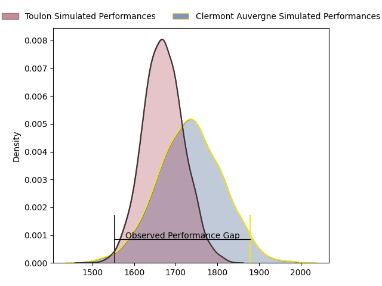
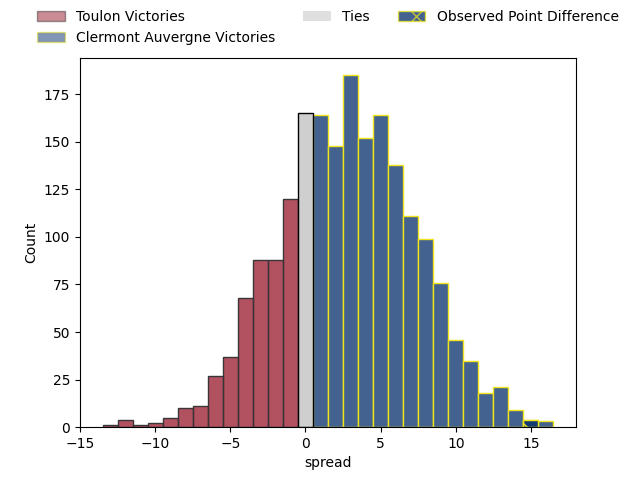
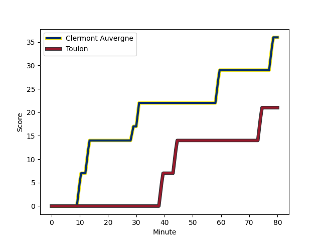
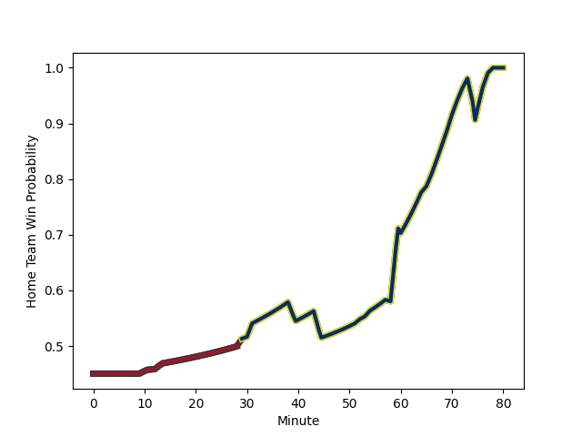

---  
layout: page  
title: Toulon at Clermont Auvergne; 21-36  
date: 2023-02-26 21:05:00 18:00:00 -0500  
categories: match review  
---
# Toulon at Clermont Auvergne; 21-36

# Club Level Predictions

The first set of predictions treats a club as the smallest object, as the club develops its members, organizes a gameplan, and deploys its players as needed for each match. This club model has a prediction of 0.583, which translates to predicting Clermont Auvergne to win by 3.0.

Each club has a rating and a rating deviation (simiar to a Glicko system), and expected performances can be generated. This allows for simulated matches and spreads like the ones below.
## Projected Performances

## Projected Spreads

## Projected Results

# Player Level Predictions

Treating teams instead as an entity made up of the currently active players, I have ratings for each player in an altogether different system. These can be combined to form team ratings once teamsheets are announced, weighting starters a bit higher than the reserves. After the match is played, players can be weighted by their minutes on the field, allowing for an accurate measure of the team's composition. With these compiled team ratings, we can make predictions, measure inaccuracy, and update the individual player ratings.
## Prediction with Player Minutes: Toulon by 4.6

Toulon by 8.6 on a neutral field
## Scores over Time

## Win Probability over Time

There were 11 large changes in win probability in this match
## Prediction without Player Minutes: Toulon by 6.0

Toulon by 10.0 on a neutral pitch

|   Away Minutes | Away Player                                                           |   Away elo |   Away Percentile |   Number |   Home Percentile |   Home elo | Home Player                                                         |   Home Minutes |
|---------------:|:----------------------------------------------------------------------|-----------:|------------------:|---------:|------------------:|-----------:|:--------------------------------------------------------------------|---------------:|
|             58 | [Dany Priso](..//playerfiles//DanyPriso_cleaned.md)                   |     105.92 |                83 |        1 |                70 |      98.89 | [Etienne Falgoux](..//playerfiles//EtienneFalgoux_cleaned.md)       |             58 |
|             58 | [Anthony Étrillard](..//playerfiles//AnthonyÉtrillard_cleaned.md)     |     104.56 |                76 |        2 |                48 |      93.68 | [Étienne Fourcade](..//playerfiles//ÉtienneFourcade_cleaned.md)     |             52 |
|             58 | [Beka Gigashvili](..//playerfiles//BekaGigashvili_cleaned.md)         |      86.57 |                21 |        3 |                36 |      91.17 | [Rabah Slimani](..//playerfiles//RabahSlimani_cleaned.md)           |             54 |
|             58 | [Beka Gigashvili](..//playerfiles//BekaGigashvili_cleaned.md)         |      86.57 |                14 |        3 |                36 |      91.17 | [Rabah Slimani](..//playerfiles//RabahSlimani_cleaned.md)           |             54 |
|             58 | [Matthias Halagahu](..//playerfiles//MatthiasHalagahu_cleaned.md)     |      96.08 |                48 |        4 |                80 |     107.69 | [Thibault Lanen](..//playerfiles//ThibaultLanen_cleaned.md)         |             65 |
|             80 | [Brian Alainu'uese](..//playerfiles//BrianAlainu'uese_cleaned.md)     |     105.34 |                76 |        5 |                68 |      99.58 | [Peceli Yato](..//playerfiles//PeceliYato_cleaned.md)               |             80 |
|             70 | [Cornell du Preez](..//playerfiles//CornellduPreez_cleaned.md)        |     104.14 |                74 |        6 |                64 |      99.85 | [Arthur Iturria](..//playerfiles//ArthurIturria_cleaned.md)         |             80 |
|             80 | [Swan Rebbadj](..//playerfiles//SwanRebbadj_cleaned.md)               |     104.78 |                75 |        7 |                62 |      99.09 | [Alexandre Fischer](..//playerfiles//AlexandreFischer_cleaned.md)   |             60 |
|             70 | [Facundo Isa](..//playerfiles//FacundoIsa_cleaned.md)                 |      95.44 |                51 |        8 |                12 |      79.69 | [Fritz Lee](..//playerfiles//FritzLee_cleaned.md)                   |             80 |
|             60 | [Benoit Paillaugue](..//playerfiles//BenoitPaillaugue_cleaned.md)     |      93.95 |                48 |        9 |                61 |      98.91 | [Baptiste Jauneau](..//playerfiles//BaptisteJauneau_cleaned.md)     |             60 |
|             66 | [Ihaia West](..//playerfiles//IhaiaWest_cleaned.md)                   |      98.22 |                58 |       10 |                54 |      96.96 | [Anthony Belleau](..//playerfiles//AnthonyBelleau_cleaned.md)       |             65 |
|             80 | [Jiuta Wainiqolo](..//playerfiles//JiutaWainiqolo_cleaned.md)         |     102.8  |                73 |       11 |                16 |      82.46 | [Alivereti Raka](..//playerfiles//AliveretiRaka_cleaned.md)         |             80 |
|             80 | [Duncan Paia'aua](..//playerfiles//DuncanPaia'aua_cleaned.md)         |      99.77 |                64 |       12 |                14 |      81.21 | [Irae Simone](..//playerfiles//IraeSimone_cleaned.md)               |             80 |
|             80 | [Waisea Nayacavelu](..//playerfiles//WaiseaNayacavelu_cleaned.md)     |      95.69 |                51 |       13 |                65 |     100.31 | [George Moala](..//playerfiles//GeorgeMoala_cleaned.md)             |             80 |
|             80 | [Cheslin Kolbe](..//playerfiles//CheslinKolbe_cleaned.md)             |      99.03 |                61 |       14 |                29 |      88.34 | [Bautista Delguy](..//playerfiles//BautistaDelguy_cleaned.md)       |             80 |
|             80 | [Thomas Salles](..//playerfiles//ThomasSalles_cleaned.md)             |     103.66 |                71 |       15 |                70 |     103.31 | [Alex Newsome](..//playerfiles//AlexNewsome_cleaned.md)             |             80 |
|             22 | [Christopher Tolofua](..//playerfiles//ChristopherTolofua_cleaned.md) |      93.11 |               nan |       16 |                44 |      97.79 | [Benjamin Boudou](..//playerfiles//BenjaminBoudou_cleaned.md)       |             28 |
|             22 | [Bruce Devaux](..//playerfiles//BruceDevaux_cleaned.md)               |      99.92 |                59 |       17 |                60 |      98.04 | [Cristian Ojovan](..//playerfiles//CristianOjovan_cleaned.md)       |             26 |
|             22 | [Kieran Brookes](..//playerfiles//KieranBrookes_cleaned.md)           |     109.54 |                77 |       18 |                38 |      91.78 | [Giorgi Beria](..//playerfiles//GiorgiBeria_cleaned.md)             |             22 |
|             22 | [Adrien Warion](..//playerfiles//AdrienWarion_cleaned.md)             |      99.84 |                63 |       19 |                25 |      87.18 | [Judicael Cancoriet](..//playerfiles//JudicaelCancoriet_cleaned.md) |             20 |
|             20 | [Jules Danglot](..//playerfiles//JulesDanglot_cleaned.md)             |     107.1  |                82 |       20 |                58 |      96.09 | [Sebastien Bézy](..//playerfiles//SebastienBézy_cleaned.md)         |             20 |
|             14 | [Jérémy Sinzelle](..//playerfiles//JérémySinzelle_cleaned.md)         |     101.75 |                65 |       21 |                41 |      92.22 | [Jules Plisson](..//playerfiles//JulesPlisson_cleaned.md)           |             15 |
|             10 | [Mathieu Bastareaud](..//playerfiles//MathieuBastareaud_cleaned.md)   |      97.07 |                57 |       22 |                26 |      89.46 | [Miles Amatosero](..//playerfiles//MilesAmatosero_cleaned.md)       |             15 |
|             10 | [Mattéo Le Corvec](..//playerfiles//MattéoLeCorvec_cleaned.md)        |      93    |                42 |       23 |               nan |     nan    | nan                                                                 |            nan |

