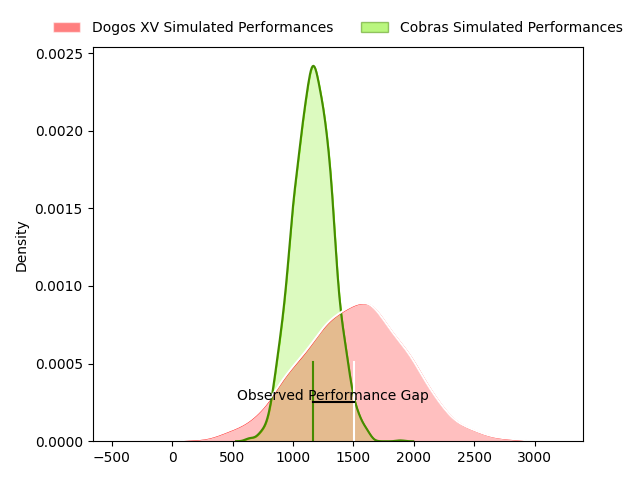
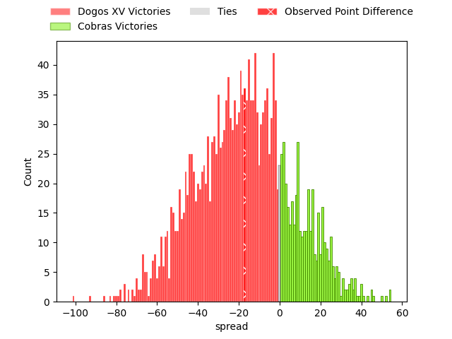
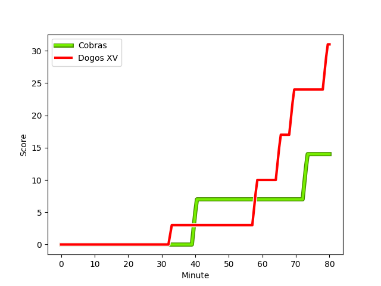
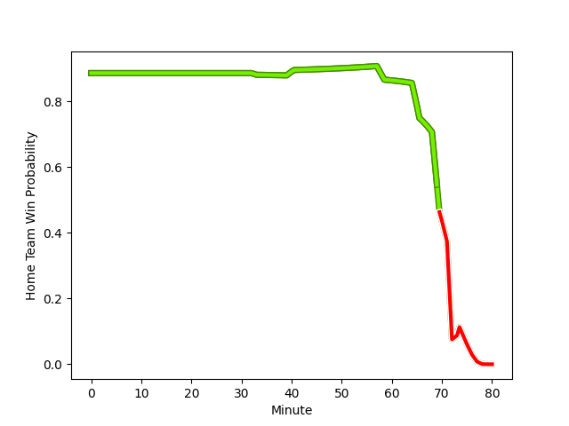

---  
layout: page  
title: Dogos XV at Cobras; 31-14  
date: 2023-02-26 19:00:00 18:00:00 -0500  
categories: match review  
---
# Dogos XV at Cobras; 31-14

# Club Level Predictions

The first set of predictions treats a club as the smallest object, as the club develops its members, organizes a gameplan, and deploys its players as needed for each match. This club model has a prediction of 0.242, which translates to predicting Dogos XV to win by 17.0.

Each club has a rating and a rating deviation (simiar to a Glicko system), and expected performances can be generated. This allows for simulated matches and spreads like the ones below.
## Projected Performances

## Projected Spreads

## Projected Results

# Player Level Predictions

Treating teams instead as an entity made up of the currently active players, I have ratings for each player in an altogether different system. These can be combined to form team ratings once teamsheets are announced, weighting starters a bit higher than the reserves. After the match is played, players can be weighted by their minutes on the field, allowing for an accurate measure of the team's composition. With these compiled team ratings, we can make predictions, measure inaccuracy, and update the individual player ratings.
## Prediction with Player Minutes: Cobras by 93.2

Cobras by 89.2 on a neutral field
## Scores over Time

## Win Probability over Time

There were 11 large changes in win probability in this match
## Prediction without Player Minutes: Cobras by 86.3

Cobras by 82.3 on a neutral pitch

|   Away Minutes | Away Player                                                                      |   Away elo |   Away Percentile |   Number |   Home Percentile |   Home elo | Home Player                                                                             |   Home Minutes |
|---------------:|:---------------------------------------------------------------------------------|-----------:|------------------:|---------:|------------------:|-----------:|:----------------------------------------------------------------------------------------|---------------:|
|             63 | [Santiago Pulella](..//playerfiles//SantiagoPulella_cleaned.md)                  |      62.4  |                 1 |        1 |                40 |      92.23 | [Levy Marinho](..//playerfiles//LevyMarinho_cleaned.md)                                 |             72 |
|             63 | [Santiago Pulella](..//playerfiles//SantiagoPulella_cleaned.md)                  |      62.4  |                11 |        1 |                40 |      92.23 | [Levy Marinho](..//playerfiles//LevyMarinho_cleaned.md)                                 |             72 |
|             63 | [Santiago Pulella](..//playerfiles//SantiagoPulella_cleaned.md)                  |      62.4  |                 1 |        1 |                40 |      92.23 | [Levy Marinho](..//playerfiles//LevyMarinho_cleaned.md)                                 |             80 |
|             63 | [Santiago Pulella](..//playerfiles//SantiagoPulella_cleaned.md)                  |      62.4  |                11 |        1 |                40 |      92.23 | [Levy Marinho](..//playerfiles//LevyMarinho_cleaned.md)                                 |             80 |
|             56 | [Boris Wenger](..//playerfiles//BorisWenger_cleaned.md)                          |      64.33 |                 2 |        2 |                 6 |      74.37 | [Endy Willian](..//playerfiles//EndyWillian_cleaned.md)                                 |             80 |
|             56 | [Boris Wenger](..//playerfiles//BorisWenger_cleaned.md)                          |      64.33 |                 2 |        2 |                 6 |      74.37 | [Endy Willian](..//playerfiles//EndyWillian_cleaned.md)                                 |             47 |
|             50 | [Octavio Filippa](..//playerfiles//OctavioFilippa_cleaned.md)                    |      63.5  |                13 |        3 |                62 |      98.54 | [Henrique Ribeiro Ferreira](..//playerfiles//HenriqueRibeiroFerreira_cleaned.md)        |             80 |
|             50 | [Octavio Filippa](..//playerfiles//OctavioFilippa_cleaned.md)                    |      63.5  |                 1 |        3 |                62 |      98.54 | [Henrique Ribeiro Ferreira](..//playerfiles//HenriqueRibeiroFerreira_cleaned.md)        |             80 |
|             50 | [Octavio Filippa](..//playerfiles//OctavioFilippa_cleaned.md)                    |      63.5  |                13 |        3 |                62 |      98.54 | [Henrique Ribeiro Ferreira](..//playerfiles//HenriqueRibeiroFerreira_cleaned.md)        |             54 |
|             50 | [Octavio Filippa](..//playerfiles//OctavioFilippa_cleaned.md)                    |      63.5  |                 1 |        3 |                62 |      98.54 | [Henrique Ribeiro Ferreira](..//playerfiles//HenriqueRibeiroFerreira_cleaned.md)        |             54 |
|             41 | [Gregorio Hernandez](..//playerfiles//GregorioHernandez_cleaned.md)              |      58.45 |                10 |        4 |                41 |      92.23 | [Lucio Anconetani](..//playerfiles//LucioAnconetani_cleaned.md)                         |             80 |
|             41 | [Gregorio Hernandez](..//playerfiles//GregorioHernandez_cleaned.md)              |      58.45 |                 2 |        4 |                41 |      92.23 | [Lucio Anconetani](..//playerfiles//LucioAnconetani_cleaned.md)                         |             80 |
|             80 | [Franco Molina](..//playerfiles//FrancoMolina_cleaned.md)                        |      76.61 |                10 |        5 |                 5 |      67.81 | [Gabriel Paganini](..//playerfiles//GabrielPaganini_cleaned.md)                         |             80 |
|             80 | [Aitor Bildosola](..//playerfiles//AitorBildosola_cleaned.md)                    |      60.2  |                 2 |        6 |                10 |      76.4  | [Cleber Dias](..//playerfiles//CleberDias_cleaned.md)                                   |             71 |
|             80 | [Aitor Bildosola](..//playerfiles//AitorBildosola_cleaned.md)                    |      60.2  |                 2 |        6 |                10 |      76.4  | [Cleber Dias](..//playerfiles//CleberDias_cleaned.md)                                   |             80 |
|             80 | [Aitor Bildosola](..//playerfiles//AitorBildosola_cleaned.md)                    |      60.2  |                10 |        6 |                10 |      76.4  | [Cleber Dias](..//playerfiles//CleberDias_cleaned.md)                                   |             80 |
|             80 | [Aitor Bildosola](..//playerfiles//AitorBildosola_cleaned.md)                    |      60.2  |                10 |        6 |                10 |      76.4  | [Cleber Dias](..//playerfiles//CleberDias_cleaned.md)                                   |             71 |
|             72 | [Efrain Elias](..//playerfiles//EfrainElias_cleaned.md)                          |      76.61 |                 8 |        7 |                26 |      87.52 | [Matheus Claudio](..//playerfiles//MatheusClaudio_cleaned.md)                           |             68 |
|             72 | [Efrain Elias](..//playerfiles//EfrainElias_cleaned.md)                          |      76.61 |                 8 |        7 |                26 |      87.52 | [Matheus Claudio](..//playerfiles//MatheusClaudio_cleaned.md)                           |             80 |
|             80 | [Ignacio Jose Gandini](..//playerfiles//IgnacioJoseGandini_cleaned.md)           |      59.89 |                 1 |        8 |                27 |      87.86 | [Andre Arruda](..//playerfiles//AndreArruda_cleaned.md)                                 |             73 |
|             80 | [Ignacio Jose Gandini](..//playerfiles//IgnacioJoseGandini_cleaned.md)           |      59.89 |                10 |        8 |                27 |      87.86 | [Andre Arruda](..//playerfiles//AndreArruda_cleaned.md)                                 |             73 |
|             80 | [Ignacio Jose Gandini](..//playerfiles//IgnacioJoseGandini_cleaned.md)           |      59.89 |                 1 |        8 |                27 |      87.86 | [Andre Arruda](..//playerfiles//AndreArruda_cleaned.md)                                 |             80 |
|             80 | [Ignacio Jose Gandini](..//playerfiles//IgnacioJoseGandini_cleaned.md)           |      59.89 |                10 |        8 |                27 |      87.86 | [Andre Arruda](..//playerfiles//AndreArruda_cleaned.md)                                 |             80 |
|             44 | [Juan Cruz Strada](..//playerfiles//JuanCruzStrada_cleaned.md)                   |      67.41 |                 3 |        9 |               nan |      95    | [Facundo Vilalba](..//playerfiles//FacundoVilalba_cleaned.md)                           |             80 |
|             44 | [Juan Cruz Strada](..//playerfiles//JuanCruzStrada_cleaned.md)                   |      67.41 |                23 |        9 |               nan |      95    | [Facundo Vilalba](..//playerfiles//FacundoVilalba_cleaned.md)                           |             80 |
|             44 | [Juan Cruz Strada](..//playerfiles//JuanCruzStrada_cleaned.md)                   |      67.41 |                 3 |        9 |               nan |      95    | [Facundo Vilalba](..//playerfiles//FacundoVilalba_cleaned.md)                           |             59 |
|             44 | [Juan Cruz Strada](..//playerfiles//JuanCruzStrada_cleaned.md)                   |      67.41 |                23 |        9 |               nan |      95    | [Facundo Vilalba](..//playerfiles//FacundoVilalba_cleaned.md)                           |             59 |
|             80 | [Julian Ignacio Hernandez](..//playerfiles//JulianIgnacioHernandez_cleaned.md)   |      81.56 |                20 |       10 |                11 |      79.05 | [Lucas Tranquez](..//playerfiles//LucasTranquez_cleaned.md)                             |             80 |
|             59 | [Ernesto Giudice](..//playerfiles//ErnestoGiudice_cleaned.md)                    |      95    |               nan |       11 |                47 |      93.97 | [Daniel Lima](..//playerfiles//DanielLima_cleaned.md)                                   |             80 |
|             80 | [Leonardo Gea Salim](..//playerfiles//LeonardoGeaSalim_cleaned.md)               |      67.22 |                 4 |       12 |                70 |     101.82 | [Victor Silva](..//playerfiles//VictorSilva_cleaned.md)                                 |             80 |
|             80 | [Leonardo Gea Salim](..//playerfiles//LeonardoGeaSalim_cleaned.md)               |      67.22 |                 4 |       12 |                70 |     101.82 | [Victor Silva](..//playerfiles//VictorSilva_cleaned.md)                                 |             63 |
|             80 | [Faustino Sánchez Valarolo](..//playerfiles//FaustinoSánchezValarolo_cleaned.md) |      89.71 |               nan |       13 |                27 |      87.61 | [Nicolas Cantarutti](..//playerfiles//NicolasCantarutti_cleaned.md)                     |             80 |
|             80 | [Mateo Soler](..//playerfiles//MateoSoler_cleaned.md)                            |      76.61 |                10 |       14 |                37 |      90.57 | [Ariel Rodrigues](..//playerfiles//ArielRodrigues_cleaned.md)                           |             80 |
|             56 | [Franco Giudice](..//playerfiles//FrancoGiudice_cleaned.md)                      |      57.91 |                 2 |       15 |               nan |      72.96 | [Guilherme Coghetto](..//playerfiles//GuilhermeCoghetto_cleaned.md)                     |             80 |
|             56 | [Franco Giudice](..//playerfiles//FrancoGiudice_cleaned.md)                      |      57.91 |                11 |       15 |               nan |      72.96 | [Guilherme Coghetto](..//playerfiles//GuilhermeCoghetto_cleaned.md)                     |             80 |
|             39 | [Juan Bautista Mernes](..//playerfiles//JuanBautistaMernes_cleaned.md)           |      77.36 |                 9 |       16 |                15 |      82.48 | [Leonardo de Souza da Silva](..//playerfiles//LeonardodeSouzadaSilva_cleaned.md)        |             33 |
|             36 | [Agustin Moyano](..//playerfiles//AgustinMoyano_cleaned.md)                      |      85.8  |               nan |       17 |                30 |      89.22 | [Joel Ramirez](..//playerfiles//JoelRamirez_cleaned.md)                                 |             26 |
|             30 | [Ramiro Valdes Iribarren](..//playerfiles//RamiroValdesIribarren_cleaned.md)     |      89.71 |               nan |       18 |                23 |      85.77 | [Douglas Rauth](..//playerfiles//DouglasRauth_cleaned.md)                               |             21 |
|             24 | [Roman Pretz](..//playerfiles//RomanPretz_cleaned.md)                            |      92.01 |               nan |       19 |                10 |      75.23 | [Alain Andres Altahona Fulleda](..//playerfiles//AlainAndresAltahonaFulleda_cleaned.md) |             17 |
|             24 | [Mariano García Ascárate](..//playerfiles//MarianoGarcíaAscárate_cleaned.md)     |      95    |               nan |       20 |               nan |      94.93 | [Ben Donald](..//playerfiles//BenDonald_cleaned.md)                                     |              9 |
|             17 | [Mateo Nunez Miserez](..//playerfiles//MateoNunezMiserez_cleaned.md)             |      91.55 |               nan |       21 |                12 |      81.47 | [Alexandre Alves](..//playerfiles//AlexandreAlves_cleaned.md)                           |              8 |
|              8 | [Federico Albrisi](..//playerfiles//FedericoAlbrisi_cleaned.md)                  |      96.57 |               nan |       22 |                 4 |      69.87 | [Diver Ceballos](..//playerfiles//DiverCeballos_cleaned.md)                             |              7 |
|             21 | [Juan Baronio](..//playerfiles//JuanBaronio_cleaned.md)                          |      95    |               nan |       23 |               nan |      95    | [Donnacha Byrne](..//playerfiles//DonnachaByrne_cleaned.md)                             |             12 |

