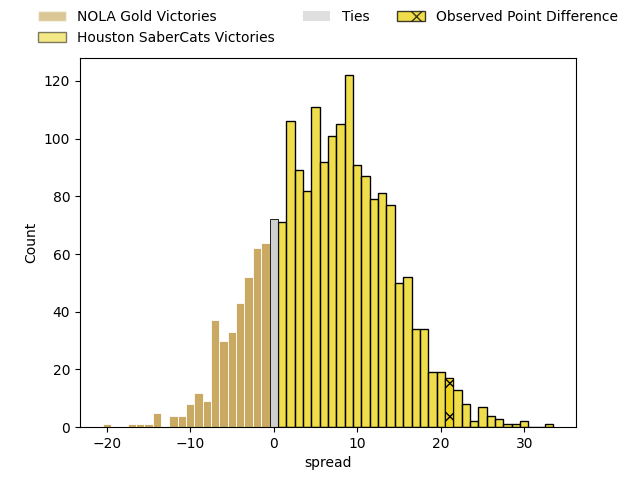
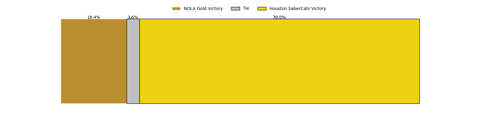
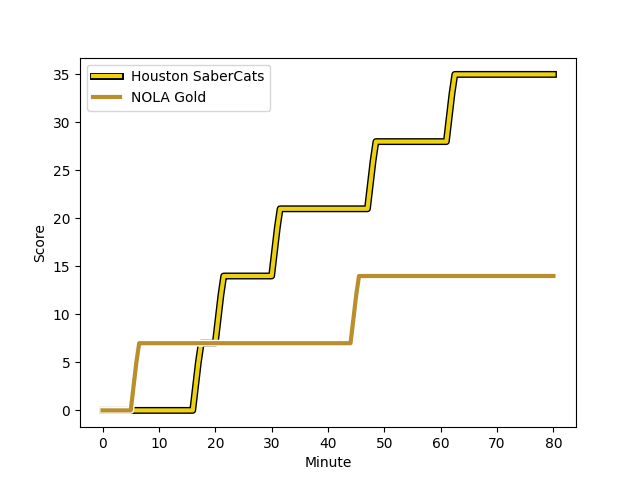
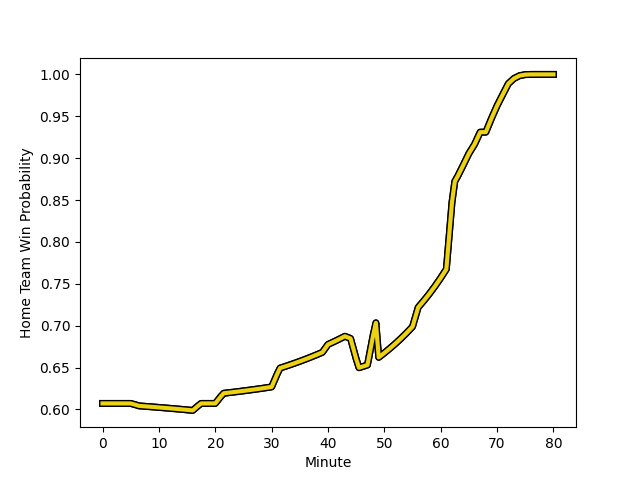

---  
layout: page  
title: NOLA Gold at Houston SaberCats; 14-35  
date: 2023-02-26 03:00:00 18:00:00 -0500  
categories: match review  
---
# NOLA Gold at Houston SaberCats; 14-35

# Club Level Predictions

The first set of predictions treats a club as the smallest object, as the club develops its members, organizes a gameplan, and deploys its players as needed for each match. This club model has a prediction of 0.671, which translates to predicting Houston SaberCats to win by 6.5.

Each club has a rating and a rating deviation (simiar to a Glicko system), and expected performances can be generated. This allows for simulated matches and spreads like the ones below.
## Projected Performances

## Projected Spreads

## Projected Results

# Player Level Predictions

Treating teams instead as an entity made up of the currently active players, I have ratings for each player in an altogether different system. These can be combined to form team ratings once teamsheets are announced, weighting starters a bit higher than the reserves. After the match is played, players can be weighted by their minutes on the field, allowing for an accurate measure of the team's composition. With these compiled team ratings, we can make predictions, measure inaccuracy, and update the individual player ratings.
## Prediction with Player Minutes: Houston SaberCats by 22.9

Houston SaberCats by 18.9 on a neutral field
## Scores over Time

## Win Probability over Time

There were 3 large changes in win probability in this match
## Prediction without Player Minutes: Houston SaberCats by 23.4

Houston SaberCats by 19.4 on a neutral pitch

|   Away Minutes | Away Player                                                                                                 |   Away elo |   Away Percentile |   Number |   Home Percentile |   Home elo | Home Player                                                                              |   Home Minutes |
|---------------:|:------------------------------------------------------------------------------------------------------------|-----------:|------------------:|---------:|------------------:|-----------:|:-----------------------------------------------------------------------------------------|---------------:|
|             44 | [Kevin Sullivan](..//playerfiles//KevinSullivan_cleaned.md)                                                 |      97.07 |                56 |        1 |                72 |     101.42 | [Rob Cobb](..//playerfiles//RobCobb_cleaned.md)                                          |             68 |
|             44 | [Kevin Sullivan](..//playerfiles//KevinSullivan_cleaned.md)                                                 |      97.07 |                89 |        1 |                72 |     101.42 | [Rob Cobb](..//playerfiles//RobCobb_cleaned.md)                                          |             68 |
|             44 | [Pat O'Toole](..//playerfiles//PatO'Toole_cleaned.md)                                                       |      54.24 |                 1 |        2 |                64 |      98.98 | [Axel Zapata](..//playerfiles//AxelZapata_cleaned.md)                                    |             63 |
|             44 | [Pat O'Toole](..//playerfiles//PatO'Toole_cleaned.md)                                                       |      54.24 |                 3 |        2 |                64 |      98.98 | [Axel Zapata](..//playerfiles//AxelZapata_cleaned.md)                                    |             63 |
|             44 | [Dino Waldren](..//playerfiles//DinoWaldren_cleaned.md)                                                     |      89.39 |               nan |        3 |                72 |     101.42 | [Morgan Mitchell](..//playerfiles//MorganMitchell_cleaned.md)                            |             62 |
|             56 | [Billy Stewart](..//playerfiles//BillyStewart_cleaned.md)                                                   |     118.98 |                92 |        4 |                55 |      96.44 | [Siaosi Mahoni](..//playerfiles//SiaosiMahoni_cleaned.md)                                |             49 |
|             56 | [Billy Stewart](..//playerfiles//BillyStewart_cleaned.md)                                                   |     118.98 |                98 |        4 |                55 |      96.44 | [Siaosi Mahoni](..//playerfiles//SiaosiMahoni_cleaned.md)                                |             49 |
|             66 | [Liam Hallam-Eames](..//playerfiles//LiamHallam-Eames_cleaned.md)                                           |      80.98 |                15 |        5 |                 7 |      73.23 | [Nathan Den Hoedt](..//playerfiles//NathanDenHoedt_cleaned.md)                           |             80 |
|             80 | [Moni Tonga'uiha](..//playerfiles//MoniTonga'uiha_cleaned.md)                                               |      19.28 |                 0 |        6 |                71 |     102.66 | [Hanco Germishuys](..//playerfiles//HancoGermishuys_cleaned.md)                          |             80 |
|             80 | [Moni Tonga'uiha](..//playerfiles//MoniTonga'uiha_cleaned.md)                                               |      19.28 |                 0 |        6 |                71 |     102.66 | [Hanco Germishuys](..//playerfiles//HancoGermishuys_cleaned.md)                          |             80 |
|             80 | [Tom Florence](..//playerfiles//TomFlorence_cleaned.md)                                                     |      80.98 |                12 |        7 |                70 |     102.66 | [Danny Barrett](..//playerfiles//DannyBarrett_cleaned.md)                                |             49 |
|             80 | [Cameron Dolan](..//playerfiles//CameronDolan_cleaned.md)                                                   |      80.98 |                13 |        8 |                48 |      94.08 | [Gideon van Wyk](..//playerfiles//GideonvanWyk_cleaned.md)                               |             80 |
|             56 | [Damian Leothon Stevens](..//playerfiles//DamianLeothonStevens_cleaned.md)                                  |      72.39 |                24 |        9 |                34 |      89.92 | [Carlo de Nysschen](..//playerfiles//CarlodeNysschen_cleaned.md)                         |             68 |
|             56 | [Damian Leothon Stevens](..//playerfiles//DamianLeothonStevens_cleaned.md)                                  |      72.39 |                 6 |        9 |                34 |      89.92 | [Carlo de Nysschen](..//playerfiles//CarlodeNysschen_cleaned.md)                         |             68 |
|             62 | [Rodney Iona](..//playerfiles//RodneyIona_cleaned.md)                                                       |      80.98 |                14 |       10 |                 8 |      76.66 | [David Coetzer](..//playerfiles//DavidCoetzer_cleaned.md)                                |             72 |
|             80 | [Dougie Fife](..//playerfiles//DougieFife_cleaned.md)                                                       |      95    |               nan |       11 |               nan |      95    | [Vereniki Tikoisolomone](..//playerfiles//VerenikiTikoisolomone_cleaned.md)              |             68 |
|             80 | [Jordan Jackson-Hope](..//playerfiles//JordanJackson-Hope_cleaned.md)                                       |      80.98 |                13 |       12 |                11 |      78.6  | [Dominic Akina](..//playerfiles//DominicAkina_cleaned.md)                                |             80 |
|             80 | [Philippus Jacobus Snyman (JP) du Plessis](..//playerfiles//PhilippusJacobusSnyman(JP)duPlessis_cleaned.md) |      69.94 |                 5 |       13 |                72 |     102.66 | [Christian Dyer](..//playerfiles//ChristianDyer_cleaned.md)                              |             80 |
|             80 | [Philippus Jacobus Snyman (JP) du Plessis](..//playerfiles//PhilippusJacobusSnyman(JP)duPlessis_cleaned.md) |      69.94 |                18 |       13 |                72 |     102.66 | [Christian Dyer](..//playerfiles//ChristianDyer_cleaned.md)                              |             80 |
|             80 | [Harley Wheeler](..//playerfiles//HarleyWheeler_cleaned.md)                                                 |      93.56 |                47 |       14 |                54 |      96.4  | [Gherardus Jacobus Labuschagne](..//playerfiles//GherardusJacobusLabuschagne_cleaned.md) |             80 |
|             40 | [Jordan Trainor](..//playerfiles//JordanTrainor_cleaned.md)                                                 |      80.98 |                17 |       15 |                69 |     102.66 | [Drew Wild](..//playerfiles//DrewWild_cleaned.md)                                        |             80 |
|             36 | [Matt Harmon](..//playerfiles//MattHarmon_cleaned.md)                                                       |      90.62 |               nan |       16 |                70 |     102.09 | [Alec McDonnell](..//playerfiles//AlecMcDonnell_cleaned.md)                              |             12 |
|             36 | [Eric Howard](..//playerfiles//EricHoward_cleaned.md)                                                       |      91.49 |               nan |       17 |               nan |      96.25 | [Andrew Tuala](..//playerfiles//AndrewTuala_cleaned.md)                                  |             17 |
|             36 | [Jarred Adams](..//playerfiles//JarredAdams_cleaned.md)                                                     |      72.57 |                 5 |       18 |               nan |     103.37 | [Pono Davis](..//playerfiles//PonoDavis_cleaned.md)                                      |             18 |
|             36 | [Jarred Adams](..//playerfiles//JarredAdams_cleaned.md)                                                     |      72.57 |                21 |       18 |               nan |     103.37 | [Pono Davis](..//playerfiles//PonoDavis_cleaned.md)                                      |             18 |
|             24 | [Malcolm May](..//playerfiles//MalcolmMay_cleaned.md)                                                       |      65.47 |                 5 |       19 |                16 |      83.43 | [Marno Redelinghuys](..//playerfiles//MarnoRedelinghuys_cleaned.md)                      |             31 |
|             14 | [Maciu Koroi](..//playerfiles//MaciuKoroi_cleaned.md)                                                       |      97.85 |                70 |       20 |                 0 |      17.96 | [Keni Nasoqeqe](..//playerfiles//KeniNasoqeqe_cleaned.md)                                |             31 |
|             24 | [Luke Campbell](..//playerfiles//LukeCampbell_cleaned.md)                                                   |      89.57 |               nan |       21 |                 0 |      11.24 | [Nick Boyer](..//playerfiles//NickBoyer_cleaned.md)                                      |             12 |
|             18 | [Ross Depperschmidt](..//playerfiles//RossDepperschmidt_cleaned.md)                                         |      40.62 |                 0 |       22 |                98 |     139.42 | [Robert Povey](..//playerfiles//RobertPovey_cleaned.md)                                  |              8 |
|             40 | [Jack Webster](..//playerfiles//JackWebster_cleaned.md)                                                     |      66.74 |                14 |       23 |                14 |      79.68 | [Zach Pangeliman](..//playerfiles//ZachPangeliman_cleaned.md)                            |             12 |
|             40 | [Jack Webster](..//playerfiles//JackWebster_cleaned.md)                                                     |      66.74 |                 4 |       23 |                14 |      79.68 | [Zach Pangeliman](..//playerfiles//ZachPangeliman_cleaned.md)                            |             12 |

