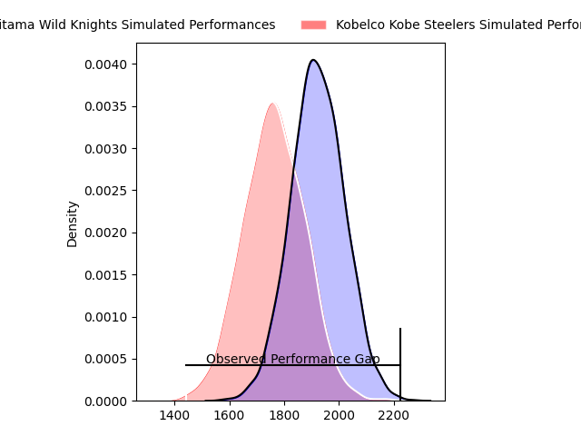
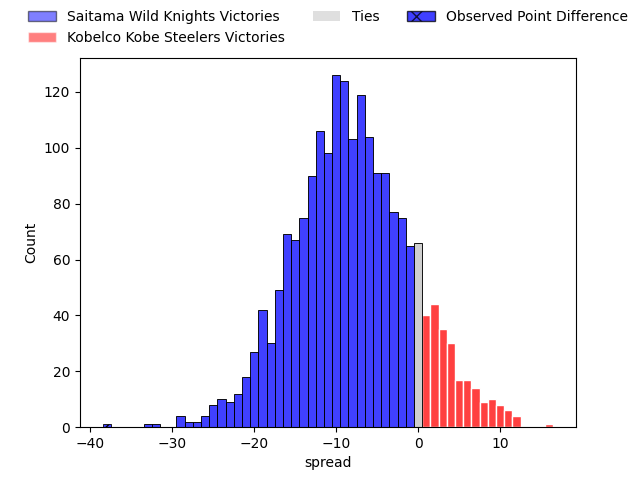
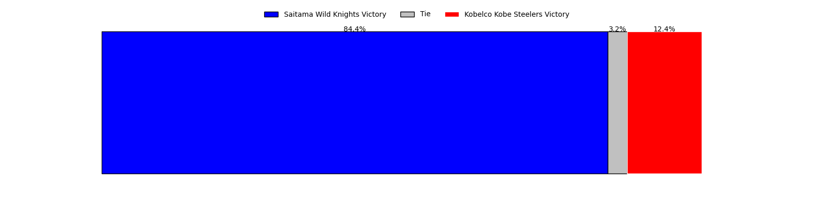
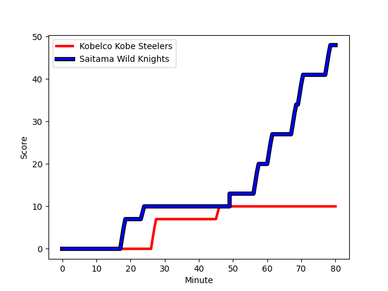
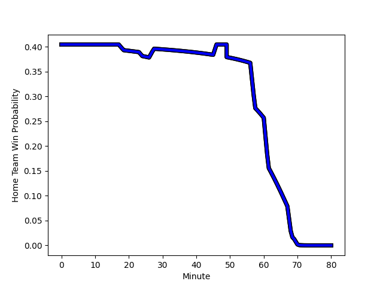

---  
layout: page  
title: Saitama Wild Knights at Kobelco Kobe Steelers; 48-10  
date: 2023-02-26 00:00:00 18:00:00 -0500  
categories: match review  
---
# Saitama Wild Knights at Kobelco Kobe Steelers; 48-10

# Club Level Predictions

The first set of predictions treats a club as the smallest object, as the club develops its members, organizes a gameplan, and deploys its players as needed for each match. This club model has a prediction of 0.291, which translates to predicting Saitama Wild Knights to win by 8.1.

Each club has a rating and a rating deviation (simiar to a Glicko system), and expected performances can be generated. This allows for simulated matches and spreads like the ones below.
## Projected Performances

## Projected Spreads

## Projected Results

# Player Level Predictions

Treating teams instead as an entity made up of the currently active players, I have ratings for each player in an altogether different system. These can be combined to form team ratings once teamsheets are announced, weighting starters a bit higher than the reserves. After the match is played, players can be weighted by their minutes on the field, allowing for an accurate measure of the team's composition. With these compiled team ratings, we can make predictions, measure inaccuracy, and update the individual player ratings.
## Prediction with Player Minutes: Saitama Wild Knights by 12.8

Saitama Wild Knights by 16.8 on a neutral field
## Scores over Time

## Win Probability over Time

There were 6 large changes in win probability in this match
## Prediction without Player Minutes: Saitama Wild Knights by 12.8

Saitama Wild Knights by 16.8 on a neutral pitch

|   Away Minutes | Away Player                                                      |   Away elo |   Away Percentile |   Number |   Home Percentile |   Home elo | Home Player                                                                    |   Home Minutes |
|---------------:|:-----------------------------------------------------------------|-----------:|------------------:|---------:|------------------:|-----------:|:-------------------------------------------------------------------------------|---------------:|
|             80 | [Keita Inagaki](..//playerfiles//KeitaInagaki_cleaned.md)        |     103.23 |                78 |        1 |                90 |     111.8  | [Isileli Nakajima Vakauta](..//playerfiles//IsileliNakajimaVakauta_cleaned.md) |             80 |
|             80 | [Atsushi Sakate](..//playerfiles//AtsushiSakate_cleaned.md)      |     112.84 |                89 |        2 |                55 |      95.45 | [Kenta Matsuoka](..//playerfiles//KentaMatsuoka_cleaned.md)                    |             80 |
|             80 | [Taiki Fujii](..//playerfiles//TaikiFujii_cleaned.md)            |     106.74 |                83 |        3 |                87 |     109.23 | [Sho Maeda](..//playerfiles//ShoMaeda_cleaned.md)                              |             80 |
|             80 | [Liam Mitchell](..//playerfiles//LiamMitchell_cleaned.md)        |     110.68 |                85 |        4 |                30 |      89.83 | [Gerard Cowley-Tuioti](..//playerfiles//GerardCowley-Tuioti_cleaned.md)        |             80 |
|             80 | [Esei Ha'angana](..//playerfiles//EseiHa'angana_cleaned.md)      |     123.86 |                95 |        5 |                19 |      83.44 | [John Dave Schickerling](..//playerfiles//JohnDaveSchickerling_cleaned.md)     |             80 |
|             80 | [Ben Gunter](..//playerfiles//BenGunter_cleaned.md)              |     101.8  |                69 |        6 |                69 |     101.92 | [Amanaki Saumaki](..//playerfiles//AmanakiSaumaki_cleaned.md)                  |             80 |
|             80 | [Lachlan Boshier](..//playerfiles//LachlanBoshier_cleaned.md)    |     102.24 |                70 |        7 |                96 |     129.02 | [Hikaru Hashimoto](..//playerfiles//HikaruHashimoto_cleaned.md)                |             80 |
|             80 | [Jack Cornelsen](..//playerfiles//JackCornelsen_cleaned.md)      |     106.65 |                79 |        8 |                18 |      83.51 | [Marcell Coetzee](..//playerfiles//MarcellCoetzee_cleaned.md)                  |             80 |
|             80 | [Keisuke Uchida](..//playerfiles//KeisukeUchida_cleaned.md)      |     103.41 |                72 |        9 |                22 |      86.22 | [Atsushi Hiwasa](..//playerfiles//AtsushiHiwasa_cleaned.md)                    |             80 |
|             80 | [Rikiya Matsuda](..//playerfiles//RikiyaMatsuda_cleaned.md)      |     108.76 |                81 |       10 |                16 |      83.51 | [Lee Seung Sin](..//playerfiles//LeeSeungSin_cleaned.md)                       |             80 |
|             80 | [Ryuji Noguchi](..//playerfiles//RyujiNoguchi_cleaned.md)        |     122.37 |                94 |       11 |                94 |     119.58 | [Shinsuke Iseki](..//playerfiles//ShinsukeIseki_cleaned.md)                    |             80 |
|             80 | [Damian de Allende](..//playerfiles//DamiandeAllende_cleaned.md) |     103.31 |                72 |       12 |                72 |     102.51 | [Richard Buckman](..//playerfiles//RichardBuckman_cleaned.md)                  |             80 |
|             80 | [Dylan Riley](..//playerfiles//DylanRiley_cleaned.md)            |     113.66 |                88 |       13 |                57 |      97.23 | [Junta Hamano](..//playerfiles//JuntaHamano_cleaned.md)                        |             80 |
|             80 | [Tatsuhiro Tanji](..//playerfiles//TatsuhiroTanji_cleaned.md)    |      98.09 |                59 |       14 |                30 |      88.5  | [Ataata Moeakiola](..//playerfiles//AtaataMoeakiola_cleaned.md)                |             80 |
|             80 | [Takuya Yamasawa](..//playerfiles//TakuyaYamasawa_cleaned.md)    |     115.18 |                88 |       15 |                23 |      83.51 | [Ryohei Yamanaka](..//playerfiles//RyoheiYamanaka_cleaned.md)                  |             80 |

