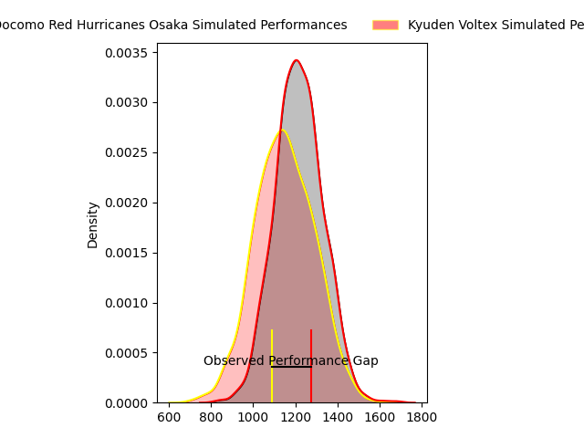
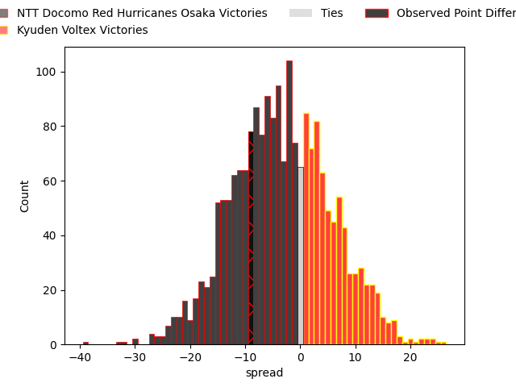
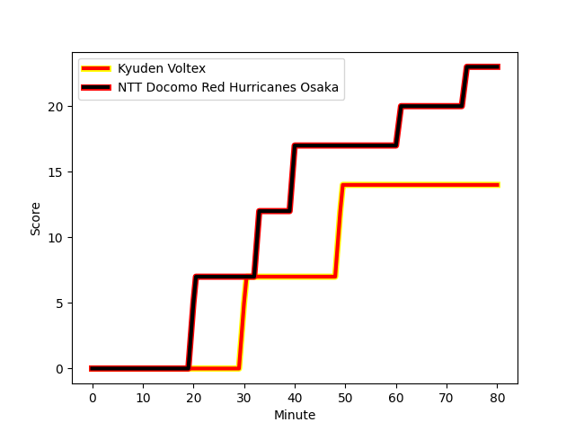
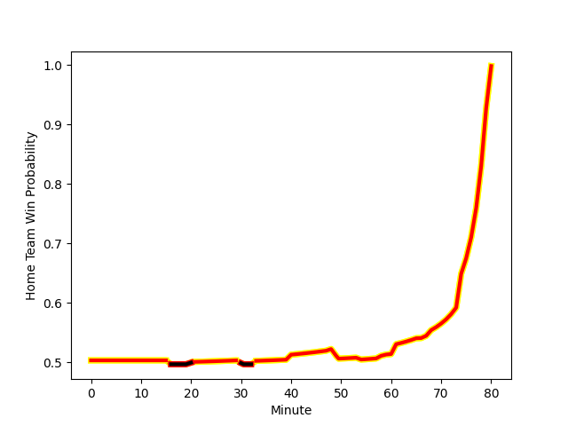

---  
layout: page  
title: NTT Docomo Red Hurricanes Osaka at Kyuden Voltex; 23-14  
date: 2023-02-26 00:00:00 18:00:00 -0500  
categories: match review  
---
# NTT Docomo Red Hurricanes Osaka at Kyuden Voltex; 23-14

# Club Level Predictions

The first set of predictions treats a club as the smallest object, as the club develops its members, organizes a gameplan, and deploys its players as needed for each match. This club model has a prediction of 0.413, which translates to predicting NTT Docomo Red Hurricanes Osaka to win by 3.3.

Each club has a rating and a rating deviation (simiar to a Glicko system), and expected performances can be generated. This allows for simulated matches and spreads like the ones below.
## Projected Performances

## Projected Spreads

## Projected Results

# Player Level Predictions

Treating teams instead as an entity made up of the currently active players, I have ratings for each player in an altogether different system. These can be combined to form team ratings once teamsheets are announced, weighting starters a bit higher than the reserves. After the match is played, players can be weighted by their minutes on the field, allowing for an accurate measure of the team's composition. With these compiled team ratings, we can make predictions, measure inaccuracy, and update the individual player ratings.
## Prediction with Player Minutes: Kyuden Voltex by 4.6

Kyuden Voltex by 0.6 on a neutral field
## Scores over Time

## Win Probability over Time

There were 7 large changes in win probability in this match
## Prediction without Player Minutes: Kyuden Voltex by 3.5

NTT Docomo Red Hurricanes Osaka by 0.5 on a neutral pitch

|   Away Minutes | Away Player                                                             |   Away elo |   Away Percentile |   Number |   Home Percentile |   Home elo | Home Player                                                                |   Home Minutes |
|---------------:|:------------------------------------------------------------------------|-----------:|------------------:|---------:|------------------:|-----------:|:---------------------------------------------------------------------------|---------------:|
|             58 | [Yosuke Nishiura](..//playerfiles//YosukeNishiura_cleaned.md)           |      79.32 |                10 |        1 |                74 |     101.59 | [Samuel Nozomu Faialaga](..//playerfiles//SamuelNozomuFaialaga_cleaned.md) |             54 |
|             79 | [Hisamitsu Shimada](..//playerfiles//HisamitsuShimada_cleaned.md)       |      95.01 |                53 |        2 |                53 |      95.18 | [Daigo Asato](..//playerfiles//DaigoAsato_cleaned.md)                      |             59 |
|             58 | [Munekata Sashida](..//playerfiles//MunekataSashida_cleaned.md)         |      86.45 |                20 |        3 |                35 |      90.95 | [Yasuo Saruwatari](..//playerfiles//YasuoSaruwatari_cleaned.md)            |             54 |
|             80 | [Willie Britz](..//playerfiles//WillieBritz_cleaned.md)                 |      96.85 |                57 |        4 |                72 |     103.36 | [Tomotaka Ishimatsu](..//playerfiles//TomotakaIshimatsu_cleaned.md)        |             68 |
|             66 | [Tom Jeffries](..//playerfiles//TomJeffries_cleaned.md)                 |     102.86 |                70 |        5 |                50 |      94.97 | [Tom Rowe](..//playerfiles//TomRowe_cleaned.md)                            |             80 |
|             80 | [Toru Sugishita](..//playerfiles//ToruSugishita_cleaned.md)             |      74.59 |                 6 |        6 |                19 |      85.07 | [Michiro Takai](..//playerfiles//MichiroTakai_cleaned.md)                  |             80 |
|             74 | [Taro Sato](..//playerfiles//TaroSato_cleaned.md)                       |     116.42 |                91 |        7 |                92 |     118.3  | [Colby Fainga'a](..//playerfiles//ColbyFainga'a_cleaned.md)                |             68 |
|             80 | [Colin Bourke](..//playerfiles//ColinBourke_cleaned.md)                 |      96.35 |                51 |        8 |                55 |      97.74 | [Walker Alex Takuya](..//playerfiles//WalkerAlexTakuya_cleaned.md)         |             80 |
|             61 | [Toshihiro Yamamouchi](..//playerfiles//ToshihiroYamamouchi_cleaned.md) |      98.1  |                60 |        9 |                51 |      95.14 | [Shunta Takenouchi](..//playerfiles//ShuntaTakenouchi_cleaned.md)          |             54 |
|             66 | [Ei Kawamuko](..//playerfiles//EiKawamuko_cleaned.md)                   |      82.05 |                14 |       10 |                49 |      95.98 | [Phil Burleigh](..//playerfiles//PhilBurleigh_cleaned.md)                  |             80 |
|             80 | [Masaki Kobayashi](..//playerfiles//MasakiKobayashi_cleaned.md)         |     110.03 |                85 |       11 |                23 |      86.43 | [Ren Hagiwara](..//playerfiles//RenHagiwara_cleaned.md)                    |             80 |
|             74 | [Mifiposeti Paea](..//playerfiles//MifiposetiPaea_cleaned.md)           |     100.63 |                67 |       12 |                52 |      95.63 | [Sam Vaka](..//playerfiles//SamVaka_cleaned.md)                            |             80 |
|             80 | [Benjamin Saunders](..//playerfiles//BenjaminSaunders_cleaned.md)       |     129.81 |                97 |       13 |               nan |      66.41 | [Kenji Hayata](..//playerfiles//KenjiHayata_cleaned.md)                    |             16 |
|             80 | [Ryo Tsuruda](..//playerfiles//RyoTsuruda_cleaned.md)                   |     124.81 |                95 |       14 |                76 |     104.83 | [Yasunari Isoda](..//playerfiles//YasunariIsoda_cleaned.md)                |             80 |
|             80 | [Taichi Yoshizawa](..//playerfiles//TaichiYoshizawa_cleaned.md)         |      66.25 |                 6 |       15 |                77 |     106.98 | [Yusuke Aramaki](..//playerfiles//YusukeAramaki_cleaned.md)                |             48 |
|             22 | [Shosuke Fukasawa](..//playerfiles//ShosukeFukasawa_cleaned.md)         |      90.41 |                28 |       16 |                78 |     105.93 | [Kichi Uezato](..//playerfiles//KichiUezato_cleaned.md)                    |             64 |
|             22 | [Yuichiro Hosono](..//playerfiles//YuichiroHosono_cleaned.md)           |      97.8  |               nan |       17 |               nan |      96.93 | [Akihito Yamada](..//playerfiles//AkihitoYamada_cleaned.md)                |             32 |
|             19 | [Kenta Komura](..//playerfiles//KentaKomura_cleaned.md)                 |     101.65 |                68 |       18 |               nan |     125.92 | [Kazuto Tokunaga](..//playerfiles//KazutoTokunaga_cleaned.md)              |             26 |
|             14 | [Tatsunari Fujita](..//playerfiles//TatsunariFujita_cleaned.md)         |      70.69 |                 6 |       19 |                62 |      99.48 | [Shinpei Kamata](..//playerfiles//ShinpeiKamata_cleaned.md)                |             26 |
|             14 | [Oh Ryong Tee](..//playerfiles//OhRyongTee_cleaned.md)                  |      96.3  |               nan |       20 |                19 |      84.2  | [Daisuke Kodama](..//playerfiles//DaisukeKodama_cleaned.md)                |             26 |
|              6 | [Tsukasa Yasuda](..//playerfiles//TsukasaYasuda_cleaned.md)             |      87.26 |                26 |       21 |               nan |      87.24 | [Genki Nakamura](..//playerfiles//GenkiNakamura_cleaned.md)                |             21 |
|              6 | [Daisuke Iba](..//playerfiles//DaisukeIba_cleaned.md)                   |      89.26 |               nan |       22 |                34 |      90.02 | [Ray Tatafu](..//playerfiles//RayTatafu_cleaned.md)                        |             12 |
|              1 | [Mitsumasa Harayama](..//playerfiles//MitsumasaHarayama_cleaned.md)     |     100.61 |                72 |       23 |                66 |      99.99 | [Yuuki Yamada](..//playerfiles//YuukiYamada_cleaned.md)                    |             12 |

