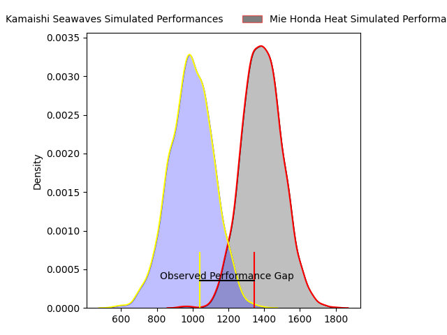
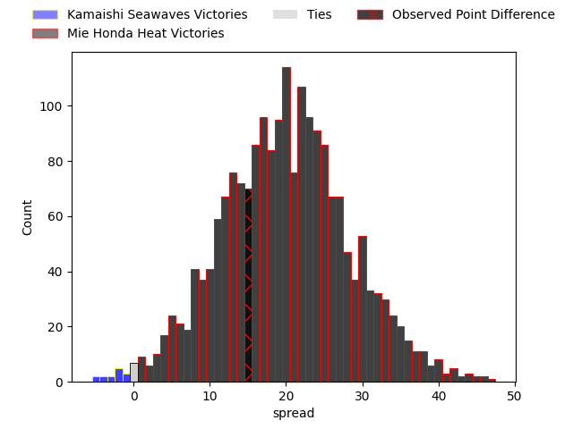
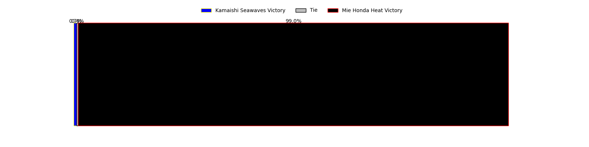
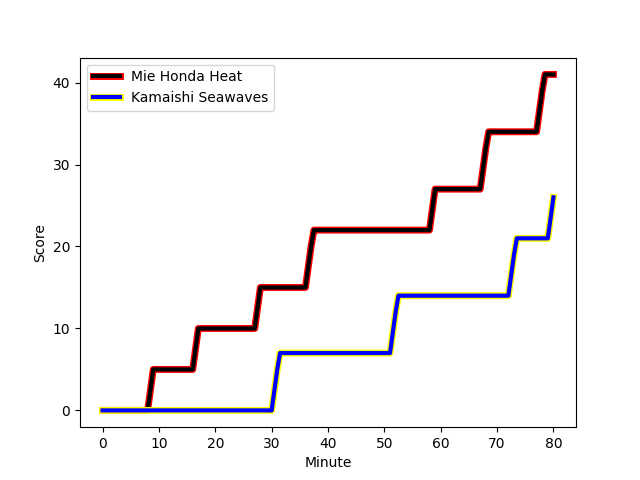
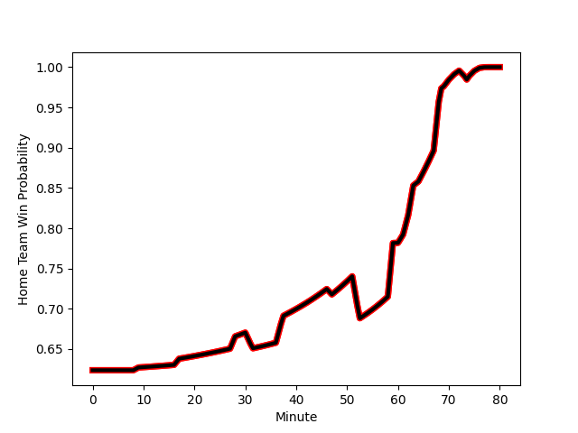

---  
layout: page  
title: Kamaishi Seawaves at Mie Honda Heat; 26-41  
date: 2023-02-26 00:00:00 18:00:00 -0500  
categories: match review  
---
# Kamaishi Seawaves at Mie Honda Heat; 26-41

# Club Level Predictions

The first set of predictions treats a club as the smallest object, as the club develops its members, organizes a gameplan, and deploys its players as needed for each match. This club model has a prediction of 0.892, which translates to predicting Mie Honda Heat to win by 19.7.

Each club has a rating and a rating deviation (simiar to a Glicko system), and expected performances can be generated. This allows for simulated matches and spreads like the ones below.
## Projected Performances

## Projected Spreads

## Projected Results

# Player Level Predictions

Treating teams instead as an entity made up of the currently active players, I have ratings for each player in an altogether different system. These can be combined to form team ratings once teamsheets are announced, weighting starters a bit higher than the reserves. After the match is played, players can be weighted by their minutes on the field, allowing for an accurate measure of the team's composition. With these compiled team ratings, we can make predictions, measure inaccuracy, and update the individual player ratings.
## Prediction with Player Minutes: Mie Honda Heat by 26.0

Mie Honda Heat by 22.0 on a neutral field
## Scores over Time

## Win Probability over Time

There were 4 large changes in win probability in this match
## Prediction without Player Minutes: Mie Honda Heat by 27.0

Mie Honda Heat by 23.0 on a neutral pitch

|   Away Minutes | Away Player                                                              |   Away elo |   Away Percentile |   Number |   Home Percentile |   Home elo | Home Player                                                              |   Home Minutes |
|---------------:|:-------------------------------------------------------------------------|-----------:|------------------:|---------:|------------------:|-----------:|:-------------------------------------------------------------------------|---------------:|
|             74 | [Takuya Takahashi](..//playerfiles//TakuyaTakahashi_cleaned.md)          |      78.81 |                10 |        1 |               nan |      70.47 | [Takumi Fuji](..//playerfiles//TakumiFuji_cleaned.md)                    |             63 |
|             64 | [Daiki Ito](..//playerfiles//DaikiIto_cleaned.md)                        |      72.42 |                 6 |        2 |                49 |      97.14 | [Lee Seung Hyok](..//playerfiles//LeeSeungHyok_cleaned.md)               |             63 |
|             64 | [Taiki Noguchi](..//playerfiles//TaikiNoguchi_cleaned.md)                |      94    |                56 |        3 |                66 |      99.94 | [Taiki Yoshioka](..//playerfiles//TaikiYoshioka_cleaned.md)              |             60 |
|             47 | [Sergio Moreira](..//playerfiles//SergioMoreira_cleaned.md)              |      92.71 |                42 |        4 |                 4 |      69.85 | [Viliami Afu Kaipouli](..//playerfiles//ViliamiAfuKaipouli_cleaned.md)   |             80 |
|             80 | [Ben Nee Nee](..//playerfiles//BenNeeNee_cleaned.md)                     |      85.82 |                23 |        5 |                79 |     106.57 | [Francois John Mostert](..//playerfiles//FrancoisJohnMostert_cleaned.md) |             60 |
|             80 | [Ryota Kano](..//playerfiles//RyotaKano_cleaned.md)                      |      79.77 |                12 |        6 |                31 |      89.05 | [Ryota Kobayashi](..//playerfiles//RyotaKobayashi_cleaned.md)            |             80 |
|             62 | [Daisuke Musya](..//playerfiles//DaisukeMusya_cleaned.md)                |      82.63 |                14 |        7 |                38 |      90.86 | [Ryo Furuta](..//playerfiles//RyoFuruta_cleaned.md)                      |             80 |
|             80 | [Sam Henwood](..//playerfiles//SamHenwood_cleaned.md)                    |      96.37 |                52 |        8 |                79 |     107.31 | [Pablo Matera](..//playerfiles//PabloMatera_cleaned.md)                  |             60 |
|             69 | [Youhei Murakami](..//playerfiles//YouheiMurakami_cleaned.md)            |      68.8  |                 4 |        9 |                56 |      97.31 | [Kenta Yamaji](..//playerfiles//KentaYamaji_cleaned.md)                  |             69 |
|             47 | [Ryoma Nakamura](..//playerfiles//RyomaNakamura_cleaned.md)              |      54.61 |                 1 |       10 |                70 |     102.56 | [Kaleb Trask](..//playerfiles//KalebTrask_cleaned.md)                    |             69 |
|             75 | [Kodai Ono](..//playerfiles//KodaiOno_cleaned.md)                        |      64.88 |                 4 |       11 |                93 |     118.99 | [Naoki Motomura](..//playerfiles//NaokiMotomura_cleaned.md)              |             80 |
|             80 | [Osuka Lloyd Murata](..//playerfiles//OsukaLloydMurata_cleaned.md)       |      72.41 |                 6 |       12 |                69 |     101.85 | [Fraser Quirk](..//playerfiles//FraserQuirk_cleaned.md)                  |             69 |
|             80 | [Kohei Ishigaki](..//playerfiles//KoheiIshigaki_cleaned.md)              |     104.27 |                76 |       13 |                13 |      81.08 | [Clinton Knox](..//playerfiles//ClintonKnox_cleaned.md)                  |             80 |
|             80 | [Ryuji Abe](..//playerfiles//RyujiAbe_cleaned.md)                        |      87.49 |                25 |       14 |                80 |     106.7  | [Yoshizaku Fujita](..//playerfiles//YoshizakuFujita_cleaned.md)          |             80 |
|             80 | [Cameron Bailey](..//playerfiles//CameronBailey_cleaned.md)              |      88.75 |                33 |       15 |                73 |     105.26 | [Thomas Banks](..//playerfiles//ThomasBanks_cleaned.md)                  |             80 |
|             33 | [Dallas Tatana](..//playerfiles//DallasTatana_cleaned.md)                |      84.49 |                27 |       16 |               nan |     103.55 | [Masaki Kondo](..//playerfiles//MasakiKondo_cleaned.md)                  |             20 |
|             33 | [Joshua Trevor Stander](..//playerfiles//JoshuaTrevorStander_cleaned.md) |      87.06 |                27 |       17 |                36 |      93    | [Matthys Basson](..//playerfiles//MatthysBasson_cleaned.md)              |             20 |
|             16 | [Kota Kumamoto](..//playerfiles//KotaKumamoto_cleaned.md)                |      98.42 |                62 |       18 |               nan |      95    | [Justin Downey](..//playerfiles//JustinDowney_cleaned.md)                |             20 |
|             16 | [Shun Terawaki](..//playerfiles//ShunTerawaki_cleaned.md)                |      87.03 |                22 |       19 |                38 |      91.95 | [Tatsuhiko Tsurukawa](..//playerfiles//TatsuhikoTsurukawa_cleaned.md)    |             17 |
|             11 | [Takumi Tokairin](..//playerfiles//TakumiTokairin_cleaned.md)            |      95    |               nan |       20 |                99 |     148.62 | [Tateo Kanai](..//playerfiles//TateoKanai_cleaned.md)                    |             17 |
|             18 | [Yuta Nakano](..//playerfiles//YutaNakano_cleaned.md)                    |      48.99 |                 1 |       21 |                51 |      96.89 | [Kanta Watanabe](..//playerfiles//KantaWatanabe_cleaned.md)              |             11 |
|              6 | [Shoichiro Inada](..//playerfiles//ShoichiroInada_cleaned.md)            |      84.4  |                17 |       22 |                36 |      96.25 | [Shogo Nezuka](..//playerfiles//ShogoNezuka_cleaned.md)                  |             11 |
|              5 | [Ryo Kataoka](..//playerfiles//RyoKataoka_cleaned.md)                    |      96.06 |                53 |       23 |                86 |     112.84 | [Gwangtee Oh](..//playerfiles//GwangteeOh_cleaned.md)                    |             11 |

