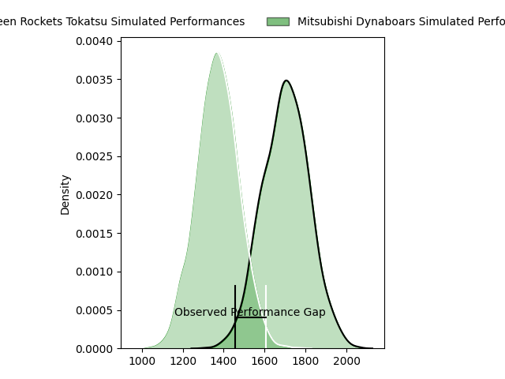
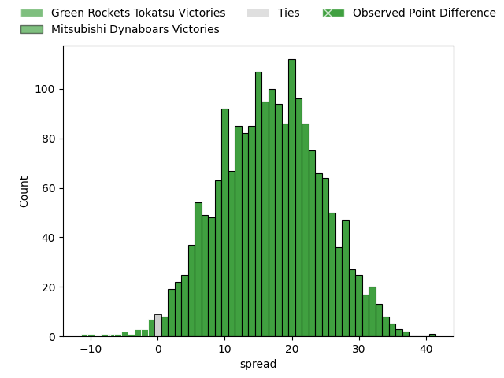
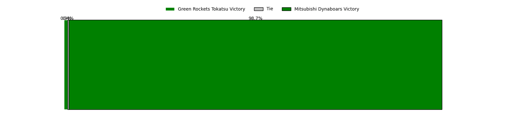
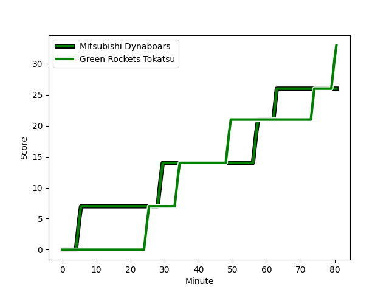
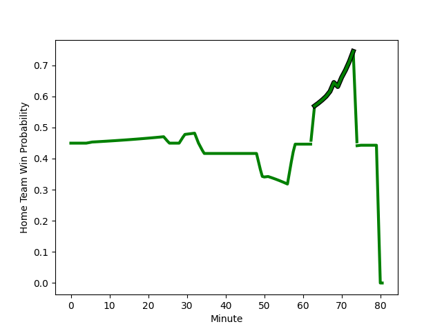

---  
layout: page  
title: Green Rockets Tokatsu at Mitsubishi Dynaboars; 33-26  
date: 2023-02-26 00:00:00 18:00:00 -0500  
categories: match review  
---
# Green Rockets Tokatsu at Mitsubishi Dynaboars; 33-26

# Club Level Predictions

The first set of predictions treats a club as the smallest object, as the club develops its members, organizes a gameplan, and deploys its players as needed for each match. This club model has a prediction of 0.862, which translates to predicting Mitsubishi Dynaboars to win by 16.8.

Each club has a rating and a rating deviation (simiar to a Glicko system), and expected performances can be generated. This allows for simulated matches and spreads like the ones below.
## Projected Performances

## Projected Spreads

## Projected Results

# Player Level Predictions

Treating teams instead as an entity made up of the currently active players, I have ratings for each player in an altogether different system. These can be combined to form team ratings once teamsheets are announced, weighting starters a bit higher than the reserves. After the match is played, players can be weighted by their minutes on the field, allowing for an accurate measure of the team's composition. With these compiled team ratings, we can make predictions, measure inaccuracy, and update the individual player ratings.
## Prediction with Player Minutes: Green Rockets Tokatsu by 4.8

Green Rockets Tokatsu by 8.8 on a neutral field
## Scores over Time

## Win Probability over Time

There were 11 large changes in win probability in this match
## Prediction without Player Minutes: Green Rockets Tokatsu by 4.7

Green Rockets Tokatsu by 8.7 on a neutral pitch

|   Away Minutes | Away Player                                                   |   Away elo |   Away Percentile |   Number |   Home Percentile |   Home elo | Home Player                                                                 |   Home Minutes |
|---------------:|:--------------------------------------------------------------|-----------:|------------------:|---------:|------------------:|-----------:|:----------------------------------------------------------------------------|---------------:|
|             58 | [Suguru Kubo](..//playerfiles//SuguruKubo_cleaned.md)         |      94.55 |                49 |        1 |                 8 |      77.31 | [Hayato Hosoda](..//playerfiles//HayatoHosoda_cleaned.md)                   |             51 |
|             58 | [Yo Sato](..//playerfiles//YoSato_cleaned.md)                 |      73.42 |                 4 |        2 |                 7 |      75.97 | [Yuki Miyazato](..//playerfiles//YukiMiyazato_cleaned.md)                   |             68 |
|             58 | [Satoshi Ueda](..//playerfiles//SatoshiUeda_cleaned.md)       |     122.03 |                96 |        3 |                99 |     138.01 | [Tomoaki Ishii](..//playerfiles//TomoakiIshii_cleaned.md)                   |             33 |
|             80 | [Daiki Yamagiwa](..//playerfiles//DaikiYamagiwa_cleaned.md)   |      75.75 |                 9 |        4 |                15 |      81.56 | [Daniel Linde](..//playerfiles//DanielLinde_cleaned.md)                     |             80 |
|             80 | [Luke Porter](..//playerfiles//LukePorter_cleaned.md)         |      83.15 |                16 |        5 |                14 |      80.06 | [Walt Steenkamp](..//playerfiles//WaltSteenkamp_cleaned.md)                 |             75 |
|             69 | [Wheetu Douglas](..//playerfiles//WheetuDouglas_cleaned.md)   |      84.91 |                19 |        6 |                82 |     108.43 | [Masataka Tsuruya](..//playerfiles//MasatakaTsuruya_cleaned.md)             |             80 |
|             69 | [Ryoi Kamei](..//playerfiles//RyoiKamei_cleaned.md)           |      56.69 |                 2 |        7 |                 8 |      77.48 | [Yusuke Sakamoto](..//playerfiles//YusukeSakamoto_cleaned.md)               |             80 |
|             80 | [Aseri Masivou](..//playerfiles//AseriMasivou_cleaned.md)     |     109.55 |                84 |        8 |                15 |      82.1  | [Jackson Hemopo](..//playerfiles//JacksonHemopo_cleaned.md)                 |             80 |
|             80 | [Nicholas Phipps](..//playerfiles//NicholasPhipps_cleaned.md) |      91.17 |                38 |        9 |                50 |      94.78 | [Kota Iwamura](..//playerfiles//KotaIwamura_cleaned.md)                     |             80 |
|             80 | [Taisetsu Kanai](..//playerfiles//TaisetsuKanai_cleaned.md)   |      97.37 |                55 |       10 |                 6 |      64.91 | [Jamie Shillcock](..//playerfiles//JamieShillcock_cleaned.md)               |             80 |
|             80 | [Kenta Omata](..//playerfiles//KentaOmata_cleaned.md)         |     107.26 |                81 |       11 |                69 |     101.62 | [Nozomi Nara](..//playerfiles//NozomiNara_cleaned.md)                       |             80 |
|             80 | [Christian Laui](..//playerfiles//ChristianLaui_cleaned.md)   |      92.64 |                43 |       12 |                11 |      78.01 | [Brackin Karauria-Henry](..//playerfiles//BrackinKarauria-Henry_cleaned.md) |             80 |
|             58 | [Maritino Nemani](..//playerfiles//MaritinoNemani_cleaned.md) |     102.62 |                72 |       13 |                22 |      85.45 | [Curtis Rona](..//playerfiles//CurtisRona_cleaned.md)                       |             67 |
|             70 | [Yuma Sugimoto](..//playerfiles//YumaSugimoto_cleaned.md)     |     102.72 |                72 |       14 |                26 |      87.71 | [Jonmoon Han](..//playerfiles//JonmoonHan_cleaned.md)                       |             68 |
|             80 | [Lomano Lemeki](..//playerfiles//LomanoLemeki_cleaned.md)     |      88.1  |                31 |       15 |                10 |      76.57 | [Roland Alaiasa](..//playerfiles//RolandAlaiasa_cleaned.md)                 |             80 |
|             22 | [Taku Toma](..//playerfiles//TakuToma_cleaned.md)             |      93.6  |                22 |       16 |                41 |      90.24 | [Mototsugu Hachiya](..//playerfiles//MototsuguHachiya_cleaned.md)           |             47 |
|             22 | [Tim Bennetts](..//playerfiles//TimBennetts_cleaned.md)       |      88.22 |                29 |       17 |                29 |      85.79 | [Shunsuke Sakamoto](..//playerfiles//ShunsukeSakamoto_cleaned.md)           |             29 |
|             22 | [Ash Dixon](..//playerfiles//AshDixon_cleaned.md)             |      88.6  |                34 |       18 |                30 |      89.41 | [Matt To'omua](..//playerfiles//MattTo'omua_cleaned.md)                     |             13 |
|             22 | [Sunao Takizawa](..//playerfiles//SunaoTakizawa_cleaned.md)   |      87.58 |                20 |       19 |                47 |      91.38 | [Yoshimitsu Yasue](..//playerfiles//YoshimitsuYasue_cleaned.md)             |             12 |
|             11 | [Yoshida Hosoda](..//playerfiles//YoshidaHosoda_cleaned.md)   |      94.38 |                50 |       20 |                46 |      93.28 | [Kazuki Ishida](..//playerfiles//KazukiIshida_cleaned.md)                   |             12 |
|             11 | [Ren Osawa](..//playerfiles//RenOsawa_cleaned.md)             |      93.11 |               nan |       21 |                16 |      82.15 | [Epineri Uluviti](..//playerfiles//EpineriUluviti_cleaned.md)               |              5 |
|             10 | [Tom Marshall](..//playerfiles//TomMarshall_cleaned.md)       |      88.86 |                34 |       22 |               nan |     nan    | nan                                                                         |            nan |

