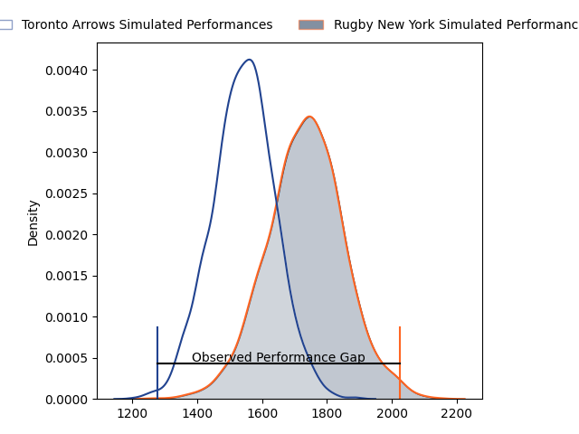
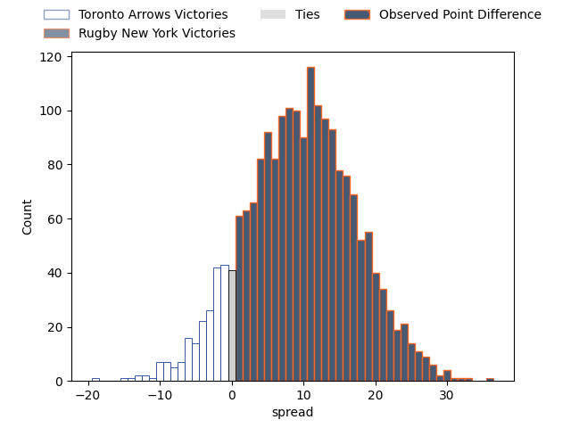
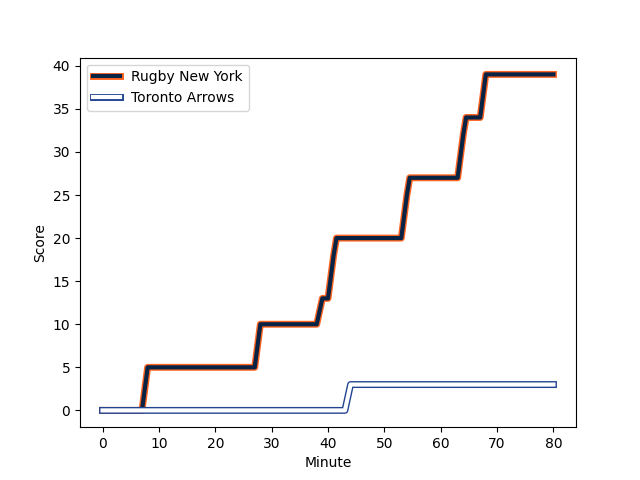
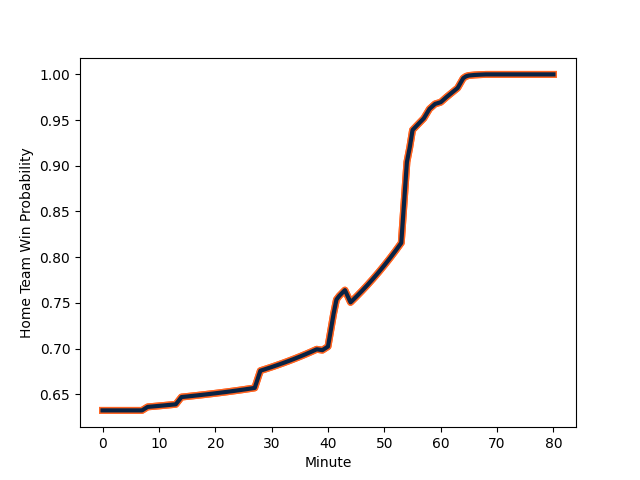

---  
layout: page  
title: Toronto Arrows at Rugby New York; 3-39  
date: 2023-02-26 21:00:00 18:00:00 -0500  
categories: match review  
---
# Toronto Arrows at Rugby New York; 3-39

# Club Level Predictions

The first set of predictions treats a club as the smallest object, as the club develops its members, organizes a gameplan, and deploys its players as needed for each match. This club model has a prediction of 0.737, which translates to predicting Rugby New York to win by 9.4.

Each club has a rating and a rating deviation (simiar to a Glicko system), and expected performances can be generated. This allows for simulated matches and spreads like the ones below.
## Projected Performances

## Projected Spreads

## Projected Results

# Player Level Predictions

Treating teams instead as an entity made up of the currently active players, I have ratings for each player in an altogether different system. These can be combined to form team ratings once teamsheets are announced, weighting starters a bit higher than the reserves. After the match is played, players can be weighted by their minutes on the field, allowing for an accurate measure of the team's composition. With these compiled team ratings, we can make predictions, measure inaccuracy, and update the individual player ratings.
## Prediction with Player Minutes: Rugby New York by 27.4

Rugby New York by 23.4 on a neutral field
## Scores over Time

## Win Probability over Time

There were 2 large changes in win probability in this match
## Prediction without Player Minutes: Rugby New York by 26.6

Rugby New York by 22.6 on a neutral pitch

|   Away Minutes | Away Player                                                               |   Away elo |   Away Percentile |   Number |   Home Percentile |   Home elo | Home Player                                                       |   Home Minutes |
|---------------:|:--------------------------------------------------------------------------|-----------:|------------------:|---------:|------------------:|-----------:|:------------------------------------------------------------------|---------------:|
|             80 | [Conan O'Donnell](..//playerfiles//ConanO'Donnell_cleaned.md)             |      83.23 |                31 |        1 |                29 |      89.49 | [Chance Wenglewski](..//playerfiles//ChanceWenglewski_cleaned.md) |             54 |
|             80 | [Conan O'Donnell](..//playerfiles//ConanO'Donnell_cleaned.md)             |      83.23 |                15 |        1 |                29 |      89.49 | [Chance Wenglewski](..//playerfiles//ChanceWenglewski_cleaned.md) |             54 |
|             42 | [Gene Syminton](..//playerfiles//GeneSyminton_cleaned.md)                 |      82.82 |                31 |        2 |                33 |      89.82 | [Dylan Fawsitt](..//playerfiles//DylanFawsitt_cleaned.md)         |             54 |
|             42 | [Gene Syminton](..//playerfiles//GeneSyminton_cleaned.md)                 |      82.82 |                15 |        2 |                33 |      89.82 | [Dylan Fawsitt](..//playerfiles//DylanFawsitt_cleaned.md)         |             54 |
|             39 | [Isaac Salmon](..//playerfiles//IsaacSalmon_cleaned.md)                   |      82.65 |                29 |        3 |                35 |      91.13 | [Nic Mayhew](..//playerfiles//NicMayhew_cleaned.md)               |             44 |
|             39 | [Isaac Salmon](..//playerfiles//IsaacSalmon_cleaned.md)                   |      82.65 |                14 |        3 |                35 |      91.13 | [Nic Mayhew](..//playerfiles//NicMayhew_cleaned.md)               |             44 |
|             80 | [Mason Flesch](..//playerfiles//MasonFlesch_cleaned.md)                   |       9.6  |                 0 |        4 |                32 |      89.82 | [Nate Brakeley](..//playerfiles//NateBrakeley_cleaned.md)         |             80 |
|             80 | [Mason Flesch](..//playerfiles//MasonFlesch_cleaned.md)                   |       9.6  |                 0 |        4 |                32 |      89.82 | [Nate Brakeley](..//playerfiles//NateBrakeley_cleaned.md)         |             80 |
|             54 | [Micaiah Torrance-Reid](..//playerfiles//MicaiahTorrance-Reid_cleaned.md) |      88.41 |                28 |        5 |                28 |      88.42 | [Hamish Dalzell](..//playerfiles//HamishDalzell_cleaned.md)       |             55 |
|             60 | [Travis Larsen](..//playerfiles//TravisLarsen_cleaned.md)                 |      86.1  |                40 |        6 |                29 |      88.42 | [Benjamin Bonasso](..//playerfiles//BenjaminBonasso_cleaned.md)   |             63 |
|             60 | [Travis Larsen](..//playerfiles//TravisLarsen_cleaned.md)                 |      86.1  |                22 |        6 |                29 |      88.42 | [Benjamin Bonasso](..//playerfiles//BenjaminBonasso_cleaned.md)   |             63 |
|             60 | [Lucas Rumball](..//playerfiles//LucasRumball_cleaned.md)                 |      88.41 |                29 |        7 |                29 |      88.42 | [Brendon O'Connor](..//playerfiles//BrendonO'Connor_cleaned.md)   |             55 |
|             80 | [Mitch Eadie](..//playerfiles//MitchEadie_cleaned.md)                     |      99.97 |                64 |        8 |               nan |      94.59 | [Kara Pryor](..//playerfiles//KaraPryor_cleaned.md)               |             80 |
|             65 | [Ross Braude](..//playerfiles//RossBraude_cleaned.md)                     |      88.41 |                30 |        9 |                13 |      75.54 | [Connor Buckley](..//playerfiles//ConnorBuckley_cleaned.md)       |             58 |
|             80 | [Mitch Richardson](..//playerfiles//MitchRichardson_cleaned.md)           |       4.73 |                 0 |       10 |                27 |      88.42 | [Samuel Windsor](..//playerfiles//SamuelWindsor_cleaned.md)       |             80 |
|             80 | [Kobe Faust](..//playerfiles//KobeFaust_cleaned.md)                       |      81.03 |                14 |       11 |                33 |      89.57 | [Teofilo Ed Fidow](..//playerfiles//TeofiloEdFidow_cleaned.md)    |             80 |
|             80 | [Fabian Goodall](..//playerfiles//FabianGoodall_cleaned.md)               |      98.51 |               nan |       12 |                37 |      90.81 | [Jason Emery](..//playerfiles//JasonEmery_cleaned.md)             |             55 |
|             80 | [Tautalatasi Tasi](..//playerfiles//TautalatasiTasi_cleaned.md)           |      88.41 |                29 |       13 |               nan |      92.61 | [Fa'asiu Fuatai](..//playerfiles//Fa'asiuFuatai_cleaned.md)       |             80 |
|             14 | [Cole Davis](..//playerfiles//ColeDavis_cleaned.md)                       |      82.82 |                29 |       14 |                29 |      88.42 | [Andrew Coe](..//playerfiles//AndrewCoe_cleaned.md)               |             80 |
|             14 | [Cole Davis](..//playerfiles//ColeDavis_cleaned.md)                       |      82.82 |                17 |       14 |                29 |      88.42 | [Andrew Coe](..//playerfiles//AndrewCoe_cleaned.md)               |             80 |
|             80 | [Ciaran Breen](..//playerfiles//CiaranBreen_cleaned.md)                   |      88.41 |                31 |       15 |                32 |      88.42 | [Jack Heighton](..//playerfiles//JackHeighton_cleaned.md)         |             80 |
|             38 | [Ramon Ayarza](..//playerfiles//RamonAyarza_cleaned.md)                   |      81.15 |                13 |       16 |               nan |      95    | [Tevita Langi](..//playerfiles//TevitaLangi_cleaned.md)           |             26 |
|             41 | [Nik Hildebrand](..//playerfiles//NikHildebrand_cleaned.md)               |     116.43 |               nan |       17 |                99 |     156.08 | [Kaleb Geiger](..//playerfiles//KalebGeiger_cleaned.md)           |             26 |
|             26 | [Adrian Wadden](..//playerfiles//AdrianWadden_cleaned.md)                 |      59.83 |                 3 |       18 |               nan |      92.29 | [Sam Davies](..//playerfiles//SamDavies_cleaned.md)               |             36 |
|             20 | [Michael Sheppard](..//playerfiles//MichaelSheppard_cleaned.md)           |      93.85 |               nan |       19 |                99 |     152.87 | [Charlie Hewitt](..//playerfiles//CharlieHewitt_cleaned.md)       |             25 |
|             20 | [James O'Neill](..//playerfiles//JamesO'Neill_cleaned.md)                 |     108.52 |                81 |       20 |               nan |      95    | [John Powers](..//playerfiles//JohnPowers_cleaned.md)             |             17 |
|             15 | [Cole Brown](..//playerfiles//ColeBrown_cleaned.md)                       |      47.24 |                 0 |       21 |                31 |      88.83 | [Brad Tucker](..//playerfiles//BradTucker_cleaned.md)             |             25 |
|             15 | [Cole Brown](..//playerfiles//ColeBrown_cleaned.md)                       |      47.24 |                 5 |       21 |                31 |      88.83 | [Brad Tucker](..//playerfiles//BradTucker_cleaned.md)             |             25 |
|             66 | [Avery Oitomen](..//playerfiles//AveryOitomen_cleaned.md)                 |      72.3  |               nan |       22 |                70 |     101.01 | [Eamonn Matthews](..//playerfiles//EamonnMatthews_cleaned.md)     |             22 |
|            nan | nan                                                                       |     nan    |               nan |       23 |                29 |      88.42 | [Teihorangi Walden](..//playerfiles//TeihorangiWalden_cleaned.md) |             25 |

