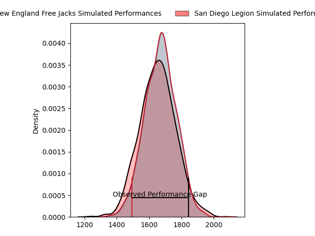
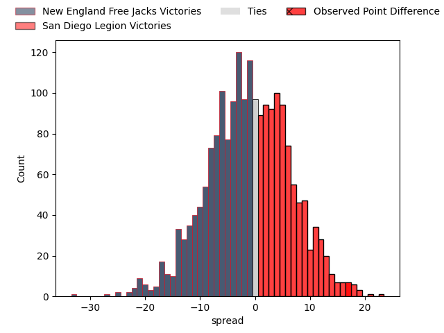
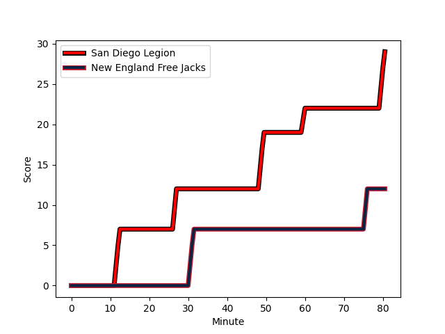
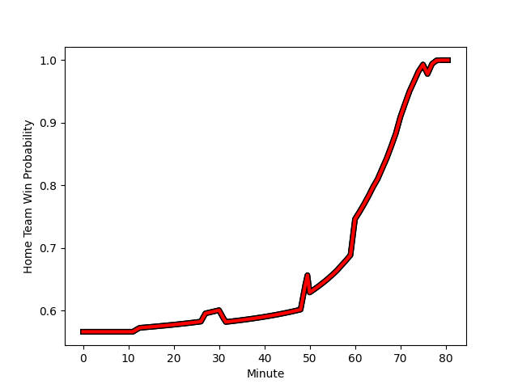

---  
layout: page  
title: New England Free Jacks at San Diego Legion; 12-29  
date: 2023-02-26 22:00:00 18:00:00 -0500  
categories: match review  
---
# New England Free Jacks at San Diego Legion; 12-29

# Club Level Predictions

The first set of predictions treats a club as the smallest object, as the club develops its members, organizes a gameplan, and deploys its players as needed for each match. This club model has a prediction of 0.473, which translates to predicting New England Free Jacks to win by 1.0.

Each club has a rating and a rating deviation (simiar to a Glicko system), and expected performances can be generated. This allows for simulated matches and spreads like the ones below.
## Projected Performances

## Projected Spreads

## Projected Results

# Player Level Predictions

Treating teams instead as an entity made up of the currently active players, I have ratings for each player in an altogether different system. These can be combined to form team ratings once teamsheets are announced, weighting starters a bit higher than the reserves. After the match is played, players can be weighted by their minutes on the field, allowing for an accurate measure of the team's composition. With these compiled team ratings, we can make predictions, measure inaccuracy, and update the individual player ratings.
## Prediction with Player Minutes: San Diego Legion by 16.0

San Diego Legion by 12.0 on a neutral field
## Scores over Time

## Win Probability over Time

There were 4 large changes in win probability in this match
## Prediction without Player Minutes: San Diego Legion by 16.8

San Diego Legion by 12.8 on a neutral pitch

|   Away Minutes | Away Player                                                         |   Away elo |   Away Percentile |   Number |   Home Percentile |   Home elo | Home Player                                                                  |   Home Minutes |
|---------------:|:--------------------------------------------------------------------|-----------:|------------------:|---------:|------------------:|-----------:|:-----------------------------------------------------------------------------|---------------:|
|             50 | [Kyle Ciquera](..//playerfiles//KyleCiquera_cleaned.md)             |      79.55 |                10 |        1 |                 2 |      64.88 | [Faka'osi Pifeleti](..//playerfiles//Faka'osiPifeleti_cleaned.md)            |             60 |
|             50 | [Kyle Ciquera](..//playerfiles//KyleCiquera_cleaned.md)             |      79.55 |                 2 |        1 |                 2 |      64.88 | [Faka'osi Pifeleti](..//playerfiles//Faka'osiPifeleti_cleaned.md)            |             60 |
|             50 | [Millenium Sanerivi](..//playerfiles//MilleniumSanerivi_cleaned.md) |     119.36 |                81 |        2 |                92 |     115.19 | [Sama Malolo](..//playerfiles//SamaMalolo_cleaned.md)                        |             50 |
|             50 | [Millenium Sanerivi](..//playerfiles//MilleniumSanerivi_cleaned.md) |     119.36 |                95 |        2 |                92 |     115.19 | [Sama Malolo](..//playerfiles//SamaMalolo_cleaned.md)                        |             50 |
|             50 | [Cole Keith](..//playerfiles//ColeKeith_cleaned.md)                 |     119.36 |                95 |        3 |                85 |     106.99 | [Nathan Sylvia](..//playerfiles//NathanSylvia_cleaned.md)                    |             60 |
|             50 | [Cole Keith](..//playerfiles//ColeKeith_cleaned.md)                 |     119.36 |                87 |        3 |                85 |     106.99 | [Nathan Sylvia](..//playerfiles//NathanSylvia_cleaned.md)                    |             60 |
|             80 | [Josh Larsen](..//playerfiles//JoshLarsen_cleaned.md)               |     109.02 |                83 |        4 |                94 |     121.28 | [Ben Grant](..//playerfiles//BenGrant_cleaned.md)                            |             73 |
|             80 | [Conor Keys](..//playerfiles//ConorKeys_cleaned.md)                 |      97.28 |               nan |        5 |                58 |      97.26 | [Isaac Ross](..//playerfiles//IsaacRoss_cleaned.md)                          |             57 |
|             50 | [Sam Fischli](..//playerfiles//SamFischli_cleaned.md)               |     114.63 |                82 |        6 |                17 |      84.44 | [Christian Poidevin](..//playerfiles//ChristianPoidevin_cleaned.md)          |             80 |
|             50 | [Sam Fischli](..//playerfiles//SamFischli_cleaned.md)               |     114.63 |                89 |        6 |                17 |      84.44 | [Christian Poidevin](..//playerfiles//ChristianPoidevin_cleaned.md)          |             80 |
|             65 | [Joe Johnston](..//playerfiles//JoeJohnston_cleaned.md)             |      10.51 |                 0 |        7 |                59 |      97.92 | [Blair Cowan](..//playerfiles//BlairCowan_cleaned.md)                        |             80 |
|             65 | [Joe Johnston](..//playerfiles//JoeJohnston_cleaned.md)             |      10.51 |                 0 |        7 |                59 |      97.92 | [Blair Cowan](..//playerfiles//BlairCowan_cleaned.md)                        |             80 |
|             80 | [Wian Conradie](..//playerfiles//WianConradie_cleaned.md)           |     109.02 |                82 |        8 |                56 |      97.92 | [Tupou Afungia](..//playerfiles//TupouAfungia_cleaned.md)                    |             80 |
|             50 | [John Poland](..//playerfiles//JohnPoland_cleaned.md)               |      67.6  |                 1 |        9 |                59 |      97.92 | [Richard Judd](..//playerfiles//RichardJudd_cleaned.md)                      |             67 |
|             50 | [John Poland](..//playerfiles//JohnPoland_cleaned.md)               |      67.6  |                 3 |        9 |                59 |      97.92 | [Richard Judd](..//playerfiles//RichardJudd_cleaned.md)                      |             67 |
|             70 | [Jayson Potroz](..//playerfiles//JaysonPotroz_cleaned.md)           |     121.64 |                81 |       10 |                19 |      85.57 | [Josh Henderson](..//playerfiles//JoshHenderson_cleaned.md)                  |             60 |
|             70 | [Jayson Potroz](..//playerfiles//JaysonPotroz_cleaned.md)           |     121.64 |                92 |       10 |                19 |      85.57 | [Josh Henderson](..//playerfiles//JoshHenderson_cleaned.md)                  |             60 |
|             80 | [Paul Balekana](..//playerfiles//PaulBalekana_cleaned.md)           |     109.02 |                84 |       11 |                59 |      97.92 | [Tomas Aoake](..//playerfiles//TomasAoake_cleaned.md)                        |             80 |
|             50 | [Spencer Jones](..//playerfiles//SpencerJones_cleaned.md)           |      71.78 |                 5 |       12 |                59 |      97.74 | [Ma'a Nonu](..//playerfiles//Ma'aNonu_cleaned.md)                            |             67 |
|             80 | [Wayne van der Bank](..//playerfiles//WaynevanderBank_cleaned.md)   |      56.27 |                 2 |       13 |                59 |      97.92 | [Marcel Brache](..//playerfiles//MarcelBrache_cleaned.md)                    |             80 |
|             80 | [Taniela Filimone](..//playerfiles//TanielaFilimone_cleaned.md)     |     122.52 |                95 |       14 |                59 |      97.92 | [Nathaniel Augspurger](..//playerfiles//NathanielAugspurger_cleaned.md)      |             80 |
|             80 | [Taniela Filimone](..//playerfiles//TanielaFilimone_cleaned.md)     |     122.52 |                83 |       14 |                59 |      97.92 | [Nathaniel Augspurger](..//playerfiles//NathanielAugspurger_cleaned.md)      |             80 |
|             80 | [Mitchell Wilson](..//playerfiles//MitchellWilson_cleaned.md)       |      13.53 |                 0 |       15 |                56 |      97.92 | [Mike Te'o](..//playerfiles//MikeTe'o_cleaned.md)                            |             80 |
|             30 | [Foster Dewitt](..//playerfiles//FosterDewitt_cleaned.md)           |      99.24 |                63 |       16 |               nan |      95.66 | [Djustice Sears-Duru](..//playerfiles//DjusticeSears-Duru_cleaned.md)        |             20 |
|             30 | [Andrew Quattrin](..//playerfiles//AndrewQuattrin_cleaned.md)       |      98.68 |               nan |       17 |               nan |      95.95 | [Shilo Klein](..//playerfiles//ShiloKlein_cleaned.md)                        |             30 |
|             30 | [Tevita Sole](..//playerfiles//TevitaSole_cleaned.md)               |     108.19 |                80 |       18 |               nan |      95.36 | [Chris Baumann](..//playerfiles//ChrisBaumann_cleaned.md)                    |             20 |
|             30 | [Semisi Paea](..//playerfiles//SemisiPaea_cleaned.md)               |     120.77 |                83 |       19 |                62 |      98.63 | [Jale Railala Vakaloloma](..//playerfiles//JaleRailalaVakaloloma_cleaned.md) |             23 |
|             30 | [Semisi Paea](..//playerfiles//SemisiPaea_cleaned.md)               |     120.77 |                93 |       19 |                62 |      98.63 | [Jale Railala Vakaloloma](..//playerfiles//JaleRailalaVakaloloma_cleaned.md) |             23 |
|             15 | [Cam Davidowicz](..//playerfiles//CamDavidowicz_cleaned.md)         |      18.89 |                 0 |       20 |               nan |      95    | [Jason Higgins](..//playerfiles//JasonHiggins_cleaned.md)                    |             13 |
|             15 | [Cam Davidowicz](..//playerfiles//CamDavidowicz_cleaned.md)         |      18.89 |                 0 |       20 |               nan |      95    | [Jason Higgins](..//playerfiles//JasonHiggins_cleaned.md)                    |             13 |
|             30 | [Kieran McClea](..//playerfiles//KieranMcClea_cleaned.md)           |      95    |               nan |       21 |               nan |      95.04 | [Malakai Latu](..//playerfiles//MalakaiLatu_cleaned.md)                      |              7 |
|             10 | [Reece MacDonald](..//playerfiles//ReeceMacDonald_cleaned.md)       |      96.4  |               nan |       22 |               nan |      95.47 | [Will Hooley](..//playerfiles//WillHooley_cleaned.md)                        |             20 |
|             30 | [Ben Lesage](..//playerfiles//BenLesage_cleaned.md)                 |      95    |               nan |       23 |               nan |      95.18 | [Ryan Matyas](..//playerfiles//RyanMatyas_cleaned.md)                        |             13 |

