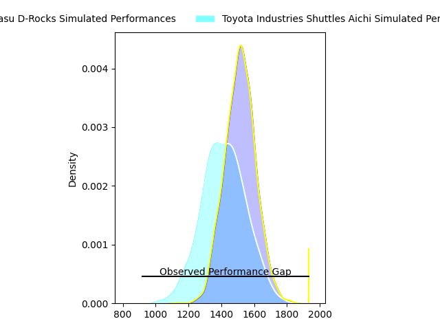
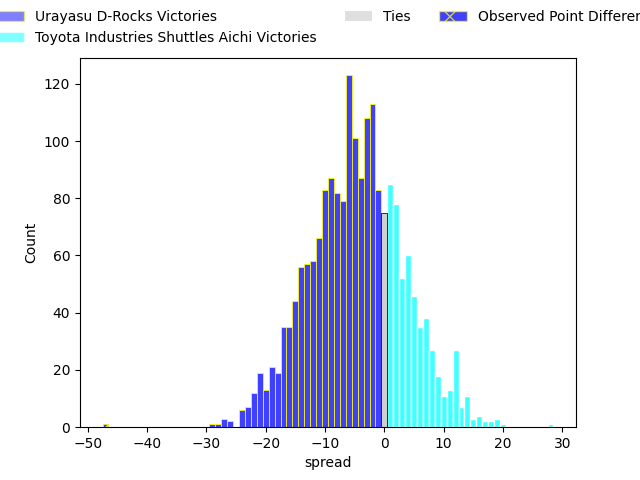
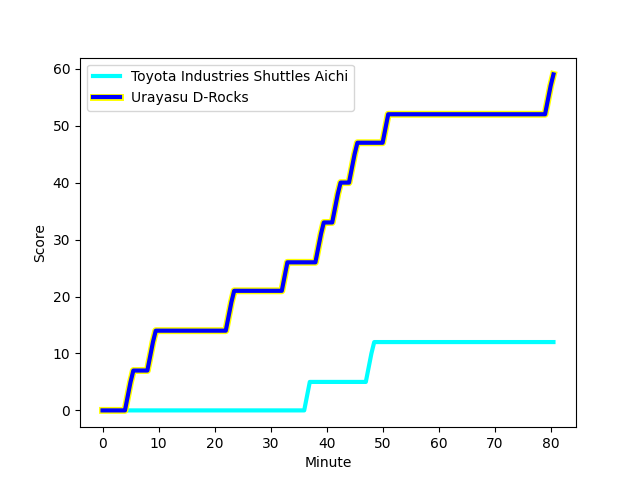
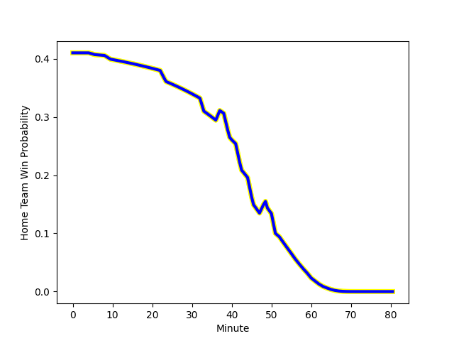

---  
layout: page  
title: Urayasu D-Rocks at Toyota Industries Shuttles Aichi; 59-12  
date: 2023-02-26 00:00:00 18:00:00 -0500  
categories: match review  
---
# Urayasu D-Rocks at Toyota Industries Shuttles Aichi; 59-12

# Club Level Predictions

The first set of predictions treats a club as the smallest object, as the club develops its members, organizes a gameplan, and deploys its players as needed for each match. This club model has a prediction of 0.366, which translates to predicting Urayasu D-Rocks to win by 5.0.

Each club has a rating and a rating deviation (simiar to a Glicko system), and expected performances can be generated. This allows for simulated matches and spreads like the ones below.
## Projected Performances

## Projected Spreads

## Projected Results

# Player Level Predictions

Treating teams instead as an entity made up of the currently active players, I have ratings for each player in an altogether different system. These can be combined to form team ratings once teamsheets are announced, weighting starters a bit higher than the reserves. After the match is played, players can be weighted by their minutes on the field, allowing for an accurate measure of the team's composition. With these compiled team ratings, we can make predictions, measure inaccuracy, and update the individual player ratings.
## Prediction with Player Minutes: Urayasu D-Rocks by 11.8

Urayasu D-Rocks by 15.8 on a neutral field
## Scores over Time

## Win Probability over Time

There were 4 large changes in win probability in this match
## Prediction without Player Minutes: Urayasu D-Rocks by 11.5

Urayasu D-Rocks by 15.5 on a neutral pitch

|   Away Minutes | Away Player                                                                  |   Away elo |   Away Percentile |   Number |   Home Percentile |   Home elo | Home Player                                                              |   Home Minutes |
|---------------:|:-----------------------------------------------------------------------------|-----------:|------------------:|---------:|------------------:|-----------:|:-------------------------------------------------------------------------|---------------:|
|             62 | [Kabuto Anoku](..//playerfiles//KabutoAnoku_cleaned.md)                      |      82.71 |                14 |        1 |                97 |     123.31 | [Tomoki Yamaguchi](..//playerfiles//TomokiYamaguchi_cleaned.md)          |             49 |
|             49 | [Franco Stephan Marais](..//playerfiles//FrancoStephanMarais_cleaned.md)     |     101.42 |                66 |        2 |                 3 |      66.04 | [Akito Fujinami](..//playerfiles//AkitoFujinami_cleaned.md)              |             49 |
|             49 | [Syuhei Takeuchi](..//playerfiles//SyuheiTakeuchi_cleaned.md)                |      87.27 |                23 |        3 |                30 |      89.69 | [Harumoto Kodera](..//playerfiles//HarumotoKodera_cleaned.md)            |             40 |
|             80 | [Ryeongji Kim](..//playerfiles//RyeongjiKim_cleaned.md)                      |      84.42 |                20 |        4 |                97 |     127.72 | [Ryuichiro Fukutsubo](..//playerfiles//RyuichiroFukutsubo_cleaned.md)    |             80 |
|             68 | [Lourens Jacobus Erasmus](..//playerfiles//LourensJacobusErasmus_cleaned.md) |     102.29 |                70 |        5 |                21 |      85.16 | [Yoann Maestri](..//playerfiles//YoannMaestri_cleaned.md)                |             71 |
|             49 | [Shingo Nakashima](..//playerfiles//ShingoNakashima_cleaned.md)              |     114.82 |                89 |        6 |               nan |      94.93 | [Tama Kapene](..//playerfiles//TamaKapene_cleaned.md)                    |             56 |
|             80 | [Tetta Shigemitsu](..//playerfiles//TettaShigemitsu_cleaned.md)              |     101.99 |                70 |        7 |                90 |     115.34 | [Shoichi Yura](..//playerfiles//ShoichiYura_cleaned.md)                  |             80 |
|             80 | [Tyler Warne Paul](..//playerfiles//TylerWarnePaul_cleaned.md)               |     101.38 |                68 |        8 |                30 |      88.8  | [Yamato Matsuoka](..//playerfiles//YamatoMatsuoka_cleaned.md)            |             80 |
|             52 | [Ren Iinuma](..//playerfiles//RenIinuma_cleaned.md)                          |     109.47 |                86 |        9 |                35 |      90.1  | [Riku Morisaki](..//playerfiles//RikuMorisaki_cleaned.md)                |             61 |
|             52 | [Otere Black](..//playerfiles//OtereBlack_cleaned.md)                        |     103.06 |                70 |       10 |                52 |      96.38 | [Akihiro Shimizu](..//playerfiles//AkihiroShimizu_cleaned.md)            |             80 |
|             80 | [Kai Ishii](..//playerfiles//KaiIshii_cleaned.md)                            |     110.21 |                85 |       11 |                20 |      84.56 | [Hiroaki Saito](..//playerfiles//HiroakiSaito_cleaned.md)                |             80 |
|             80 | [Samisoni Ahokovi Tua](..//playerfiles//SamisoniAhokoviTua_cleaned.md)       |      94.45 |                48 |       12 |                35 |      90.22 | [Keita Ichikawa](..//playerfiles//KeitaIchikawa_cleaned.md)              |             64 |
|             60 | [Shane Edwards Gates](..//playerfiles//ShaneEdwardsGates_cleaned.md)         |     116.09 |                92 |       13 |                 5 |      70.17 | [James Mollentze](..//playerfiles//JamesMollentze_cleaned.md)            |             80 |
|             80 | [Larry Steven Sulunga](..//playerfiles//LarryStevenSulunga_cleaned.md)       |     119.56 |                93 |       14 |                23 |      86.52 | [Joe Kamana](..//playerfiles//JoeKamana_cleaned.md)                      |             80 |
|             80 | [Takuhei Yasuda](..//playerfiles//TakuheiYasuda_cleaned.md)                  |     126.74 |                96 |       15 |                51 |      96.03 | [Shunta Kawano](..//playerfiles//ShuntaKawano_cleaned.md)                |             80 |
|             31 | [Ryuji Fujimura](..//playerfiles//RyujiFujimura_cleaned.md)                  |     107    |                84 |       16 |                24 |      87.91 | [Ryota Fukamura](..//playerfiles//RyotaFukamura_cleaned.md)              |             40 |
|             31 | [Kim Ryom](..//playerfiles//KimRyom_cleaned.md)                              |      91.33 |                33 |       17 |                73 |     101.59 | [Hyosuke Watanabe](..//playerfiles//HyosukeWatanabe_cleaned.md)          |             31 |
|             31 | [Liam Gill](..//playerfiles//LiamGill_cleaned.md)                            |     111.2  |                85 |       18 |               nan |      74.95 | [Tomoya Watanabe](..//playerfiles//TomoyaWatanabe_cleaned.md)            |             31 |
|             28 | [Greig Laidlaw](..//playerfiles//GreigLaidlaw_cleaned.md)                    |     103.38 |                71 |       19 |               nan |      91.94 | [Itaru Taniguchi](..//playerfiles//ItaruTaniguchi_cleaned.md)            |             24 |
|             28 | [Shotaro Matsuo](..//playerfiles//ShotaroMatsuo_cleaned.md)                  |      95    |               nan |       20 |                82 |     108.11 | [Hitoshi Matsumoto](..//playerfiles//HitoshiMatsumoto_cleaned.md)        |             11 |
|             20 | [Tone Tukufuka](..//playerfiles//ToneTukufuka_cleaned.md)                    |     134.76 |                98 |       21 |               nan |      95    | [Taisei Okamoto](..//playerfiles//TaiseiOkamoto_cleaned.md)              |             19 |
|             18 | [Kazuma Nishikawa](..//playerfiles//KazumaNishikawa_cleaned.md)              |      88.04 |                25 |       22 |                44 |      90.82 | [Shoma Makinouchi](..//playerfiles//ShomaMakinouchi_cleaned.md)          |              9 |
|             12 | [Yuta Kojima](..//playerfiles//YutaKojima_cleaned.md)                        |     111.1  |                86 |       23 |                46 |      93.68 | [Timothy Gregory Swiel](..//playerfiles//TimothyGregorySwiel_cleaned.md) |              5 |

