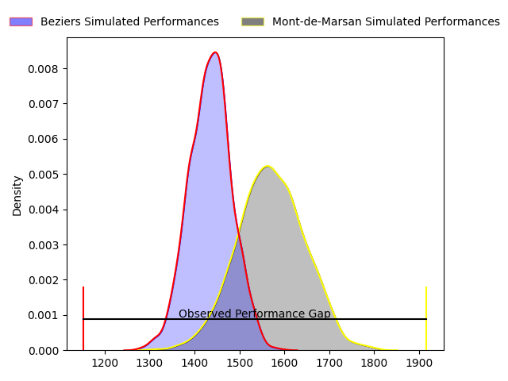
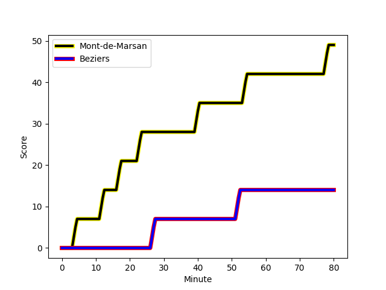
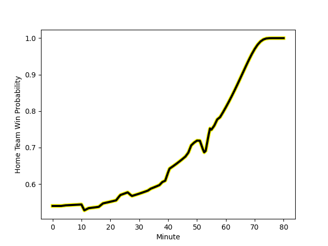

---  
layout: page  
title: Beziers at Mont-de-Marsan; 14-49  
date: 2023-03-02 21:00:00 18:00:00 -0500  
categories: match review  
---
# Beziers at Mont-de-Marsan; 14-49

# Club Level Predictions

The first set of predictions treats a club as the smallest object, as the club develops its members, organizes a gameplan, and deploys its players as needed for each match. This club model has a prediction of 0.688, which translates to predicting Mont-de-Marsan to win by 6.9.

Each club has a rating and a rating deviation (simiar to a Glicko system), and expected performances can be generated. This allows for simulated matches and spreads like the ones below.
## Projected Performances

## Projected Spreads

## Projected Results

# Player Level Predictions

Treating teams instead as an entity made up of the currently active players, I have ratings for each player in an altogether different system. These can be combined to form team ratings once teamsheets are announced, weighting starters a bit higher than the reserves. After the match is played, players can be weighted by their minutes on the field, allowing for an accurate measure of the team's composition. With these compiled team ratings, we can make predictions, measure inaccuracy, and update the individual player ratings.
## Prediction with Player Minutes: Mont-de-Marsan by 11.0

Mont-de-Marsan by 7.0 on a neutral field
## Scores over Time

## Win Probability over Time

There were 1 large changes in win probability in this match
## Prediction without Player Minutes: Mont-de-Marsan by 13.8

Mont-de-Marsan by 9.8 on a neutral pitch

|   Away Minutes | Away Player                                                                          |   Away elo |   Away Percentile |   Number |   Home Percentile |   Home elo | Home Player                                                                      |   Home Minutes |
|---------------:|:-------------------------------------------------------------------------------------|-----------:|------------------:|---------:|------------------:|-----------:|:---------------------------------------------------------------------------------|---------------:|
|             34 | [Giorgi Akhaladze](..//playerfiles//GiorgiAkhaladze_cleaned.md)                      |      98.95 |                79 |        1 |                95 |     118.93 | [Thomas Bultel](..//playerfiles//ThomasBultel_cleaned.md)                        |             58 |
|             51 | [Clément Esteriola](..//playerfiles//ClémentEsteriola_cleaned.md)                    |      71.99 |                 5 |        2 |                93 |     117.61 | [Jose Luis Gonzalez](..//playerfiles//JoseLuisGonzalez_cleaned.md)               |             50 |
|             55 | [Jamie Hagan](..//playerfiles//JamieHagan_cleaned.md)                                |      90.93 |               nan |        3 |                96 |     121.24 | [Gheorge Gajion](..//playerfiles//GheorgeGajion_cleaned.md)                      |             55 |
|             80 | [Clément Bitz](..//playerfiles//ClémentBitz_cleaned.md)                              |     100.69 |                69 |        4 |                98 |     134.56 | [Romain Durand](..//playerfiles//RomainDurand_cleaned.md)                        |             11 |
|             80 | [John Madigan](..//playerfiles//JohnMadigan_cleaned.md)                              |      78.07 |                11 |        5 |                77 |     105.06 | [Andrei Ostrikov](..//playerfiles//AndreiOstrikov_cleaned.md)                    |             50 |
|             80 | [William van Bost](..//playerfiles//WilliamvanBost_cleaned.md)                       |      97.83 |                59 |        6 |                 5 |      72.38 | [Léo Banos](..//playerfiles//LéoBanos_cleaned.md)                                |             48 |
|             47 | [Joaquim Selma](..//playerfiles//JoaquimSelma_cleaned.md)                            |      95    |               nan |        7 |                55 |      96.64 | [Nicolas Garrault](..//playerfiles//NicolasGarrault_cleaned.md)                  |             80 |
|             11 | [Sias Koen](..//playerfiles//SiasKoen_cleaned.md)                                    |      89.66 |                31 |        8 |                26 |      88.92 | [Michael Faleafa](..//playerfiles//MichaelFaleafa_cleaned.md)                    |             80 |
|             47 | [Josh Valentine](..//playerfiles//JoshValentine_cleaned.md)                          |      95.36 |                58 |        9 |                18 |      84.08 | [Christophe Loustalot](..//playerfiles//ChristopheLoustalot_cleaned.md)          |             57 |
|             47 | [Romain Uruty](..//playerfiles//RomainUruty_cleaned.md)                              |      96.97 |                63 |       10 |                39 |      84.59 | [Joris Pialot](..//playerfiles//JorisPialot_cleaned.md)                          |             80 |
|             47 | [Romain Uruty](..//playerfiles//RomainUruty_cleaned.md)                              |      96.97 |                63 |       10 |                18 |      84.59 | [Joris Pialot](..//playerfiles//JorisPialot_cleaned.md)                          |             80 |
|             38 | [Paul Alquier](..//playerfiles//PaulAlquier_cleaned.md)                              |      97.73 |                59 |       11 |                79 |     105.51 | [Kaminieli Rasaku](..//playerfiles//KaminieliRasaku_cleaned.md)                  |             80 |
|             80 | [James Tofa](..//playerfiles//JamesTofa_cleaned.md)                                  |      90.04 |                34 |       12 |                 9 |      76.43 | [Jules Even](..//playerfiles//JulesEven_cleaned.md)                              |             50 |
|             80 | [Andries Ebenaezer Swanepoel](..//playerfiles//AndriesEbenaezerSwanepoel_cleaned.md) |      86.9  |                25 |       13 |                41 |      91.81 | [Ambrose Curtis](..//playerfiles//AmbroseCurtis_cleaned.md)                      |             80 |
|             80 | [Maxime Espeut](..//playerfiles//MaximeEspeut_cleaned.md)                            |     141.88 |                99 |       14 |                90 |     113.67 | [Julien Cabannes](..//playerfiles//JulienCabannes_cleaned.md)                    |             80 |
|             80 | [Charly Malié](..//playerfiles//CharlyMalié_cleaned.md)                              |      85.02 |                24 |       15 |                71 |     103.35 | [Alexandre de Nardi](..//playerfiles//AlexandredeNardi_cleaned.md)               |             80 |
|             69 | [Thomas Hoarau](..//playerfiles//ThomasHoarau_cleaned.md)                            |      93.88 |                48 |       16 |                58 |      98.34 | [Veresa Tuqovu Ramototabua](..//playerfiles//VeresaTuqovuRamototabua_cleaned.md) |             69 |
|             46 | [Ferdinand Changel](..//playerfiles//FerdinandChangel_cleaned.md)                    |      93.21 |               nan |       17 |                80 |     107.49 | [Aurélien Lisena](..//playerfiles//AurélienLisena_cleaned.md)                    |             32 |
|             42 | [Jarrod Poi](..//playerfiles//JarrodPoi_cleaned.md)                                  |      85.87 |                30 |       18 |               nan |      95    | [Leandro Luis Cedaro](..//playerfiles//LeandroLuisCedaro_cleaned.md)             |             30 |
|             33 | [Jean Victor Goillot](..//playerfiles//JeanVictorGoillot_cleaned.md)                 |      97.44 |                58 |       19 |                62 |     100.26 | [Simon Desaubies](..//playerfiles//SimonDesaubies_cleaned.md)                    |             30 |
|             33 | [Adrien Latorre](..//playerfiles//AdrienLatorre_cleaned.md)                          |      95.97 |               nan |       20 |                59 |      96.94 | [Simon Labouyrie](..//playerfiles//SimonLabouyrie_cleaned.md)                    |             30 |
|             33 | [Yassine Maamry](..//playerfiles//YassineMaamry_cleaned.md)                          |      83.89 |                20 |       21 |                66 |      93.49 | [Max Curie](..//playerfiles//MaxCurie_cleaned.md)                                |             25 |
|             33 | [Yassine Maamry](..//playerfiles//YassineMaamry_cleaned.md)                          |      83.89 |                20 |       21 |                39 |      93.49 | [Max Curie](..//playerfiles//MaxCurie_cleaned.md)                                |             25 |
|             29 | [Wilmar Arnoldi](..//playerfiles//WilmarArnoldi_cleaned.md)                          |      97.35 |                60 |       22 |                64 |      99.41 | [Baptiste Canut](..//playerfiles//BaptisteCanut_cleaned.md)                      |             23 |
|             25 | [Yannick Arroyo](..//playerfiles//YannickArroyo_cleaned.md)                          |      89.28 |                28 |       23 |               nan |      99.12 | [Dino Casadei](..//playerfiles//DinoCasadei_cleaned.md)                          |             22 |

