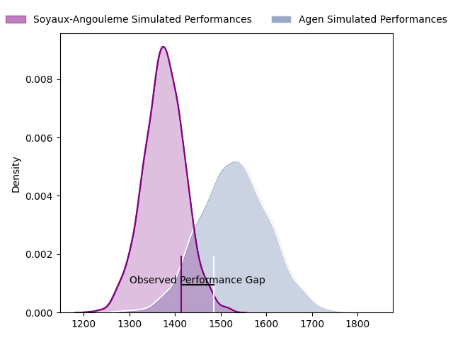
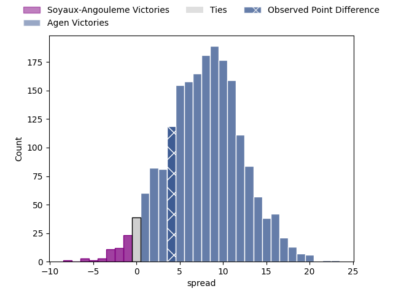
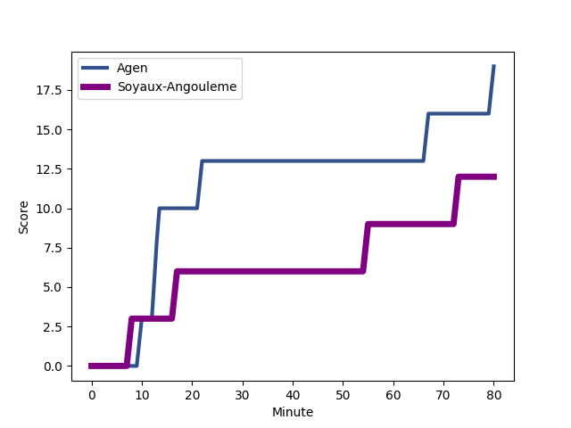
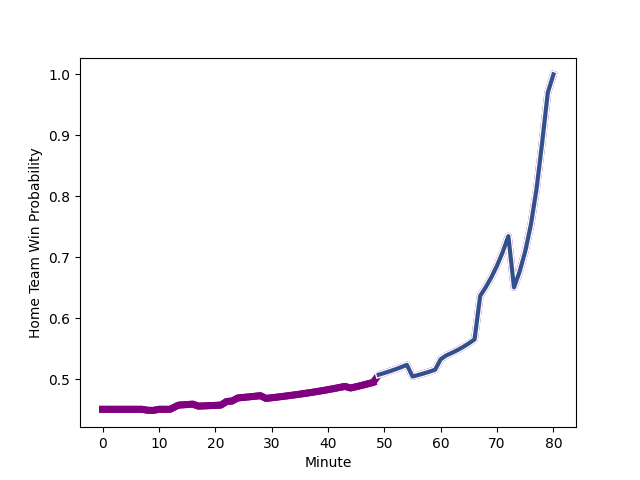

---  
layout: page  
title: Soyaux-Angouleme at Agen; 15-19  
date: 2023-03-03 19:30:00 18:00:00 -0500  
categories: match review  
---
# Soyaux-Angouleme at Agen; 15-19

# Club Level Predictions

The first set of predictions treats a club as the smallest object, as the club develops its members, organizes a gameplan, and deploys its players as needed for each match. This club model has a prediction of 0.706, which translates to predicting Agen to win by 7.7.

Each club has a rating and a rating deviation (simiar to a Glicko system), and expected performances can be generated. This allows for simulated matches and spreads like the ones below.
## Projected Performances

## Projected Spreads

## Projected Results

# Player Level Predictions

Treating teams instead as an entity made up of the currently active players, I have ratings for each player in an altogether different system. These can be combined to form team ratings once teamsheets are announced, weighting starters a bit higher than the reserves. After the match is played, players can be weighted by their minutes on the field, allowing for an accurate measure of the team's composition. With these compiled team ratings, we can make predictions, measure inaccuracy, and update the individual player ratings.
## Prediction with Player Minutes: Soyaux-Angouleme by 6.1

Soyaux-Angouleme by 10.1 on a neutral field
## Scores over Time

## Win Probability over Time

There were 9 large changes in win probability in this match
## Prediction without Player Minutes: Soyaux-Angouleme by 4.2

Soyaux-Angouleme by 8.2 on a neutral pitch

|   Away Minutes | Away Player                                                            |   Away elo |   Away Percentile |   Number |   Home Percentile |   Home elo | Home Player                                                                              |   Home Minutes |
|---------------:|:-----------------------------------------------------------------------|-----------:|------------------:|---------:|------------------:|-----------:|:-----------------------------------------------------------------------------------------|---------------:|
|             29 | [Khatchik Vartan](..//playerfiles//KhatchikVartan_cleaned.md)          |      81.38 |                12 |        1 |                44 |      93.29 | [Richard Barrington](..//playerfiles//RichardBarrington_cleaned.md)                      |             49 |
|             80 | [Rayne Barka](..//playerfiles//RayneBarka_cleaned.md)                  |      99.09 |                70 |        2 |                51 |      94    | [Mike Sosene-Feagai](..//playerfiles//MikeSosene-Feagai_cleaned.md)                      |             49 |
|             80 | [Rayne Barka](..//playerfiles//RayneBarka_cleaned.md)                  |      99.09 |                57 |        2 |                51 |      94    | [Mike Sosene-Feagai](..//playerfiles//MikeSosene-Feagai_cleaned.md)                      |             49 |
|             49 | [Manasa Saulo Romumu](..//playerfiles//ManasaSauloRomumu_cleaned.md)   |      95.74 |                40 |        3 |                55 |      85.43 | [Alex Burin](..//playerfiles//AlexBurin_cleaned.md)                                      |             55 |
|             49 | [Manasa Saulo Romumu](..//playerfiles//ManasaSauloRomumu_cleaned.md)   |      95.74 |                40 |        3 |                19 |      85.43 | [Alex Burin](..//playerfiles//AlexBurin_cleaned.md)                                      |             55 |
|             80 | [Ian Kitwanga](..//playerfiles//IanKitwanga_cleaned.md)                |      86.51 |                20 |        4 |                52 |      95.55 | [Joe Maksymiw](..//playerfiles//JoeMaksymiw_cleaned.md)                                  |             80 |
|             67 | [Sikeli Nabou](..//playerfiles//SikeliNabou_cleaned.md)                |      99    |                62 |        5 |                76 |      96.03 | [Evan Olmstead](..//playerfiles//EvanOlmstead_cleaned.md)                                |             55 |
|             80 | [Germain Burgaud](..//playerfiles//GermainBurgaud_cleaned.md)          |     122.26 |                94 |        6 |                51 |      93.23 | [Antoine Erbani](..//playerfiles//AntoineErbani_cleaned.md)                              |             80 |
|             80 | [Nicolas Martins](..//playerfiles//NicolasMartins_cleaned.md)          |     104.59 |                75 |        7 |                 5 |      70.56 | [Vincent Farré](..//playerfiles//VincentFarré_cleaned.md)                                |             80 |
|             80 | [Nicolas Martins](..//playerfiles//NicolasMartins_cleaned.md)          |     104.59 |                75 |        7 |                11 |      70.56 | [Vincent Farré](..//playerfiles//VincentFarré_cleaned.md)                                |             80 |
|             24 | [Matt Va'ai](..//playerfiles//MattVa'ai_cleaned.md)                    |      98.94 |                51 |        8 |                15 |      82.76 | [Fotu Lokotui](..//playerfiles//FotuLokotui_cleaned.md)                                  |             61 |
|             44 | [Emmanuel Saubusse](..//playerfiles//EmmanuelSaubusse_cleaned.md)      |      97.29 |                54 |        9 |                49 |      84.98 | [Sonatane Takulua](..//playerfiles//SonataneTakulua_cleaned.md)                          |             60 |
|             44 | [Emmanuel Saubusse](..//playerfiles//EmmanuelSaubusse_cleaned.md)      |      97.29 |                54 |        9 |                21 |      84.98 | [Sonatane Takulua](..//playerfiles//SonataneTakulua_cleaned.md)                          |             60 |
|             61 | [Jacob Botica](..//playerfiles//JacobBotica_cleaned.md)                |      90.9  |               nan |       10 |                70 |     102.87 | [Thomas Vincent](..//playerfiles//ThomasVincent_cleaned.md)                              |             80 |
|             80 | [Marvin Lestremau](..//playerfiles//MarvinLestremau_cleaned.md)        |      92.01 |                43 |       11 |                32 |      89.44 | [Iban Etcheverry](..//playerfiles//IbanEtcheverry_cleaned.md)                            |             80 |
|             61 | [Inaki Ayarza Saporta](..//playerfiles//InakiAyarzaSaporta_cleaned.md) |      94.56 |                49 |       12 |                65 |      99.85 | [Kolinio Ramoka](..//playerfiles//KolinioRamoka_cleaned.md)                              |             80 |
|             80 | [Ledua Mau](..//playerfiles//LeduaMau_cleaned.md)                      |      90.13 |                35 |       13 |                 5 |      71.08 | [Théo Belan](..//playerfiles//ThéoBelan_cleaned.md)                                      |             49 |
|             80 | [Ledua Mau](..//playerfiles//LeduaMau_cleaned.md)                      |      90.13 |                35 |       13 |                12 |      71.08 | [Théo Belan](..//playerfiles//ThéoBelan_cleaned.md)                                      |             49 |
|             80 | [Kamilieni Raivono](..//playerfiles//KamilieniRaivono_cleaned.md)      |      98.18 |                59 |       14 |                63 |      99.44 | [Inoke Nalaga Kurukuruvakatini](..//playerfiles//InokeNalagaKurukuruvakatini_cleaned.md) |             80 |
|             80 | [Pierre Lafitte](..//playerfiles//PierreLafitte_cleaned.md)            |      89.41 |                32 |       15 |                30 |      75.94 | [Mathieu Lamoulie](..//playerfiles//MathieuLamoulie_cleaned.md)                          |             60 |
|             80 | [Pierre Lafitte](..//playerfiles//PierreLafitte_cleaned.md)            |      89.41 |                32 |       15 |                11 |      75.94 | [Mathieu Lamoulie](..//playerfiles//MathieuLamoulie_cleaned.md)                          |             60 |
|             56 | [Ole Avei](..//playerfiles//OleAvei_cleaned.md)                        |      93    |                40 |       16 |                19 |      84.72 | [Elton Thomas Jantjies](..//playerfiles//EltonThomasJantjies_cleaned.md)                 |             31 |
|             51 | [Shota Gogisvanidze](..//playerfiles//ShotaGogisvanidze_cleaned.md)    |     105.57 |                83 |       17 |                76 |      99.46 | [Clément Martinez](..//playerfiles//ClémentMartinez_cleaned.md)                          |             31 |
|             36 | [Lucas Rubio](..//playerfiles//LucasRubio_cleaned.md)                  |      98.15 |               nan |       18 |                39 |      83.97 | [Hans Lombard-Buret](..//playerfiles//HansLombard-Buret_cleaned.md)                      |             31 |
|             36 | [Lucas Rubio](..//playerfiles//LucasRubio_cleaned.md)                  |      98.15 |               nan |       18 |                16 |      83.97 | [Hans Lombard-Buret](..//playerfiles//HansLombard-Buret_cleaned.md)                      |             31 |
|             31 | [Omar Dahir](..//playerfiles//OmarDahir_cleaned.md)                    |      84.63 |                17 |       19 |                56 |      98.35 | [Beau Farrance](..//playerfiles//BeauFarrance_cleaned.md)                                |             25 |
|             19 | [Matthieu Ugalde](..//playerfiles//MatthieuUgalde_cleaned.md)          |     104.25 |                75 |       20 |                60 |      98.13 | [Zak Farrance](..//playerfiles//ZakFarrance_cleaned.md)                                  |             25 |
|             19 | [Mathis Lafon](..//playerfiles//MathisLafon_cleaned.md)                |      93.88 |                45 |       21 |                37 |      90.81 | [Theo Idjellidaine](..//playerfiles//TheoIdjellidaine_cleaned.md)                        |             20 |
|             13 | [Saba Pesvianidze](..//playerfiles//SabaPesvianidze_cleaned.md)        |     122.82 |                92 |       22 |                60 |      99.08 | [Jean-Marcellin Buttin](..//playerfiles//Jean-MarcellinButtin_cleaned.md)                |             20 |
|             13 | [Saba Pesvianidze](..//playerfiles//SabaPesvianidze_cleaned.md)        |     122.82 |                95 |       22 |                60 |      99.08 | [Jean-Marcellin Buttin](..//playerfiles//Jean-MarcellinButtin_cleaned.md)                |             20 |
|            nan | nan                                                                    |     nan    |               nan |       23 |               nan |      93.99 | [Julien Lebian](..//playerfiles//JulienLebian_cleaned.md)                                |             19 |

