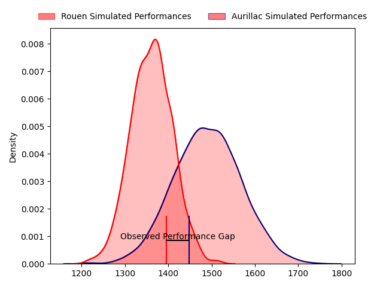
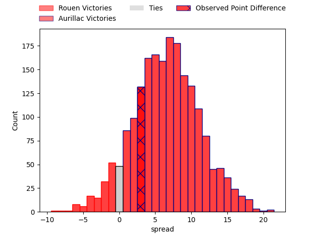
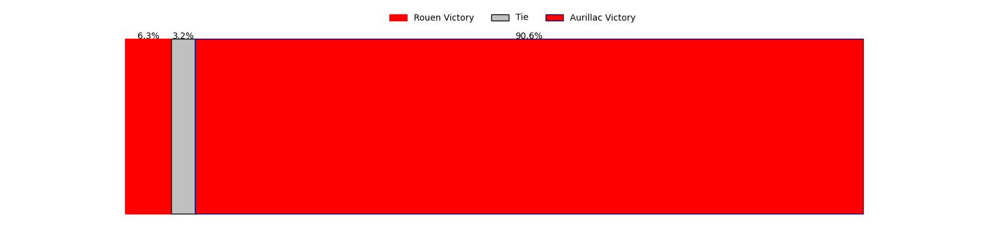
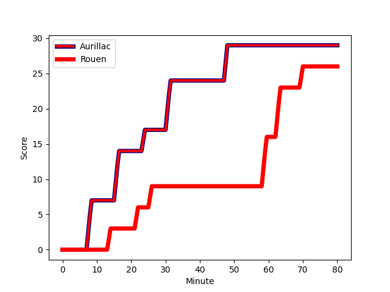
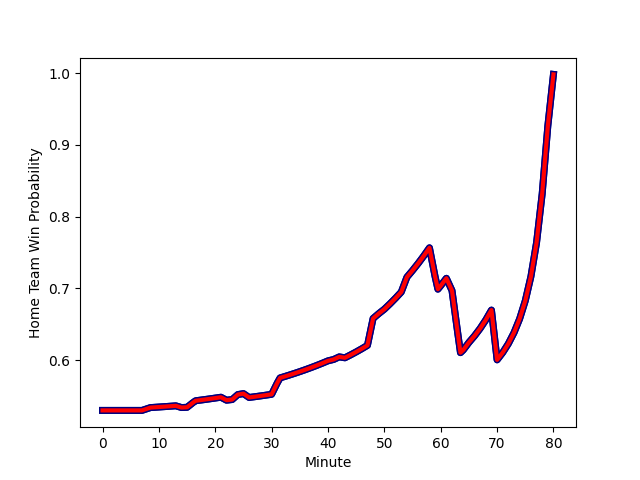

---  
layout: page  
title: Rouen at Aurillac; 26-29  
date: 2023-03-03 19:30:00 18:00:00 -0500  
categories: match review  
---
# Rouen at Aurillac; 26-29

# Club Level Predictions

The first set of predictions treats a club as the smallest object, as the club develops its members, organizes a gameplan, and deploys its players as needed for each match. This club model has a prediction of 0.678, which translates to predicting Aurillac to win by 6.5.

Each club has a rating and a rating deviation (simiar to a Glicko system), and expected performances can be generated. This allows for simulated matches and spreads like the ones below.
## Projected Performances

## Projected Spreads

## Projected Results

# Player Level Predictions

Treating teams instead as an entity made up of the currently active players, I have ratings for each player in an altogether different system. These can be combined to form team ratings once teamsheets are announced, weighting starters a bit higher than the reserves. After the match is played, players can be weighted by their minutes on the field, allowing for an accurate measure of the team's composition. With these compiled team ratings, we can make predictions, measure inaccuracy, and update the individual player ratings.
## Prediction with Player Minutes: Aurillac by 6.1

Aurillac by 2.1 on a neutral field
## Scores over Time

## Win Probability over Time

There were 9 large changes in win probability in this match
## Prediction without Player Minutes: Aurillac by 8.7

Aurillac by 4.7 on a neutral pitch

|   Away Minutes | Away Player                                                                               |   Away elo |   Away Percentile |   Number |   Home Percentile |   Home elo | Home Player                                                                                           |   Home Minutes |
|---------------:|:------------------------------------------------------------------------------------------|-----------:|------------------:|---------:|------------------:|-----------:|:------------------------------------------------------------------------------------------------------|---------------:|
|             54 | [Soulemane Camara](..//playerfiles//SoulemaneCamara_cleaned.md)                           |     103.41 |                86 |        1 |                26 |      88.67 | [Robert Rodgers](..//playerfiles//RobertRodgers_cleaned.md)                                           |             62 |
|             50 | [Ru-Hann Greyling](..//playerfiles//Ru-HannGreyling_cleaned.md)                           |      87.8  |                33 |        2 |                69 |     100.32 | [Adrian Smith](..//playerfiles//AdrianSmith_cleaned.md)                                               |             62 |
|             54 | [Cody Thomas](..//playerfiles//CodyThomas_cleaned.md)                                     |      79.49 |                10 |        3 |                91 |     112.91 | [Giorgi Kartvelishvili](..//playerfiles//GiorgiKartvelishvili_cleaned.md)                             |             62 |
|             59 | [Raphaël Vieilledent](..//playerfiles//RaphaëlVieilledent_cleaned.md)                     |      87.07 |                27 |        4 |                56 |      96.85 | [Martial Rolland](..//playerfiles//MartialRolland_cleaned.md)                                         |             65 |
|             80 | [John Charles Astle](..//playerfiles//JohnCharlesAstle_cleaned.md)                        |      98.16 |                60 |        5 |                63 |      99.2  | [Georgi Javakhia](..//playerfiles//GeorgiJavakhia_cleaned.md)                                         |             41 |
|             65 | [Lucas Costa](..//playerfiles//LucasCosta_cleaned.md)                                     |      86.66 |                23 |        6 |                67 |     100.48 | [Cam Dodson](..//playerfiles//CamDodson_cleaned.md)                                                   |             43 |
|             59 | [Martinus Abraham Tienie Burger](..//playerfiles//MartinusAbrahamTienieBurger_cleaned.md) |      84.52 |                18 |        7 |                 5 |      72.73 | [Théo Cambon](..//playerfiles//ThéoCambon_cleaned.md)                                                 |             80 |
|             80 | [Valentino Mapapalangi](..//playerfiles//ValentinoMapapalangi_cleaned.md)                 |      87.91 |                27 |        8 |                22 |      85.88 | [Latuka Maituku](..//playerfiles//LatukaMaituku_cleaned.md)                                           |             80 |
|             63 | [Florent Campeggia](..//playerfiles//FlorentCampeggia_cleaned.md)                         |      71.3  |                 6 |        9 |                55 |      96.17 | [David Delarue](..//playerfiles//DavidDelarue_cleaned.md)                                             |             62 |
|             80 | [Franck Pourteau](..//playerfiles//FranckPourteau_cleaned.md)                             |      89.73 |                32 |       10 |                14 |      80.91 | [Antoine Aucagne](..//playerfiles//AntoineAucagne_cleaned.md)                                         |             80 |
|             63 | [Malcolm Bertschy](..//playerfiles//MalcolmBertschy_cleaned.md)                           |      94.2  |                48 |       11 |                61 |      98.53 | [Adriaan Jocobus van der Berg Coertzen](..//playerfiles//AdriaanJocobusvanderBergCoertzen_cleaned.md) |             80 |
|             80 | [Alex Luatua](..//playerfiles//AlexLuatua_cleaned.md)                                     |      86.24 |                24 |       12 |                16 |      83.18 | [Christa Powell](..//playerfiles//ChristaPowell_cleaned.md)                                           |             80 |
|             80 | [Ugo Delorme](..//playerfiles//UgoDelorme_cleaned.md)                                     |      86.56 |                33 |       13 |                62 |      98.92 | [Elijah Niko](..//playerfiles//ElijahNiko_cleaned.md)                                                 |             65 |
|             80 | [Paul Surano](..//playerfiles//PaulSurano_cleaned.md)                                     |      81.01 |                17 |       14 |                17 |      83.31 | [Simeli Yabaki](..//playerfiles//SimeliYabaki_cleaned.md)                                             |             80 |
|             80 | [Peter Lydon](..//playerfiles//PeterLydon_cleaned.md)                                     |     119.15 |                93 |       15 |                10 |      75.72 | [Anderson Neisen](..//playerfiles//AndersonNeisen_cleaned.md)                                         |             80 |
|             30 | [Lucas Malbert](..//playerfiles//LucasMalbert_cleaned.md)                                 |      89.62 |                31 |       16 |                15 |      81.93 | [Jean-Baptiste Singer](..//playerfiles//Jean-BaptisteSinger_cleaned.md)                               |             39 |
|             30 | [Lucas Malbert](..//playerfiles//LucasMalbert_cleaned.md)                                 |      89.62 |                31 |       16 |                18 |      81.93 | [Jean-Baptiste Singer](..//playerfiles//Jean-BaptisteSinger_cleaned.md)                               |             39 |
|             26 | [Mohamed Boughanmi](..//playerfiles//MohamedBoughanmi_cleaned.md)                         |      87.75 |                24 |       17 |                40 |      90.59 | [Steve Moukete](..//playerfiles//SteveMoukete_cleaned.md)                                             |             37 |
|             26 | [Antoine Fournier](..//playerfiles//AntoineFournier_cleaned.md)                           |      77.57 |                 8 |       18 |                95 |     118.64 | [Luka Nioradze](..//playerfiles//LukaNioradze_cleaned.md)                                             |             18 |
|             21 | [Fabien Vincent](..//playerfiles//FabienVincent_cleaned.md)                               |      95.45 |                54 |       19 |                10 |      76.72 | [Hugo Bouyssou](..//playerfiles//HugoBouyssou_cleaned.md)                                             |             18 |
|             21 | [Jean Leleu](..//playerfiles//JeanLeleu_cleaned.md)                                       |      84.44 |                19 |       20 |                24 |      88.43 | [Jean-Jacques Gymael](..//playerfiles//Jean-JacquesGymael_cleaned.md)                                 |             18 |
|             17 | [Théo Nanette](..//playerfiles//ThéoNanette_cleaned.md)                                   |      81.78 |                16 |       21 |                14 |      82.22 | [Henzo Kiteau](..//playerfiles//HenzoKiteau_cleaned.md)                                               |             18 |
|             17 | [Marius Marty](..//playerfiles//MariusMarty_cleaned.md)                                   |      72.96 |                 9 |       22 |                77 |     107.34 | [Yann Tivoli](..//playerfiles//YannTivoli_cleaned.md)                                                 |             15 |
|             15 | [Willy N'Diaye](..//playerfiles//WillyN'Diaye_cleaned.md)                                 |      88.92 |                43 |       23 |                91 |     118.49 | [Marc Palmier](..//playerfiles//MarcPalmier_cleaned.md)                                               |             15 |

