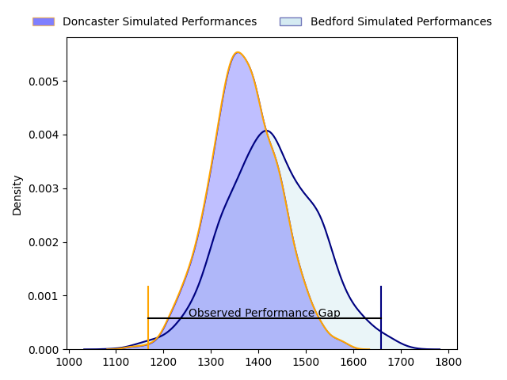
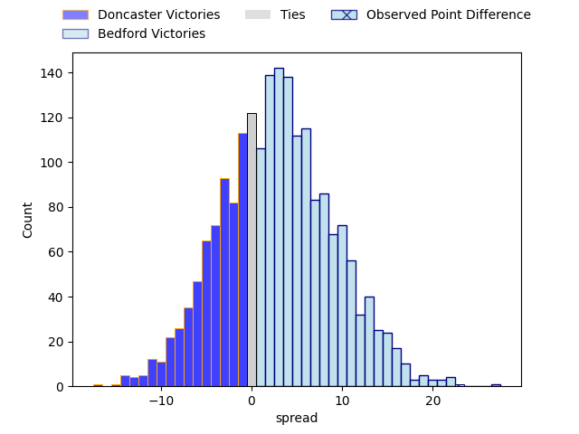
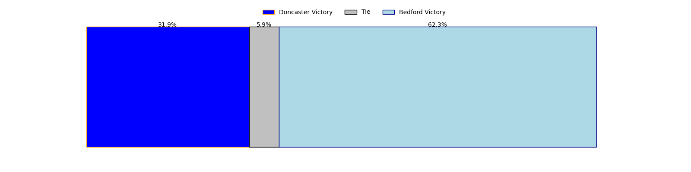
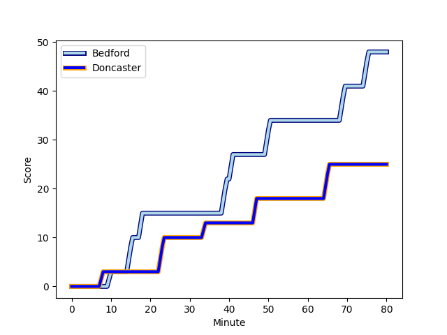
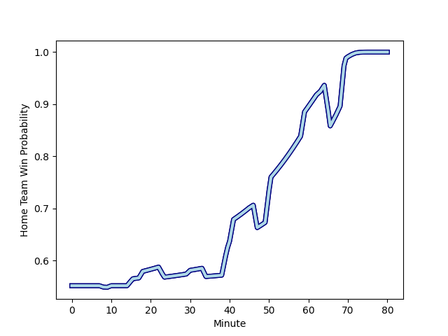

---  
layout: page  
title: Doncaster at Bedford; 25-48  
date: 2023-03-03 20:45:00 18:00:00 -0500  
categories: match review  
---
# Doncaster at Bedford; 25-48

# Club Level Predictions

The first set of predictions treats a club as the smallest object, as the club develops its members, organizes a gameplan, and deploys its players as needed for each match. This club model has a prediction of 0.577, which translates to predicting Bedford to win by 2.8.

Each club has a rating and a rating deviation (simiar to a Glicko system), and expected performances can be generated. This allows for simulated matches and spreads like the ones below.
## Projected Performances

## Projected Spreads

## Projected Results

# Player Level Predictions

Treating teams instead as an entity made up of the currently active players, I have ratings for each player in an altogether different system. These can be combined to form team ratings once teamsheets are announced, weighting starters a bit higher than the reserves. After the match is played, players can be weighted by their minutes on the field, allowing for an accurate measure of the team's composition. With these compiled team ratings, we can make predictions, measure inaccuracy, and update the individual player ratings.
## Prediction with Player Minutes: Bedford by 13.1

Bedford by 9.1 on a neutral field
## Scores over Time

## Win Probability over Time

There were 9 large changes in win probability in this match
## Prediction without Player Minutes: Bedford by 10.7

Bedford by 6.7 on a neutral pitch

|   Away Minutes | Away Player                                                     |   Away elo |   Away Percentile |   Number |   Home Percentile |   Home elo | Home Player                                                              |   Home Minutes |
|---------------:|:----------------------------------------------------------------|-----------:|------------------:|---------:|------------------:|-----------:|:-------------------------------------------------------------------------|---------------:|
|             63 | [James Wayland](..//playerfiles//JamesWayland_cleaned.md)       |     100.43 |                69 |        1 |                31 |      89.79 | [Joey Conway](..//playerfiles//JoeyConway_cleaned.md)                    |             72 |
|             59 | [George Edgson](..//playerfiles//GeorgeEdgson_cleaned.md)       |     120.7  |                95 |        2 |                58 |      97.1  | [Jack Hughes](..//playerfiles//JackHughes_cleaned.md)                    |             46 |
|             59 | [Jake Armstrong](..//playerfiles//JakeArmstrong_cleaned.md)     |      94.21 |                47 |        3 |                21 |      86.52 | [Oisin Heffernan](..//playerfiles//OisinHeffernan_cleaned.md)            |             59 |
|             80 | [Ehize Ehizode](..//playerfiles//EhizeEhizode_cleaned.md)       |      56.3  |                 2 |        4 |                78 |     106.18 | [Robin Williams](..//playerfiles//RobinWilliams_cleaned.md)              |             80 |
|             80 | [Max Williamson](..//playerfiles//MaxWilliamson_cleaned.md)     |      95    |               nan |        5 |                77 |     105.66 | [Luke Frost](..//playerfiles//LukeFrost_cleaned.md)                      |             80 |
|             40 | [Sam Hudson](..//playerfiles//SamHudson_cleaned.md)             |     107.12 |                81 |        6 |                13 |      81.82 | [Kayde Sylvester](..//playerfiles//KaydeSylvester_cleaned.md)            |             59 |
|             68 | [Rhys Tait](..//playerfiles//RhysTait_cleaned.md)               |      95    |               nan |        7 |                34 |      89.93 | [Jac Arthur](..//playerfiles//JacArthur_cleaned.md)                      |             30 |
|             76 | [John Kelly](..//playerfiles//JohnKelly_cleaned.md)             |      83.86 |                32 |        8 |                16 |      82.76 | [Tui Uru](..//playerfiles//TuiUru_cleaned.md)                            |             80 |
|             76 | [John Kelly](..//playerfiles//JohnKelly_cleaned.md)             |      83.86 |                18 |        8 |                16 |      82.76 | [Tui Uru](..//playerfiles//TuiUru_cleaned.md)                            |             80 |
|             72 | [Alex Dolly](..//playerfiles//AlexDolly_cleaned.md)             |     109.78 |                87 |        9 |                96 |     119.68 | [Alex Day](..//playerfiles//AlexDay_cleaned.md)                          |             76 |
|             80 | [Sam Olver](..//playerfiles//SamOlver_cleaned.md)               |      92.36 |                42 |       10 |                99 |     141.77 | [William Maisey](..//playerfiles//WilliamMaisey_cleaned.md)              |             76 |
|             80 | [Jack Metcalf](..//playerfiles//JackMetcalf_cleaned.md)         |     100.85 |                65 |       11 |                53 |      95.99 | [Dean Adamson](..//playerfiles//DeanAdamson_cleaned.md)                  |             80 |
|             80 | [Connor Edwards](..//playerfiles//ConnorEdwards_cleaned.md)     |      90.97 |                37 |       12 |                85 |     110.1  | [Michael Le Bourgeois](..//playerfiles//MichaelLeBourgeois_cleaned.md)   |             59 |
|             63 | [Joe Margetts](..//playerfiles//JoeMargetts_cleaned.md)         |      83.21 |                12 |       13 |                55 |      97.3  | [Ethan Grayson](..//playerfiles//EthanGrayson_cleaned.md)                |             80 |
|             80 | [George Simpson](..//playerfiles//GeorgeSimpson_cleaned.md)     |      79.21 |                13 |       14 |                21 |      85.61 | [Sean French](..//playerfiles//SeanFrench_cleaned.md)                    |             80 |
|             80 | [Maliq Holden](..//playerfiles//MaliqHolden_cleaned.md)         |     122.19 |                94 |       15 |                73 |     105.47 | [Matthew Samuel Worley](..//playerfiles//MatthewSamuelWorley_cleaned.md) |             80 |
|             40 | [Theo Vukasinovic](..//playerfiles//TheoVukasinovic_cleaned.md) |      93.73 |               nan |       16 |                55 |      97.41 | [Kieran Curran](..//playerfiles//KieranCurran_cleaned.md)                |             50 |
|             21 | [Will Holling](..//playerfiles//WillHolling_cleaned.md)         |      97.25 |                59 |       17 |               nan |      95    | [James Fish](..//playerfiles//JamesFish_cleaned.md)                      |             34 |
|             21 | [Karl Garside](..//playerfiles//KarlGarside_cleaned.md)         |      78.37 |                10 |       18 |                57 |      97.5  | [Jamie Elliott](..//playerfiles//JamieElliott_cleaned.md)                |             21 |
|             17 | [Kai Owen](..//playerfiles//KaiOwen_cleaned.md)                 |      93.64 |                44 |       19 |                81 |     107.69 | [Tom Lockett](..//playerfiles//TomLockett_cleaned.md)                    |             21 |
|             17 | [Billy McBryde](..//playerfiles//BillyMcBryde_cleaned.md)       |     104.85 |                75 |       20 |                91 |     113.19 | [Ed Prowse](..//playerfiles//EdProwse_cleaned.md)                        |             21 |
|             12 | [Jared Cardew](..//playerfiles//JaredCardew_cleaned.md)         |      93.26 |                36 |       21 |                52 |      99.25 | [Lewis Holsey](..//playerfiles//LewisHolsey_cleaned.md)                  |              8 |
|              8 | [Will Yarnell](..//playerfiles//WillYarnell_cleaned.md)         |      94.16 |               nan |       22 |                22 |      88.31 | [Louis Grimoldby](..//playerfiles//LouisGrimoldby_cleaned.md)            |              4 |
|              4 | [Adam Hopkinson](..//playerfiles//AdamHopkinson_cleaned.md)     |      95    |               nan |       23 |               nan |      95    | [Rory Brand](..//playerfiles//RoryBrand_cleaned.md)                      |              4 |

