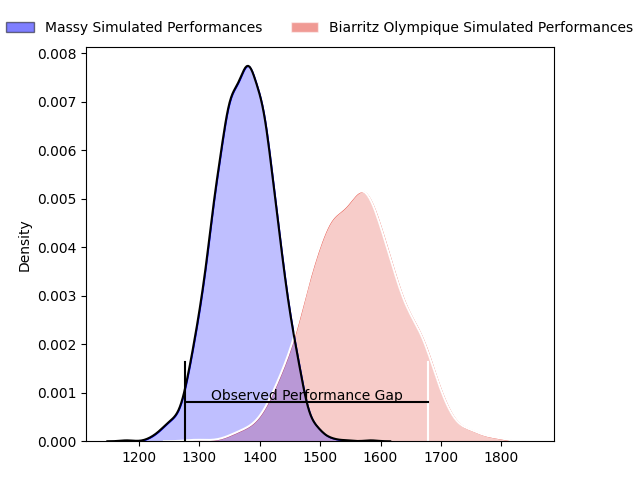
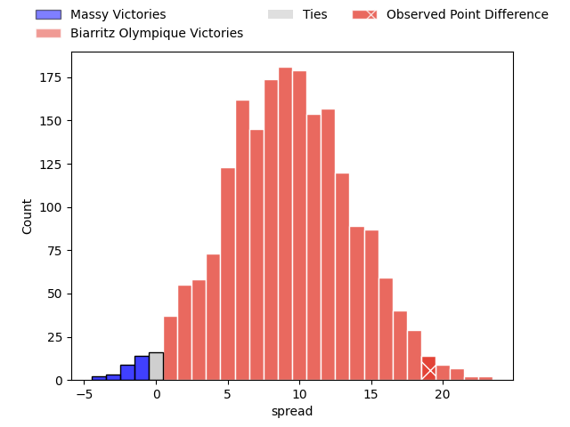
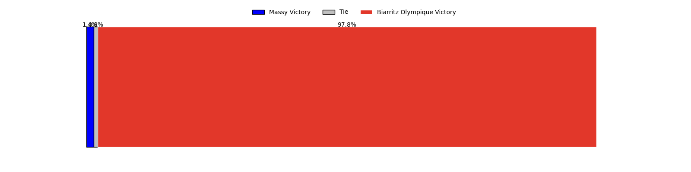
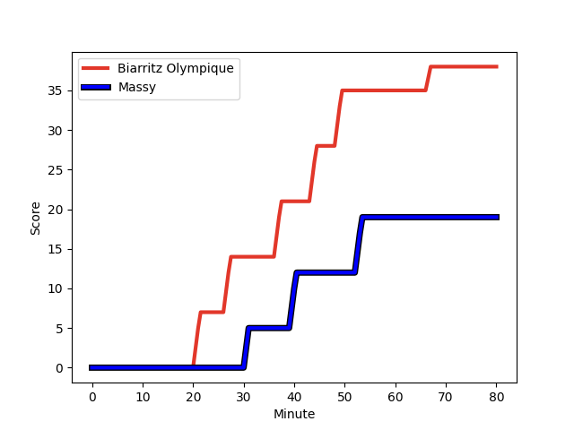
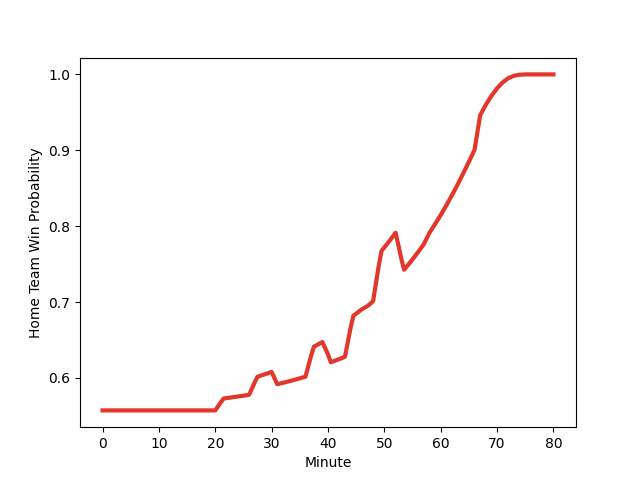

---  
layout: page  
title: Massy at Biarritz Olympique; 19-38  
date: 2023-03-03 19:30:00 18:00:00 -0500  
categories: match review  
---
# Massy at Biarritz Olympique; 19-38

# Club Level Predictions

The first set of predictions treats a club as the smallest object, as the club develops its members, organizes a gameplan, and deploys its players as needed for each match. This club model has a prediction of 0.742, which translates to predicting Biarritz Olympique to win by 9.3.

Each club has a rating and a rating deviation (simiar to a Glicko system), and expected performances can be generated. This allows for simulated matches and spreads like the ones below.
## Projected Performances

## Projected Spreads

## Projected Results

# Player Level Predictions

Treating teams instead as an entity made up of the currently active players, I have ratings for each player in an altogether different system. These can be combined to form team ratings once teamsheets are announced, weighting starters a bit higher than the reserves. After the match is played, players can be weighted by their minutes on the field, allowing for an accurate measure of the team's composition. With these compiled team ratings, we can make predictions, measure inaccuracy, and update the individual player ratings.
## Prediction with Player Minutes: Biarritz Olympique by 13.9

Biarritz Olympique by 9.9 on a neutral field
## Scores over Time

## Win Probability over Time

There were 5 large changes in win probability in this match
## Prediction without Player Minutes: Biarritz Olympique by 10.5

Biarritz Olympique by 6.5 on a neutral pitch

|   Away Minutes | Away Player                                                        |   Away elo |   Away Percentile |   Number |   Home Percentile |   Home elo | Home Player                                                         |   Home Minutes |
|---------------:|:-------------------------------------------------------------------|-----------:|------------------:|---------:|------------------:|-----------:|:--------------------------------------------------------------------|---------------:|
|             47 | [Alexandre Candel](..//playerfiles//AlexandreCandel_cleaned.md)    |      95.38 |               nan |        1 |                46 |      93.94 | [Giorgi Nutsubidze](..//playerfiles//GiorgiNutsubidze_cleaned.md)   |             40 |
|             80 | [Randy Grelleaud](..//playerfiles//RandyGrelleaud_cleaned.md)      |     100.47 |                71 |        2 |                51 |      95    | [Baptiste Erdocio](..//playerfiles//BaptisteErdocio_cleaned.md)     |             80 |
|             47 | [Guiterembi Vickos](..//playerfiles//GuiterembiVickos_cleaned.md)  |      93.57 |                33 |        3 |                54 |      93.64 | [Luka Azariashvili](..//playerfiles//LukaAzariashvili_cleaned.md)   |             40 |
|             47 | [Andrew Chauveau](..//playerfiles//AndrewChauveau_cleaned.md)      |      71.54 |                 6 |        4 |                43 |      92.88 | [Johan Aliouat](..//playerfiles//JohanAliouat_cleaned.md)           |             80 |
|             80 | [Louis Bruinsma](..//playerfiles//LouisBruinsma_cleaned.md)        |      73.49 |                 8 |        5 |                36 |      89.87 | [Josh Tyrell](..//playerfiles//JoshTyrell_cleaned.md)               |             80 |
|             80 | [Louis Bruinsma](..//playerfiles//LouisBruinsma_cleaned.md)        |      73.49 |                 7 |        5 |                36 |      89.87 | [Josh Tyrell](..//playerfiles//JoshTyrell_cleaned.md)               |             80 |
|             58 | [Tony Tissot](..//playerfiles//TonyTissot_cleaned.md)              |      85.83 |                27 |        6 |                17 |      83.86 | [David O'Callaghan](..//playerfiles//DavidO'Callaghan_cleaned.md)   |             40 |
|             58 | [Tony Tissot](..//playerfiles//TonyTissot_cleaned.md)              |      85.83 |                21 |        6 |                17 |      83.86 | [David O'Callaghan](..//playerfiles//DavidO'Callaghan_cleaned.md)   |             40 |
|             47 | [Mehdi Tlili](..//playerfiles//MehdiTlili_cleaned.md)              |      93.53 |               nan |        7 |                64 |      99.46 | [Thomas Hebert](..//playerfiles//ThomasHebert_cleaned.md)           |             80 |
|             80 | [Samuel Nollet](..//playerfiles//SamuelNollet_cleaned.md)          |      90.99 |                38 |        8 |                45 |      93.96 | [Elliott Dixon](..//playerfiles//ElliottDixon_cleaned.md)           |             80 |
|             58 | [Benjamin Prier](..//playerfiles//BenjaminPrier_cleaned.md)        |     119.75 |                97 |        9 |                49 |      94.28 | [Barnabé Couilloud](..//playerfiles//BarnabéCouilloud_cleaned.md)   |             80 |
|             80 | [Tom Deleuze](..//playerfiles//TomDeleuze_cleaned.md)              |      92.66 |                46 |       10 |                22 |      86.69 | [Baptiste Germain](..//playerfiles//BaptisteGermain_cleaned.md)     |             80 |
|             80 | [Nathan Farissier](..//playerfiles//NathanFarissier_cleaned.md)    |      88.97 |                30 |       11 |                90 |     112.41 | [Temo Matiu](..//playerfiles//TemoMatiu_cleaned.md)                 |             40 |
|             80 | [Mathieu Guillomot](..//playerfiles//MathieuGuillomot_cleaned.md)  |      53.86 |                 1 |       12 |               nan |      95    | [Joseph Tomane](..//playerfiles//JosephTomane_cleaned.md)           |             63 |
|             40 | [Arthur Seigneuret](..//playerfiles//ArthurSeigneuret_cleaned.md)  |      98.26 |                60 |       13 |                49 |      95.45 | [Ilian Perraux](..//playerfiles//IlianPerraux_cleaned.md)           |             80 |
|             80 | [Yanis Dit Robaglia](..//playerfiles//YanisDitRobaglia_cleaned.md) |      69.78 |                 5 |       14 |                42 |      92.37 | [Francois Vergnaud](..//playerfiles//FrancoisVergnaud_cleaned.md)   |             80 |
|             80 | [Thomas Rozière](..//playerfiles//ThomasRozière_cleaned.md)        |      87.65 |                20 |       15 |                29 |      87.34 | [Joe Jonas](..//playerfiles//JoeJonas_cleaned.md)                   |             80 |
|             40 | [Massimo Ortolan](..//playerfiles//MassimoOrtolan_cleaned.md)      |      94.18 |                47 |       16 |               nan |      95    | [Zakaria El Fakir](..//playerfiles//ZakariaElFakir_cleaned.md)      |             28 |
|             33 | [Marco Fuser](..//playerfiles//MarcoFuser_cleaned.md)              |      92    |                41 |       17 |                65 |      98.17 | [Killian Taofifenua](..//playerfiles//KillianTaofifenua_cleaned.md) |             40 |
|             33 | [Tijde Visser](..//playerfiles//TijdeVisser_cleaned.md)            |      90.65 |                33 |       18 |                76 |     104.65 | [John Dyer](..//playerfiles//JohnDyer_cleaned.md)                   |             40 |
|             33 | [Clément Lanen](..//playerfiles//ClémentLanen_cleaned.md)          |      91.92 |               nan |       19 |               nan |      95.53 | [Gilles Bosch](..//playerfiles//GillesBosch_cleaned.md)             |             40 |
|             33 | [Fernandez Correa](..//playerfiles//FernandezCorrea_cleaned.md)    |      82.72 |                11 |       20 |               nan |      95    | [Clément Pérusin](..//playerfiles//ClémentPérusin_cleaned.md)       |             17 |
|             22 | [Samuel Boissinot](..//playerfiles//SamuelBoissinot_cleaned.md)    |      83.75 |                25 |       21 |                54 |     100.19 | [Luka Tchelidze](..//playerfiles//LukaTchelidze_cleaned.md)         |             12 |
|             22 | [Maxime Danton](..//playerfiles//MaximeDanton_cleaned.md)          |     113.03 |                88 |       22 |               nan |     nan    | nan                                                                 |            nan |

