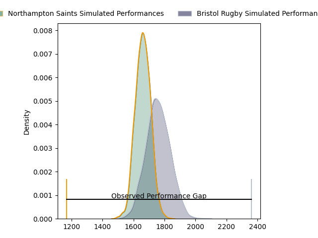
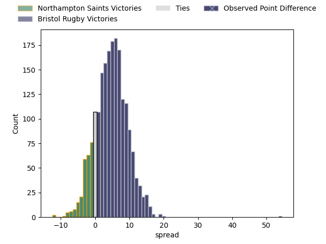
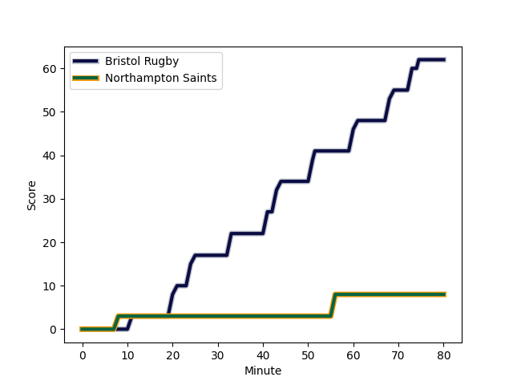
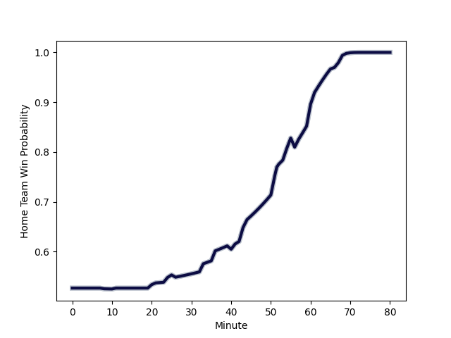

---  
layout: page  
title: Northampton Saints at Bristol Rugby; 8.0-62.0  
date: 2023-03-03 14:45:00 18:00:00 -0500  
categories: match review  
---
# Northampton Saints at Bristol Rugby; 8.0-62.0

# Club Level Predictions

The first set of predictions treats a club as the smallest object, as the club develops its members, organizes a gameplan, and deploys its players as needed for each match. This club model has a prediction of 0.631, which translates to predicting Bristol Rugby to win by 4.7.

Each club has a rating and a rating deviation (simiar to a Glicko system), and expected performances can be generated. This allows for simulated matches and spreads like the ones below.
## Projected Performances

## Projected Spreads

## Projected Results

# Player Level Predictions

Treating teams instead as an entity made up of the currently active players, I have ratings for each player in an altogether different system. These can be combined to form team ratings once teamsheets are announced, weighting starters a bit higher than the reserves. After the match is played, players can be weighted by their minutes on the field, allowing for an accurate measure of the team's composition. With these compiled team ratings, we can make predictions, measure inaccuracy, and update the individual player ratings.
## Prediction with Player Minutes: Bristol Rugby by 12.7

Bristol Rugby by 8.7 on a neutral field
## Scores over Time

## Win Probability over Time

There were 3 large changes in win probability in this match
## Prediction without Player Minutes: Bristol Rugby by 16.4

Bristol Rugby by 12.4 on a neutral pitch

|   Away Minutes | Away Player                                                             |   Away elo |   Away Percentile |   Number |   Home Percentile |   Home elo | Home Player                                                   |   Home Minutes |
|---------------:|:------------------------------------------------------------------------|-----------:|------------------:|---------:|------------------:|-----------:|:--------------------------------------------------------------|---------------:|
|             40 | [Ethan Waller](..//playerfiles//EthanWaller_cleaned.md)                 |     104.64 |                63 |        1 |                37 |      91.62 | [Yann Thomas](..//playerfiles//YannThomas_cleaned.md)         |             54 |
|             80 | [Sam Matavesi](..//playerfiles//SamMatavesi_cleaned.md)                 |      74.29 |                 6 |        2 |                43 |      92.42 | [Harry Thacker](..//playerfiles//HarryThacker_cleaned.md)     |             61 |
|             41 | [Alfie Petch](..//playerfiles//AlfiePetch_cleaned.md)                   |      70.71 |                 7 |        3 |                47 |      94.13 | [Max Lahiff](..//playerfiles//MaxLahiff_cleaned.md)           |             54 |
|             80 | [Lukhan Salakaia-Loto](..//playerfiles//LukhanSalakaia-Loto_cleaned.md) |      82.08 |                15 |        4 |                93 |     120.35 | [Joe Batley](..//playerfiles//JoeBatley_cleaned.md)           |             79 |
|             80 | [Alex Moon](..//playerfiles//AlexMoon_cleaned.md)                       |     122.21 |                94 |        5 |                84 |     110.42 | [Chris Vui](..//playerfiles//ChrisVui_cleaned.md)             |             73 |
|             26 | [Alex Coles](..//playerfiles//AlexColes_cleaned.md)                     |      68.11 |                 3 |        6 |                96 |     130.73 | [Sam Jeffries](..//playerfiles//SamJeffries_cleaned.md)       |             36 |
|             80 | [Angus Scott-Young](..//playerfiles//AngusScott-Young_cleaned.md)       |     114.08 |                88 |        7 |                85 |     111.22 | [Fitz Harding](..//playerfiles//FitzHarding_cleaned.md)       |             80 |
|             55 | [Sam Graham](..//playerfiles//SamGraham_cleaned.md)                     |     120.08 |                93 |        8 |                29 |      88.54 | [Magnus Bradbury](..//playerfiles//MagnusBradbury_cleaned.md) |             80 |
|             66 | [Callum Braley](..//playerfiles//CallumBraley_cleaned.md)               |      93.62 |                47 |        9 |                84 |     108.2  | [Harry Randall](..//playerfiles//HarryRandall_cleaned.md)     |             80 |
|             66 | [Fin Smith](..//playerfiles//FinSmith_cleaned.md)                       |      86.2  |                21 |       10 |                82 |     108.71 | [AJ MacGinty](..//playerfiles//AJMacGinty_cleaned.md)         |             57 |
|             80 | [Tom Collins](..//playerfiles//TomCollins_cleaned.md)                   |     119.49 |                93 |       11 |                85 |     109.97 | [Gabriel Ibitoye](..//playerfiles//GabrielIbitoye_cleaned.md) |             80 |
|             80 | [Rory Hutchinson](..//playerfiles//RoryHutchinson_cleaned.md)           |      89.84 |                34 |       12 |                10 |      77.3  | [James Williams](..//playerfiles//JamesWilliams_cleaned.md)   |             80 |
|             66 | [Fraser Dingwall](..//playerfiles//FraserDingwall_cleaned.md)           |      76.72 |                10 |       13 |                96 |     127.46 | [Semi Radradra](..//playerfiles//SemiRadradra_cleaned.md)     |             80 |
|             80 | [Courtnall Skosan](..//playerfiles//CourtnallSkosan_cleaned.md)         |     118.14 |                92 |       14 |                39 |      91.34 | [Ratu Naulago](..//playerfiles//RatuNaulago_cleaned.md)       |             26 |
|             80 | [George Hendy](..//playerfiles//GeorgeHendy_cleaned.md)                 |     114.86 |                88 |       15 |                92 |     118.93 | [Charles Piutau](..//playerfiles//CharlesPiutau_cleaned.md)   |             53 |
|             14 | [Tom Cruse](..//playerfiles//TomCruse_cleaned.md)                       |      97.42 |               nan |       16 |                79 |     103.63 | [Bryan Byrne](..//playerfiles//BryanByrne_cleaned.md)         |             26 |
|             40 | [Alex Waller](..//playerfiles//AlexWaller_cleaned.md)                   |     129.91 |                99 |       17 |                97 |     124.89 | [Jake Woolmore](..//playerfiles//JakeWoolmore_cleaned.md)     |             26 |
|             39 | [Paul Hill](..//playerfiles//PaulHill_cleaned.md)                       |     104.97 |                81 |       18 |               nan |      93.15 | [George Kloska](..//playerfiles//GeorgeKloska_cleaned.md)     |             26 |
|             40 | [Karl Wilkins](..//playerfiles//KarlWilkins_cleaned.md)                 |      67.81 |               nan |       19 |                98 |     133.69 | [Steven Luatua](..//playerfiles//StevenLuatua_cleaned.md)     |             30 |
|             25 | [Aaron Hinkley](..//playerfiles//AaronHinkley_cleaned.md)               |      88.84 |                27 |       20 |                66 |     100.48 | [Jake Heenan](..//playerfiles//JakeHeenan_cleaned.md)         |             14 |
|             14 | [Jake Garside](..//playerfiles//JakeGarside_cleaned.md)                 |      95.81 |               nan |       21 |                11 |      76.44 | [Andy Uren](..//playerfiles//AndyUren_cleaned.md)             |             27 |
|             14 | [James Grayson](..//playerfiles//JamesGrayson_cleaned.md)               |      97.83 |                56 |       22 |                93 |     118.45 | [Sam Bedlow](..//playerfiles//SamBedlow_cleaned.md)           |             23 |
|             14 | [Tom Litchfield](..//playerfiles//TomLitchfield_cleaned.md)             |      92.94 |               nan |       23 |                15 |      83.9  | [Ioan Lloyd](..//playerfiles//IoanLloyd_cleaned.md)           |             54 |

