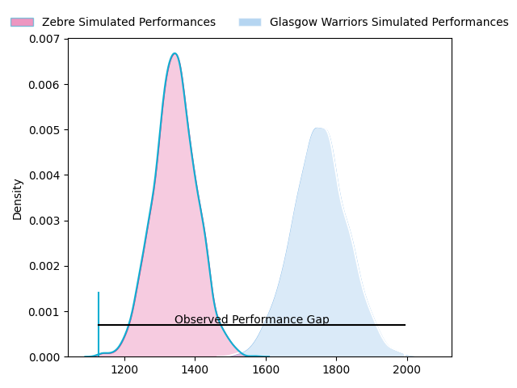
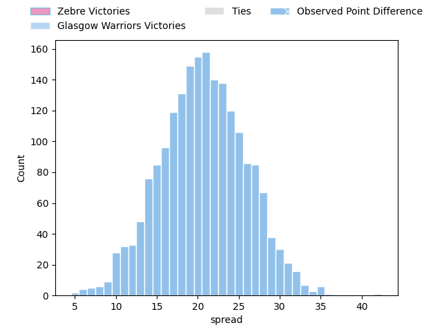
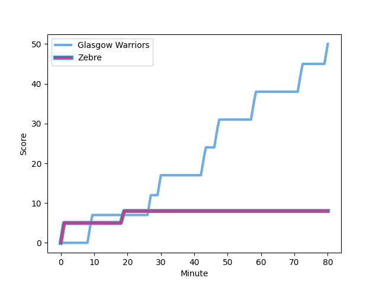
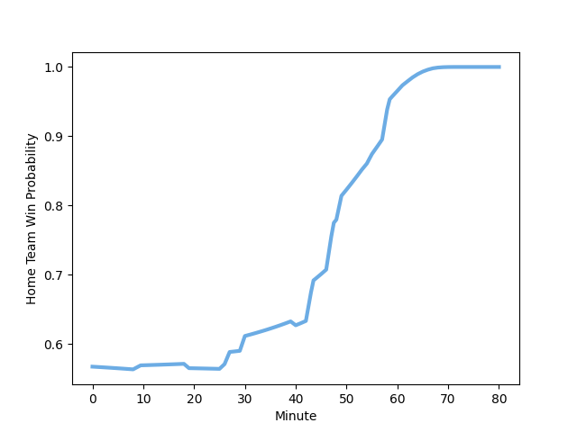

---  
layout: page  
title: Zebre at Glasgow Warriors; 8-50  
date: 2023-03-03 20:35:00 18:00:00 -0500  
categories: match review  
---
# Zebre at Glasgow Warriors; 8-50

# Club Level Predictions

The first set of predictions treats a club as the smallest object, as the club develops its members, organizes a gameplan, and deploys its players as needed for each match. This club model has a prediction of 0.91, which translates to predicting Glasgow Warriors to win by 20.5.

Each club has a rating and a rating deviation (simiar to a Glicko system), and expected performances can be generated. This allows for simulated matches and spreads like the ones below.
## Projected Performances

## Projected Spreads

## Projected Results

# Player Level Predictions

Treating teams instead as an entity made up of the currently active players, I have ratings for each player in an altogether different system. These can be combined to form team ratings once teamsheets are announced, weighting starters a bit higher than the reserves. After the match is played, players can be weighted by their minutes on the field, allowing for an accurate measure of the team's composition. With these compiled team ratings, we can make predictions, measure inaccuracy, and update the individual player ratings.
## Prediction with Player Minutes: Glasgow Warriors by 14.9

Glasgow Warriors by 10.9 on a neutral field
## Scores over Time

## Win Probability over Time

There were 4 large changes in win probability in this match
## Prediction without Player Minutes: Glasgow Warriors by 11.9

Glasgow Warriors by 7.9 on a neutral pitch

|   Away Minutes | Away Player                                                                 |   Away elo |   Away Percentile |   Number |   Home Percentile |   Home elo | Home Player                                                                   |   Home Minutes |
|---------------:|:----------------------------------------------------------------------------|-----------:|------------------:|---------:|------------------:|-----------:|:------------------------------------------------------------------------------|---------------:|
|             49 | [Paolo Buonfiglio](..//playerfiles//PaoloBuonfiglio_cleaned.md)             |      97.58 |                65 |        1 |               nan |      90.99 | [Allan Michael Elgin Dell](..//playerfiles//AllanMichaelElginDell_cleaned.md) |             49 |
|             49 | [Giampietro Ribaldi](..//playerfiles//GiampietroRibaldi_cleaned.md)         |      89.16 |                31 |        2 |                30 |      88.91 | [Johnny Matthews](..//playerfiles//JohnnyMatthews_cleaned.md)                 |             49 |
|             49 | [Matteo Nocera](..//playerfiles//MatteoNocera_cleaned.md)                   |      82.66 |                14 |        3 |                79 |      99.66 | [Simon Berghan](..//playerfiles//SimonBerghan_cleaned.md)                     |             54 |
|             61 | [Leonard Krumov](..//playerfiles//LeonardKrumov_cleaned.md)                 |      98.34 |                60 |        4 |                63 |      99.33 | [Lewis Bean](..//playerfiles//LewisBean_cleaned.md)                           |             54 |
|             80 | [Andrea Zambonin](..//playerfiles//AndreaZambonin_cleaned.md)               |      77.57 |                11 |        5 |                83 |     106.37 | [Jean-Pierre du Preez](..//playerfiles//Jean-PierreduPreez_cleaned.md)        |             80 |
|             54 | [Luca Andreani](..//playerfiles//LucaAndreani_cleaned.md)                   |      87.12 |                24 |        6 |                28 |      88.23 | [Scott Cummings](..//playerfiles//ScottCummings_cleaned.md)                   |             80 |
|             80 | [Matt Kvesic](..//playerfiles//MattKvesic_cleaned.md)                       |      90.25 |                35 |        7 |                30 |      88.98 | [Rory Darge](..//playerfiles//RoryDarge_cleaned.md)                           |             67 |
|             80 | [Davide Ruggeri](..//playerfiles//DavideRuggeri_cleaned.md)                 |      89.15 |                35 |        8 |                46 |      94.11 | [Sione Vailanu](..//playerfiles//SioneVailanu_cleaned.md)                     |             80 |
|             26 | [Chris Cook](..//playerfiles//ChrisCook_cleaned.md)                         |      93.88 |                48 |        9 |                63 |      96.61 | [George Horne](..//playerfiles//GeorgeHorne_cleaned.md)                       |             67 |
|             62 | [Tiff Eden](..//playerfiles//TiffEden_cleaned.md)                           |      93.7  |                45 |       10 |                25 |      87.86 | [Tom Jordan](..//playerfiles//TomJordan_cleaned.md)                           |             55 |
|             80 | [Simone Gesi](..//playerfiles//SimoneGesi_cleaned.md)                       |      84.63 |                20 |       11 |                52 |      95.94 | [Cole Forbes](..//playerfiles//ColeForbes_cleaned.md)                         |             80 |
|             40 | [Enrico Lucchin](..//playerfiles//EnricoLucchin_cleaned.md)                 |      78.68 |                11 |       12 |                52 |      95.94 | [Sam Johnson](..//playerfiles//SamJohnson_cleaned.md)                         |             80 |
|             80 | [Tommaso Boni](..//playerfiles//TommasoBoni_cleaned.md)                     |      95.86 |                51 |       13 |                90 |     115.06 | [Stafford McDowall](..//playerfiles//StaffordMcDowall_cleaned.md)             |             80 |
|             80 | [Jacopo Trulla](..//playerfiles//JacopoTrulla_cleaned.md)                   |     100.62 |                66 |       14 |                30 |      87.33 | [Josh McKay](..//playerfiles//JoshMcKay_cleaned.md)                           |             80 |
|             80 | [Richard Kriel](..//playerfiles//RichardKriel_cleaned.md)                   |      95.5  |                53 |       15 |                91 |     116.59 | [Ollie Smith](..//playerfiles//OllieSmith_cleaned.md)                         |             80 |
|             54 | [Ratko Jelic](..//playerfiles//RatkoJelic_cleaned.md)                       |      91.25 |                56 |       16 |                84 |     108.07 | [Fraser Brown](..//playerfiles//FraserBrown_cleaned.md)                       |             31 |
|             40 | [Damiano Mazza](..//playerfiles//DamianoMazza_cleaned.md)                   |      95.39 |               nan |       17 |                85 |     108.02 | [Jamie Bhatti](..//playerfiles//JamieBhatti_cleaned.md)                       |             31 |
|             31 | [Luca Rizzoli](..//playerfiles//LucaRizzoli_cleaned.md)                     |      71.68 |                 4 |       18 |                69 |      99.19 | [Thomas Gordon](..//playerfiles//ThomasGordon_cleaned.md)                     |             26 |
|             31 | [Marco Manfredi](..//playerfiles//MarcoManfredi_cleaned.md)                 |      89.99 |                33 |       19 |               nan |      95    | [Olivier Kebble](..//playerfiles//OlivierKebble_cleaned.md)                   |             26 |
|             31 | [Ion Neculai](..//playerfiles//IonNeculai_cleaned.md)                       |      99.93 |                66 |       20 |                52 |      96.81 | [Duncan Weir](..//playerfiles//DuncanWeir_cleaned.md)                         |             25 |
|             26 | [Giovanni Licata](..//playerfiles//GiovanniLicata_cleaned.md)               |      93.94 |                45 |       21 |                74 |     104.34 | [Alex Samuel](..//playerfiles//AlexSamuel_cleaned.md)                         |             13 |
|             19 | [Jan-Frederik Uys](..//playerfiles//Jan-FrederikUys_cleaned.md)             |      95.25 |                51 |       22 |                65 |      99.81 | [Jamie Dobie](..//playerfiles//JamieDobie_cleaned.md)                         |             13 |
|             18 | [Geronimo Prisciantelli](..//playerfiles//GeronimoPrisciantelli_cleaned.md) |      98.16 |                54 |       23 |               nan |     nan    | nan                                                                           |            nan |

