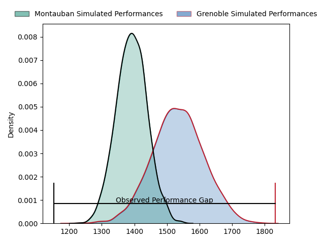
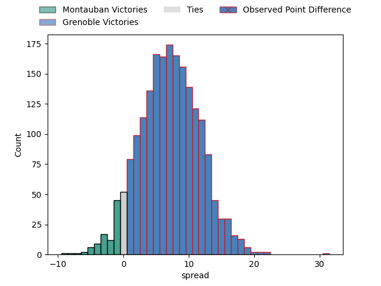
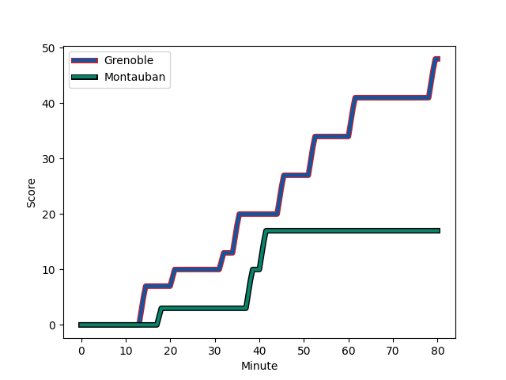
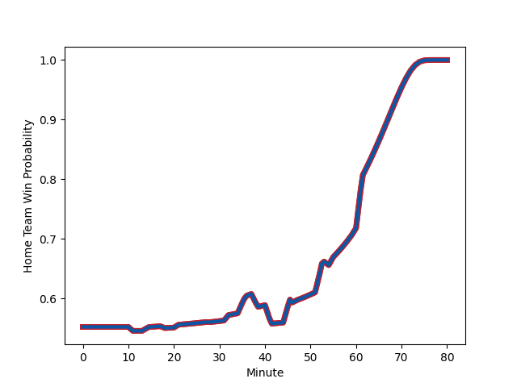

---  
layout: page  
title: Montauban at Grenoble; 17-48  
date: 2023-03-03 19:30:00 18:00:00 -0500  
categories: match review  
---
# Montauban at Grenoble; 17-48

# Club Level Predictions

The first set of predictions treats a club as the smallest object, as the club develops its members, organizes a gameplan, and deploys its players as needed for each match. This club model has a prediction of 0.691, which translates to predicting Grenoble to win by 7.1.

Each club has a rating and a rating deviation (simiar to a Glicko system), and expected performances can be generated. This allows for simulated matches and spreads like the ones below.
## Projected Performances

## Projected Spreads

## Projected Results

# Player Level Predictions

Treating teams instead as an entity made up of the currently active players, I have ratings for each player in an altogether different system. These can be combined to form team ratings once teamsheets are announced, weighting starters a bit higher than the reserves. After the match is played, players can be weighted by their minutes on the field, allowing for an accurate measure of the team's composition. With these compiled team ratings, we can make predictions, measure inaccuracy, and update the individual player ratings.
## Prediction with Player Minutes: Grenoble by 12.6

Grenoble by 8.6 on a neutral field
## Scores over Time

## Win Probability over Time

There were 4 large changes in win probability in this match
## Prediction without Player Minutes: Grenoble by 14.7

Grenoble by 10.7 on a neutral pitch

|   Away Minutes | Away Player                                                         |   Away elo |   Away Percentile |   Number |   Home Percentile |   Home elo | Home Player                                                           |   Home Minutes |
|---------------:|:--------------------------------------------------------------------|-----------:|------------------:|---------:|------------------:|-----------:|:----------------------------------------------------------------------|---------------:|
|             52 | [Lucas Seyrolle](..//playerfiles//LucasSeyrolle_cleaned.md)         |      93.83 |                51 |        1 |                90 |     112.43 | [Zack Gauthier](..//playerfiles//ZackGauthier_cleaned.md)             |             54 |
|             52 | [Kevin Firmin](..//playerfiles//KevinFirmin_cleaned.md)             |      90.82 |                55 |        2 |               nan |      96.71 | [Bernabe Massa](..//playerfiles//BernabeMassa_cleaned.md)             |             28 |
|             52 | [Mirian Burduli](..//playerfiles//MirianBurduli_cleaned.md)         |     102.89 |                76 |        3 |                63 |      96.59 | [Regis Montagne](..//playerfiles//RegisMontagne_cleaned.md)           |             54 |
|             80 | [Alexandre Manukula](..//playerfiles//AlexandreManukula_cleaned.md) |     102.35 |                70 |        4 |                67 |     101.13 | [Thomas Lainault](..//playerfiles//ThomasLainault_cleaned.md)         |             80 |
|             52 | [Dan Malafosse](..//playerfiles//DanMalafosse_cleaned.md)           |      86.11 |                25 |        5 |                56 |      96.91 | [Tanginoa Halaifonua](..//playerfiles//TanginoaHalaifonua_cleaned.md) |             60 |
|             80 | [Kyllian Ringuet](..//playerfiles//KyllianRinguet_cleaned.md)       |      84.19 |                19 |        6 |                55 |      97.2  | [Antonin Berruyer](..//playerfiles//AntoninBerruyer_cleaned.md)       |             47 |
|             80 | [Frédéric Quercy](..//playerfiles//FrédéricQuercy_cleaned.md)       |      58.57 |                 2 |        7 |                65 |     101.92 | [Steeve Blanc-Mappaz](..//playerfiles//SteeveBlanc-Mappaz_cleaned.md) |             80 |
|             46 | [Epeli Momo](..//playerfiles//EpeliMomo_cleaned.md)                 |      69.01 |                 4 |        8 |                83 |     109.31 | [Pio Muarua](..//playerfiles//PioMuarua_cleaned.md)                   |             80 |
|             52 | [Alexis Bernadet](..//playerfiles//AlexisBernadet_cleaned.md)       |      99.15 |                73 |        9 |                69 |     100.82 | [Éric Escande](..//playerfiles//ÉricEscande_cleaned.md)               |             61 |
|             80 | [Jérôme Bosviel](..//playerfiles//JérômeBosviel_cleaned.md)         |     107.06 |                81 |       10 |                67 |     102.67 | [Thomas Fortunel](..//playerfiles//ThomasFortunel_cleaned.md)         |             80 |
|             80 | [Bastien Guillemin](..//playerfiles//BastienGuillemin_cleaned.md)   |      97.64 |                58 |       11 |               nan |      95    | [Erwan Dridi](..//playerfiles//ErwanDridi_cleaned.md)                 |             80 |
|             80 | [Maxence Bonnin](..//playerfiles//MaxenceBonnin_cleaned.md)         |      98.27 |                60 |       12 |                80 |     106.87 | [Romain Barthélémy](..//playerfiles//RomainBarthélémy_cleaned.md)     |             41 |
|             80 | [Paul Bonnefond](..//playerfiles//PaulBonnefond_cleaned.md)         |      89.84 |                34 |       13 |                 7 |      73.45 | [Romain Trouilloud](..//playerfiles//RomainTrouilloud_cleaned.md)     |             80 |
|             55 | [Jean-Bernard Pujol](..//playerfiles//Jean-BernardPujol_cleaned.md) |      93.05 |                44 |       14 |                69 |     101.46 | [Karim Qadiri](..//playerfiles//KarimQadiri_cleaned.md)               |             80 |
|             36 | [Maxime Mathy](..//playerfiles//MaximeMathy_cleaned.md)             |     103.3  |                70 |       15 |                73 |     105.25 | [Julien Farnoux](..//playerfiles//JulienFarnoux_cleaned.md)           |             11 |
|             44 | [Taleta Tupuola](..//playerfiles//TaletaTupuola_cleaned.md)         |      97.35 |                57 |       16 |                33 |      89.63 | [Terence Hepetema](..//playerfiles//TerenceHepetema_cleaned.md)       |             69 |
|             28 | [David Marotel](..//playerfiles//DavidMarotel_cleaned.md)           |      94.2  |               nan |       17 |                52 |      94.96 | [Mathis Sarragallet](..//playerfiles//MathisSarragallet_cleaned.md)   |             52 |
|             34 | [Hugo Fuentes](..//playerfiles//HugoFuentes_cleaned.md)             |      95    |               nan |       18 |                58 |      98.34 | [Corentin Glenat](..//playerfiles//CorentinGlenat_cleaned.md)         |             39 |
|             28 | [Nicolas Agnesi](..//playerfiles//NicolasAgnesi_cleaned.md)         |     116.03 |                93 |       19 |                62 |      99.12 | [Thibaut Martel](..//playerfiles//ThibautMartel_cleaned.md)           |             33 |
|             28 | [Dimitri Vaotoa](..//playerfiles//DimitriVaotoa_cleaned.md)         |      93.53 |                45 |       20 |                15 |      83.15 | [Luka Goginava](..//playerfiles//LukaGoginava_cleaned.md)             |             26 |
|             28 | [Simon Renaud](..//playerfiles//SimonRenaud_cleaned.md)             |      84.49 |                22 |       21 |                31 |      91.91 | [Irakli Aptsiauri](..//playerfiles//IrakliAptsiauri_cleaned.md)       |             26 |
|             28 | [Quentin Delord](..//playerfiles//QuentinDelord_cleaned.md)         |      95    |               nan |       22 |                71 |     102.53 | [Levi Douglas](..//playerfiles//LeviDouglas_cleaned.md)               |             20 |
|             25 | [Semesa Rokoduguni](..//playerfiles//SemesaRokoduguni_cleaned.md)   |      85.34 |                22 |       23 |                74 |     103.52 | [Bautista Ezcurra](..//playerfiles//BautistaEzcurra_cleaned.md)       |             19 |

