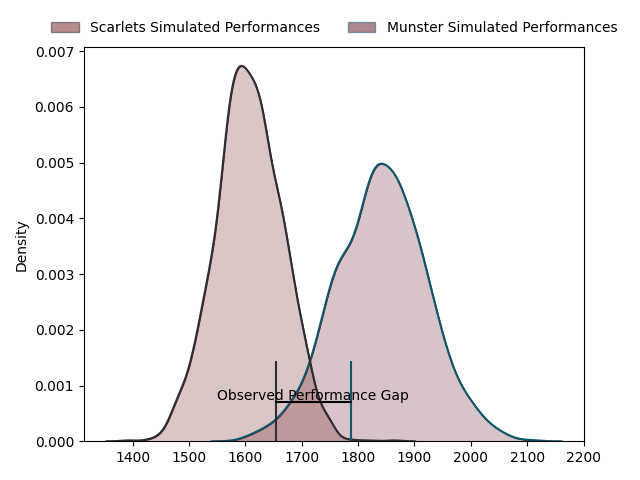
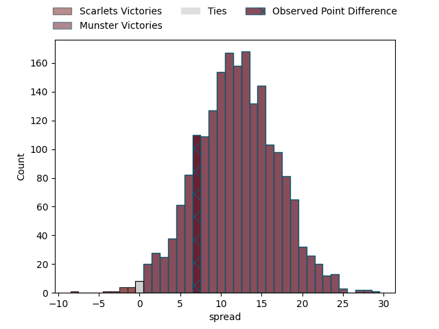
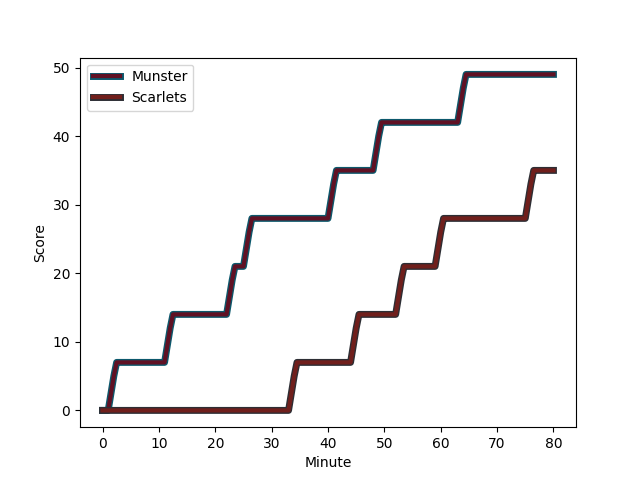
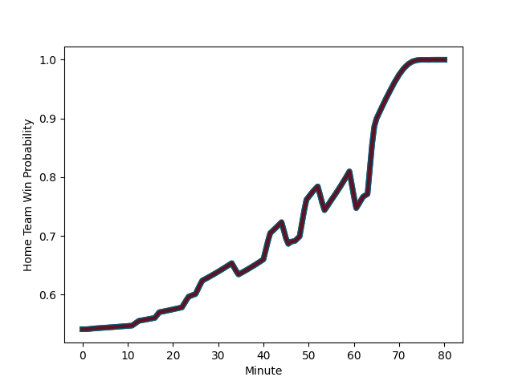

---  
layout: page  
title: Scarlets at Munster; 42-49  
date: 2023-03-03 20:35:00 18:00:00 -0500  
categories: match review  
---
# Scarlets at Munster; 42-49

# Club Level Predictions

The first set of predictions treats a club as the smallest object, as the club develops its members, organizes a gameplan, and deploys its players as needed for each match. This club model has a prediction of 0.792, which translates to predicting Munster to win by 11.8.

Each club has a rating and a rating deviation (simiar to a Glicko system), and expected performances can be generated. This allows for simulated matches and spreads like the ones below.
## Projected Performances

## Projected Spreads

## Projected Results

# Player Level Predictions

Treating teams instead as an entity made up of the currently active players, I have ratings for each player in an altogether different system. These can be combined to form team ratings once teamsheets are announced, weighting starters a bit higher than the reserves. After the match is played, players can be weighted by their minutes on the field, allowing for an accurate measure of the team's composition. With these compiled team ratings, we can make predictions, measure inaccuracy, and update the individual player ratings.
## Prediction with Player Minutes: Munster by 11.2

Munster by 7.2 on a neutral field
## Scores over Time

## Win Probability over Time

There were 7 large changes in win probability in this match
## Prediction without Player Minutes: Munster by 15.9

Munster by 11.9 on a neutral pitch

|   Away Minutes | Away Player                                                          |   Away elo |   Away Percentile |   Number |   Home Percentile |   Home elo | Home Player                                                                    |   Home Minutes |
|---------------:|:---------------------------------------------------------------------|-----------:|------------------:|---------:|------------------:|-----------:|:-------------------------------------------------------------------------------|---------------:|
|             54 | [Kemsley Mathias](..//playerfiles//KemsleyMathias_cleaned.md)        |     104.14 |                80 |        1 |                86 |     108.17 | [Josh Wycherley](..//playerfiles//JoshWycherley_cleaned.md)                    |             47 |
|             80 | [Shaun Evans](..//playerfiles//ShaunEvans_cleaned.md)                |      98.47 |                64 |        2 |                53 |     100.26 | [Diarmuid Barron](..//playerfiles//DiarmuidBarron_cleaned.md)                  |             47 |
|             45 | [Sam Wainwright](..//playerfiles//SamWainwright_cleaned.md)          |      90.35 |                32 |        3 |                86 |     107.68 | [Roman Salanoa](..//playerfiles//RomanSalanoa_cleaned.md)                      |             47 |
|             65 | [Vaea Fifita](..//playerfiles//VaeaFifita_cleaned.md)                |     112.8  |                88 |        4 |                93 |     119.78 | [Jean Kleyn](..//playerfiles//JeanKleyn_cleaned.md)                            |             63 |
|             80 | [Sam Lousi](..//playerfiles//SamLousi_cleaned.md)                    |     116.59 |                92 |        5 |                81 |     107.28 | [Fineen Wycherley](..//playerfiles//FineenWycherley_cleaned.md)                |             80 |
|             63 | [Joshua McLeod](..//playerfiles//JoshuaMcLeod_cleaned.md)            |      97.28 |                55 |        6 |                78 |     106.39 | [Jack O'Donoghue](..//playerfiles//JackO'Donoghue_cleaned.md)                  |             51 |
|             80 | [Daniel Fabian Davis](..//playerfiles//DanielFabianDavis_cleaned.md) |     112.47 |                87 |        7 |                89 |     114.89 | [John Hodnett](..//playerfiles//JohnHodnett_cleaned.md)                        |             68 |
|             80 | [Sione Kalamafoni](..//playerfiles//SioneKalamafoni_cleaned.md)      |     112.95 |                88 |        8 |                92 |     116.96 | [Gavin Coombes](..//playerfiles//GavinCoombes_cleaned.md)                      |             80 |
|             45 | [Dan Blacker](..//playerfiles//DanBlacker_cleaned.md)                |      98.59 |                56 |        9 |                88 |     109.9  | [Paddy Patterson](..//playerfiles//PaddyPatterson_cleaned.md)                  |             80 |
|             80 | [Sam Costelow](..//playerfiles//SamCostelow_cleaned.md)              |     104.79 |                76 |       10 |                89 |     113.82 | [Joey Carbery](..//playerfiles//JoeyCarbery_cleaned.md)                        |             52 |
|             80 | [Steffan Evans](..//playerfiles//SteffanEvans_cleaned.md)            |     112.8  |                89 |       11 |                91 |     117.36 | [Shane Daly](..//playerfiles//ShaneDaly_cleaned.md)                            |             80 |
|             80 | [Ioan Nicholas](..//playerfiles//IoanNicholas_cleaned.md)            |     107.01 |                81 |       12 |                93 |     117.81 | [Malakai Fekitoa](..//playerfiles//MalakaiFekitoa_cleaned.md)                  |             80 |
|             80 | [Joe Roberts](..//playerfiles//JoeRoberts_cleaned.md)                |     110.46 |                87 |       13 |                93 |     117.83 | [Antoine Frisch](..//playerfiles//AntoineFrisch_cleaned.md)                    |             80 |
|             80 | [Tom Rogers](..//playerfiles//TomRogers_cleaned.md)                  |      95    |               nan |       14 |                74 |     103.46 | [Calvin Nash](..//playerfiles//CalvinNash_cleaned.md)                          |             80 |
|             17 | [Johnny McNicholl](..//playerfiles//JohnnyMcNicholl_cleaned.md)      |     109.72 |                84 |       15 |                32 |      95.4  | [Patrick Campbell](..//playerfiles//PatrickCampbell_cleaned.md)                |             55 |
|             63 | [Johnny Williams](..//playerfiles//JohnnyWilliams_cleaned.md)        |      95    |               nan |       16 |                92 |     113.87 | [Niall Scannell](..//playerfiles//NiallScannell_cleaned.md)                    |             33 |
|             35 | [Gareth Davies](..//playerfiles//GarethDavies_cleaned.md)            |     102.7  |                74 |       17 |               nan |      95    | [Keynan Knox](..//playerfiles//KeynanKnox_cleaned.md)                          |             33 |
|             35 | [Javan Sebastian](..//playerfiles//JavanSebastian_cleaned.md)        |      98.54 |                58 |       18 |               nan |      96.7  | [Mark Donnelly](..//playerfiles//MarkDonnelly_cleaned.md)                      |             33 |
|             26 | [Steff Thomas](..//playerfiles//SteffThomas_cleaned.md)              |     103.2  |                75 |       19 |                68 |     104.97 | [Jack O'Sullivan](..//playerfiles//JackO'Sullivan_cleaned.md)                  |             29 |
|             17 | [Carwyn Tuipulotu](..//playerfiles//CarwynTuipulotu_cleaned.md)      |      94.57 |                45 |       20 |                81 |     106.87 | [Jack Crowley](..//playerfiles//JackCrowley_cleaned.md)                        |             28 |
|             15 | [Morgan Jones](..//playerfiles//MorganJones_cleaned.md)              |      93.57 |                46 |       21 |               nan |      97.52 | [Ethan Coughlan](..//playerfiles//EthanCoughlan_cleaned.md)                    |             25 |
|            nan | nan                                                                  |     nan    |               nan |       22 |               nan |      95    | [Rudolph Gerhardus Snyman](..//playerfiles//RudolphGerhardusSnyman_cleaned.md) |             17 |
|            nan | nan                                                                  |     nan    |               nan |       23 |                83 |     111    | [Alex Kendellen](..//playerfiles//AlexKendellen_cleaned.md)                    |             12 |

