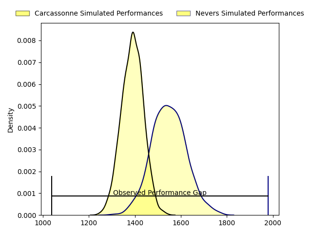
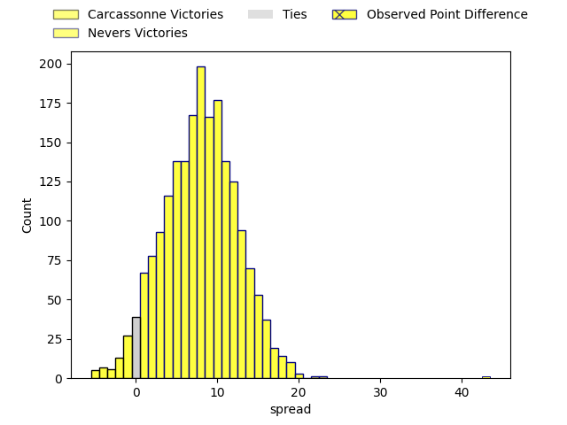
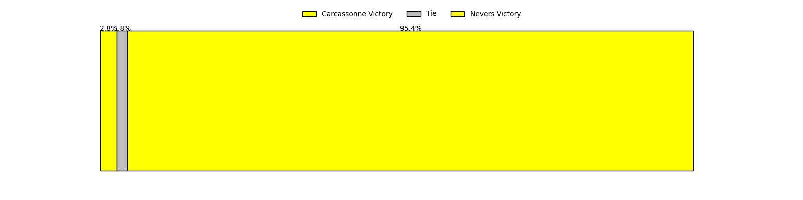
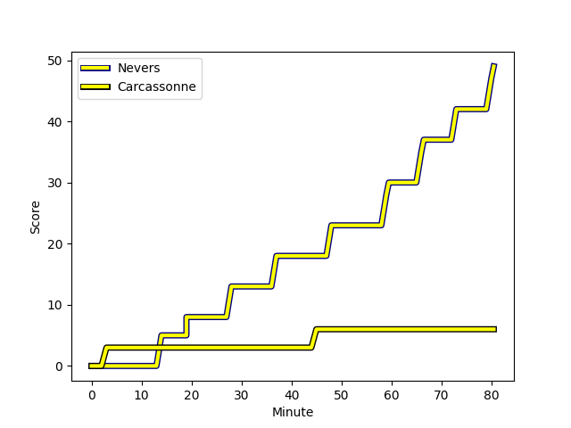
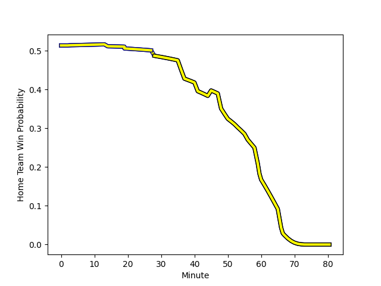

---  
layout: page  
title: Carcassonne at Nevers; 6-49  
date: 2023-03-03 19:30:00 18:00:00 -0500  
categories: match review  
---
# Carcassonne at Nevers; 6-49

# Club Level Predictions

The first set of predictions treats a club as the smallest object, as the club develops its members, organizes a gameplan, and deploys its players as needed for each match. This club model has a prediction of 0.71, which translates to predicting Nevers to win by 7.9.

Each club has a rating and a rating deviation (simiar to a Glicko system), and expected performances can be generated. This allows for simulated matches and spreads like the ones below.
## Projected Performances

## Projected Spreads

## Projected Results

# Player Level Predictions

Treating teams instead as an entity made up of the currently active players, I have ratings for each player in an altogether different system. These can be combined to form team ratings once teamsheets are announced, weighting starters a bit higher than the reserves. After the match is played, players can be weighted by their minutes on the field, allowing for an accurate measure of the team's composition. With these compiled team ratings, we can make predictions, measure inaccuracy, and update the individual player ratings.
## Prediction with Player Minutes: Nevers by 10.3

Nevers by 6.3 on a neutral field
## Scores over Time

## Win Probability over Time

There were 5 large changes in win probability in this match
## Prediction without Player Minutes: Nevers by 8.8

Nevers by 4.8 on a neutral pitch

|   Away Minutes | Away Player                                                                    |   Away elo |   Away Percentile |   Number |   Home Percentile |   Home elo | Home Player                                                                   |   Home Minutes |
|---------------:|:-------------------------------------------------------------------------------|-----------:|------------------:|---------:|------------------:|-----------:|:------------------------------------------------------------------------------|---------------:|
|             60 | [Sami Mavinga](..//playerfiles//SamiMavinga_cleaned.md)                        |      98.05 |                61 |        1 |                74 |     101.74 | [Aitor Kitutu](..//playerfiles//AitorKitutu_cleaned.md)                       |             53 |
|             36 | [Luka Petriashvili](..//playerfiles//LukaPetriashvili_cleaned.md)              |     110.02 |                86 |        2 |                61 |      97.98 | [Elia Elia](..//playerfiles//EliaElia_cleaned.md)                             |             59 |
|             36 | [Luka Petriashvili](..//playerfiles//LukaPetriashvili_cleaned.md)              |     110.02 |                91 |        2 |                61 |      97.98 | [Elia Elia](..//playerfiles//EliaElia_cleaned.md)                             |             59 |
|             50 | [Jérémy Boyadjis](..//playerfiles//JérémyBoyadjis_cleaned.md)                  |     106.17 |                84 |        3 |                72 |     101.05 | [Ilia Kaikatsishvili](..//playerfiles//IliaKaikatsishvili_cleaned.md)         |             53 |
|             60 | [George Merrick](..//playerfiles//GeorgeMerrick_cleaned.md)                    |      90    |                33 |        4 |                67 |     100.83 | [Christiaan van der Merwe](..//playerfiles//ChristiaanvanderMerwe_cleaned.md) |             80 |
|             60 | [Rynard Ligtoring Landman](..//playerfiles//RynardLigtoringLandman_cleaned.md) |      94.36 |                48 |        5 |                87 |     111.93 | [Senio Toleafoa](..//playerfiles//SenioToleafoa_cleaned.md)                   |             56 |
|             80 | [Come Clayver Joussain](..//playerfiles//ComeClayverJoussain_cleaned.md)       |      95.22 |                51 |        6 |                36 |      90.37 | [Luka Plataret](..//playerfiles//LukaPlataret_cleaned.md)                     |             49 |
|             80 | [Robert Harley](..//playerfiles//RobertHarley_cleaned.md)                      |      94.12 |                48 |        7 |                98 |     137.04 | [Hugues Bastide](..//playerfiles//HuguesBastide_cleaned.md)                   |             59 |
|             41 | [Pierre Reynaud](..//playerfiles//PierreReynaud_cleaned.md)                    |     105.28 |                78 |        8 |                72 |     102.7  | [Jason-Collin Fraser](..//playerfiles//Jason-CollinFraser_cleaned.md)         |             80 |
|             41 | [Pierre Pagès](..//playerfiles//PierrePagès_cleaned.md)                        |      93.44 |                47 |        9 |                81 |     105.45 | [Yoan Cottin](..//playerfiles//YoanCottin_cleaned.md)                         |             57 |
|             80 | [Damien Añon](..//playerfiles//DamienAñon_cleaned.md)                          |      85.52 |                21 |       10 |                54 |      96.82 | [Shaun Reynolds](..//playerfiles//ShaunReynolds_cleaned.md)                   |             50 |
|             80 | [Clément Clavières](..//playerfiles//ClémentClavières_cleaned.md)              |      90.84 |                38 |       11 |                93 |     118.11 | [Christian Erasmus](..//playerfiles//ChristianErasmus_cleaned.md)             |             80 |
|             80 | [Pierre Aguillon](..//playerfiles//PierreAguillon_cleaned.md)                  |     110.94 |                88 |       12 |                83 |     107.47 | [Leonard Paris](..//playerfiles//LeonardParis_cleaned.md)                     |             80 |
|             80 | [Joris Dupont](..//playerfiles//JorisDupont_cleaned.md)                        |      95    |               nan |       13 |                31 |      89.07 | [Alifereti Loaloa](..//playerfiles//AliferetiLoaloa_cleaned.md)               |             80 |
|             80 | [Benoit Jasmin](..//playerfiles//BenoitJasmin_cleaned.md)                      |     140.03 |                98 |       14 |                39 |      91.03 | [Christian Ambadiang](..//playerfiles//ChristianAmbadiang_cleaned.md)         |             80 |
|             36 | [Maxime Gianet](..//playerfiles//MaximeGianet_cleaned.md)                      |     105.71 |                74 |       15 |                56 |      98.16 | [Kylian Jaminet](..//playerfiles//KylianJaminet_cleaned.md)                   |             80 |
|             44 | [Baptiste Mouchous](..//playerfiles//BaptisteMouchous_cleaned.md)              |      84.2  |                20 |       16 |                54 |      98.41 | [Shaun Adendorff](..//playerfiles//ShaunAdendorff_cleaned.md)                 |             31 |
|             44 | [Baptiste Mouchous](..//playerfiles//BaptisteMouchous_cleaned.md)              |      84.2  |                33 |       16 |                54 |      98.41 | [Shaun Adendorff](..//playerfiles//ShaunAdendorff_cleaned.md)                 |             31 |
|             44 | [Connor Sa](..//playerfiles//ConnorSa_cleaned.md)                              |      86.89 |                24 |       17 |                82 |     106.99 | [Yohan Le Bourhis](..//playerfiles//YohanLeBourhis_cleaned.md)                |             30 |
|             39 | [Étienne Herjean](..//playerfiles//ÉtienneHerjean_cleaned.md)                  |      98.76 |                60 |       18 |                67 |     100.96 | [Tomike Mataradze](..//playerfiles//TomikeMataradze_cleaned.md)               |             27 |
|             39 | [Martin Dulon](..//playerfiles//MartinDulon_cleaned.md)                        |      80.65 |                13 |       19 |               nan |      95.63 | [Sosefo Tapu Falatea](..//playerfiles//SosefoTapuFalatea_cleaned.md)          |             27 |
|             30 | [Vakhtangi Akhobadze](..//playerfiles//VakhtangiAkhobadze_cleaned.md)          |     100.77 |                61 |       20 |                85 |     110.03 | [Maxence Barjaud](..//playerfiles//MaxenceBarjaud_cleaned.md)                 |             24 |
|             20 | [Jules Martinez](..//playerfiles//JulesMartinez_cleaned.md)                    |      78.99 |                11 |       21 |                77 |     104.83 | [Arthurs Barbier](..//playerfiles//ArthursBarbier_cleaned.md)                 |             23 |
|             20 | [Jules Martinez](..//playerfiles//JulesMartinez_cleaned.md)                    |      78.99 |                 9 |       21 |                77 |     104.83 | [Arthurs Barbier](..//playerfiles//ArthursBarbier_cleaned.md)                 |             23 |
|             20 | [Bilal Fadli](..//playerfiles//BilalFadli_cleaned.md)                          |      95    |               nan |       22 |                28 |      88.03 | [Quentin Beaudaux](..//playerfiles//QuentinBeaudaux_cleaned.md)               |             21 |
|             20 | [Stephane Onambele Mbarga](..//playerfiles//StephaneOnambeleMbarga_cleaned.md) |      92.26 |                42 |       23 |                23 |      86.82 | [Steven David](..//playerfiles//StevenDavid_cleaned.md)                       |             21 |

