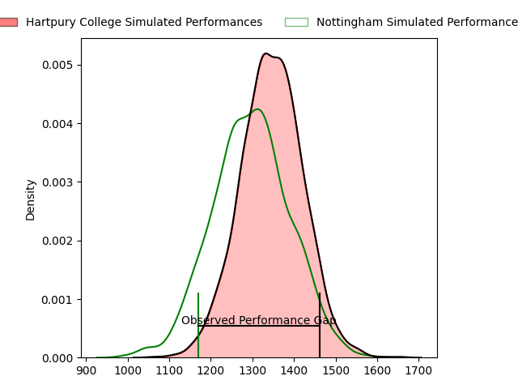
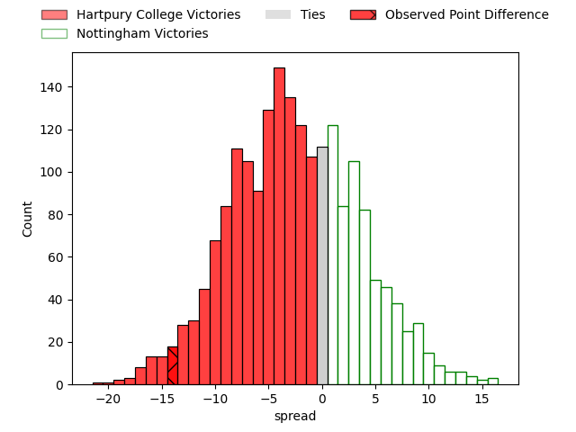
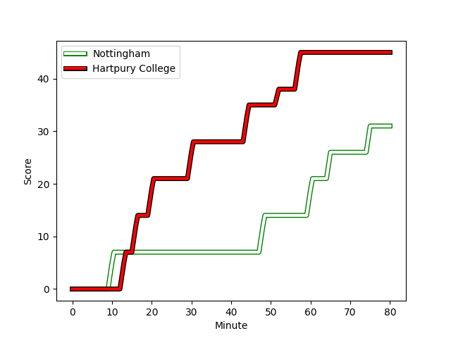
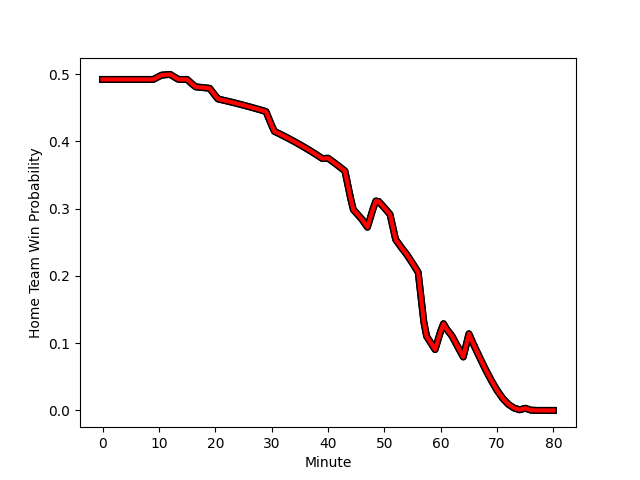

---  
layout: page  
title: Hartpury College at Nottingham; 45-31  
date: 2023-03-03 20:45:00 18:00:00 -0500  
categories: match review  
---
# Hartpury College at Nottingham; 45-31

# Club Level Predictions

The first set of predictions treats a club as the smallest object, as the club develops its members, organizes a gameplan, and deploys its players as needed for each match. This club model has a prediction of 0.429, which translates to predicting Hartpury College to win by 2.5.

Each club has a rating and a rating deviation (simiar to a Glicko system), and expected performances can be generated. This allows for simulated matches and spreads like the ones below.
## Projected Performances

## Projected Spreads

## Projected Results

# Player Level Predictions

Treating teams instead as an entity made up of the currently active players, I have ratings for each player in an altogether different system. These can be combined to form team ratings once teamsheets are announced, weighting starters a bit higher than the reserves. After the match is played, players can be weighted by their minutes on the field, allowing for an accurate measure of the team's composition. With these compiled team ratings, we can make predictions, measure inaccuracy, and update the individual player ratings.
## Prediction with Player Minutes: Nottingham by 2.6

Hartpury College by 1.4 on a neutral field
## Scores over Time

## Win Probability over Time

There were 6 large changes in win probability in this match
## Prediction without Player Minutes: Nottingham by 0.7

Hartpury College by 3.3 on a neutral pitch

|   Away Minutes | Away Player                                                               |   Away elo |   Away Percentile |   Number |   Home Percentile |   Home elo | Home Player                                                                     |   Home Minutes |
|---------------:|:--------------------------------------------------------------------------|-----------:|------------------:|---------:|------------------:|-----------:|:--------------------------------------------------------------------------------|---------------:|
|             66 | [Joe Wrafter](..//playerfiles//JoeWrafter_cleaned.md)                     |      90.66 |                33 |        1 |                 4 |      70.66 | [Toby Williams](..//playerfiles//TobyWilliams_cleaned.md)                       |             80 |
|             69 | [Luke Stratford](..//playerfiles//LukeStratford_cleaned.md)               |      94.5  |                52 |        2 |                45 |      89.95 | [Harry Clayton](..//playerfiles//HarryClayton_cleaned.md)                       |             54 |
|             76 | [Jonathan Benz-Salomon](..//playerfiles//JonathanBenz-Salomon_cleaned.md) |      78.52 |                 9 |        3 |                14 |      82.64 | [Xavier Valentine](..//playerfiles//XavierValentine_cleaned.md)                 |             60 |
|             80 | [Jack Davies](..//playerfiles//JackDavies_cleaned.md)                     |      87.72 |                26 |        4 |                26 |      83.03 | [Jack Shine](..//playerfiles//JackShine_cleaned.md)                             |             54 |
|             80 | [Jack Davies](..//playerfiles//JackDavies_cleaned.md)                     |      87.72 |                26 |        4 |                17 |      83.03 | [Jack Shine](..//playerfiles//JackShine_cleaned.md)                             |             54 |
|             75 | [Dale Lemon](..//playerfiles//DaleLemon_cleaned.md)                       |      97.18 |                57 |        5 |                40 |      91.88 | [Iosefa Danny Wayne Fiaola](..//playerfiles//IosefaDannyWayneFiaola_cleaned.md) |             80 |
|             80 | [Sam Lewis](..//playerfiles//SamLewis_cleaned.md)                         |      76.35 |                 7 |        6 |                22 |      86.23 | [George Cox](..//playerfiles//GeorgeCox_cleaned.md)                             |             80 |
|             57 | [Oli Robinson](..//playerfiles//OliRobinson_cleaned.md)                   |      78.14 |                 9 |        7 |                86 |     103.46 | [Nathan Tweedy](..//playerfiles//NathanTweedy_cleaned.md)                       |             80 |
|             57 | [Oli Robinson](..//playerfiles//OliRobinson_cleaned.md)                   |      78.14 |                 9 |        7 |                73 |     103.46 | [Nathan Tweedy](..//playerfiles//NathanTweedy_cleaned.md)                       |             80 |
|             80 | [Joe Howard](..//playerfiles//JoeHoward_cleaned.md)                       |      73.97 |                 6 |        8 |                10 |      78.24 | [Josh Poullet](..//playerfiles//JoshPoullet_cleaned.md)                         |             62 |
|             80 | [Matty Jones](..//playerfiles//MattyJones_cleaned.md)                     |     106.56 |                83 |        9 |                21 |      77.49 | [Micheal Stronge](..//playerfiles//MichealStronge_cleaned.md)                   |             57 |
|             80 | [Matty Jones](..//playerfiles//MattyJones_cleaned.md)                     |     106.56 |                83 |        9 |                11 |      77.49 | [Micheal Stronge](..//playerfiles//MichealStronge_cleaned.md)                   |             57 |
|             80 | [Tommy Mathews](..//playerfiles//TommyMathews_cleaned.md)                 |      91.42 |                39 |       10 |                13 |      77.32 | [Sam Hollingsworth](..//playerfiles//SamHollingsworth_cleaned.md)               |             47 |
|             80 | [Bradley Denty](..//playerfiles//BradleyDenty_cleaned.md)                 |      94.27 |                48 |       11 |               nan |      95    | [Henry Joule](..//playerfiles//HenryJoule_cleaned.md)                           |             80 |
|             75 | [Will Butler](..//playerfiles//WillButler_cleaned.md)                     |      83.09 |                25 |       12 |                 7 |      73.23 | [Javiah Pohe](..//playerfiles//JaviahPohe_cleaned.md)                           |             49 |
|             80 | [Jack Reeves](..//playerfiles//JackReeves_cleaned.md)                     |      55.41 |                 1 |       13 |                16 |      82.62 | [Michael Green](..//playerfiles//MichaelGreen_cleaned.md)                       |             80 |
|             40 | [Jack Johnson](..//playerfiles//JackJohnson_cleaned.md)                   |      95    |               nan |       14 |                11 |      77.54 | [David Williams](..//playerfiles//DavidWilliams_cleaned.md)                     |             80 |
|             80 | [Jacob Morris](..//playerfiles//JacobMorris_cleaned.md)                   |      69.16 |                 7 |       15 |                47 |      89.66 | [Jordan Kehinde Olowofela](..//playerfiles//JordanKehindeOlowofela_cleaned.md)  |             80 |
|             40 | [Matthew McNab](..//playerfiles//MatthewMcNab_cleaned.md)                 |      84.25 |                19 |       16 |                14 |      73.32 | [Morgan Bunting](..//playerfiles//MorganBunting_cleaned.md)                     |             33 |
|             40 | [Matthew McNab](..//playerfiles//MatthewMcNab_cleaned.md)                 |      84.25 |                19 |       16 |                 6 |      73.32 | [Morgan Bunting](..//playerfiles//MorganBunting_cleaned.md)                     |             33 |
|             23 | [Harry Short](..//playerfiles//HarryShort_cleaned.md)                     |     117.56 |                92 |       17 |                15 |      79.95 | [John Joseph Neville](..//playerfiles//JohnJosephNeville_cleaned.md)            |             31 |
|             23 | [Harry Short](..//playerfiles//HarryShort_cleaned.md)                     |     117.56 |                92 |       17 |                18 |      79.95 | [John Joseph Neville](..//playerfiles//JohnJosephNeville_cleaned.md)            |             31 |
|             14 | [Aristot Benz-Salomon](..//playerfiles//AristotBenz-Salomon_cleaned.md)   |      95.08 |                66 |       18 |                 6 |      69.39 | [Archie Vanes](..//playerfiles//ArchieVanes_cleaned.md)                         |             26 |
|             14 | [Aristot Benz-Salomon](..//playerfiles//AristotBenz-Salomon_cleaned.md)   |      95.08 |                66 |       18 |                 4 |      69.39 | [Archie Vanes](..//playerfiles//ArchieVanes_cleaned.md)                         |             26 |
|             11 | [Andrew Davies](..//playerfiles//AndrewDavies_cleaned.md)                 |      93.24 |               nan |       19 |                83 |     106.4  | [Callum Allen](..//playerfiles//CallumAllen_cleaned.md)                         |             26 |
|              5 | [Ben Glynn](..//playerfiles//BenGlynn_cleaned.md)                         |      93.96 |               nan |       20 |                 9 |      75.87 | [Liam Slatem](..//playerfiles//LiamSlatem_cleaned.md)                           |             23 |
|              5 | [Harry Tarling](..//playerfiles//HarryTarling_cleaned.md)                 |      93.56 |                47 |       21 |               nan |      93.71 | [Liam Bishop](..//playerfiles//LiamBishop_cleaned.md)                           |             20 |
|              4 | [Sam Rodman](..//playerfiles//SamRodman_cleaned.md)                       |     108.11 |                89 |       22 |               nan |      93.55 | [Jay Ecclesfield](..//playerfiles//JayEcclesfield_cleaned.md)                   |             18 |

