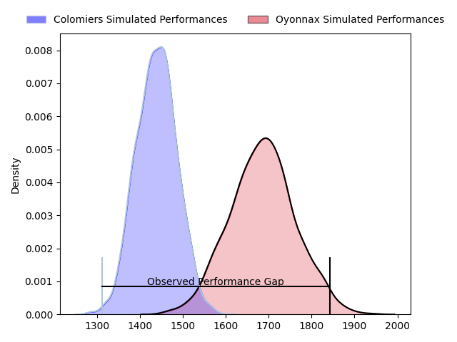
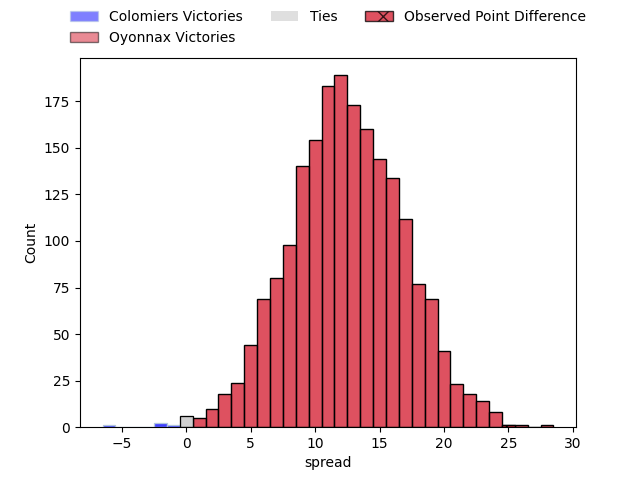
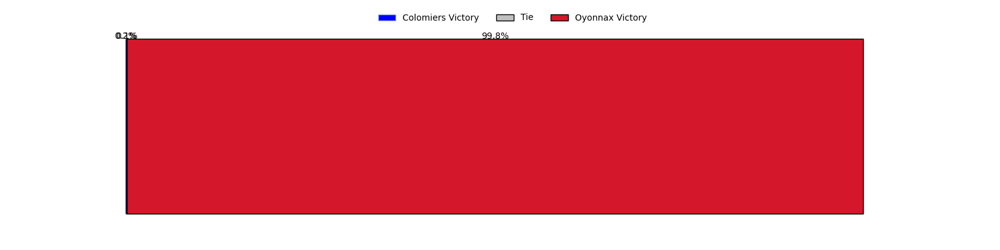
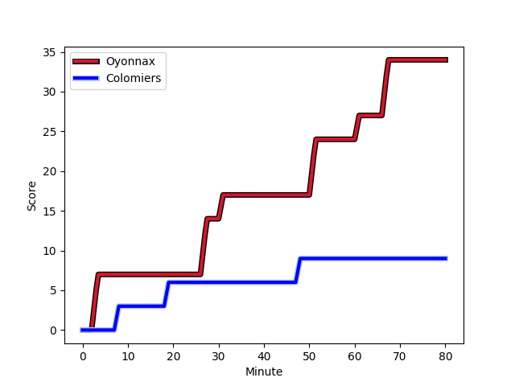
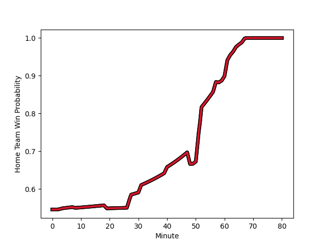

---  
layout: page  
title: Colomiers at Oyonnax; 9-34  
date: 2023-03-03 21:00:00 18:00:00 -0500  
categories: match review  
---
# Colomiers at Oyonnax; 9-34

# Club Level Predictions

The first set of predictions treats a club as the smallest object, as the club develops its members, organizes a gameplan, and deploys its players as needed for each match. This club model has a prediction of 0.803, which translates to predicting Oyonnax to win by 12.3.

Each club has a rating and a rating deviation (simiar to a Glicko system), and expected performances can be generated. This allows for simulated matches and spreads like the ones below.
## Projected Performances

## Projected Spreads

## Projected Results

# Player Level Predictions

Treating teams instead as an entity made up of the currently active players, I have ratings for each player in an altogether different system. These can be combined to form team ratings once teamsheets are announced, weighting starters a bit higher than the reserves. After the match is played, players can be weighted by their minutes on the field, allowing for an accurate measure of the team's composition. With these compiled team ratings, we can make predictions, measure inaccuracy, and update the individual player ratings.
## Prediction with Player Minutes: Oyonnax by 12.0

Oyonnax by 8.0 on a neutral field
## Scores over Time

## Win Probability over Time

There were 6 large changes in win probability in this match
## Prediction without Player Minutes: Oyonnax by 8.5

Oyonnax by 4.5 on a neutral pitch

|   Away Minutes | Away Player                                                         |   Away elo |   Away Percentile |   Number |   Home Percentile |   Home elo | Home Player                                                           |   Home Minutes |
|---------------:|:--------------------------------------------------------------------|-----------:|------------------:|---------:|------------------:|-----------:|:----------------------------------------------------------------------|---------------:|
|             52 | [Guillaume Tartas](..//playerfiles//GuillaumeTartas_cleaned.md)     |     126.03 |                97 |        1 |                33 |      90.53 | [Tommy Raynaud](..//playerfiles//TommyRaynaud_cleaned.md)             |             64 |
|             62 | [Thomas Larrieu](..//playerfiles//ThomasLarrieu_cleaned.md)         |     130.64 |                97 |        2 |                52 |      94.04 | [Teddy Durand](..//playerfiles//TeddyDurand_cleaned.md)               |             49 |
|             52 | [Marco Fepulea'i](..//playerfiles//MarcoFepulea'i_cleaned.md)       |     103.16 |                78 |        3 |                61 |      98.09 | [Thomas Laclayat](..//playerfiles//ThomasLaclayat_cleaned.md)         |             49 |
|             52 | [Marco Fepulea'i](..//playerfiles//MarcoFepulea'i_cleaned.md)       |     103.16 |                38 |        3 |                61 |      98.09 | [Thomas Laclayat](..//playerfiles//ThomasLaclayat_cleaned.md)         |             49 |
|             40 | [Jean Thomas](..//playerfiles//JeanThomas_cleaned.md)               |     118.77 |                83 |        4 |                66 |     100.83 | [Phoenix Battye](..//playerfiles//PhoenixBattye_cleaned.md)           |             62 |
|             80 | [Jack Whetton](..//playerfiles//JackWhetton_cleaned.md)             |      96.43 |                54 |        5 |                75 |     102.64 | [Hugo Fabregue](..//playerfiles//HugoFabregue_cleaned.md)             |             49 |
|             80 | [Waël Ponpon](..//playerfiles//WaëlPonpon_cleaned.md)               |      96.54 |                27 |        6 |                99 |     156.35 | [Kevin Lebreton](..//playerfiles//KevinLebreton_cleaned.md)           |             80 |
|             57 | [Aldric Lescure](..//playerfiles//AldricLescure_cleaned.md)         |     114.71 |                90 |        7 |                86 |     110.94 | [Loïc Credoz](..//playerfiles//LoïcCredoz_cleaned.md)                 |             58 |
|             80 | [Yann Peysson](..//playerfiles//YannPeysson_cleaned.md)             |      79.16 |                11 |        8 |                58 |      98.51 | [Rory Grice](..//playerfiles//RoryGrice_cleaned.md)                   |             80 |
|             57 | [Ugo Seguela](..//playerfiles//UgoSeguela_cleaned.md)               |      90.9  |                41 |        9 |                12 |      78.54 | [Ilan El Khattabi](..//playerfiles//IlanElKhattabi_cleaned.md)        |             68 |
|             80 | [Romuald Séguy](..//playerfiles//RomualdSéguy_cleaned.md)           |      97.17 |                55 |       10 |                94 |     121.32 | [Justin Bouraux](..//playerfiles//JustinBouraux_cleaned.md)           |             80 |
|             80 | [Alexis Palisson](..//playerfiles//AlexisPalisson_cleaned.md)       |     106.03 |                80 |       11 |                78 |     107.25 | [Aurelien Callandret](..//playerfiles//AurelienCallandret_cleaned.md) |             80 |
|             80 | [Michele Campagnaro](..//playerfiles//MicheleCampagnaro_cleaned.md) |      89.88 |                34 |       12 |                66 |     100.39 | [Théo Millet](..//playerfiles//ThéoMillet_cleaned.md)                 |             80 |
|             80 | [Victor Moro](..//playerfiles//VictorMoro_cleaned.md)               |      62.61 |                 2 |       13 |                28 |      88.05 | [Florian Vialelle](..//playerfiles//FlorianVialelle_cleaned.md)       |             80 |
|             59 | [Peni Rokoduguni](..//playerfiles//PeniRokoduguni_cleaned.md)       |      76.09 |                 8 |       14 |                72 |     102.53 | [Joe Ravouvou](..//playerfiles//JoeRavouvou_cleaned.md)               |             64 |
|             59 | [Max Auriac](..//playerfiles//MaxAuriac_cleaned.md)                 |     119.09 |                92 |       15 |                73 |     104.54 | [Tony Ensor](..//playerfiles//TonyEnsor_cleaned.md)                   |             80 |
|             40 | [Maxime Granouillet](..//playerfiles//MaximeGranouillet_cleaned.md) |     105.71 |                78 |       16 |                52 |      95.49 | [Thibault Berthaud](..//playerfiles//ThibaultBerthaud_cleaned.md)     |             31 |
|             28 | [Robin Bellemand](..//playerfiles//RobinBellemand_cleaned.md)       |      85.98 |                20 |       17 |                73 |     103.6  | [Steve Mafi](..//playerfiles//SteveMafi_cleaned.md)                   |             31 |
|             28 | [Thomas Dubois](..//playerfiles//ThomasDubois_cleaned.md)           |      95.33 |                51 |       18 |                34 |      90.11 | [Manu Leiataua](..//playerfiles//ManuLeiataua_cleaned.md)             |             31 |
|             28 | [Thomas Dubois](..//playerfiles//ThomasDubois_cleaned.md)           |      95.33 |                16 |       18 |                34 |      90.11 | [Manu Leiataua](..//playerfiles//ManuLeiataua_cleaned.md)             |             31 |
|             23 | [Edoardo Gori](..//playerfiles//EdoardoGori_cleaned.md)             |      84.91 |                17 |       19 |                27 |      86.42 | [Luke Hamilton](..//playerfiles//LukeHamilton_cleaned.md)             |             22 |
|             23 | [Jorick Dastugue](..//playerfiles//JorickDastugue_cleaned.md)       |      89.19 |                31 |       20 |                34 |      90.32 | [Victor Lebas](..//playerfiles//VictorLebas_cleaned.md)               |             18 |
|             21 | [Grégoire Maurino](..//playerfiles//GrégoireMaurino_cleaned.md)     |     110.33 |                87 |       21 |               nan |      95.04 | [Irakli Mirtskhulava](..//playerfiles//IrakliMirtskhulava_cleaned.md) |             16 |
|             21 | [Thomas Girard](..//playerfiles//ThomasGirard_cleaned.md)           |      98.84 |                58 |       22 |                95 |     125.74 | [Jules Soulan](..//playerfiles//JulesSoulan_cleaned.md)               |             16 |
|             18 | [Andrew Ready](..//playerfiles//AndrewReady_cleaned.md)             |     106.75 |                56 |       23 |                83 |     106.19 | [Yvan David](..//playerfiles//YvanDavid_cleaned.md)                   |             12 |
|             18 | [Andrew Ready](..//playerfiles//AndrewReady_cleaned.md)             |     106.75 |                84 |       23 |                83 |     106.19 | [Yvan David](..//playerfiles//YvanDavid_cleaned.md)                   |             12 |

