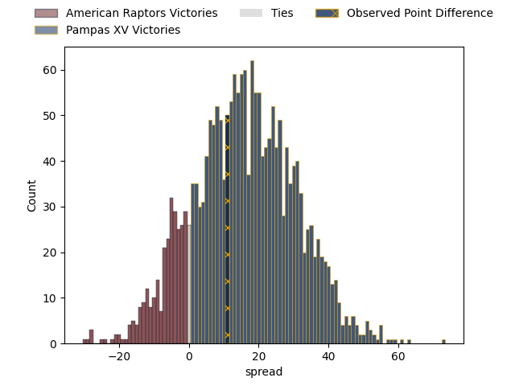
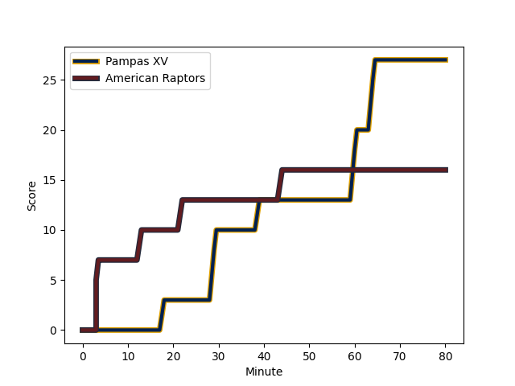
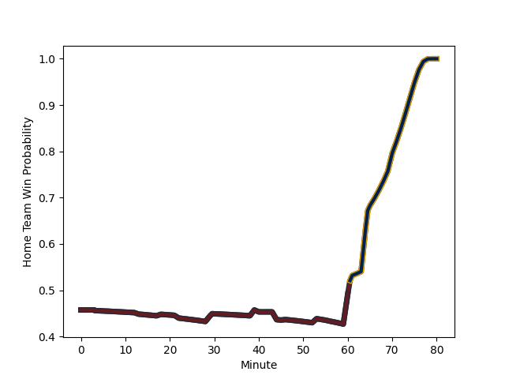

---  
layout: page  
title: American Raptors at Pampas XV; 16-27  
date: 2023-03-03 22:00:00 18:00:00 -0500  
categories: match review  
---
# American Raptors at Pampas XV; 16-27

# Club Level Predictions

The first set of predictions treats a club as the smallest object, as the club develops its members, organizes a gameplan, and deploys its players as needed for each match. This club model has a prediction of 0.759, which translates to predicting Pampas XV to win by 12.5.

Each club has a rating and a rating deviation (simiar to a Glicko system), and expected performances can be generated. This allows for simulated matches and spreads like the ones below.
## Projected Performances

## Projected Spreads

## Projected Results

# Player Level Predictions

Treating teams instead as an entity made up of the currently active players, I have ratings for each player in an altogether different system. These can be combined to form team ratings once teamsheets are announced, weighting starters a bit higher than the reserves. After the match is played, players can be weighted by their minutes on the field, allowing for an accurate measure of the team's composition. With these compiled team ratings, we can make predictions, measure inaccuracy, and update the individual player ratings.
## Prediction with Player Minutes: American Raptors by 3.4

American Raptors by 7.4 on a neutral field
## Scores over Time

## Win Probability over Time

There were 11 large changes in win probability in this match
## Prediction without Player Minutes: American Raptors by 3.5

American Raptors by 7.5 on a neutral pitch

|   Away Minutes | Away Player                                                                    |   Away elo |   Away Percentile |   Number |   Home Percentile |   Home elo | Home Player                                                                               |   Home Minutes |
|---------------:|:-------------------------------------------------------------------------------|-----------:|------------------:|---------:|------------------:|-----------:|:------------------------------------------------------------------------------------------|---------------:|
|             56 | [Payton Telea-Ilalio](..//playerfiles//PaytonTelea-Ilalio_cleaned.md)          |      92.59 |                42 |        1 |                36 |      91.26 | [Miguel Angel Prince](..//playerfiles//MiguelAngelPrince_cleaned.md)                      |             53 |
|             80 | [Diego Fortuny](..//playerfiles//DiegoFortuny_cleaned.md)                      |      99.99 |                68 |        2 |                52 |      94.36 | [Ramiro Gurovich](..//playerfiles//RamiroGurovich_cleaned.md)                             |             77 |
|             46 | [Juan Echeverria](..//playerfiles//JuanEcheverria_cleaned.md)                  |     110.1  |                67 |        3 |                37 |      91.47 | [Javier Angel Coronel](..//playerfiles//JavierAngelCoronel_cleaned.md)                    |             70 |
|             46 | [Juan Echeverria](..//playerfiles//JuanEcheverria_cleaned.md)                  |     110.1  |                88 |        3 |                37 |      91.47 | [Javier Angel Coronel](..//playerfiles//JavierAngelCoronel_cleaned.md)                    |             70 |
|             70 | [Mikey Grandy](..//playerfiles//MikeyGrandy_cleaned.md)                        |     110.41 |                64 |        4 |                65 |      98.97 | [Lorenzo Colidio](..//playerfiles//LorenzoColidio_cleaned.md)                             |             61 |
|             70 | [Mikey Grandy](..//playerfiles//MikeyGrandy_cleaned.md)                        |     110.41 |                85 |        4 |                65 |      98.97 | [Lorenzo Colidio](..//playerfiles//LorenzoColidio_cleaned.md)                             |             61 |
|             80 | [Diego Magno](..//playerfiles//DiegoMagno_cleaned.md)                          |      98.46 |                60 |        5 |                68 |      99.56 | [Rodrigo Fernandez Criado](..//playerfiles//RodrigoFernandezCriado_cleaned.md)            |             70 |
|             80 | [Shawn Clark](..//playerfiles//ShawnClark_cleaned.md)                          |     107.05 |                54 |        6 |                92 |     116.99 | [Nicolas Damorim](..//playerfiles//NicolasDamorim_cleaned.md)                             |             80 |
|             80 | [Shawn Clark](..//playerfiles//ShawnClark_cleaned.md)                          |     107.05 |                79 |        6 |                92 |     116.99 | [Nicolas Damorim](..//playerfiles//NicolasDamorim_cleaned.md)                             |             80 |
|             80 | [Ronan Murphy](..//playerfiles//RonanMurphy_cleaned.md)                        |      97.44 |                54 |        7 |                82 |     108.42 | [Jeronimo Ureta](..//playerfiles//JeronimoUreta_cleaned.md)                               |             80 |
|             40 | [Siaki Lolohea Vikilani](..//playerfiles//SiakiLoloheaVikilani_cleaned.md)     |      95    |               nan |        8 |                48 |      95.07 | [Santiago Ruiz](..//playerfiles//SantiagoRuiz_cleaned.md)                                 |             80 |
|             65 | [Martin Landajo](..//playerfiles//MartinLandajo_cleaned.md)                    |     108.77 |                86 |        9 |               nan |      92.26 | [Eliseo Nicolas Morales Abraham](..//playerfiles//EliseoNicolasMoralesAbraham_cleaned.md) |             53 |
|             65 | [Martin Landajo](..//playerfiles//MartinLandajo_cleaned.md)                    |     108.77 |                65 |        9 |               nan |      92.26 | [Eliseo Nicolas Morales Abraham](..//playerfiles//EliseoNicolasMoralesAbraham_cleaned.md) |             53 |
|             77 | [Lucas Gonzalez Amorosino](..//playerfiles//LucasGonzalezAmorosino_cleaned.md) |      99.58 |                62 |       10 |                 1 |      45.16 | [Joaquin de la Vega Mendia](..//playerfiles//JoaquindelaVegaMendia_cleaned.md)            |             80 |
|             80 | [Seimou Smith](..//playerfiles//SeimouSmith_cleaned.md)                        |      90.32 |                36 |       11 |                95 |     123.33 | [Tomas Passaro](..//playerfiles//TomasPassaro_cleaned.md)                                 |             80 |
|             80 | [Aki Pulu](..//playerfiles//AkiPulu_cleaned.md)                                |     105.35 |                79 |       12 |                20 |      84.72 | [Manuel Alfaro Torneiro](..//playerfiles//ManuelAlfaroTorneiro_cleaned.md)                |             70 |
|             61 | [Dominik Iacovino](..//playerfiles//DominikIacovino_cleaned.md)                |     105.78 |                80 |       13 |                41 |      91.77 | [Felipe de la Vega](..//playerfiles//FelipedelaVega_cleaned.md)                           |             80 |
|             61 | [Dominik Iacovino](..//playerfiles//DominikIacovino_cleaned.md)                |     105.78 |                58 |       13 |                41 |      91.77 | [Felipe de la Vega](..//playerfiles//FelipedelaVega_cleaned.md)                           |             80 |
|             80 | [Ryan James](..//playerfiles//RyanJames_cleaned.md)                            |     107    |                81 |       14 |                44 |      92.85 | [Benjamin Elizalde](..//playerfiles//BenjaminElizalde_cleaned.md)                         |             80 |
|             80 | [Ryan James](..//playerfiles//RyanJames_cleaned.md)                            |     107    |                60 |       14 |                44 |      92.85 | [Benjamin Elizalde](..//playerfiles//BenjaminElizalde_cleaned.md)                         |             80 |
|             80 | [Line Latu](..//playerfiles//LineLatu_cleaned.md)                              |     104.23 |                73 |       15 |                90 |     115.99 | [Juan Ignacio Lando](..//playerfiles//JuanIgnacioLando_cleaned.md)                        |             80 |
|             34 | [Ma'ake Muti](..//playerfiles//Ma'akeMuti_cleaned.md)                          |     106.05 |                84 |       16 |                78 |     103.01 | [Matias Medrano](..//playerfiles//MatiasMedrano_cleaned.md)                               |             27 |
|             34 | [Ma'ake Muti](..//playerfiles//Ma'akeMuti_cleaned.md)                          |     106.05 |                52 |       16 |                78 |     103.01 | [Matias Medrano](..//playerfiles//MatiasMedrano_cleaned.md)                               |             27 |
|             24 | [Sebastian Otero](..//playerfiles//SebastianOtero_cleaned.md)                  |      93.46 |                43 |       17 |                72 |     101.8  | [Rafael Iriarte](..//playerfiles//RafaelIriarte_cleaned.md)                               |             27 |
|             19 | [Watson Filikitonga](..//playerfiles//WatsonFilikitonga_cleaned.md)            |      92.85 |               nan |       18 |                77 |     105.59 | [Manuel Bernstein](..//playerfiles//ManuelBernstein_cleaned.md)                           |             19 |
|             15 | [Ethan McVeigh](..//playerfiles//EthanMcVeigh_cleaned.md)                      |     100.87 |               nan |       19 |                11 |      78.34 | [Federico Ignacio Lavanini](..//playerfiles//FedericoIgnacioLavanini_cleaned.md)          |             10 |
|             10 | [Will Crawford](..//playerfiles//WillCrawford_cleaned.md)                      |      62.43 |                 3 |       20 |               nan |      95    | [Santiago Castro](..//playerfiles//SantiagoCastro_cleaned.md)                             |             10 |
|              3 | [Patrick Madden](..//playerfiles//PatrickMadden_cleaned.md)                    |      99.17 |               nan |       21 |                45 |      97.31 | [Martin Villar](..//playerfiles//MartinVillar_cleaned.md)                                 |             10 |
|             40 | [Tommy Clark](..//playerfiles//TommyClark_cleaned.md)                          |     103.82 |                71 |       22 |               nan |      95.34 | [Valentin Minoyetti](..//playerfiles//ValentinMinoyetti_cleaned.md)                       |              3 |

