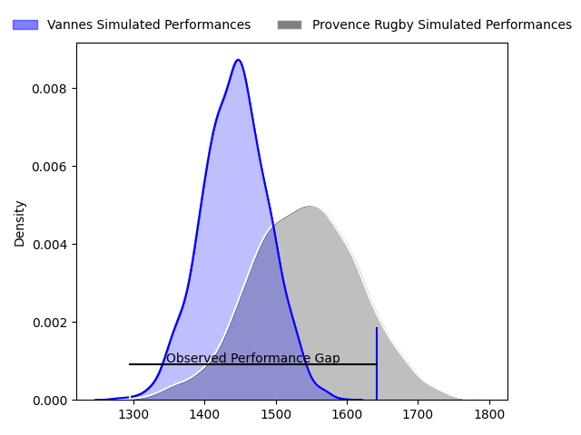
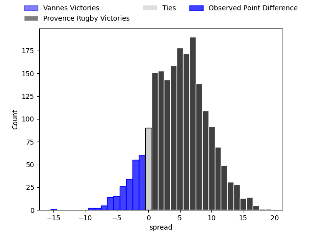
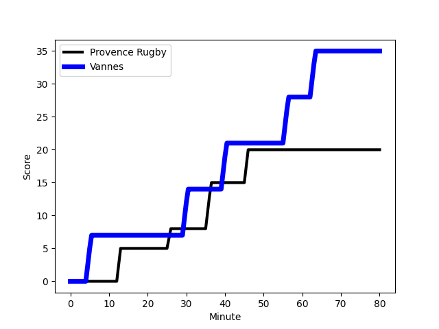
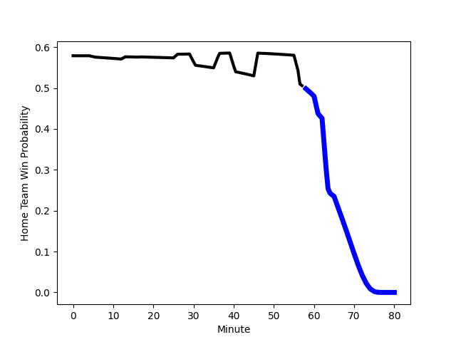

---  
layout: page  
title: Vannes at Provence Rugby; 35-20  
date: 2023-03-03 19:00:00 18:00:00 -0500  
categories: match review  
---
# Vannes at Provence Rugby; 35-20

# Club Level Predictions

The first set of predictions treats a club as the smallest object, as the club develops its members, organizes a gameplan, and deploys its players as needed for each match. This club model has a prediction of 0.635, which translates to predicting Provence Rugby to win by 4.9.

Each club has a rating and a rating deviation (simiar to a Glicko system), and expected performances can be generated. This allows for simulated matches and spreads like the ones below.
## Projected Performances

## Projected Spreads

## Projected Results

# Player Level Predictions

Treating teams instead as an entity made up of the currently active players, I have ratings for each player in an altogether different system. These can be combined to form team ratings once teamsheets are announced, weighting starters a bit higher than the reserves. After the match is played, players can be weighted by their minutes on the field, allowing for an accurate measure of the team's composition. With these compiled team ratings, we can make predictions, measure inaccuracy, and update the individual player ratings.
## Prediction with Player Minutes: Provence Rugby by 18.8

Provence Rugby by 14.8 on a neutral field
## Scores over Time

## Win Probability over Time

There were 14 large changes in win probability in this match
## Prediction without Player Minutes: Provence Rugby by 16.6

Provence Rugby by 12.6 on a neutral pitch

|   Away Minutes | Away Player                                                               |   Away elo |   Away Percentile |   Number |   Home Percentile |   Home elo | Home Player                                                           |   Home Minutes |
|---------------:|:--------------------------------------------------------------------------|-----------:|------------------:|---------:|------------------:|-----------:|:----------------------------------------------------------------------|---------------:|
|             65 | [Andy Bordelai](..//playerfiles//AndyBordelai_cleaned.md)                 |     119.71 |                96 |        1 |                14 |      82.47 | [David Lolohea](..//playerfiles//DavidLolohea_cleaned.md)             |             80 |
|             65 | [Andy Bordelai](..//playerfiles//AndyBordelai_cleaned.md)                 |     119.71 |                96 |        1 |                10 |      82.47 | [David Lolohea](..//playerfiles//DavidLolohea_cleaned.md)             |             80 |
|             56 | [Pat Leafa](..//playerfiles//PatLeafa_cleaned.md)                         |     101.18 |                72 |        2 |                40 |      93.4  | [Loïck Jammes](..//playerfiles//LoïckJammes_cleaned.md)               |             46 |
|             56 | [Paga Tafili](..//playerfiles//PagaTafili_cleaned.md)                     |     129.55 |                99 |        3 |                43 |      93.19 | [Luke Tagi](..//playerfiles//LukeTagi_cleaned.md)                     |             46 |
|             79 | [Edoardo Iachizzi](..//playerfiles//EdoardoIachizzi_cleaned.md)           |      92.1  |                40 |        4 |                93 |     120.59 | [Clément Chartier](..//playerfiles//ClémentChartier_cleaned.md)       |             80 |
|             80 | [Ewan Thomas Johnson](..//playerfiles//EwanThomasJohnson_cleaned.md)      |     104.07 |                75 |        5 |                75 |     104.22 | [Alexandre Flanquart](..//playerfiles//AlexandreFlanquart_cleaned.md) |             46 |
|             61 | [Karl Chateau](..//playerfiles//KarlChateau_cleaned.md)                   |      78.8  |                10 |        6 |                90 |     115.17 | [Guillaume Piazzoli](..//playerfiles//GuillaumePiazzoli_cleaned.md)   |             80 |
|             80 | [Francisco Gorrisen](..//playerfiles//FranciscoGorrisen_cleaned.md)       |      98.55 |                60 |        7 |                90 |     114.67 | [Jessy Jegerlhener](..//playerfiles//JessyJegerlhener_cleaned.md)     |             80 |
|             80 | [Joe Edwards](..//playerfiles//JoeEdwards_cleaned.md)                     |      91.06 |                36 |        8 |                56 |      98.11 | [Carl Axtens](..//playerfiles//CarlAxtens_cleaned.md)                 |             17 |
|             79 | [Michael Ruru](..//playerfiles//MichaelRuru_cleaned.md)                   |      79.77 |                13 |        9 |                66 |      99.81 | [Simon Tarel](..//playerfiles//SimonTarel_cleaned.md)                 |             66 |
|             80 | [Maxime Lafage](..//playerfiles//MaximeLafage_cleaned.md)                 |      94.92 |                44 |       10 |                88 |     113.34 | [Jonny McPhillips](..//playerfiles//JonnyMcPhillips_cleaned.md)       |             46 |
|             80 | [Romaric Camou](..//playerfiles//RomaricCamou_cleaned.md)                 |      91.55 |                35 |       11 |                79 |     105.81 | [Nadir Bouhedjeur](..//playerfiles//NadirBouhedjeur_cleaned.md)       |             80 |
|             80 | [Andres Vilaseca](..//playerfiles//AndresVilaseca_cleaned.md)             |      99.49 |                64 |       12 |                31 |      91.11 | [Louis Marrou](..//playerfiles//LouisMarrou_cleaned.md)               |             80 |
|             67 | [Sacha Valleau](..//playerfiles//SachaValleau_cleaned.md)                 |      89.51 |                32 |       13 |                84 |     108.17 | [Kaveinga Finau](..//playerfiles//KaveingaFinau_cleaned.md)           |             80 |
|             80 | [Nathanael Hulleu](..//playerfiles//NathanaelHulleu_cleaned.md)           |      95.05 |                50 |       14 |                96 |     124.88 | [Kevin Bly](..//playerfiles//KevinBly_cleaned.md)                     |             46 |
|             80 | [Gwenaël Duplenne](..//playerfiles//GwenaëlDuplenne_cleaned.md)           |      91.68 |                42 |       15 |                95 |     123.42 | [Florent Massip](..//playerfiles//FlorentMassip_cleaned.md)           |             80 |
|             24 | [Théo Beziat](..//playerfiles//ThéoBeziat_cleaned.md)                     |      87.84 |                27 |       16 |               nan |      96.93 | [Teimana Harrison](..//playerfiles//TeimanaHarrison_cleaned.md)       |             63 |
|             24 | [Phil Kite](..//playerfiles//PhilKite_cleaned.md)                         |      86.55 |                17 |       17 |                95 |     117.59 | [German Kessler](..//playerfiles//GermanKessler_cleaned.md)           |             34 |
|             24 | [Phil Kite](..//playerfiles//PhilKite_cleaned.md)                         |      86.55 |                31 |       17 |                95 |     117.59 | [German Kessler](..//playerfiles//GermanKessler_cleaned.md)           |             34 |
|             19 | [Léon Boulier](..//playerfiles//LéonBoulier_cleaned.md)                   |     126.1  |                97 |       18 |                97 |     130.7  | [Jérôme Dufour](..//playerfiles//JérômeDufour_cleaned.md)             |             34 |
|             15 | [Charles-Henri Berguet](..//playerfiles//Charles-HenriBerguet_cleaned.md) |      91.63 |                37 |       19 |               nan |      94.07 | [Nicolas Toth](..//playerfiles//NicolasToth_cleaned.md)               |             34 |
|             13 | [Nicolas Freitas](..//playerfiles//NicolasFreitas_cleaned.md)             |      90.84 |                38 |       20 |                86 |     109.84 | [Peter Betham](..//playerfiles//PeterBetham_cleaned.md)               |             34 |
|              1 | [Remi Leroux](..//playerfiles//RemiLeroux_cleaned.md)                     |      93.5  |               nan |       21 |                51 |      96.09 | [Enzo Selponi](..//playerfiles//EnzoSelponi_cleaned.md)               |             34 |
|              1 | [Erwan Nicolas](..//playerfiles//ErwanNicolas_cleaned.md)                 |     114.81 |                94 |       22 |               nan |      93.83 | [Jeremie Martin](..//playerfiles//JeremieMartin_cleaned.md)           |             14 |

