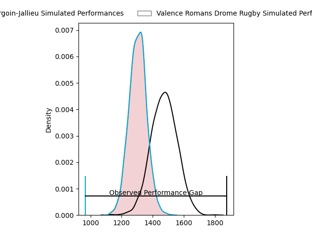
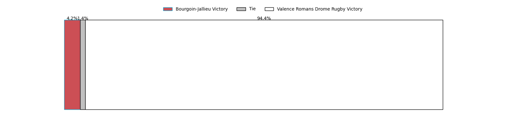
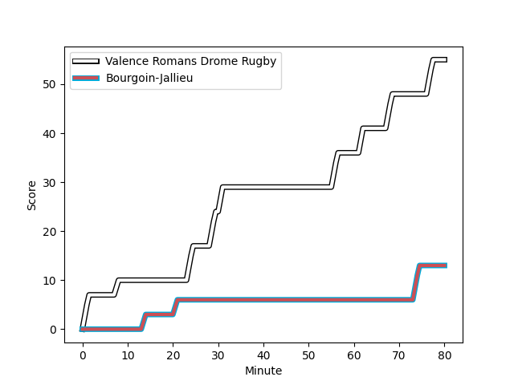
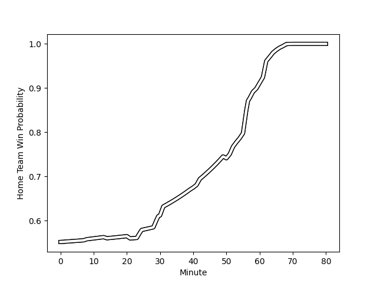

---  
layout: page  
title: Bourgoin-Jallieu at Valence Romans Drome Rugby; 13-55  
date: 2023-03-03 19:00:00 18:00:00 -0500  
categories: match review  
---
# Bourgoin-Jallieu at Valence Romans Drome Rugby; 13-55

# Club Level Predictions

The first set of predictions treats a club as the smallest object, as the club develops its members, organizes a gameplan, and deploys its players as needed for each match. This club model has a prediction of 0.723, which translates to predicting Valence Romans Drome Rugby to win by 8.5.

Each club has a rating and a rating deviation (simiar to a Glicko system), and expected performances can be generated. This allows for simulated matches and spreads like the ones below.
## Projected Performances

## Projected Spreads

## Projected Results

# Player Level Predictions

Treating teams instead as an entity made up of the currently active players, I have ratings for each player in an altogether different system. These can be combined to form team ratings once teamsheets are announced, weighting starters a bit higher than the reserves. After the match is played, players can be weighted by their minutes on the field, allowing for an accurate measure of the team's composition. With these compiled team ratings, we can make predictions, measure inaccuracy, and update the individual player ratings.
## Prediction with Player Minutes: Valence Romans Drome Rugby by 13.1

Valence Romans Drome Rugby by 9.1 on a neutral field
## Scores over Time

## Win Probability over Time

There were 2 large changes in win probability in this match
## Prediction without Player Minutes: Valence Romans Drome Rugby by 12.0

Valence Romans Drome Rugby by 8.0 on a neutral pitch

|   Away Minutes | Away Player                                                                    |   Away elo |   Away Percentile |   Number |   Home Percentile |   Home elo | Home Player                                                                |   Home Minutes |
|---------------:|:-------------------------------------------------------------------------------|-----------:|------------------:|---------:|------------------:|-----------:|:---------------------------------------------------------------------------|---------------:|
|             52 | [Adrien Devisme](..//playerfiles//AdrienDevisme_cleaned.md)                    |      80.6  |                11 |        1 |                98 |     129.23 | [Sami Zouhair](..//playerfiles//SamiZouhair_cleaned.md)                    |             50 |
|             42 | [Mohamed Khribache](..//playerfiles//MohamedKhribache_cleaned.md)              |     104.62 |                80 |        2 |                79 |     104.26 | [Dorian Marco Pena](..//playerfiles//DorianMarcoPena_cleaned.md)           |             57 |
|             80 | [Mickaël Simutoga](..//playerfiles//MickaëlSimutoga_cleaned.md)                |      87.05 |                22 |        3 |                54 |      96.48 | [John Henry Fincham](..//playerfiles//JohnHenryFincham_cleaned.md)         |             46 |
|             80 | [Robin Gascou](..//playerfiles//RobinGascou_cleaned.md)                        |      84.69 |                25 |        4 |                89 |     114.32 | [Darrell Dyer](..//playerfiles//DarrellDyer_cleaned.md)                    |             80 |
|             80 | [Joketani Raikabula Koroi](..//playerfiles//JoketaniRaikabulaKoroi_cleaned.md) |      99.82 |                64 |        5 |                59 |      97.65 | [Florian Goumat](..//playerfiles//FlorianGoumat_cleaned.md)                |             59 |
|             40 | [Kevin Rivoire](..//playerfiles//KevinRivoire_cleaned.md)                      |      90.64 |                36 |        6 |                85 |     110.78 | [Alexis Armary](..//playerfiles//AlexisArmary_cleaned.md)                  |             80 |
|             80 | [Bynjamin Rabatel](..//playerfiles//BynjaminRabatel_cleaned.md)                |     104.41 |                74 |        7 |                38 |      94.71 | [Sven Bernat Girlando](..//playerfiles//SvenBernatGirlando_cleaned.md)     |             80 |
|             52 | [Poutasi Luafutu](..//playerfiles//PoutasiLuafutu_cleaned.md)                  |      94.27 |                45 |        8 |                35 |      89.97 | [Ioane Iashagashvili](..//playerfiles//IoaneIashagashvili_cleaned.md)      |             46 |
|             52 | [Remi Bouet](..//playerfiles//RemiBouet_cleaned.md)                            |     105.27 |                79 |        9 |                 9 |      76.38 | [Tim Menzel](..//playerfiles//TimMenzel_cleaned.md)                        |             64 |
|             40 | [Nicolas Vuillemin](..//playerfiles//NicolasVuillemin_cleaned.md)              |      94.54 |                48 |       10 |                73 |     105.37 | [Joris Moura](..//playerfiles//JorisMoura_cleaned.md)                      |             80 |
|             54 | [Quentin Lefort](..//playerfiles//QuentinLefort_cleaned.md)                    |      97.92 |                58 |       11 |                49 |      94.68 | [Mason Emerson](..//playerfiles//MasonEmerson_cleaned.md)                  |             80 |
|             58 | [Isaiah Leota](..//playerfiles//IsaiahLeota_cleaned.md)                        |     103.94 |                76 |       12 |                87 |     111.17 | [Ben Neiceru](..//playerfiles//BenNeiceru_cleaned.md)                      |             80 |
|             80 | [Christopher Bosch](..//playerfiles//ChristopherBosch_cleaned.md)              |      97.57 |                57 |       13 |                11 |      77.4  | [Anatole Pauvert](..//playerfiles//AnatolePauvert_cleaned.md)              |             50 |
|             80 | [Naibuka Rokua](..//playerfiles//NaibukaRokua_cleaned.md)                      |      90.58 |                36 |       14 |                58 |      97.66 | [Adam Vargas](..//playerfiles//AdamVargas_cleaned.md)                      |             80 |
|             80 | [Nicolas Cachet](..//playerfiles//NicolasCachet_cleaned.md)                    |      74.81 |                10 |       15 |                65 |     100.64 | [Quentin Gobet](..//playerfiles//QuentinGobet_cleaned.md)                  |             59 |
|             40 | [Léandre Cotte](..//playerfiles//LéandreCotte_cleaned.md)                      |      95.07 |                50 |       16 |               nan |      97.4  | [Kevin Goze](..//playerfiles//KevinGoze_cleaned.md)                        |             34 |
|             40 | [Romain Sola](..//playerfiles//RomainSola_cleaned.md)                          |      91.86 |                46 |       17 |                31 |      88.88 | [Matthew Gicquel](..//playerfiles//MatthewGicquel_cleaned.md)              |             34 |
|             38 | [Killian Tripier](..//playerfiles//KillianTripier_cleaned.md)                  |      90.26 |                32 |       18 |                29 |      86.53 | [Andrea Pontanier](..//playerfiles//AndreaPontanier_cleaned.md)            |             30 |
|             28 | [Lakisipone Lee](..//playerfiles//LakisiponeLee_cleaned.md)                    |      76.49 |                 7 |       19 |                38 |      92.5  | [Akuila Joeli Tabualevu](..//playerfiles//AkuilaJoeliTabualevu_cleaned.md) |             30 |
|             28 | [Adrien Pontarollo](..//playerfiles//AdrienPontarollo_cleaned.md)              |      89.35 |                31 |       20 |                82 |     103.83 | [Yanis Gimenez](..//playerfiles//YanisGimenez_cleaned.md)                  |             23 |
|             28 | [Nugzar Somkhishvili](..//playerfiles//NugzarSomkhishvili_cleaned.md)          |      98.13 |                61 |       21 |                22 |      85.72 | [François Uys](..//playerfiles//FrançoisUys_cleaned.md)                    |             21 |
|             26 | [Maxime Caillet](..//playerfiles//MaximeCaillet_cleaned.md)                    |     101.22 |                72 |       22 |                42 |      92.36 | [Lucas Méret](..//playerfiles//LucasMéret_cleaned.md)                      |             21 |
|             22 | [Makalea Foliaki](..//playerfiles//MakaleaFoliaki_cleaned.md)                  |      97.52 |                54 |       23 |               nan |      97.45 | [Mickael Thébault](..//playerfiles//MickaelThébault_cleaned.md)            |             16 |

