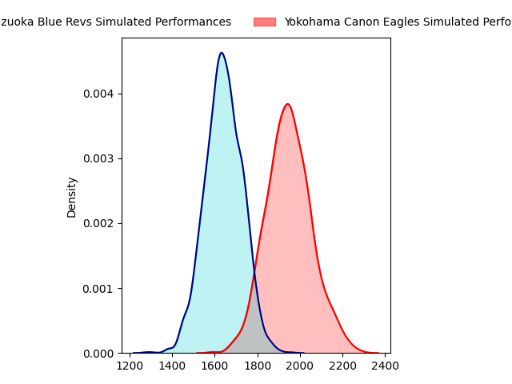
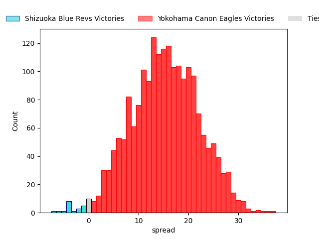
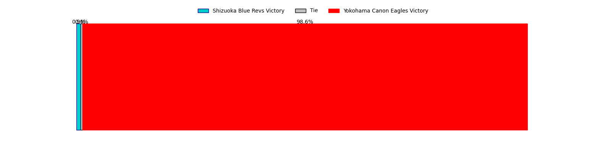
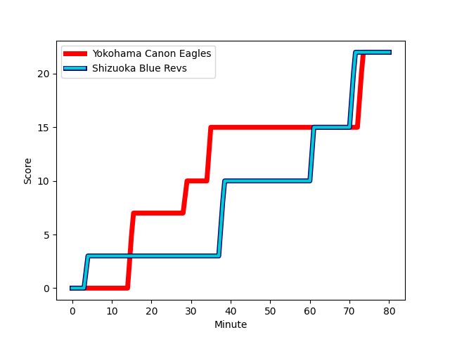
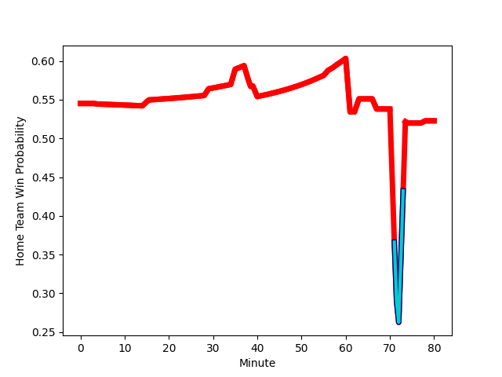

---  
layout: page  
title: Shizuoka Blue Revs at Yokohama Canon Eagles; 22-22  
date: 2023-03-03 11:00:00 18:00:00 -0500  
categories: match review  
---
# Shizuoka Blue Revs at Yokohama Canon Eagles; 22-22

# Club Level Predictions

The first set of predictions treats a club as the smallest object, as the club develops its members, organizes a gameplan, and deploys its players as needed for each match. This club model has a prediction of 0.844, which translates to predicting Yokohama Canon Eagles to win by 15.2.

Each club has a rating and a rating deviation (simiar to a Glicko system), and expected performances can be generated. This allows for simulated matches and spreads like the ones below.
## Projected Performances

## Projected Spreads

## Projected Results

# Player Level Predictions

Treating teams instead as an entity made up of the currently active players, I have ratings for each player in an altogether different system. These can be combined to form team ratings once teamsheets are announced, weighting starters a bit higher than the reserves. After the match is played, players can be weighted by their minutes on the field, allowing for an accurate measure of the team's composition. With these compiled team ratings, we can make predictions, measure inaccuracy, and update the individual player ratings.
## Prediction with Player Minutes: Yokohama Canon Eagles by 11.9

Yokohama Canon Eagles by 7.9 on a neutral field
## Scores over Time

## Win Probability over Time

There were 6 large changes in win probability in this match
## Prediction without Player Minutes: Yokohama Canon Eagles by 19.3

Yokohama Canon Eagles by 15.3 on a neutral pitch

|   Away Minutes | Away Player                                                                                     |   Away elo |   Away Percentile |   Number |   Home Percentile |   Home elo | Home Player                                                                   |   Home Minutes |
|---------------:|:------------------------------------------------------------------------------------------------|-----------:|------------------:|---------:|------------------:|-----------:|:------------------------------------------------------------------------------|---------------:|
|             80 | [Kazuhiro Kawata](..//playerfiles//KazuhiroKawata_cleaned.md)                                   |     101.87 |                74 |        1 |                99 |     134.63 | [Takato Okabe](..//playerfiles//TakatoOkabe_cleaned.md)                       |             74 |
|             80 | [Takeshi Hino](..//playerfiles//TakeshiHino_cleaned.md)                                         |      95.14 |                53 |        2 |                59 |      97.21 | [Yusuke Niwai](..//playerfiles//YusukeNiwai_cleaned.md)                       |             67 |
|             80 | [Heiichiro Ito](..//playerfiles//HeiichiroIto_cleaned.md)                                       |     101.23 |                72 |        3 |                 3 |      71.73 | [Tatsuro Sugimoto](..//playerfiles//TatsuroSugimoto_cleaned.md)               |             63 |
|             40 | [Samuela Anise](..//playerfiles//SamuelaAnise_cleaned.md)                                       |      95.95 |               nan |        4 |                78 |     106.38 | [Max Douglas](..//playerfiles//MaxDouglas_cleaned.md)                         |             55 |
|             80 | [Murray Douglas](..//playerfiles//MurrayDouglas_cleaned.md)                                     |      95    |                49 |        5 |                69 |     104.29 | [Cory Hill](..//playerfiles//CoryHill_cleaned.md)                             |             80 |
|             72 | [Malgene Ilaua](..//playerfiles//MalgeneIlaua_cleaned.md)                                       |      92.52 |                43 |        6 |                92 |     118.06 | [Sioeli Vakalahi](..//playerfiles//SioeliVakalahi_cleaned.md)                 |             80 |
|             78 | [Richard Goh Jones](..//playerfiles//RichardGohJones_cleaned.md)                                |      97.66 |                57 |        7 |                65 |     100.1  | [Naoto Shimada](..//playerfiles//NaotoShimada_cleaned.md)                     |             74 |
|             80 | [Albertus Stephanus (Kwagga) Smith](..//playerfiles//AlbertusStephanus(Kwagga)Smith_cleaned.md) |      95.66 |                50 |        8 |                72 |     103.14 | [Sione Halasili](..//playerfiles//SioneHalasili_cleaned.md)                   |             80 |
|             56 | [Bryn Hall](..//playerfiles//BrynHall_cleaned.md)                                               |      99.99 |                66 |        9 |                72 |     102.26 | [Francois (Faf) de Klerk](..//playerfiles//Francois(Faf)deKlerk_cleaned.md)   |             58 |
|             80 | [Kenta Iemura](..//playerfiles//KentaIemura_cleaned.md)                                         |      89.7  |                31 |       10 |                82 |     108    | [Yu Tamura](..//playerfiles//YuTamura_cleaned.md)                             |             58 |
|             56 | [Chikara Ito](..//playerfiles//ChikaraIto_cleaned.md)                                           |      91.83 |                41 |       11 |                 7 |      72.34 | [Masayoshi Takezawa](..//playerfiles//MasayoshiTakezawa_cleaned.md)           |             80 |
|             80 | [Viliami Tahitu'a](..//playerfiles//ViliamiTahitu'a_cleaned.md)                                 |     100.82 |                67 |       12 |                90 |     114.24 | [Yusuke Kajimura](..//playerfiles//YusukeKajimura_cleaned.md)                 |             80 |
|             80 | [Hiroto Kobayashi](..//playerfiles//HirotoKobayashi_cleaned.md)                                 |     121.24 |                95 |       13 |                91 |     115.38 | [Jesse Andre Kriel](..//playerfiles//JesseAndreKriel_cleaned.md)              |             80 |
|             80 | [Eito Maki](..//playerfiles//EitoMaki_cleaned.md)                                               |      90.33 |                35 |       14 |                87 |     112.06 | [Inoke Burua](..//playerfiles//InokeBurua_cleaned.md)                         |             63 |
|             80 | [Keagan Faria](..//playerfiles//KeaganFaria_cleaned.md)                                         |      99.67 |                62 |       15 |                65 |     100.76 | [Junpei Ogura](..//playerfiles//JunpeiOgura_cleaned.md)                       |             80 |
|             40 | [Eishin Kuwano](..//playerfiles//EishinKuwano_cleaned.md)                                       |     126.43 |                96 |       16 |                76 |     105.61 | [Jacobus Johannes van Dyk](..//playerfiles//JacobusJohannesvanDyk_cleaned.md) |             25 |
|             24 | [Fumihiro Yoshizawa](..//playerfiles//FumihiroYoshizawa_cleaned.md)                             |      97.45 |               nan |       17 |                29 |      90.56 | [Kafazumi Yamasuga](..//playerfiles//KafazumiYamasuga_cleaned.md)             |             22 |
|             24 | [Sam Greene](..//playerfiles//SamGreene_cleaned.md)                                             |      87.02 |                24 |       18 |                93 |     121.24 | [Sarel Petrus Marais](..//playerfiles//SarelPetrusMarais_cleaned.md)          |             22 |
|              8 | [Ryosuke Funahashi](..//playerfiles//RyosukeFunahashi_cleaned.md)                               |     125.6  |                95 |       19 |               nan |      98.98 | [Shouta Matsuoka](..//playerfiles//ShoutaMatsuoka_cleaned.md)                 |             17 |
|              2 | [Takuma Shoji](..//playerfiles//TakumaShoji_cleaned.md)                                         |      91.8  |                40 |       20 |                93 |     119.37 | [Chihito Matsui](..//playerfiles//ChihitoMatsui_cleaned.md)                   |             17 |
|            nan | nan                                                                                             |     nan    |               nan |       21 |                 4 |      70.4  | [Shin Kawamura](..//playerfiles//ShinKawamura_cleaned.md)                     |             13 |
|            nan | nan                                                                                             |     nan    |               nan |       22 |               nan |      99.67 | [Chang Ho Ahn](..//playerfiles//ChangHoAhn_cleaned.md)                        |              6 |
|            nan | nan                                                                                             |     nan    |               nan |       23 |                97 |     131.17 | [Ryota Suginaga](..//playerfiles//RyotaSuginaga_cleaned.md)                   |              6 |

