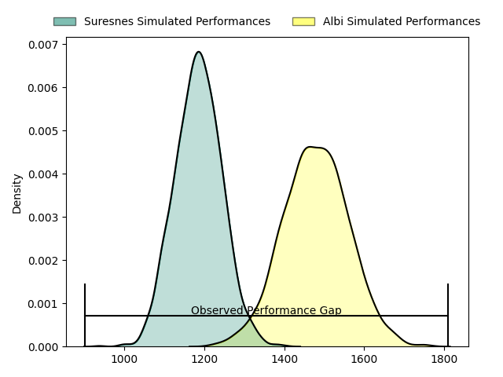
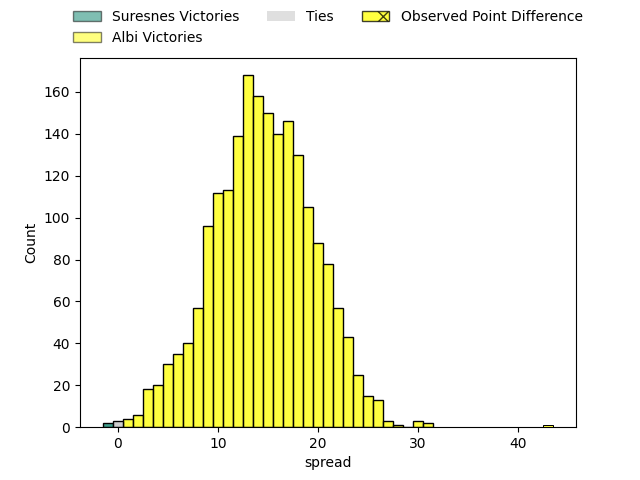
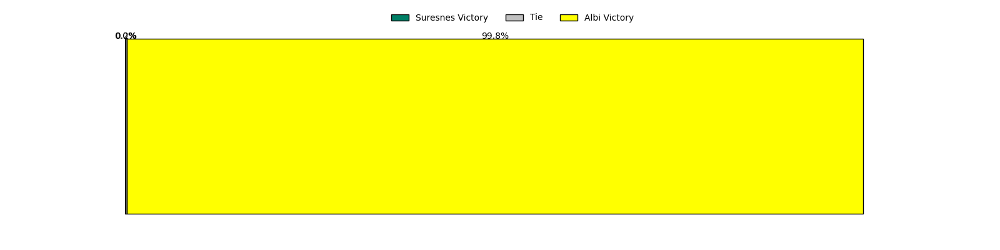
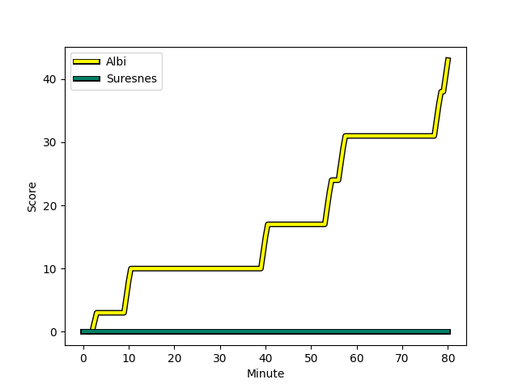

---  
layout: page  
title: Suresnes at Albi; 0-43  
date: 2023-03-04 18:30:00 18:00:00 -0500  
categories: match review  
---
# Suresnes at Albi; 0-43

# Club Level Predictions

The first set of predictions treats a club as the smallest object, as the club develops its members, organizes a gameplan, and deploys its players as needed for each match. This club model has a prediction of 0.839, which translates to predicting Albi to win by 14.6.

Each club has a rating and a rating deviation (simiar to a Glicko system), and expected performances can be generated. This allows for simulated matches and spreads like the ones below.
## Projected Performances

## Projected Spreads

## Projected Results

# Player Level Predictions

Treating teams instead as an entity made up of the currently active players, I have ratings for each player in an altogether different system. These can be combined to form team ratings once teamsheets are announced, weighting starters a bit higher than the reserves. After the match is played, players can be weighted by their minutes on the field, allowing for an accurate measure of the team's composition. With these compiled team ratings, we can make predictions, measure inaccuracy, and update the individual player ratings.
## Prediction with Player Minutes: Albi by 18.4

Albi by 14.4 on a neutral field
## Scores over Time

## Win Probability over Time

There were 3 large changes in win probability in this match
## Prediction without Player Minutes: Albi by 17.8

Albi by 13.8 on a neutral pitch

|   Away Minutes | Away Player                                                                           |   Away elo |   Away Percentile |   Number |   Home Percentile |   Home elo | Home Player                                                                          |   Home Minutes |
|---------------:|:--------------------------------------------------------------------------------------|-----------:|------------------:|---------:|------------------:|-----------:|:-------------------------------------------------------------------------------------|---------------:|
|             62 | [Elias Coulibaly](..//playerfiles//EliasCoulibaly_cleaned.md)                         |     101.47 |               nan |        1 |                91 |     113.39 | [Antoine Soave](..//playerfiles//AntoineSoave_cleaned.md)                            |             56 |
|             80 | [Elias Coulibaly](..//playerfiles//EliasCoulibaly_cleaned.md)                         |     101.47 |               nan |        1 |                91 |     113.39 | [Antoine Soave](..//playerfiles//AntoineSoave_cleaned.md)                            |             56 |
|             62 | [Elias Coulibaly](..//playerfiles//EliasCoulibaly_cleaned.md)                         |     101.47 |               nan |        1 |                91 |     113.39 | [Antoine Soave](..//playerfiles//AntoineSoave_cleaned.md)                            |             80 |
|             80 | [Elias Coulibaly](..//playerfiles//EliasCoulibaly_cleaned.md)                         |     101.47 |               nan |        1 |                91 |     113.39 | [Antoine Soave](..//playerfiles//AntoineSoave_cleaned.md)                            |             80 |
|             60 | [Thomas Bordes](..//playerfiles//ThomasBordes_cleaned.md)                             |      89.72 |                22 |        2 |                20 |      85.87 | [Reinach Venter](..//playerfiles//ReinachVenter_cleaned.md)                          |             56 |
|             80 | [Thomas Bordes](..//playerfiles//ThomasBordes_cleaned.md)                             |      89.72 |                22 |        2 |                20 |      85.87 | [Reinach Venter](..//playerfiles//ReinachVenter_cleaned.md)                          |             56 |
|             60 | [Thomas Bordes](..//playerfiles//ThomasBordes_cleaned.md)                             |      89.72 |                22 |        2 |                20 |      85.87 | [Reinach Venter](..//playerfiles//ReinachVenter_cleaned.md)                          |             80 |
|             80 | [Thomas Bordes](..//playerfiles//ThomasBordes_cleaned.md)                             |      89.72 |                22 |        2 |                20 |      85.87 | [Reinach Venter](..//playerfiles//ReinachVenter_cleaned.md)                          |             80 |
|             80 | [Leandro Mario Assi](..//playerfiles//LeandroMarioAssi_cleaned.md)                    |      94    |                30 |        3 |                59 |      96.3  | [Dimitri Tchapnga](..//playerfiles//DimitriTchapnga_cleaned.md)                      |             80 |
|             80 | [Leandro Mario Assi](..//playerfiles//LeandroMarioAssi_cleaned.md)                    |      94    |                30 |        3 |                59 |      96.3  | [Dimitri Tchapnga](..//playerfiles//DimitriTchapnga_cleaned.md)                      |             56 |
|             49 | [Leandro Mario Assi](..//playerfiles//LeandroMarioAssi_cleaned.md)                    |      94    |                30 |        3 |                59 |      96.3  | [Dimitri Tchapnga](..//playerfiles//DimitriTchapnga_cleaned.md)                      |             56 |
|             49 | [Leandro Mario Assi](..//playerfiles//LeandroMarioAssi_cleaned.md)                    |      94    |                30 |        3 |                59 |      96.3  | [Dimitri Tchapnga](..//playerfiles//DimitriTchapnga_cleaned.md)                      |             80 |
|             80 | [Florian Desbordes](..//playerfiles//FlorianDesbordes_cleaned.md)                     |      92.02 |                40 |        4 |                82 |     106.44 | [Charles Foures](..//playerfiles//CharlesFoures_cleaned.md)                          |             80 |
|             80 | [Sacha Yahi](..//playerfiles//SachaYahi_cleaned.md)                                   |      95    |               nan |        5 |                73 |     103.65 | [Jacques Jacobus Engelbrecht](..//playerfiles//JacquesJacobusEngelbrecht_cleaned.md) |             56 |
|             62 | [Sacha Yahi](..//playerfiles//SachaYahi_cleaned.md)                                   |      95    |               nan |        5 |                73 |     103.65 | [Jacques Jacobus Engelbrecht](..//playerfiles//JacquesJacobusEngelbrecht_cleaned.md) |             80 |
|             80 | [Sacha Yahi](..//playerfiles//SachaYahi_cleaned.md)                                   |      95    |               nan |        5 |                73 |     103.65 | [Jacques Jacobus Engelbrecht](..//playerfiles//JacquesJacobusEngelbrecht_cleaned.md) |             80 |
|             62 | [Sacha Yahi](..//playerfiles//SachaYahi_cleaned.md)                                   |      95    |               nan |        5 |                73 |     103.65 | [Jacques Jacobus Engelbrecht](..//playerfiles//JacquesJacobusEngelbrecht_cleaned.md) |             56 |
|             80 | [Hayam El Bibouji](..//playerfiles//HayamElBibouji_cleaned.md)                        |      93.67 |                48 |        6 |                48 |      93.66 | [Luke Joseph Stringer](..//playerfiles//LukeJosephStringer_cleaned.md)               |             80 |
|             80 | [Hayam El Bibouji](..//playerfiles//HayamElBibouji_cleaned.md)                        |      93.67 |                48 |        6 |                48 |      93.66 | [Luke Joseph Stringer](..//playerfiles//LukeJosephStringer_cleaned.md)               |             58 |
|             80 | [Bastien Berenguel](..//playerfiles//BastienBerenguel_cleaned.md)                     |     107.44 |                80 |        7 |                18 |      84.02 | [Vincent Calas](..//playerfiles//VincentCalas_cleaned.md)                            |             80 |
|             74 | [Louis-Mathieu Jazeix](..//playerfiles//Louis-MathieuJazeix_cleaned.md)               |      98.62 |                59 |        8 |                89 |     114.04 | [Sandrick Maciotta](..//playerfiles//SandrickMaciotta_cleaned.md)                    |             80 |
|             80 | [Louis-Mathieu Jazeix](..//playerfiles//Louis-MathieuJazeix_cleaned.md)               |      98.62 |                59 |        8 |                89 |     114.04 | [Sandrick Maciotta](..//playerfiles//SandrickMaciotta_cleaned.md)                    |             80 |
|             50 | [Quentin Dauvergne](..//playerfiles//QuentinDauvergne_cleaned.md)                     |      81.49 |                15 |        9 |                14 |      81    | [Titouan Pouzoullic](..//playerfiles//TitouanPouzoullic_cleaned.md)                  |             80 |
|             80 | [Quentin Dauvergne](..//playerfiles//QuentinDauvergne_cleaned.md)                     |      81.49 |                15 |        9 |                14 |      81    | [Titouan Pouzoullic](..//playerfiles//TitouanPouzoullic_cleaned.md)                  |             80 |
|             50 | [Quentin Dauvergne](..//playerfiles//QuentinDauvergne_cleaned.md)                     |      81.49 |                15 |        9 |                14 |      81    | [Titouan Pouzoullic](..//playerfiles//TitouanPouzoullic_cleaned.md)                  |             64 |
|             80 | [Quentin Dauvergne](..//playerfiles//QuentinDauvergne_cleaned.md)                     |      81.49 |                15 |        9 |                14 |      81    | [Titouan Pouzoullic](..//playerfiles//TitouanPouzoullic_cleaned.md)                  |             64 |
|             72 | [Ignacio Mieres](..//playerfiles//IgnacioMieres_cleaned.md)                           |      99.37 |                62 |       10 |                40 |      91.83 | [François Fontaine](..//playerfiles//FrançoisFontaine_cleaned.md)                    |             53 |
|             72 | [Ignacio Mieres](..//playerfiles//IgnacioMieres_cleaned.md)                           |      99.37 |                62 |       10 |                40 |      91.83 | [François Fontaine](..//playerfiles//FrançoisFontaine_cleaned.md)                    |             80 |
|             80 | [Ignacio Mieres](..//playerfiles//IgnacioMieres_cleaned.md)                           |      99.37 |                62 |       10 |                40 |      91.83 | [François Fontaine](..//playerfiles//FrançoisFontaine_cleaned.md)                    |             53 |
|             80 | [Ignacio Mieres](..//playerfiles//IgnacioMieres_cleaned.md)                           |      99.37 |                62 |       10 |                40 |      91.83 | [François Fontaine](..//playerfiles//FrançoisFontaine_cleaned.md)                    |             80 |
|             80 | [Thomas Baudy](..//playerfiles//ThomasBaudy_cleaned.md)                               |      85.94 |                28 |       11 |                65 |      99.93 | [Louis Decrop](..//playerfiles//LouisDecrop_cleaned.md)                              |             80 |
|             80 | [Thomas Baudy](..//playerfiles//ThomasBaudy_cleaned.md)                               |      85.94 |                28 |       11 |                65 |      99.93 | [Louis Decrop](..//playerfiles//LouisDecrop_cleaned.md)                              |             52 |
|             50 | [Hugo Detre](..//playerfiles//HugoDetre_cleaned.md)                                   |      82.84 |                17 |       12 |                38 |      91.01 | [Simon Andreu](..//playerfiles//SimonAndreu_cleaned.md)                              |             80 |
|             80 | [Hugo Detre](..//playerfiles//HugoDetre_cleaned.md)                                   |      82.84 |                17 |       12 |                38 |      91.01 | [Simon Andreu](..//playerfiles//SimonAndreu_cleaned.md)                              |             80 |
|             80 | [Lilan Savioz Fouillet](..//playerfiles//LilanSaviozFouillet_cleaned.md)              |     103.7  |                74 |       13 |                96 |     126.14 | [Baptiste Couchinave](..//playerfiles//BaptisteCouchinave_cleaned.md)                |             80 |
|             80 | [Jean-Baptiste Fuster](..//playerfiles//Jean-BaptisteFuster_cleaned.md)               |      54.07 |                 1 |       14 |                72 |     102.43 | [Charly Vicenzo Trussardi](..//playerfiles//CharlyVicenzoTrussardi_cleaned.md)       |             80 |
|             80 | [Pierre Le Huby](..//playerfiles//PierreLeHuby_cleaned.md)                            |      96.97 |               nan |       15 |                71 |     103.24 | [Paul Clergue](..//playerfiles//PaulClergue_cleaned.md)                              |             80 |
|             18 | [Lucas Dycke](..//playerfiles//LucasDycke_cleaned.md)                                 |      85.69 |                20 |       16 |                65 |      99.24 | [Pierre Commenge](..//playerfiles//PierreCommenge_cleaned.md)                        |             24 |
|             20 | [Anthony Bajart](..//playerfiles//AnthonyBajart_cleaned.md)                           |     101.89 |                73 |       17 |                85 |     107.8  | [Arthur Castant](..//playerfiles//ArthurCastant_cleaned.md)                          |             24 |
|             31 | [Victor Damian Arias](..//playerfiles//VictorDamianArias_cleaned.md)                  |     105.63 |                83 |       18 |                68 |      99.98 | [Jean-Baptiste De Clercq](..//playerfiles//Jean-BaptisteDeClercq_cleaned.md)         |             24 |
|             18 | [Damien Bozic](..//playerfiles//DamienBozic_cleaned.md)                               |      95.85 |               nan |       19 |                48 |      94.41 | [John Henry Heath Backhouse](..//playerfiles//JohnHenryHeathBackhouse_cleaned.md)    |             24 |
|             30 | [Théo Bachiri](..//playerfiles//ThéoBachiri_cleaned.md)                               |      86.14 |                18 |       20 |                92 |     118.54 | [Lucas Guillaume](..//playerfiles//LucasGuillaume_cleaned.md)                        |             22 |
|              8 | [Gaëtan Robert](..//playerfiles//GaëtanRobert_cleaned.md)                             |      79.75 |                12 |       21 |                36 |      92.19 | [Gilen Queheille](..//playerfiles//GilenQueheille_cleaned.md)                        |             16 |
|             30 | [Petero Tuwai](..//playerfiles//PeteroTuwai_cleaned.md)                               |      95.69 |                52 |       22 |                43 |      94.08 | [Théo Vidal](..//playerfiles//ThéoVidal_cleaned.md)                                  |             27 |
|              6 | [Frédéric Buisha Ngoy Mbiyaki](..//playerfiles//FrédéricBuishaNgoyMbiyaki_cleaned.md) |      95    |               nan |       23 |                75 |     106.18 | [Téo Dospital](..//playerfiles//TéoDospital_cleaned.md)                              |             28 |

