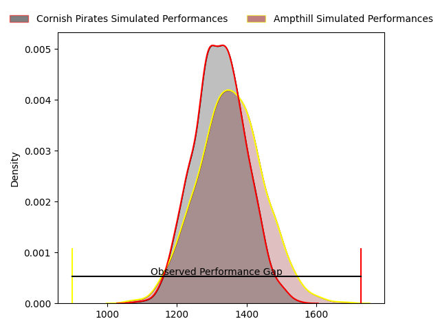
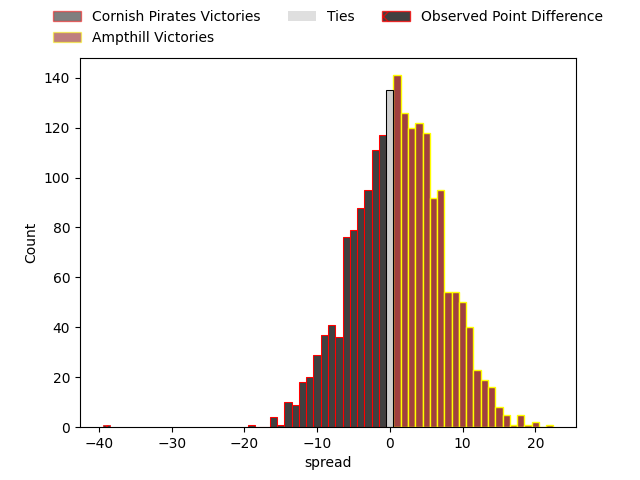
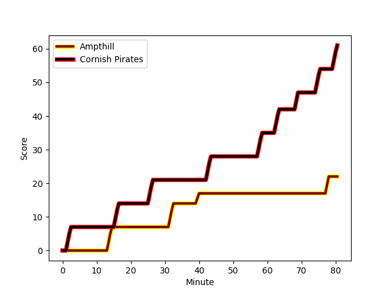
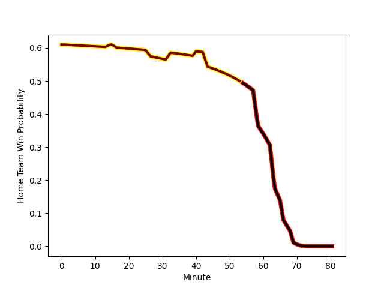

---  
layout: page  
title: Cornish Pirates at Ampthill; 61-22  
date: 2023-03-04 15:00:00 18:00:00 -0500  
categories: match review  
---
# Cornish Pirates at Ampthill; 61-22

# Club Level Predictions

The first set of predictions treats a club as the smallest object, as the club develops its members, organizes a gameplan, and deploys its players as needed for each match. This club model has a prediction of 0.538, which translates to predicting Ampthill to win by 1.4.

Each club has a rating and a rating deviation (simiar to a Glicko system), and expected performances can be generated. This allows for simulated matches and spreads like the ones below.
## Projected Performances

## Projected Spreads

## Projected Results

# Player Level Predictions

Treating teams instead as an entity made up of the currently active players, I have ratings for each player in an altogether different system. These can be combined to form team ratings once teamsheets are announced, weighting starters a bit higher than the reserves. After the match is played, players can be weighted by their minutes on the field, allowing for an accurate measure of the team's composition. With these compiled team ratings, we can make predictions, measure inaccuracy, and update the individual player ratings.
## Prediction with Player Minutes: Ampthill by 16.2

Ampthill by 12.2 on a neutral field
## Scores over Time

## Win Probability over Time

There were 6 large changes in win probability in this match
## Prediction without Player Minutes: Ampthill by 16.2

Ampthill by 12.2 on a neutral pitch

|   Away Minutes | Away Player                                                      |   Away elo |   Away Percentile |   Number |   Home Percentile |   Home elo | Home Player                                                       |   Home Minutes |
|---------------:|:-----------------------------------------------------------------|-----------:|------------------:|---------:|------------------:|-----------:|:------------------------------------------------------------------|---------------:|
|             80 | [Jack Andrew](..//playerfiles//JackAndrew_cleaned.md)            |     120.22 |                96 |        1 |                67 |     105.64 | [James Flynn](..//playerfiles//JamesFlynn_cleaned.md)             |             80 |
|             80 | [Jack Andrew](..//playerfiles//JackAndrew_cleaned.md)            |     120.22 |                96 |        1 |                83 |     105.64 | [James Flynn](..//playerfiles//JamesFlynn_cleaned.md)             |             80 |
|             80 | [William Crane](..//playerfiles//WilliamCrane_cleaned.md)        |      92.98 |                45 |        2 |                89 |     110.79 | [Sid Blackmore](..//playerfiles//SidBlackmore_cleaned.md)         |             80 |
|             80 | [Matt Johnson](..//playerfiles//MattJohnson_cleaned.md)          |      97.12 |                57 |        3 |                71 |     104.75 | [Luke Green](..//playerfiles//LukeGreen_cleaned.md)               |             80 |
|             80 | [Matt Johnson](..//playerfiles//MattJohnson_cleaned.md)          |      97.12 |                57 |        3 |                81 |     104.75 | [Luke Green](..//playerfiles//LukeGreen_cleaned.md)               |             80 |
|             80 | [Josh Williams](..//playerfiles//JoshWilliams_cleaned.md)        |      93.69 |               nan |        4 |                86 |     111.11 | [Charlie Beckett](..//playerfiles//CharlieBeckett_cleaned.md)     |             80 |
|             80 | [Will Britton](..//playerfiles//WillBritton_cleaned.md)          |      97.5  |                57 |        5 |                53 |      95.84 | [Fyn Brown](..//playerfiles//FynBrown_cleaned.md)                 |             80 |
|             80 | [Alex Everett](..//playerfiles//AlexEverett_cleaned.md)          |      90.32 |                36 |        6 |                33 |      89.76 | [Harry Wilson](..//playerfiles//HarryWilson_cleaned.md)           |             80 |
|             80 | [Will Gibson](..//playerfiles//WillGibson_cleaned.md)            |      88    |                41 |        7 |                78 |     106.48 | [Josh Smart](..//playerfiles//JoshSmart_cleaned.md)               |             80 |
|             80 | [John Stevens](..//playerfiles//JohnStevens_cleaned.md)          |     118.38 |                93 |        8 |                59 |      98.66 | [Morgan Strong](..//playerfiles//MorganStrong_cleaned.md)         |             80 |
|             80 | [Alex Schwarz](..//playerfiles//AlexSchwarz_cleaned.md)          |      77.36 |                11 |        9 |                97 |     123.66 | [Peter White](..//playerfiles//PeterWhite_cleaned.md)             |             80 |
|             80 | [Arwel Robson](..//playerfiles//ArwelRobson_cleaned.md)          |      75.71 |                 8 |       10 |                82 |     108.38 | [Tom Hardwick](..//playerfiles//TomHardwick_cleaned.md)           |             80 |
|             80 | [Robin Wedlake](..//playerfiles//RobinWedlake_cleaned.md)        |      90.82 |                37 |       11 |                44 |      92.8  | [Alexandrer Harmes](..//playerfiles//AlexandrerHarmes_cleaned.md) |             80 |
|             80 | [Garyn Smith](..//playerfiles//GarynSmith_cleaned.md)            |      83.39 |                17 |       12 |                23 |      85.85 | [Joshua Bragman](..//playerfiles//JoshuaBragman_cleaned.md)       |             80 |
|             80 | [Rory Parata](..//playerfiles//RoryParata_cleaned.md)            |      89.83 |                34 |       13 |                70 |     101.69 | [George Worth](..//playerfiles//GeorgeWorth_cleaned.md)           |             80 |
|             80 | [Arthur Relton](..//playerfiles//ArthurRelton_cleaned.md)        |      95.44 |                52 |       14 |                78 |     105.41 | [Ben Harris](..//playerfiles//BenHarris_cleaned.md)               |             80 |
|             80 | [Alexander AJ Cant](..//playerfiles//AlexanderAJCant_cleaned.md) |     118.1  |                91 |       15 |                83 |     109.78 | [Tomas Bacon](..//playerfiles//TomasBacon_cleaned.md)             |             80 |

