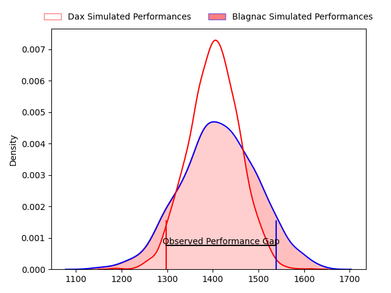
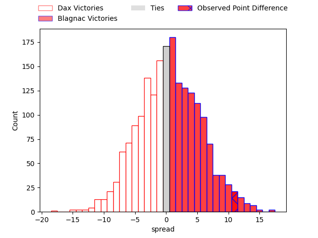
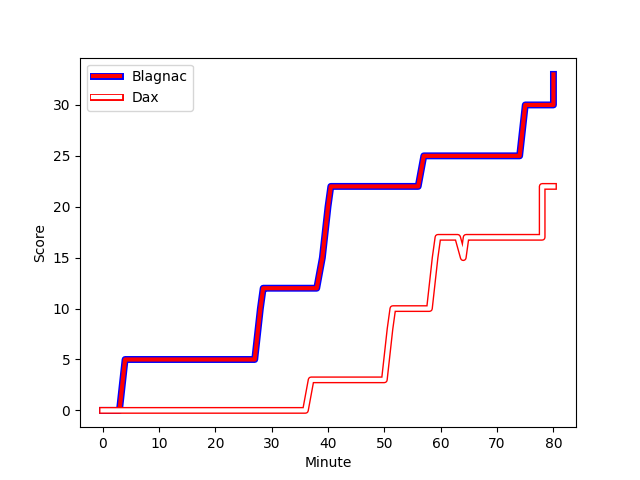
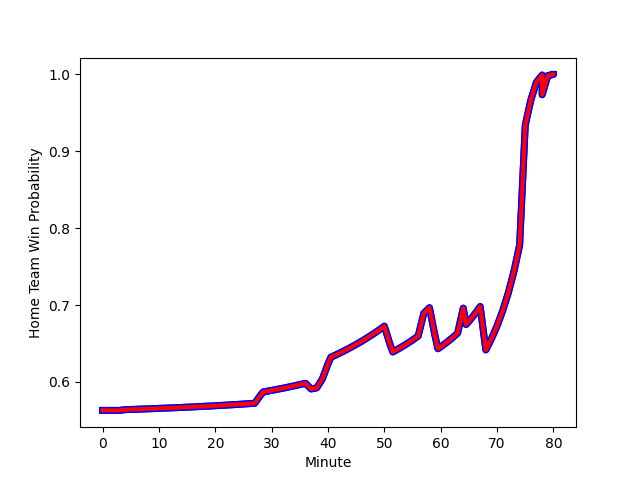

---  
layout: page  
title: Dax at Blagnac; 22-33  
date: 2023-03-04 16:00:00 18:00:00 -0500  
categories: match review  
---
# Dax at Blagnac; 22-33

# Club Level Predictions

The first set of predictions treats a club as the smallest object, as the club develops its members, organizes a gameplan, and deploys its players as needed for each match. This club model has a prediction of 0.51, which translates to predicting Blagnac to win by 0.3.

Each club has a rating and a rating deviation (simiar to a Glicko system), and expected performances can be generated. This allows for simulated matches and spreads like the ones below.
## Projected Performances

## Projected Spreads

## Projected Results

# Player Level Predictions

Treating teams instead as an entity made up of the currently active players, I have ratings for each player in an altogether different system. These can be combined to form team ratings once teamsheets are announced, weighting starters a bit higher than the reserves. After the match is played, players can be weighted by their minutes on the field, allowing for an accurate measure of the team's composition. With these compiled team ratings, we can make predictions, measure inaccuracy, and update the individual player ratings.
## Prediction with Player Minutes: Blagnac by 15.0

Blagnac by 11.0 on a neutral field
## Scores over Time

## Win Probability over Time

There were 9 large changes in win probability in this match
## Prediction without Player Minutes: Blagnac by 17.5

Blagnac by 13.5 on a neutral pitch

|   Away Minutes | Away Player                                                        |   Away elo |   Away Percentile |   Number |   Home Percentile |   Home elo | Home Player                                                             |   Home Minutes |
|---------------:|:-------------------------------------------------------------------|-----------:|------------------:|---------:|------------------:|-----------:|:------------------------------------------------------------------------|---------------:|
|             39 | [Joaquin Rodon](..//playerfiles//JoaquinRodon_cleaned.md)          |      90.4  |                33 |        1 |                20 |      80.66 | [Jean-Baptiste Martin](..//playerfiles//Jean-BaptisteMartin_cleaned.md) |             58 |
|             80 | [Joaquin Rodon](..//playerfiles//JoaquinRodon_cleaned.md)          |      90.4  |                33 |        1 |                20 |      80.66 | [Jean-Baptiste Martin](..//playerfiles//Jean-BaptisteMartin_cleaned.md) |             58 |
|             39 | [Joaquin Rodon](..//playerfiles//JoaquinRodon_cleaned.md)          |      90.4  |                33 |        1 |                20 |      80.66 | [Jean-Baptiste Martin](..//playerfiles//Jean-BaptisteMartin_cleaned.md) |             80 |
|             80 | [Joaquin Rodon](..//playerfiles//JoaquinRodon_cleaned.md)          |      90.4  |                33 |        1 |                20 |      80.66 | [Jean-Baptiste Martin](..//playerfiles//Jean-BaptisteMartin_cleaned.md) |             80 |
|             80 | [Maxime Delonca](..//playerfiles//MaximeDelonca_cleaned.md)        |      85.14 |                19 |        2 |                93 |     111.87 | [Gabin Villerouge](..//playerfiles//GabinVillerouge_cleaned.md)         |             80 |
|             39 | [Maxime Delonca](..//playerfiles//MaximeDelonca_cleaned.md)        |      85.14 |                19 |        2 |                93 |     111.87 | [Gabin Villerouge](..//playerfiles//GabinVillerouge_cleaned.md)         |             49 |
|             80 | [Maxime Delonca](..//playerfiles//MaximeDelonca_cleaned.md)        |      85.14 |                19 |        2 |                93 |     111.87 | [Gabin Villerouge](..//playerfiles//GabinVillerouge_cleaned.md)         |             49 |
|             39 | [Maxime Delonca](..//playerfiles//MaximeDelonca_cleaned.md)        |      85.14 |                19 |        2 |                93 |     111.87 | [Gabin Villerouge](..//playerfiles//GabinVillerouge_cleaned.md)         |             80 |
|             80 | [Thibaud Dréan](..//playerfiles//ThibaudDréan_cleaned.md)          |      68.75 |                 3 |        3 |                53 |      95.69 | [Fabien Lorenzon](..//playerfiles//FabienLorenzon_cleaned.md)           |             80 |
|             58 | [Thibaud Dréan](..//playerfiles//ThibaudDréan_cleaned.md)          |      68.75 |                 3 |        3 |                53 |      95.69 | [Fabien Lorenzon](..//playerfiles//FabienLorenzon_cleaned.md)           |             80 |
|             80 | [Thibaud Dréan](..//playerfiles//ThibaudDréan_cleaned.md)          |      68.75 |                 3 |        3 |                53 |      95.69 | [Fabien Lorenzon](..//playerfiles//FabienLorenzon_cleaned.md)           |             62 |
|             58 | [Thibaud Dréan](..//playerfiles//ThibaudDréan_cleaned.md)          |      68.75 |                 3 |        3 |                53 |      95.69 | [Fabien Lorenzon](..//playerfiles//FabienLorenzon_cleaned.md)           |             62 |
|             53 | [Étienne Loiret](..//playerfiles//ÉtienneLoiret_cleaned.md)        |      89.93 |                32 |        4 |                91 |     114.78 | [Vincent Mutel](..//playerfiles//VincentMutel_cleaned.md)               |             80 |
|             80 | [Étienne Loiret](..//playerfiles//ÉtienneLoiret_cleaned.md)        |      89.93 |                32 |        4 |                91 |     114.78 | [Vincent Mutel](..//playerfiles//VincentMutel_cleaned.md)               |             80 |
|             80 | [Matt Luamanu](..//playerfiles//MattLuamanu_cleaned.md)            |      86.62 |                36 |        5 |                71 |     102.75 | [Lilian Rousset](..//playerfiles//LilianRousset_cleaned.md)             |             80 |
|             80 | [Matt Luamanu](..//playerfiles//MattLuamanu_cleaned.md)            |      86.62 |                36 |        5 |                71 |     102.75 | [Lilian Rousset](..//playerfiles//LilianRousset_cleaned.md)             |             66 |
|             53 | [Matt Luamanu](..//playerfiles//MattLuamanu_cleaned.md)            |      86.62 |                36 |        5 |                71 |     102.75 | [Lilian Rousset](..//playerfiles//LilianRousset_cleaned.md)             |             80 |
|             53 | [Matt Luamanu](..//playerfiles//MattLuamanu_cleaned.md)            |      86.62 |                36 |        5 |                71 |     102.75 | [Lilian Rousset](..//playerfiles//LilianRousset_cleaned.md)             |             66 |
|             80 | [Arnaud Aletti](..//playerfiles//ArnaudAletti_cleaned.md)          |      96.99 |                56 |        6 |                58 |      97.69 | [Nikita Bekov](..//playerfiles//NikitaBekov_cleaned.md)                 |             75 |
|             80 | [Arnaud Aletti](..//playerfiles//ArnaudAletti_cleaned.md)          |      96.99 |                56 |        6 |                58 |      97.69 | [Nikita Bekov](..//playerfiles//NikitaBekov_cleaned.md)                 |             80 |
|             80 | [Théo Tremeau](..//playerfiles//ThéoTremeau_cleaned.md)            |      91.69 |                40 |        7 |                33 |      89.61 | [Benjamin Collet](..//playerfiles//BenjaminCollet_cleaned.md)           |             52 |
|             80 | [Théo Tremeau](..//playerfiles//ThéoTremeau_cleaned.md)            |      91.69 |                40 |        7 |                33 |      89.61 | [Benjamin Collet](..//playerfiles//BenjaminCollet_cleaned.md)           |             80 |
|             80 | [Brice Ferrer](..//playerfiles//BriceFerrer_cleaned.md)            |      78.99 |                11 |        8 |                77 |     105.27 | [Mathieu Vachon](..//playerfiles//MathieuVachon_cleaned.md)             |             80 |
|             55 | [Simon Garrouteigt](..//playerfiles//SimonGarrouteigt_cleaned.md)  |      87.28 |                27 |        9 |                84 |     107.56 | [Paul Ravier](..//playerfiles//PaulRavier_cleaned.md)                   |             68 |
|             55 | [Simon Garrouteigt](..//playerfiles//SimonGarrouteigt_cleaned.md)  |      87.28 |                27 |        9 |                84 |     107.56 | [Paul Ravier](..//playerfiles//PaulRavier_cleaned.md)                   |             80 |
|             80 | [Simon Garrouteigt](..//playerfiles//SimonGarrouteigt_cleaned.md)  |      87.28 |                27 |        9 |                84 |     107.56 | [Paul Ravier](..//playerfiles//PaulRavier_cleaned.md)                   |             80 |
|             80 | [Simon Garrouteigt](..//playerfiles//SimonGarrouteigt_cleaned.md)  |      87.28 |                27 |        9 |                84 |     107.56 | [Paul Ravier](..//playerfiles//PaulRavier_cleaned.md)                   |             68 |
|             80 | [Hugo Cerisier](..//playerfiles//HugoCerisier_cleaned.md)          |      89.98 |                33 |       10 |                74 |     104.03 | [Valentin Delpy](..//playerfiles//ValentinDelpy_cleaned.md)             |             80 |
|             55 | [Julien Dechavanne](..//playerfiles//JulienDechavanne_cleaned.md)  |      87.6  |                25 |       11 |                27 |      87.29 | [Lukas Doyhenard](..//playerfiles//LukasDoyhenard_cleaned.md)           |             80 |
|             80 | [Julien Dechavanne](..//playerfiles//JulienDechavanne_cleaned.md)  |      87.6  |                25 |       11 |                27 |      87.29 | [Lukas Doyhenard](..//playerfiles//LukasDoyhenard_cleaned.md)           |             80 |
|             80 | [Ilikena Bolakoro](..//playerfiles//IlikenaBolakoro_cleaned.md)    |      91.39 |                39 |       12 |                 9 |      70.84 | [Antoine Renaud](..//playerfiles//AntoineRenaud_cleaned.md)             |             80 |
|             66 | [Ilikena Bolakoro](..//playerfiles//IlikenaBolakoro_cleaned.md)    |      91.39 |                39 |       12 |                 9 |      70.84 | [Antoine Renaud](..//playerfiles//AntoineRenaud_cleaned.md)             |             80 |
|             66 | [Ilikena Bolakoro](..//playerfiles//IlikenaBolakoro_cleaned.md)    |      91.39 |                39 |       12 |                 9 |      70.84 | [Antoine Renaud](..//playerfiles//AntoineRenaud_cleaned.md)             |             66 |
|             80 | [Ilikena Bolakoro](..//playerfiles//IlikenaBolakoro_cleaned.md)    |      91.39 |                39 |       12 |                 9 |      70.84 | [Antoine Renaud](..//playerfiles//AntoineRenaud_cleaned.md)             |             66 |
|             80 | [Sylvère Reteau](..//playerfiles//SylvèreReteau_cleaned.md)        |      99.03 |                61 |       13 |                52 |      95.78 | [Clément Vareilles](..//playerfiles//ClémentVareilles_cleaned.md)       |             80 |
|             80 | [Théo Gatelier](..//playerfiles//ThéoGatelier_cleaned.md)          |     105.42 |                84 |       14 |                29 |      88.69 | [Lucas Martins](..//playerfiles//LucasMartins_cleaned.md)               |             80 |
|             80 | [Théo Duprat](..//playerfiles//ThéoDuprat_cleaned.md)              |     104.79 |                73 |       15 |                64 |     100.2  | [Ugo Seunes](..//playerfiles//UgoSeunes_cleaned.md)                     |             80 |
|             41 | [Asa Faitotoa](..//playerfiles//AsaFaitotoa_cleaned.md)            |     114.81 |                94 |       16 |                83 |     105.79 | [Cesar Biscioni](..//playerfiles//CesarBiscioni_cleaned.md)             |             22 |
|             41 | [Elvis Levi](..//playerfiles//ElvisLevi_cleaned.md)                |     129.69 |                98 |       17 |                39 |      91.3  | [Florian Bertrand](..//playerfiles//FlorianBertrand_cleaned.md)         |             31 |
|             22 | [Anthony Pelmard](..//playerfiles//AnthonyPelmard_cleaned.md)      |      96.48 |                68 |       18 |                78 |     103.46 | [Baptiste Collet](..//playerfiles//BaptisteCollet_cleaned.md)           |             18 |
|             27 | [Paul Arnaud Ausset](..//playerfiles//PaulArnaudAusset_cleaned.md) |     106.48 |                78 |       19 |                 4 |      67.31 | [Lucas Tolofua](..//playerfiles//LucasTolofua_cleaned.md)               |             14 |
|             27 | [Yoan Gaune](..//playerfiles//YoanGaune_cleaned.md)                |     109.63 |                85 |       20 |                32 |      89.62 | [Nekolo Tolofua](..//playerfiles//NekoloTolofua_cleaned.md)             |             28 |
|             25 | [Adrien Ayestaran](..//playerfiles//AdrienAyestaran_cleaned.md)    |      78.89 |                16 |       21 |                82 |     106.17 | [Ianis Ponsole](..//playerfiles//IanisPonsole_cleaned.md)               |              5 |
|             25 | [Guillaume Bouche](..//playerfiles//GuillaumeBouche_cleaned.md)    |     112.67 |                88 |       22 |                42 |      98.71 | [Corentin Penc'hoat](..//playerfiles//CorentinPenc'hoat_cleaned.md)     |             12 |
|             14 | [Jules Lartigau](..//playerfiles//JulesLartigau_cleaned.md)        |      94.77 |               nan |       23 |                96 |     128.27 | [Jean-Andre Vernetti](..//playerfiles//Jean-AndreVernetti_cleaned.md)   |             14 |

