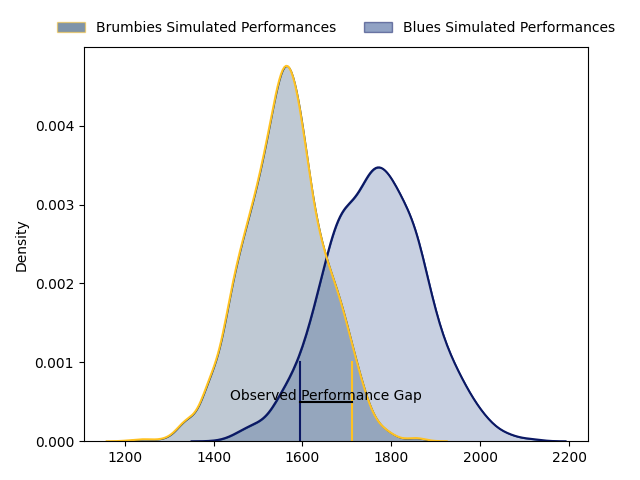
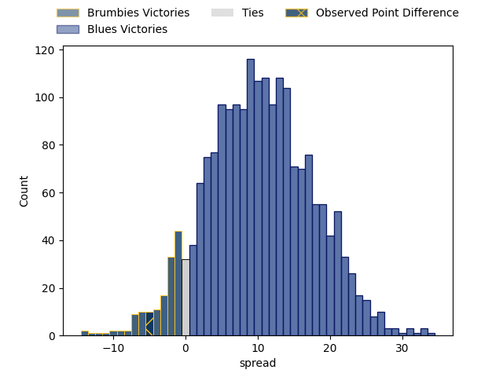
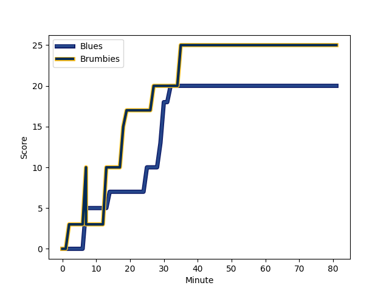
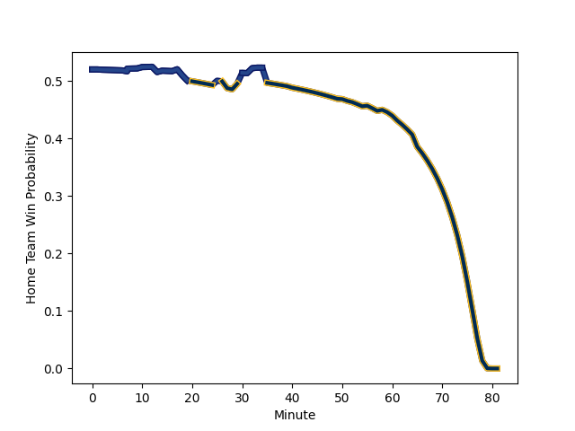

---  
layout: page  
title: Brumbies at Blues; 25.0-20.0  
date: 2023-03-04 22:00:00 18:00:00 -0500  
categories: match review  
---
# Brumbies at Blues; 25.0-20.0

# Club Level Predictions

The first set of predictions treats a club as the smallest object, as the club develops its members, organizes a gameplan, and deploys its players as needed for each match. This club model has a prediction of 0.756, which translates to predicting Blues to win by 10.2.

Each club has a rating and a rating deviation (simiar to a Glicko system), and expected performances can be generated. This allows for simulated matches and spreads like the ones below.
## Projected Performances

## Projected Spreads

## Projected Results

# Player Level Predictions

Treating teams instead as an entity made up of the currently active players, I have ratings for each player in an altogether different system. These can be combined to form team ratings once teamsheets are announced, weighting starters a bit higher than the reserves. After the match is played, players can be weighted by their minutes on the field, allowing for an accurate measure of the team's composition. With these compiled team ratings, we can make predictions, measure inaccuracy, and update the individual player ratings.
## Prediction with Player Minutes: Blues by 7.5

Blues by 3.5 on a neutral field
## Scores over Time

## Win Probability over Time

There were 8 large changes in win probability in this match
## Prediction without Player Minutes: Blues by 6.7

Blues by 2.7 on a neutral pitch

|   Away Minutes | Away Player                                                     |   Away elo |   Away Percentile |   Number |   Home Percentile |   Home elo | Home Player                                                                               |   Home Minutes |
|---------------:|:----------------------------------------------------------------|-----------:|------------------:|---------:|------------------:|-----------:|:------------------------------------------------------------------------------------------|---------------:|
|             59 | [James Slipper](..//playerfiles//JamesSlipper_cleaned.md)       |      98.09 |               nan |        1 |               nan |      98.85 | [Josh Fusitua](..//playerfiles//JoshFusitua_cleaned.md)                                   |             51 |
|             81 | [Lachlan Lonergan](..//playerfiles//LachlanLonergan_cleaned.md) |      95    |               nan |        2 |               nan |      98.85 | [Ricky Riccitelli](..//playerfiles//RickyRiccitelli_cleaned.md)                           |             61 |
|             10 | [Allan Alaalatoa](..//playerfiles//AllanAlaalatoa_cleaned.md)   |      99.71 |                67 |        3 |               nan |      95    | [James Lay](..//playerfiles//JamesLay_cleaned.md)                                         |             58 |
|             81 | [Nick Frost](..//playerfiles//NickFrost_cleaned.md)             |     101.04 |                66 |        4 |                70 |     102.71 | [Patrick Tuipulotu](..//playerfiles//PatrickTuipulotu_cleaned.md)                         |             81 |
|             59 | [Cadeyrn Neville](..//playerfiles//CadeyrnNeville_cleaned.md)   |      98.98 |                62 |        5 |                74 |     104.07 | [Cameron Suafoa](..//playerfiles//CameronSuafoa_cleaned.md)                               |             81 |
|             81 | [Rob Valetini](..//playerfiles//RobValetini_cleaned.md)         |     101.04 |                68 |        6 |               nan |      95    | [Tom Robinson](..//playerfiles//TomRobinson_cleaned.md)                                   |             53 |
|             61 | [Rory Scott](..//playerfiles//RoryScott_cleaned.md)             |      99.57 |                65 |        7 |                74 |     104.07 | [Dalton Papali'i](..//playerfiles//DaltonPapali'i_cleaned.md)                             |             65 |
|             81 | [Pete Samu](..//playerfiles//PeteSamu_cleaned.md)               |     101.04 |                68 |        8 |                75 |     104.07 | [Hoskins Sotutu](..//playerfiles//HoskinsSotutu_cleaned.md)                               |             81 |
|             50 | [Ryan Lonergan](..//playerfiles//RyanLonergan_cleaned.md)       |      98.83 |                62 |        9 |                72 |     102.48 | [Finlay Christie](..//playerfiles//FinlayChristie_cleaned.md)                             |             61 |
|             50 | [Jack Debreczeni](..//playerfiles//JackDebreczeni_cleaned.md)   |      98.83 |                60 |       10 |                73 |     104.07 | [Beauden Barrett](..//playerfiles//BeaudenBarrett_cleaned.md)                             |             81 |
|             81 | [Corey Toole](..//playerfiles//CoreyToole_cleaned.md)           |     101.04 |                67 |       11 |                72 |     102.48 | [Caleb Clarke](..//playerfiles//CalebClarke_cleaned.md)                                   |             81 |
|             81 | [Tamati Tua](..//playerfiles//TamatiTua_cleaned.md)             |     101.04 |                68 |       12 |                70 |     101.8  | [Roger Tuivasa-Sheck](..//playerfiles//RogerTuivasa-Sheck_cleaned.md)                     |             81 |
|             58 | [Len Ikitau](..//playerfiles//LenIkitau_cleaned.md)             |     100.38 |                65 |       13 |                76 |     104.07 | [Rieko Ioane](..//playerfiles//RiekoIoane_cleaned.md)                                     |             81 |
|             81 | [Andy Muirhead](..//playerfiles//AndyMuirhead_cleaned.md)       |     101.04 |                67 |       14 |                75 |     104.07 | [Mark Telea](..//playerfiles//MarkTelea_cleaned.md)                                       |             65 |
|             81 | [Tom Wright](..//playerfiles//TomWright_cleaned.md)             |     101.04 |                67 |       15 |                72 |     104.07 | [Stephen Perofeta](..//playerfiles//StephenPerofeta_cleaned.md)                           |             81 |
|              0 | [John Ulugia](..//playerfiles//JohnUlugia_cleaned.md)           |     100.38 |               nan |       16 |                69 |     100.21 | [Kurt Eklund](..//playerfiles//KurtEklund_cleaned.md)                                     |             20 |
|             22 | [Blake Schoupp](..//playerfiles//BlakeSchoupp_cleaned.md)       |      97.95 |                61 |       17 |                69 |     100.21 | [Ofa Tu'ungafasi](..//playerfiles//OfaTu'ungafasi_cleaned.md)                             |             30 |
|             71 | [Rhys Van Nek](..//playerfiles//RhysVanNek_cleaned.md)          |      96.62 |               nan |       18 |                69 |     100.21 | [Nepo Laulala](..//playerfiles//NepoLaulala_cleaned.md)                                   |             25 |
|             22 | [Darcy Swain](..//playerfiles//DarcySwain_cleaned.md)           |      97.06 |               nan |       19 |               nan |      96.36 | [James Tucker](..//playerfiles//JamesTucker_cleaned.md)                                   |             16 |
|             20 | [Luke Reimer](..//playerfiles//LukeReimer_cleaned.md)           |      96.47 |               nan |       20 |               nan |     100.78 | [Adrian Choat](..//playerfiles//AdrianChoat_cleaned.md)                                   |             26 |
|             31 | [Nic White](..//playerfiles//NicWhite_cleaned.md)               |      97.21 |               nan |       21 |               nan |      96.59 | [Taufa Funaki](..//playerfiles//TaufaFunaki_cleaned.md)                                   |             20 |
|             31 | [Noah Lolesio](..//playerfiles//NoahLolesio_cleaned.md)         |      97.21 |               nan |       22 |               nan |      97.27 | [Bryce Heem](..//playerfiles//BryceHeem_cleaned.md)                                       |              0 |
|             23 | [Ollie Sapsford](..//playerfiles//OllieSapsford_cleaned.md)     |      95.66 |               nan |       23 |               nan |      95    | [Jacob Ratumaitavuki-Kneepkens](..//playerfiles//JacobRatumaitavuki-Kneepkens_cleaned.md) |             16 |

